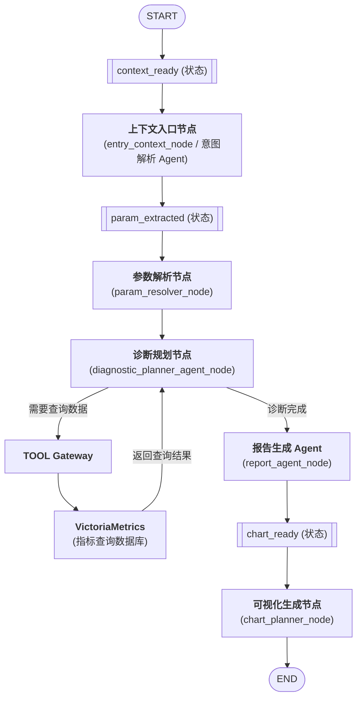

你是资深AI架构师，拥有丰富的LLM应用与多智能体系统落地经验。现在需要你针对一个APM（应用性能管理）系统的AI助手功能，输出完整的设计文档

## 0.1 背景信息
- 产品名称：APM
- 产品功能：采集交换机中的性能与健康数据，包括进程CPU使用率、进程内存使用量、系统CPU使用率、端口丢包情况、端口缓存利用率等。采集数据上报至服务器，通过算法进行异常检测。Web端目前可呈现上述指标图表，并触发异常告警。
- **数据存储架构（关键约束）**：采集数据分别持久化到以下异构存储中，Agent后续必须能够按需查询这些数据源：
  - **MySQL**：存储设备元数据、告警事件、配置等关系型数据。
  - **Redis**：缓存实时指标、会话状态等热数据。
  - **VictoriaMetrics**：存储大规模时序指标数据（CPU、内存、端口统计等）。
  - **Pyroscope**：存储进程级持续性能剖析数据（CPU火焰图等）。
  - **Loki**：存储交换机及系统日志，用于关联分析。
- 团队情况：3名开发人员，均熟练掌握Python，但缺乏AI/大模型相关的开发经验。
- 技术栈假设：后端基于Python（如Flask或FastAPI），前端为现代Web框架（如Vue或React），已具备ECharts或类似图表库的集成基础，数据层已对接上述五种存储系统。

## 0.2 面临场景：
| 场景             | 问题的例子                                                                      |     |
| -------------- | -------------------------------------------------------------------------- | --- |
| **指标聚合与分组展开**  | “设备A的FP容量”——底层对应 VFP/IFP/EFP 三个独立指标                                        |     |
| **多实体关联查询**    | “核心交换机A下联的所有接入交换机的丢包情况”——需先获取拓扑关系                                          |     |
| **模糊实体匹配与消歧**  | “刚换过光模块的端口”、“IP是10.0.0.1的设备”、“昨天报过CRC错误的交换机”                               |     |
| **实体动态范围**     | “所有CPU>90%的设备”、“丢包率前5的端口”                                                  |     |
| **复合指标与派生计算**  | “内存使用率”——底层只存 `memory_used` 和 `memory_total`                               |     |
| **多指标组合的条件查询** | “CPU高且丢包的端口”、“内存超过80%且日志频繁OOM的进程”                                          |     |
| **阈值与基线动态引用**  | “比昨天同一时间高20%的丢包端口”                                                         |     |
| **事件锚点时间**     | “上次告警发生前后10分钟的数据”                                                          |     |
| **多重时间窗口对比**   | “这周一和上周一的流量对比”                                                             |     |
| **单句多问**       | “设备A的CPU怎么样，B的丢包率高吗？”                                                      |     |
| **追问与澄清**      | 参数缺失时生成的追问，用户补充后需继承之前的解析结果                                                 |     |
| **异构标签对齐**     | VictoriaMetrics用 `device` 标签，Loki用 `hostname`，Pyroscope用 `instance` 表示同一设备 |     |
| **查询代价优化**     | “所有交换机端口的1个月丢包趋势”——数据量大，可能超时或拖垮系统                                          |     |
|                |                                                                            |     |
## 0.3 项目目标
在现有APM的Web端新增一个AI助手，需实现以下核心能力：
1. **异常智能分析（核心用例）**：能够处理上面的场景，AI助手需自主完成以下闭环：
   - 分析问题，规划需要收集哪些相关数据（设备信息、端口统计、系统资源、日志、历史告警等）
   - 从MySQL、VictoriaMetrics、Loki等不同数据源安全地获取所需数据
   - 汇总多源异构数据，进行关联分析和异常根因推断
   - 返回包含结论与依据的分析报告
   - **支持生成时序图、图表等可视化呈现**（例如丢包率趋势线、资源使用对比图等），并将图表嵌入到回答中，与Web端现有图表能力协同
2. 采用Agentic框架（多Agent协作架构），而非简单的单轮问答，例如可设计：规划Agent、数据获取Agent、分析Agent、可视化Agent等协同工作。
3. 大模型使用商用API（如OpenAI、智谱、百度千帆等），不本地部署模型。
4. 使用开源的多Agent框架进行开发。
5. **必须支持Agent安全、高效地接入上述五种数据源（MySQL、Redis、VictoriaMetrics、Pyroscope、Loki）进行读写操作**。
6. 支持多轮对话
7. 采取逐步演进的开发策略，不追求一步到位，需给出清晰的演进路线。

## 0.4 输出任务
请你基于以上信息，生成一份详细的设计文档

### 0.4.1 开发难点识别
从技术实现和团队能力两个角度，详细列出在APM中集成多Agent AI助手可能遇到的主要难点，必须包含：
- 复杂分析任务的规划与编排（如何将“端口丢包”问题自动分解为数据收集步骤）
- 针对不同数据库的安全工具设计与调用（如何将自然语言转为准确的查询语句，如何防止注入，如何处理认证）
- 高延迟查询（如Pyroscope火焰图数据、大范围时序数据）下的用户体验保障
- 多源数据聚合与关联分析
- **图表生成与前端集成**：如何通过Agent输出可渲染的图表描述或图表代码，并在Web端安全呈现
- 异常处理与降级策略
- 与现有APM后端和Web前端的集成
- 提示词工程与多智能体协作策略
- 安全与权限控制
并针对每项难点简要给出应对思路。

### 0.4.2 架构概要
给出整体架构简图（用文字描述或ASCII艺术图均可），需清晰体现：
- 用户提问→多Agent协作→各数据源查询→汇总分析→图表生成→返回前端的全链路交互
- 要清晰的体现出 LangGraph的边和节点
- 整篇文档的顺序要求
- 1、设计目标
- 2、核心功能详细说明
	- 2.1 核心功能说明
	- 2.2 难点功能说明
- 3、整体框架
	- 3.1 整体框架图 -->包含节点和边
	- 3.2 每个节点和边的作用，有那些功能
	- 3.3 在节点和边之间传递的核心数据结构
		- 3.3.1 数据结构的说明和使用方式
		- 3.3.2 各个节点之间数据是如何交互
			- 3.3.2.1 采用什么数据结构交互
			- 2.3.2.2 数据流图
- 4、详细设计
	- 4.1 每个节点的功能点和数据结构
	- 4.2.1 节点内部的数据结构的设计
	- 4.2.2 节点内部的数据流图

## 0.5 输出格式要求
- 使用Markdown格式，层级清晰，便于直接作为内部文档使用。
- 语言专业且平实，避免过度学术化，要让Python工程师能无障碍阅读。
- 所有对比表格、里程碑、时间估算尽量量化具体，不可仅作泛泛之谈。


你是资深AI架构师，拥有丰富的LLM应用与多智能体系统落地经验。以下是我的项目信息

## 0.6 背景信息
- 产品名称：APM
- 产品功能：采集交换机中的性能与健康数据，包括进程CPU使用率、进程内存使用量、系统CPU使用率、端口丢包情况、端口缓存利用率等。采集数据上报至服务器，通过算法进行异常检测。Web端目前可呈现上述指标图表，并触发异常告警。
- **数据存储架构（关键约束）**：采集数据分别持久化到以下异构存储中，Agent后续必须能够按需查询这些数据源：
  - **MySQL**：存储设备元数据、告警事件、配置等关系型数据。
  - **Redis**：缓存实时指标、会话状态等热数据。
  - **VictoriaMetrics**：存储大规模时序指标数据（CPU、内存、端口统计等）。
  - **Pyroscope**：存储进程级持续性能剖析数据（CPU火焰图等）。
  - **Loki**：存储交换机及系统日志，用于关联分析。
- 技术栈假设：后端基于Python（如Flask或FastAPI），前端为现代Web框架（如Vue或React），已具备ECharts或类似图表库的集成基础，数据层已对接上述五种存储系统。
- **AI框架选择**：明确采用LangGraph框架构建多Agent协作系统，利用其StateGraph、条件边及动态并行（Send API）能力。

## 0.8 项目目标
在现有APM的Web端新增一个AI助手，需实现以下核心能力：
1. **异常智能分析（核心用例）**：能够处理以上场景，AI助手需自主完成以下闭环：
   - 分析问题，规划需要收集哪些相关数据（设备信息、端口统计、系统资源、日志、历史告警等）
   - 从MySQL、VictoriaMetrics、Loki等不同数据源安全地获取所需数据
   - 汇总多源异构数据，进行关联分析和异常根因推断
   - 返回包含结论与依据的分析报告
   - **支持生成时序图、图表等可视化呈现**（例如丢包率趋势线、资源使用对比图等），并将图表嵌入到回答中，与Web端现有图表能力协同
2. **Agentic多智能体协作与动态并行**：基于LangGraph设计规划Agent、分析Agent、可视化Agent等。**数据获取部分采用“单个通用执行节点 + Send API 动态并行”模式**：规划Agent将用户问题拆解为多个独立、无依赖的数据获取子任务（例如同时查询设备元数据、端口时序指标、关联日志），每个子任务均被派发到同一个通用的Tool执行节点，通过LangGraph的Send API动态生成并行实例，并发执行多个数据源查询，所有结果自动聚合后再交付分析Agent。设计文档需详细说明任务拆分策略、Send API并行派发机制、结果聚合方式以及超时、失败重试等异常处理。
3. 大模型使用商用API（如OpenAI、智谱、百度千帆等），不本地部署模型。
## 0.7 场景

| 场景             | 问题的例子                                                                      |
| -------------- | -------------------------------------------------------------------------- |
| **指标聚合与分组展开**  | “设备A的FP容量”——底层对应 VFP/IFP/EFP 三个独立指标                                        |
| **多实体关联查询**    | “核心交换机A下联的所有接入交换机的丢包情况”——需先获取拓扑关系                                          |
| **模糊实体匹配与消歧**  | “刚换过光模块的端口”、“IP是10.0.0.1的设备”、“昨天报过CRC错误的交换机”                               |
| **实体动态范围**     | “所有CPU>90%的设备”、“丢包率前5的端口”                                                  |
| **复合指标与派生计算**  | “内存使用率”——底层只存 `memory_used` 和 `memory_total`                               |
| **多指标组合的条件查询** | “CPU高且丢包的端口”、“内存超过80%且日志频繁OOM的进程”                                          |
| **阈值与基线动态引用**  | “比昨天同一时间高20%的丢包端口”                                                         |
| **事件锚点时间**     | “上次告警发生前后10分钟的数据”                                                          |
| **多重时间窗口对比**   | “这周一和上周一的流量对比”                                                             |
| **单句多问**       | “设备A的CPU怎么样，B的丢包率高吗？”                                                      |
| **追问与澄清**      | 参数缺失时生成的追问，用户补充后需继承之前的解析结果                                                 |
| **异构标签对齐**     | VictoriaMetrics用 `device` 标签，Loki用 `hostname`，Pyroscope用 `instance` 表示同一设备 |
| **查询代价优化**     | “所有交换机端口的1个月丢包趋势”——数据量大，可能超时或拖垮系统                                          |


1. 
以下是我的state数据结构
2. ``` python
# 1 ---- 数据获取子任务定义 ----
@dataclass
class TimeRange:
    """时间范围定义，用于数据查询"""
    start: str  # ISO 8601格式的起始时间，如 "2024-06-01T00:00:00Z"
    end: str    # ISO 8601格式的结束时间，如 "2024-06-01T01:00:00Z"
  
# 2 意图解析节点的数据类型
@dataclass
class IntentResult:
    """意图解析节点的最终输出，将被写入 AgentState 对应字段"""
    intent_type: str                  # 意图分类
    intent: str                       # 意图描述（摘要）
    intent_confidence: float          # 置信度 [0.0, 1.0]
    reasoning: str                    # LLM 给出的简短推理过程
    next_stage: str                   # 流程下一阶段，固定为 "parameter_extraction"
    errors: List[str] = field(default_factory=list)  # 本节点产生的错误
# 3 参数解析节点的数据类型
@dataclass
class ParameterResult:
    """参数解析节点的输出，将被整体存入 AgentState.extracted_params"""
    target_entities: List[Dict[str, str]] = field(default_factory=list)
    # 实体列表，每个实体包含类型和名称，如：
    # [{"type": "device", "name": "core-switch-01"},
    #  {"type": "interface", "name": "GigabitEthernet0/1"}]
  
    metrics: List[str] = field(default_factory=list)
    # 标准化指标名列表，如 ["packet_loss_rate", "error_rate"]
    time_range: Optional[TimeRange] = None
    # 最终时间范围；若用户未指定，由参数解析填充默认值（例如最近1小时）
    extra_context: Dict[str, Any] = field(default_factory=dict)
    # 附加上下文，可包含阈值、告警ID、聚合方式等
    # 示例: {"threshold": ">5%", "aggregation": "avg"}
    raw_user_time_expression: Optional[str] = None
    # 用户原始时间表述，如 "今天上午10点到11点"，用于审计
    missing_entities: List[str] = field(default_factory=list)
    # 关键实体缺失时记录，如 ["device_name"]；若不为空，调用方可生成追问
    default_applied: bool = False
    # 是否使用了默认值（例如用户未指定时间，自动填入最近1小时）
    errors: List[str] = field(default_factory=list)
    # 本节点产生的非致命错误，如某实体模糊匹配失败、时间解析回退等
    next_stage: str = "diagnosis_planning"
    # 若缺失关键实体，应设为 "wait_user_input" 以生成追问
#★新增：意图 + 参数的联合体
@dataclass
class ParsedIntent:
    """一个解析完成的意图，包含意图本身与提取的参数"""
    intent: IntentResult
    params: Optional[ParameterResult] = None  # 可能在某些阶段尚未完成参数提取
    # 当前意图的整体执行阶段，可覆盖 IntentResult.next_stage
    stage: str = "parameter_extraction"
@dataclass
class DataTask:
    """规划Agent拆解出的单个数据获取子任务"""
    task_id: str                     # 唯一ID，用于匹配结果
    source: str                      # 数据源：mysql / redis / victoriametrics / pyroscope / loki
    query_type: str                  # 操作类型：sql / promql / logql / pyroscope_query / redis_get
    query_params: Dict[str, Any]     # 查询参数，如SQL语句、PromQL表达式、时间范围等
    description: str                 # 任务自然语言描述，方便调试与日志
    timeout: int = 10                # 超时秒数
    retry: int = 1                   # 最大重试次数
# 4 ---- 可视化图表配置 ----
@dataclass
class ChartConfig:
    """前端ECharts等图表库的配置描述"""
    chart_type: str                  # 图表类型：line, bar, pie, flamegraph 等
    title: str
    data: Union[Dict, List]          # 结构化数据，或指向时序数据的查询结果引用
    options: Dict[str, Any]          # 样式、坐标轴等ECharts option覆盖项
    description: str                 # 图表说明
# 5 ---- 主状态 ----
class AgentState(TypedDict):
    # ---- 对话上下文 ----
    messages: Annotated[List[BaseMessage], add_messages]   # 完整对话历史，使用LangGraph内置追加规约器
    # ---- 当前用户提问（每次新问题会重置整个流程） ----
    user_query: str
   # 解析后的意图列表，每个元素同时包含意图与对应参数
    parsed_intents: List[ParsedIntent]
    # ---- 规划阶段产物 ----
    plan_tasks: List[DataTask]                             # 由规划Agent生成的子任务列表，需并行执行
    # ---- 并行数据获取的结果聚合 ----
    # 使用自定义合并规约器：不同分支产生的结果会合并到一个字典中
    task_results: Annotated[Dict[str, Any], operator.ior]  # key=task_id, value=工具返回的数据或错误
    # ---- 聚合后的分析素材 ----
    aggregated_context: Optional[str]                      # 汇总所有 task_results 形成的文本摘要，供分析Agent使用
    # 保留原始结构化数据，便于可视化Agent直接读取
    raw_task_data: Optional[Dict[str, Any]]                # 与 task_results 相同，但在聚合节点整理后保留
    # ---- 分析结果 ----
    analysis_report: Optional[str]                         # 根因分析报告，Markdown格式
    # ---- 可视化图表 ----
    visualizations: List[ChartConfig]                      # 分析阶段或可视化Agent生成的图表配置列表
    # ---- 最终输出 ----
    final_response: Optional[str]                          # 最终返回给前端的完整答案，可包含图表占位符
    # ---- 控制与监控字段 ----
    next_stage: str                                        # 流程阶段标识：planning | executing | aggregating | analyzing | visualizing | finished | error
    errors: Annotated[List[str], operator.add]             # 全局错误收集，使用列表追加规约器
    retry_counts: Dict[str, int]                           # 各 task_id 的重试计数
   ```


``` python
[
    # 第一个意图：丢包诊断
    ParsedIntent(
        intent=IntentResult(
            intent="packet_loss_diagnosis",
            intent_confidence=0.97,
            reasoning="用户明确询问端口丢包原因",
            next_stage="parameter_extraction",
            errors=[]
        ),
        params=ParameterResult(
            target_entities=[
                {"type": "device", "name": "core-sw-01"},
                {"type": "interface", "name": "GigabitEthernet0/1"}
            ],
            metrics=["packet_loss_rate"],
            time_range=TimeRange(
                start="2025-03-15T09:00:00Z",
                end="2025-03-15T10:00:00Z"
            ),
            extra_context={
                "threshold": ">=5%",
                "aggregation": "avg"
            },
            raw_user_time_expression="过去一小时",
            missing_entities=[],
            default_applied=False,
            errors=[],
            next_stage="diagnosis_planning"
        ),
        stage="diagnosis_planning"
    ),

    # 第二个意图：CPU 异常检查
    ParsedIntent(
        intent=IntentResult(
            intent="system_resource_anomaly_check",
            intent_confidence=0.92,
            reasoning="用户同时询问CPU是否异常",
            next_stage="parameter_extraction",
            errors=[]
        ),
        params=ParameterResult(
            target_entities=[
                {"type": "device", "name": "core-sw-01"}
            ],
            metrics=["system_cpu_usage"],
            time_range=TimeRange(
                start="2025-03-15T09:00:00Z",
                end="2025-03-15T10:00:00Z"
            ),
            extra_context={
                "comparison": "high",       # 用户暗示了“异常飙升”
                "aggregation": "max"
            },
            raw_user_time_expression="过去一小时",
            missing_entities=[],
            default_applied=False,
            errors=[],
            next_stage="diagnosis_planning"
        ),
        stage="diagnosis_planning"
    )
]
```


收到，这次文字非常清晰！结合 **LangGraph** 的典型设计模式（特别是**工具调用循环**和**状态流转**），我为你重新构建了精确的 Markdown 表示。

这份图的核心流程是：**入口/意图解析 → 参数解析 → 诊断规划（循环调用 VictoriaMetrics 工具）→ 报告生成 → 可视化**。

---

### 5.1.1 流程图（Mermaid 格式）
可直接复制到支持 Mermaid 的 Markdown 编辑器（GitHub、Typora、Notion）中渲染。



---

### 5.1.2 节点清单（Markdown 表格）

| 节点 ID（代码标识） | 显示名称 | 作用推断 |
| :--- | :--- | :--- |
| `entry_context_node` | 上下文入口节点 / 意图解析 Agent | 加载上下文并识别用户意图 |
| `param_resolver_node` | 参数解析节点 | 提取并校验诊断所需的参数 |
| `diagnostic_planner_agent_node` | 诊断规划节点 | 核心决策 Agent，负责规划诊断步骤 |
| `tool_gateway` | TOOL Gateway | 工具网关，统一路由外部 API/工具调用 |
| `victoriametrics` | VictoriaMetrics | 时间序列数据库查询工具（获取监控指标） |
| `report_agent_node` | 报告生成 Agent | 根据诊断结果生成自然语言报告 |
| `chart_planner_node` | 可视化生成节点 | 将数据渲染为图表（如折线图、柱状图） |

---

### 5.1.3 边与流转逻辑（Markdown 表格）

| 起始节点                            | 目标节点                            | 边类型           | 触发条件 / 说明              |
| :------------------------------ | :------------------------------ | :------------ | :--------------------- |
| `START`                         | `context_ready`                 | 普通边           | 流程开始                   |
| `context_ready`                 | `entry_context_node`            | 普通边           | 上下文就绪后进入入口             |
| `entry_context_node`            | `param_extracted`               | 普通边           | 解析意图后提取参数              |
| `param_extracted`               | `param_resolver_node`           | 普通边           | 参数提取完成，进入解析            |
| `param_resolver_node`           | `diagnostic_planner_agent_node` | 普通边           | 参数就绪，启动诊断规划            |
| `diagnostic_planner_agent_node` | `tool_gateway`                  | **条件边（工具调用）** | 当 Agent 决定需要查询数据时      |
| `tool_gateway`                  | `victoriametrics`               | 普通边           | 路由至 VictoriaMetrics    |
| `victoriametrics`               | `diagnostic_planner_agent_node` | **普通边（回环）**   | 工具结果返回给 Agent，形成**循环** |
| `diagnostic_planner_agent_node` | `report_agent_node`             | **条件边（完成）**   | 当诊断结束，无需继续调用工具时        |
| `report_agent_node`             | `chart_ready`                   | 普通边           | 报告生成完毕，准备绘图            |
| `chart_ready`                   | `chart_planner_node`            | 普通边           | 状态触发可视化                |
| `chart_planner_node`            | `END`                           | 普通边           | 流程结束                   |

---

### 5.1.4 关键设计模式解读（帮助理解）
- **循环（Loop）**：`diagnostic_planner_agent_node` → `TOOL Gateway` → `VictoriaMetrics` → 返回 `diagnostic_planner_agent_node`。这是 LangGraph 最经典的 **Agent + Tools** 循环，Agent 会反复查询数据直到获得足够信息。
- **重复节点的意义**：你在 OCR 中看到 `diagnostic_planner_agent_node` 和 `VictoriaMetrics` 各出现了两次，正对应了图中**进入循环**和**退出循环**两条不同的边，这是生成循环图的正常表现。

如果需要我帮你导出为 `graphviz`（DOT）格式或调整布局，随时告诉我。😊