# 1 驱动与内核模块分析报告（表格版）

> 数据来源：`/data/.apm/model.txt`  
> 内核版本：`5.4.213+`  
> 架构：`aarch64`

---

## 1.1 总体结论

| 项目 | 结论 |
|---|---|
| 内核是否支持模块 | 支持 |
| 判断依据 | `CONFIG_MODULES=y` |
| 当前是否有已加载模块 | 有，大量模块已加载 |
| 是否存在 `.ko` 文件 | 存在 |
| 驱动形态 | **built-in + KO 模块混合** |
| 模块加载能力 | 支持 `modprobe` / `insmod` |
| 内核模块辅助程序 | `/sbin/modprobe` |
| 模块依赖数据库 | 存在 `modules.dep / modules.alias / modules.softdep / modules.symbols / modules.builtin` |

---

## 1.2 基础系统信息

| 项目 | 内容 |
|---|---|
| 系统 | `Linux Ruijie 5.4.213+ #1 SMP Thu Jul 9 17:53:26 CST 2026 aarch64 GNU/Linux` |
| 内核版本 | `5.4.213+` |
| 模块配置 | `CONFIG_MODULES_USE_ELF_RELA=y` |
|  | `CONFIG_MODULES=y` |
|  | `CONFIG_MODULES_TREE_LOOKUP=y` |
| modprobe | `/sbin/modprobe` |
| insmod | `/sbin/insmod` |
| lsmod | `/sbin/lsmod` |
| modinfo | `/sbin/modinfo` |

---

## 1.3 当前已加载模块分类汇总

### 1.3.1 无线相关模块

| 模块名 | 类型判断 | 说明 |
|---|---|---|
| `ath_pktlog` | KO | 无线日志 |
| `monitor` | KO | 无线监控 |
| `wifi_3_0` | KO | Wi-Fi 驱动主模块 |
| `qca_ol` | KO | QCA 无线核心 |
| `qca_spectral` | KO | 频谱分析 |
| `umac` | KO | 无线协议栈核心 |
| `rjwlan` | KO | 厂商 WLAN 扩展 |
| `mem_manager` | KO | 无线内存管理 |
| `qdf` | KO | QCA 驱动框架 |
| `ipq_cnss2` | KO | 平台/无线总线相关 |
| `wbuf` | KO | 无线缓冲 |
| `wbs_cam` | KO | 无线相关厂商模块 |
| `wbs_dev` | KO | 无线设备管理 |
| `wbs_hm` | KO | 无线健康/管理相关 |
| `wbs_mng` | KO | 无线管理 |
| `wbs_fwd_intf` | KO | 无线转发接口 |
| `wvas_kv` | KO | 厂商无线增强 |
| `wvas_med` | KO | 厂商无线增强 |
| `wvas_mtou` | KO | 厂商无线增强 |
| `wvas_snrscan` | KO | SNR 扫描 |
| `wvas_wids` | KO | WIDS |
| `wvas_wloc` | KO | 无线定位 |

---

### 1.3.2 网络/转发/加速相关模块

| 模块名 | 类型判断 | 说明 |
|---|---|---|
| `natk` | KO | NAT/网络处理 |
| `qca_nss_sfe` | 已加载，文件名未直接匹配 | SFE 加速 |
| `qca_nss_ppe_client` | 已加载，文件名未直接匹配 | PPE 客户端 |
| `qca_nss_ppe` | 已加载，文件名未直接匹配 | PPE 核心 |
| `qca_ssdk` | 已加载，文件名未直接匹配 | QCA 交换芯片 SDK |
| `rg_data_plane` | KO | 数据面 |
| `ef_ipsec_kernel` | KO | IPSec |
| `efqos_kernel` | KO | QoS |
| `ef_bridge_ko` | KO | 桥接增强 |
| `rg_ef_socket` | 已加载，文件名未直接匹配 | 私有 socket 扩展 |
| `rg_ef_ipv6` | 已加载，文件名未直接匹配 | 私有 IPv6 扩展 |
| `rg_ef_ip` | 已加载，文件名未直接匹配 | 私有 IP 扩展 |
| `rg_ef_frame` | 已加载，文件名未直接匹配 | 私有帧处理 |
| `fpm_k` | KO | 转发/性能相关 |
| `net2con` | KO | 网络到控制层接口 |
| `eth_parser` | KO | 以太网解析 |
| `eth_subif` | KO | 以太网子接口 |
| `dm_chardev` | KO | 字符设备接口 |
| `capwap_hvsp` | KO | CAPWAP 相关 |
| `capwap_kernel` | KO | CAPWAP 内核处理 |

---

### 1.3.3 协议与基础网络模块

| 模块名 | 类型判断 | 说明 |
|---|---|---|
| `ipv4` | KO | IPv4 协议栈模块 |
| `ipv6` | KO | IPv6 协议栈模块 |
| `bluetooth` | KO | 蓝牙 |
| `dialer_ppp_k` | KO | PPP 拨号相关 |
| `rpcap` | KO | 抓包/远程抓包相关 |
| `dns_cache` | KO | DNS 缓存 |

---

### 1.3.4 管理、业务与厂商模块

| 模块名 | 类型判断 | 说明 |
|---|---|---|
| `nm_engine` | KO | 网络管理引擎 |
| `bandsel` | KO | 频段选择 |
| `termid_kernel` | KO | 终端标识相关 |
| `aclk` | KO | 厂商时钟/业务模块 |
| `role_mgmtk` | KO | 角色管理 |
| `rg_mcast_efmc` | 已加载，文件名未直接匹配 | 组播增强 |
| `rg_wvlan` | KO | 厂商 WLAN 虚拟层 |
| `rg_wlibk` | KO | 厂商无线库 |
| `rg_ap` | KO | AP 功能 |
| `lsm_ko` | KO | 厂商安全/管理模块 |
| `env_utils` | KO | 环境变量工具 |
| `setmac_utils` | KO | 设置 MAC 工具 |
| `product_info_utils` | KO | 产品信息工具 |
| `rg_bsp_mtdoops` | 已加载，文件名未直接匹配 | BSP/mtdoops |
| `rg_console` | 已加载，文件名未直接匹配 | 控制台扩展 |
| `rg_sysfs` | 已加载，文件名未直接匹配 | sysfs 扩展 |
| `rg_thread_det` | KO | 线程检测 |
| `tech_support_agent` | KO | 技术支持代理 |
| `rg_lowmem_killer` | KO | 低内存处理 |
| `rg_dprintk` | KO | 调试打印 |
| `proc_info` | KO | proc 信息模块 |

---

## 1.4 已加载模块与文件映射表

> 说明：以下根据 `/proc/modules` 与文件系统扫描结果整理。  
> “未直接匹配”通常不代表 built-in，很多是**模块名与文件名不一致**导致，例如下划线和中划线差异。

| 模块名 | 文件映射结果 | 最终判断 |
|---|---|---|
| `aclk` | `/.rom/sbin/aclk.ko` `/sbin/aclk.ko` | KO |
| `ath_pktlog` | `/.rom/sbin/ath_pktlog.ko` `/sbin/ath_pktlog.ko` | KO |
| `bandsel` | `/.rom/sbin/bandsel.ko` `/sbin/bandsel.ko` | KO |
| `bluetooth` | `/.rom/sbin/bluetooth.ko` `/sbin/bluetooth.ko` | KO |
| `capwap_hvsp` | `/.rom/sbin/capwap_hvsp.ko` `/sbin/capwap_hvsp.ko` | KO |
| `capwap_kernel` | `/.rom/sbin/capwap_kernel.ko` `/sbin/capwap_kernel.ko` | KO |
| `dialer_ppp_k` | `/.rom/sbin/dialer_ppp_k.ko` `/sbin/dialer_ppp_k.ko` | KO |
| `dm_chardev` | `/.rom/lib64/modules/5.4.213+/extra/dm_chardev.ko` `/lib64/modules/5.4.213+/extra/dm_chardev.ko` | KO |
| `dns_cache` | `/.rom/sbin/dns_cache.ko` `/sbin/dns_cache.ko` | KO |
| `ef_bridge_ko` | `/.rom/sbin/ef_bridge_ko.ko` `/sbin/ef_bridge_ko.ko` | KO |
| `ef_ipsec_kernel` | `/.rom/sbin/ef_ipsec_kernel.ko` `/sbin/ef_ipsec_kernel.ko` | KO |
| `efqos_kernel` | `/.rom/sbin/efqos_kernel.ko` `/sbin/efqos_kernel.ko` | KO |
| `env_utils` | `/.rom/sbin/env_utils.ko` `/sbin/env_utils.ko` | KO |
| `eth_parser` | `/.rom/sbin/eth_parser.ko` `/sbin/eth_parser.ko` | KO |
| `eth_subif` | `/.rom/sbin/eth_subif.ko` `/sbin/eth_subif.ko` | KO |
| `fpm_k` | `/.rom/sbin/fpm_k.ko` `/sbin/fpm_k.ko` | KO |
| `ipq_cnss2` | `/.rom/sbin/ipq_cnss2.ko` `/sbin/ipq_cnss2.ko` | KO |
| `ipv4` | `/.rom/sbin/ipv4.ko` `/sbin/ipv4.ko` | KO |
| `ipv6` | `/.rom/sbin/ipv6.ko` `/sbin/ipv6.ko` | KO |
| `lsm_ko` | `/.rom/sbin/lsm_ko.ko` `/sbin/lsm_ko.ko` | KO |
| `mem_manager` | `/.rom/sbin/mem_manager.ko` `/sbin/mem_manager.ko` | KO |
| `monitor` | `/.rom/sbin/monitor.ko` `/sbin/monitor.ko` | KO |
| `natk` | `/.rom/sbin/natk.ko` `/sbin/natk.ko` | KO |
| `net2con` | `/.rom/sbin/net2con.ko` `/sbin/net2con.ko` | KO |
| `nm_engine` | `/.rom/sbin/nm_engine.ko` `/sbin/nm_engine.ko` | KO |
| `proc_info` | `/.rom/lib64/modules/5.4.213+/extra/proc_info.ko` `/lib64/modules/5.4.213+/extra/proc_info.ko` | KO |
| `product_info_utils` | `/.rom/sbin/product_info_utils.ko` `/sbin/product_info_utils.ko` | KO |
| `qca_nss_ppe` | 未直接匹配 | 大概率 KO（疑似 `qca-nss-ppe.ko`） |
| `qca_nss_ppe_client` | 未直接匹配 | 大概率 KO（疑似 `qca-nss-ppe-client.ko`） |
| `qca_nss_sfe` | 未直接匹配 | 大概率 KO（疑似 `qca-nss-sfe.ko`） |
| `qca_ol` | `/.rom/sbin/qca_ol.ko` `/sbin/qca_ol.ko` | KO |
| `qca_spectral` | `/.rom/sbin/qca_spectral.ko` `/sbin/qca_spectral.ko` | KO |
| `qca_ssdk` | 未直接匹配 | 大概率 KO（疑似 `qca-ssdk.ko`） |
| `qdf` | `/.rom/sbin/qdf.ko` `/sbin/qdf.ko` | KO |
| `rg_ap` | `/.rom/sbin/rg_ap.ko` `/sbin/rg_ap.ko` | KO |
| `rg_bsp_mtdoops` | 未直接匹配 | 大概率 KO（疑似 `rg-bsp-mtdoops.ko`） |
| `rg_console` | 未直接匹配 | 大概率 KO（疑似 `rg-console.ko`） |
| `rg_data_plane` | `/.rom/sbin/rg_data_plane.ko` `/sbin/rg_data_plane.ko` | KO |
| `rg_dprintk` | `/.rom/sbin/rg_dprintk.ko` `/sbin/rg_dprintk.ko` | KO |
| `rg_ef_frame` | 未直接匹配 | 大概率 KO（疑似 `rg-ef-frame.ko`） |
| `rg_ef_ip` | 未直接匹配 | 大概率 KO（疑似 `rg-ef-ip.ko`） |
| `rg_ef_ipv6` | 未直接匹配 | 大概率 KO（疑似 `rg-ef-ipv6.ko`） |
| `rg_ef_socket` | 未直接匹配 | 大概率 KO（疑似 `rg-ef-socket.ko`） |
| `rg_lowmem_killer` | `/.rom/sbin/rg_lowmem_killer.ko` `/sbin/rg_lowmem_killer.ko` | KO |
| `rg_mcast_efmc` | 未直接匹配 | 大概率 KO（疑似 `rg-mcast-efmc.ko`） |
| `rg_sysfs` | 未直接匹配 | 大概率 KO（疑似 `rg-sysfs.ko`） |
| `rg_thread_det` | `/.rom/lib64/modules/5.4.213+/extra/rg_thread_det.ko` `/lib64/modules/5.4.213+/extra/rg_thread_det.ko` `/sbin/rg_thread_det.ko` | KO |
| `rg_wlibk` | `/.rom/sbin/rg_wlibk.ko` `/sbin/rg_wlibk.ko` | KO |
| `rg_wvlan` | `/.rom/sbin/rg_wvlan.ko` `/sbin/rg_wvlan.ko` | KO |
| `rjwlan` | `/.rom/sbin/rjwlan.ko` `/sbin/rjwlan.ko` | KO |
| `role_mgmtk` | `/.rom/sbin/role_mgmtk.ko` `/sbin/role_mgmtk.ko` | KO |
| `rpcap` | `/.rom/sbin/rpcap.ko` `/sbin/rpcap.ko` | KO |
| `setmac_utils` | `/.rom/sbin/setmac_utils.ko` `/sbin/setmac_utils.ko` | KO |
| `tech_support_agent` | `/.rom/sbin/tech_support_agent.ko` `/sbin/tech_support_agent.ko` | KO |
| `termid_kernel` | `/.rom/sbin/termid_kernel.ko` `/sbin/termid_kernel.ko` | KO |
| `umac` | `/.rom/sbin/umac.ko` `/sbin/umac.ko` | KO |
| `wbs_cam` | `/.rom/sbin/wbs_cam.ko` `/sbin/wbs_cam.ko` | KO |
| `wbs_dev` | `/.rom/sbin/wbs_dev.ko` `/sbin/wbs_dev.ko` | KO |
| `wbs_fwd_intf` | `/.rom/sbin/wbs_fwd_intf.ko` `/sbin/wbs_fwd_intf.ko` | KO |
| `wbs_hm` | `/.rom/sbin/wbs_hm.ko` `/sbin/wbs_hm.ko` | KO |
| `wbs_mng` | `/.rom/sbin/wbs_mng.ko` `/sbin/wbs_mng.ko` | KO |
| `wbs_sec` | `/.rom/sbin/wbs_sec.ko` `/sbin/wbs_sec.ko` | KO |
| `wbuf` | `/.rom/sbin/wbuf.ko` `/sbin/wbuf.ko` | KO |
| `wifi_3_0` | `/.rom/sbin/wifi_3_0.ko` `/sbin/wifi_3_0.ko` | KO |
| `wvas_kv` | `/.rom/sbin/wvas_kv.ko` `/sbin/wvas_kv.ko` | KO |
| `wvas_med` | `/.rom/sbin/wvas_med.ko` `/sbin/wvas_med.ko` | KO |
| `wvas_mtou` | `/.rom/sbin/wvas_mtou.ko` `/sbin/wvas_mtou.ko` | KO |
| `wvas_snrscan` | `/.rom/sbin/wvas_snrscan.ko` `/sbin/wvas_snrscan.ko` | KO |
| `wvas_wids` | `/.rom/sbin/wvas_wids.ko` `/sbin/wvas_wids.ko` | KO |
| `wvas_wloc` | `/.rom/sbin/wvas_wloc.ko` `/sbin/wvas_wloc.ko` | KO |

---

## 1.5 Built-in 驱动候选表

> 判定原则：出现在 `dmesg` 驱动初始化/注册日志中，但不在 `/proc/modules` 已加载模块列表中。

| 驱动/日志标识 | 类型判断 | 说明 |
|---|---|---|
| `usbcore: registered new interface driver usbfs` | Built-in 候选 | USB 基础栈 |
| `usbcore: registered new interface driver hub` | Built-in 候选 | USB hub |
| `usbcore: registered new device driver usb` | Built-in 候选 | USB 设备栈 |
| `usbcore: registered new interface driver uas` | Built-in 候选 | USB Attached SCSI |
| `usbcore: registered new interface driver usb-storage` | Built-in 候选 | USB 存储 |
| `usbcore: registered new interface driver usblp` | Built-in 候选 | USB 打印 |
| `ehci_hcd: USB 2.0 'Enhanced' Host Controller (EHCI) Driver` | Built-in 候选 | EHCI 控制器 |
| `ehci-pci: EHCI PCI platform driver` | Built-in 候选 | EHCI PCI |
| `ehci-platform: EHCI generic platform driver` | Built-in 候选 | EHCI 平台 |
| `msm_serial: driver initialized` | Built-in 候选 | 串口 |
| `qca-mdio 90000.mdio: qca-mdio driver was registered` | Built-in 候选 | MDIO |
| `PPP generic driver version 2.4.2` | Built-in 候选 | PPP 通用层 |
| `i2c /dev entries driver` | Built-in 候选 | I2C |
| `* NSS Data Plane driver` | Built-in 候选 | NSS 数据面 |
| `cnss: INFO: Platform driver probed successfully` | Built-in 候选 | 平台驱动探测 |
| `sfp_mac_api_ops_init:INFO:qca probe sfp phy driver succeeded!` | Built-in 候选 | SFP PHY |
| `malibu_phy_api_ops_init:INFO:qca probe malibu phy driver succeeded!` | Built-in 候选 | PHY |
| `bcm84891x_phy_api_ops_init:INFO:qca probe bcm84891x phy driver succeeded!` | Built-in 候选 | PHY |
| `telink8x5x driver init success!(Adapt:1 Addr:0x5a)` | Built-in 候选 | 外设驱动 |

---

## 1.6 模块加载方式分析表

| 分析项 | 结果 | 说明 |
|---|---|---|
| 内核模块辅助程序 | `/sbin/modprobe` | `cat /proc/sys/kernel/modprobe` |
| 是否存在 `modprobe` | 是 | `/sbin/modprobe` |
| 是否存在 `insmod` | 是 | `/sbin/insmod` |
| 是否存在依赖数据库 | 是 | `modules.dep / modules.alias / modules.softdep / modules.symbols` |
| 是否存在 built-in 信息库 | 是 | `modules.builtin / modules.builtin.bin / modules.builtin.modinfo` |
| 模块文件布局 | 标准目录 + 厂商目录混合 | `/lib64/modules/...` + `/sbin/*.ko` + `/.rom/sbin/*.ko` |
| 日志中是否直接看到 `modprobe` | 未明显看到 | 不能据此否定模块加载 |
| 实际加载方式推断 | `modprobe` / `insmod` / 内核 request_module / 厂商初始化程序 | 混合可能性大 |

---

## 1.7 模块加载方式推断详情

| 方式 | 是否可能 | 依据 |
|---|---|---|
| 启动脚本调用 `insmod` | 很可能 | 厂商模块大量放在 `/sbin/*.ko`、`/.rom/sbin/*.ko` |
| 启动脚本调用 `modprobe` | 可能 | 系统存在完整模块依赖数据库 |
| 内核 `request_module()` 自动触发 `/sbin/modprobe` | 可能 | `/proc/sys/kernel/modprobe=/sbin/modprobe` |
| 厂商专用初始化程序加载模块 | 很可能 | 厂商私有模块数量多、路径特殊 |

---

## 1.8 重点驱动链路

### 1.8.1 WLAN 驱动链路

| 链路模块 | 说明 |
|---|---|
| `ipq_cnss2` | 平台/总线相关 |
| `qdf` | QCA 框架层 |
| `mem_manager` | 内存管理 |
| `qca_ol` | 无线核心 |
| `wifi_3_0` | Wi-Fi 驱动主模块 |
| `qca_spectral` | 频谱分析 |
| `umac` | 无线协议栈 |
| `ath_pktlog` | 日志 |
| `monitor` | 监控 |
| `rjwlan` | 厂商扩展 |

---

### 1.8.2 NSS / 数据面 / 交换链路

| 链路模块 | 说明 |
|---|---|
| `qca_ssdk` | 交换芯片 SDK |
| `qca_nss_ppe` | PPE 核心 |
| `qca_nss_ppe_client` | PPE 客户端 |
| `qca_nss_sfe` | SFE |
| `rg_data_plane` | 数据面 |
| `fpm_k` | 转发/性能 |
| `rg_ef_frame` | 私有帧处理 |
| `rg_ef_ip` | 私有 IP 扩展 |
| `rg_ef_ipv6` | 私有 IPv6 扩展 |
| `rg_ef_socket` | 私有 socket 扩展 |

---

### 1.8.3 厂商业务模块族

| 模块族 | 说明 |
|---|---|
| `wvas_*` | 无线增强/WIDS/定位/扫描等 |
| `wbs_*` | 无线设备/转发/管理 |
| `rg_*` | 厂商平台业务功能 |
| `ef_*` | 增强网络/转发/协议栈 |

---

## 1.9 最终判定表

| 问题 | 答案 |
|---|---|
| 1. 系统中有哪些驱动？ | 包括无线驱动、网络转发驱动、IPv4/IPv6、蓝牙、PPP、USB、I2C、MDIO、PHY、厂商定制业务驱动等 |
| 2. 这些驱动是 built-in 还是 ko？ | **大多数当前已加载驱动是 KO 模块**；另有一部分仅在 dmesg 中出现的驱动是 **built-in 候选** |
| 3. 这些模块如何加载？ | 系统支持 `modprobe` 和 `insmod`，结合目录结构与依赖库，推测通过 **启动脚本 + 内核自动请求 + 厂商初始化程序** 混合加载 |

---

## 1.10 建议的补充验证命令

| 目的 | 命令 |
|---|---|
| 查启动脚本中是否调用模块加载 | `grep -RniE "insmod|modprobe" /etc /etc/init.d /etc/rc* /usr/sbin /usr/bin /sbin /bin /.rom 2>/dev/null` |
| 查看内核模块辅助程序 | `cat /proc/sys/kernel/modprobe` |
| 查看模块目录映射 | `ls -l /lib/modules/5.4.213+` |
| 查看模块详细信息 | `modinfo qca_nss_ppe` |
| 查看某些关键模块在哪被引用 | `find /.rom /sbin /etc -type f | xargs grep -n "qca_nss_ppe\|wifi_3_0\|umac\|qca_ol" 2>/dev/null` |

---

如果你愿意，我下一步可以直接继续帮你做两件事中的一个：

1. **把这个表格版 Markdown 再转成适合直接落盘的 `model.md` 完整文件**
2. **按你的实际结果，把“KO / built-in / 加载方式”再精简成一个一页摘要版 Markdown**

```mermaid
flowchart LR
    N_aclk["aclk"] -->|runtime| N_capwap_kernel["capwap_kernel"]
    N_aclk["aclk"] -->|runtime| N_fpm_k["fpm_k"]
    N_aclk["aclk"] -->|runtime| N_lsm_ko["lsm_ko"]
    N_aclk["aclk"] -->|runtime| N_rg_dprintk["rg_dprintk"]
    N_aclk["aclk"] -->|runtime| N_rg_ef_frame["rg_ef_frame"]
    N_ath_pktlog["ath_pktlog"] -->|runtime| N_qdf["qdf"]
    N_ath_pktlog["ath_pktlog"] -->|runtime| N_umac["umac"]
    N_authencesn["authencesn"] -->|static| N_authenc["authenc"]
    N_bandsel["bandsel"] -->|runtime| N_rg_dprintk["rg_dprintk"]
    N_bandsel["bandsel"] -->|runtime| N_wbs_mng["wbs_mng"]
    N_bandsel["bandsel"] -->|runtime| N_wbuf["wbuf"]
    N_bluetooth["bluetooth"] -->|runtime| N_wbs_dev["wbs_dev"]
    N_capwap_hvsp["capwap_hvsp"] -->|runtime| N_lsm_ko["lsm_ko"]
    N_capwap_hvsp["capwap_hvsp"] -->|runtime| N_rg_ef_frame["rg_ef_frame"]
    N_capwap_hvsp["capwap_hvsp"] -->|runtime| N_rg_wlibk["rg_wlibk"]
    N_capwap_kernel["capwap_kernel"] -->|runtime| N_ipv4["ipv4"]
    N_capwap_kernel["capwap_kernel"] -->|runtime| N_lsm_ko["lsm_ko"]
    N_capwap_kernel["capwap_kernel"] -->|runtime| N_rg_dprintk["rg_dprintk"]
    N_capwap_kernel["capwap_kernel"] -->|runtime| N_rg_ef_frame["rg_ef_frame"]
    N_capwap_kernel["capwap_kernel"] -->|runtime| N_rg_ef_socket["rg_ef_socket"]
    N_capwap_kernel["capwap_kernel"] -->|runtime| N_rg_wlibk["rg_wlibk"]
    N_capwap_kernel["capwap_kernel"] -->|runtime| N_wbs_mng["wbs_mng"]
    N_capwap_kernel["capwap_kernel"] -->|runtime| N_wbuf["wbuf"]
    N_dialer_ppp_k["dialer_ppp_k"] -->|runtime| N_eth_parser["eth_parser"]
    N_dialer_ppp_k["dialer_ppp_k"] -->|runtime| N_lsm_ko["lsm_ko"]
    N_dialer_ppp_k["dialer_ppp_k"] -->|runtime| N_rg_dprintk["rg_dprintk"]
    N_dialer_ppp_k["dialer_ppp_k"] -->|runtime| N_rg_ef_frame["rg_ef_frame"]
    N_dns_cache["dns_cache"] -->|runtime| N_fpm_k["fpm_k"]
    N_dns_cache["dns_cache"] -->|runtime| N_lsm_ko["lsm_ko"]
    N_dns_cache["dns_cache"] -->|runtime| N_rg_dprintk["rg_dprintk"]
    N_dns_cache["dns_cache"] -->|runtime| N_rg_ef_frame["rg_ef_frame"]
    N_ef_bridge_ko["ef_bridge_ko"] -->|runtime| N_dm_chardev["dm_chardev"]
    N_ef_bridge_ko["ef_bridge_ko"] -->|runtime| N_eth_parser["eth_parser"]
    N_ef_bridge_ko["ef_bridge_ko"] -->|runtime| N_lsm_ko["lsm_ko"]
    N_ef_bridge_ko["ef_bridge_ko"] -->|runtime| N_rg_dprintk["rg_dprintk"]
    N_ef_bridge_ko["ef_bridge_ko"] -->|runtime| N_rg_ef_frame["rg_ef_frame"]
    N_ef_ipsec_kernel["ef_ipsec_kernel"] -->|runtime| N_fpm_k["fpm_k"]
    N_ef_ipsec_kernel["ef_ipsec_kernel"] -->|runtime| N_ipv4["ipv4"]
    N_ef_ipsec_kernel["ef_ipsec_kernel"] -->|runtime| N_lsm_ko["lsm_ko"]
    N_ef_ipsec_kernel["ef_ipsec_kernel"] -->|runtime| N_rg_dprintk["rg_dprintk"]
    N_ef_ipsec_kernel["ef_ipsec_kernel"] -->|runtime| N_rg_ef_frame["rg_ef_frame"]
    N_efqos_kernel["efqos_kernel"] -->|runtime| N_fpm_k["fpm_k"]
    N_efqos_kernel["efqos_kernel"] -->|runtime| N_lsm_ko["lsm_ko"]
    N_efqos_kernel["efqos_kernel"] -->|runtime| N_rg_dprintk["rg_dprintk"]
    N_efqos_kernel["efqos_kernel"] -->|runtime| N_rg_ef_frame["rg_ef_frame"]
    N_efqos_kernel["efqos_kernel"] -->|runtime| N_rg_wlibk["rg_wlibk"]
    N_efqos_kernel["efqos_kernel"] -->|runtime| N_wbs_dev["wbs_dev"]
    N_efqos_kernel["efqos_kernel"] -->|runtime| N_wbs_mng["wbs_mng"]
    N_eth_parser["eth_parser"] -->|runtime| N_lsm_ko["lsm_ko"]
    N_eth_parser["eth_parser"] -->|runtime| N_rg_dprintk["rg_dprintk"]
    N_eth_parser["eth_parser"] -->|runtime| N_rg_ef_frame["rg_ef_frame"]
    N_eth_subif["eth_subif"] -->|runtime| N_eth_parser["eth_parser"]
    N_eth_subif["eth_subif"] -->|runtime| N_lsm_ko["lsm_ko"]
    N_eth_subif["eth_subif"] -->|runtime| N_rg_dprintk["rg_dprintk"]
    N_eth_subif["eth_subif"] -->|runtime| N_rg_ef_frame["rg_ef_frame"]
    N_fpm_k["fpm_k"] -->|runtime| N_lsm_ko["lsm_ko"]
    N_fpm_k["fpm_k"] -->|runtime| N_rg_dprintk["rg_dprintk"]
    N_fpm_k["fpm_k"] -->|runtime| N_rg_ef_frame["rg_ef_frame"]
    N_ipv4["ipv4"] -->|runtime| N_lsm_ko["lsm_ko"]
    N_ipv4["ipv4"] -->|runtime| N_rg_dprintk["rg_dprintk"]
    N_ipv4["ipv4"] -->|runtime| N_rg_ef_frame["rg_ef_frame"]
    N_ipv6["ipv6"] -->|runtime| N_ipv4["ipv4"]
    N_ipv6["ipv6"] -->|runtime| N_lsm_ko["lsm_ko"]
    N_ipv6["ipv6"] -->|runtime| N_rg_dprintk["rg_dprintk"]
    N_ipv6["ipv6"] -->|runtime| N_rg_ef_frame["rg_ef_frame"]
    N_libcrc32c["libcrc32c"] -->|softpre| N_crc32c["crc32c"]
    N_lsm_ko["lsm_ko"] -->|runtime| N_rg_dprintk["rg_dprintk"]
    N_mem_manager["mem_manager"] -->|runtime| N_qdf["qdf"]
    N_monitor["monitor"] -->|runtime| N_qca_ol["qca_ol"]
    N_monitor["monitor"] -->|runtime| N_qdf["qdf"]
    N_monitor["monitor"] -->|runtime| N_rg_ef_frame["rg_ef_frame"]
    N_monitor["monitor"] -->|runtime| N_umac["umac"]
    N_monitor["monitor"] -->|runtime| N_wbuf["wbuf"]
    N_monitor["monitor"] -->|runtime| N_wifi_3_0["wifi_3_0"]
    N_natk["natk"] -->|runtime| N_fpm_k["fpm_k"]
    N_natk["natk"] -->|runtime| N_lsm_ko["lsm_ko"]
    N_natk["natk"] -->|runtime| N_rg_dprintk["rg_dprintk"]
    N_natk["natk"] -->|runtime| N_rg_ef_frame["rg_ef_frame"]
    N_net2con["net2con"] -->|runtime| N_lsm_ko["lsm_ko"]
    N_net2con["net2con"] -->|runtime| N_rg_ef_frame["rg_ef_frame"]
    N_nm_engine["nm_engine"] -->|runtime| N_rg_dprintk["rg_dprintk"]
    N_qca_nss_ppe["qca_nss_ppe"] -->|runtime| N_lsm_ko["lsm_ko"]
    N_qca_nss_ppe["qca_nss_ppe"] -->|runtime| N_qca_ssdk["qca_ssdk"]
    N_qca_nss_ppe["qca_nss_ppe"] -->|runtime| N_rg_dprintk["rg_dprintk"]
    N_qca_nss_ppe["qca_nss_ppe"] -->|runtime| N_rg_ef_frame["rg_ef_frame"]
    N_qca_nss_ppe["qca_nss_ppe"] -->|runtime| N_wbs_dev["wbs_dev"]
    N_qca_nss_ppe["qca_nss_ppe"] -->|runtime| N_wbs_fwd_intf["wbs_fwd_intf"]
    N_qca_nss_ppe["qca_nss_ppe"] -->|runtime| N_wbs_mng["wbs_mng"]
    N_qca_nss_ppe["qca_nss_ppe"] -->|runtime| N_wbuf["wbuf"]
    N_qca_nss_ppe_client["qca_nss_ppe_client"] -->|runtime| N_qca_nss_ppe["qca_nss_ppe"]
    N_qca_nss_ppe_client["qca_nss_ppe_client"] -->|runtime| N_rg_ef_frame["rg_ef_frame"]
    N_qca_nss_ppe_client["qca_nss_ppe_client"] -->|runtime| N_wbuf["wbuf"]
    N_qca_nss_sfe["qca_nss_sfe"] -->|runtime| N_qca_nss_ppe["qca_nss_ppe"]
    N_qca_nss_sfe["qca_nss_sfe"] -->|runtime| N_rg_ef_frame["rg_ef_frame"]
    N_qca_nss_sfe["qca_nss_sfe"] -->|runtime| N_wbs_fwd_intf["wbs_fwd_intf"]
    N_qca_nss_sfe["qca_nss_sfe"] -->|runtime| N_wbuf["wbuf"]
    N_qca_ol["qca_ol"] -->|runtime| N_ipq_cnss2["ipq_cnss2"]
    N_qca_ol["qca_ol"] -->|runtime| N_mem_manager["mem_manager"]
    N_qca_ol["qca_ol"] -->|runtime| N_qca_spectral["qca_spectral"]
    N_qca_ol["qca_ol"] -->|runtime| N_qdf["qdf"]
    N_qca_ol["qca_ol"] -->|runtime| N_rg_dprintk["rg_dprintk"]
    N_qca_ol["qca_ol"] -->|runtime| N_rg_ef_frame["rg_ef_frame"]
    N_qca_ol["qca_ol"] -->|runtime| N_rjwlan["rjwlan"]
    N_qca_ol["qca_ol"] -->|runtime| N_umac["umac"]
    N_qca_ol["qca_ol"] -->|runtime| N_wbs_cam["wbs_cam"]
    N_qca_ol["qca_ol"] -->|runtime| N_wbs_fwd_intf["wbs_fwd_intf"]
    N_qca_ol["qca_ol"] -->|runtime| N_wbs_mng["wbs_mng"]
    N_qca_ol["qca_ol"] -->|runtime| N_wbuf["wbuf"]
    N_qca_spectral["qca_spectral"] -->|runtime| N_qdf["qdf"]
    N_qca_spectral["qca_spectral"] -->|runtime| N_rg_ef_frame["rg_ef_frame"]
    N_qca_spectral["qca_spectral"] -->|runtime| N_umac["umac"]
    N_qdf["qdf"] -->|runtime| N_rg_ef_frame["rg_ef_frame"]
    N_qdf["qdf"] -->|runtime| N_wbuf["wbuf"]
    N_rg_ap["rg_ap"] -->|runtime| N_lsm_ko["lsm_ko"]
    N_rg_ap["rg_ap"] -->|runtime| N_rg_dprintk["rg_dprintk"]
    N_rg_ap["rg_ap"] -->|runtime| N_rg_ef_frame["rg_ef_frame"]
    N_rg_bsp_mtdoops["rg_bsp_mtdoops"] -->|runtime| N_rg_dprintk["rg_dprintk"]
    N_rg_console["rg_console"] -->|runtime| N_rg_sysfs["rg_sysfs"]
    N_rg_data_plane["rg_data_plane"] -->|runtime| N_lsm_ko["lsm_ko"]
    N_rg_data_plane["rg_data_plane"] -->|runtime| N_rg_dprintk["rg_dprintk"]
    N_rg_data_plane["rg_data_plane"] -->|runtime| N_rg_ef_frame["rg_ef_frame"]
    N_rg_data_plane["rg_data_plane"] -->|runtime| N_rg_wlibk["rg_wlibk"]
    N_rg_data_plane["rg_data_plane"] -->|runtime| N_rg_wvlan["rg_wvlan"]
    N_rg_data_plane["rg_data_plane"] -->|runtime| N_wbs_dev["wbs_dev"]
    N_rg_data_plane["rg_data_plane"] -->|runtime| N_wbs_fwd_intf["wbs_fwd_intf"]
    N_rg_data_plane["rg_data_plane"] -->|runtime| N_wbs_mng["wbs_mng"]
    N_rg_ef_frame["rg_ef_frame"] -->|runtime| N_lsm_ko["lsm_ko"]
    N_rg_ef_frame["rg_ef_frame"] -->|runtime| N_proc_info["proc_info"]
    N_rg_ef_frame["rg_ef_frame"] -->|runtime| N_rg_dprintk["rg_dprintk"]
    N_rg_ef_ip["rg_ef_ip"] -->|runtime| N_dm_chardev["dm_chardev"]
    N_rg_ef_ip["rg_ef_ip"] -->|runtime| N_fpm_k["fpm_k"]
    N_rg_ef_ip["rg_ef_ip"] -->|runtime| N_lsm_ko["lsm_ko"]
    N_rg_ef_ip["rg_ef_ip"] -->|runtime| N_rg_dprintk["rg_dprintk"]
    N_rg_ef_ip["rg_ef_ip"] -->|runtime| N_rg_ef_frame["rg_ef_frame"]
    N_rg_ef_ipv6["rg_ef_ipv6"] -->|runtime| N_dm_chardev["dm_chardev"]
    N_rg_ef_ipv6["rg_ef_ipv6"] -->|runtime| N_fpm_k["fpm_k"]
    N_rg_ef_ipv6["rg_ef_ipv6"] -->|runtime| N_lsm_ko["lsm_ko"]
    N_rg_ef_ipv6["rg_ef_ipv6"] -->|runtime| N_rg_dprintk["rg_dprintk"]
    N_rg_ef_ipv6["rg_ef_ipv6"] -->|runtime| N_rg_ef_frame["rg_ef_frame"]
    N_rg_ef_socket["rg_ef_socket"] -->|runtime| N_lsm_ko["lsm_ko"]
    N_rg_ef_socket["rg_ef_socket"] -->|runtime| N_rg_dprintk["rg_dprintk"]
    N_rg_ef_socket["rg_ef_socket"] -->|runtime| N_rg_ef_frame["rg_ef_frame"]
    N_rg_mcast_efmc["rg_mcast_efmc"] -->|runtime| N_dm_chardev["dm_chardev"]
    N_rg_mcast_efmc["rg_mcast_efmc"] -->|runtime| N_lsm_ko["lsm_ko"]
    N_rg_mcast_efmc["rg_mcast_efmc"] -->|runtime| N_rg_dprintk["rg_dprintk"]
    N_rg_mcast_efmc["rg_mcast_efmc"] -->|runtime| N_rg_ef_frame["rg_ef_frame"]
    N_rg_thread_det["rg_thread_det"] -->|runtime| N_proc_info["proc_info"]
    N_rg_thread_det["rg_thread_det"] -->|static| N_proc_info["proc_info"]
    N_rg_wlibk["rg_wlibk"] -->|runtime| N_rg_dprintk["rg_dprintk"]
    N_rg_wvlan["rg_wvlan"] -->|runtime| N_capwap_kernel["capwap_kernel"]
    N_rg_wvlan["rg_wvlan"] -->|runtime| N_lsm_ko["lsm_ko"]
    N_rg_wvlan["rg_wvlan"] -->|runtime| N_rg_dprintk["rg_dprintk"]
    N_rg_wvlan["rg_wvlan"] -->|runtime| N_rg_ef_frame["rg_ef_frame"]
    N_rg_wvlan["rg_wvlan"] -->|runtime| N_rg_wlibk["rg_wlibk"]
    N_rg_wvlan["rg_wvlan"] -->|runtime| N_wbs_dev["wbs_dev"]
    N_rg_wvlan["rg_wvlan"] -->|runtime| N_wbs_fwd_intf["wbs_fwd_intf"]
    N_rg_wvlan["rg_wvlan"] -->|runtime| N_wbs_mng["wbs_mng"]
    N_rjwlan["rjwlan"] -->|runtime| N_wbs_cam["wbs_cam"]
    N_role_mgmtk["role_mgmtk"] -->|runtime| N_fpm_k["fpm_k"]
    N_role_mgmtk["role_mgmtk"] -->|runtime| N_lsm_ko["lsm_ko"]
    N_role_mgmtk["role_mgmtk"] -->|runtime| N_rg_dprintk["rg_dprintk"]
    N_role_mgmtk["role_mgmtk"] -->|runtime| N_rg_ef_frame["rg_ef_frame"]
    N_rpcap["rpcap"] -->|runtime| N_ipv4["ipv4"]
    N_rpcap["rpcap"] -->|runtime| N_lsm_ko["lsm_ko"]
    N_rpcap["rpcap"] -->|runtime| N_rg_dprintk["rg_dprintk"]
    N_rpcap["rpcap"] -->|runtime| N_rg_ef_frame["rg_ef_frame"]
    N_rpcap["rpcap"] -->|runtime| N_rg_wlibk["rg_wlibk"]
    N_rpcap["rpcap"] -->|runtime| N_wbs_fwd_intf["wbs_fwd_intf"]
    N_rpcap["rpcap"] -->|runtime| N_wbuf["wbuf"]
    N_termid_kernel["termid_kernel"] -->|runtime| N_rg_dprintk["rg_dprintk"]
    N_termid_kernel["termid_kernel"] -->|runtime| N_rg_ef_frame["rg_ef_frame"]
    N_termid_kernel["termid_kernel"] -->|runtime| N_rg_wlibk["rg_wlibk"]
    N_umac["umac"] -->|runtime| N_ipq_cnss2["ipq_cnss2"]
    N_umac["umac"] -->|runtime| N_mem_manager["mem_manager"]
    N_umac["umac"] -->|runtime| N_qca_nss_ppe["qca_nss_ppe"]
    N_umac["umac"] -->|runtime| N_qdf["qdf"]
    N_umac["umac"] -->|runtime| N_rg_dprintk["rg_dprintk"]
    N_umac["umac"] -->|runtime| N_rg_ef_frame["rg_ef_frame"]
    N_umac["umac"] -->|runtime| N_rjwlan["rjwlan"]
    N_umac["umac"] -->|runtime| N_wbs_cam["wbs_cam"]
    N_umac["umac"] -->|runtime| N_wbs_dev["wbs_dev"]
    N_umac["umac"] -->|runtime| N_wbs_fwd_intf["wbs_fwd_intf"]
    N_umac["umac"] -->|runtime| N_wbs_hm["wbs_hm"]
    N_umac["umac"] -->|runtime| N_wbs_mng["wbs_mng"]
    N_umac["umac"] -->|runtime| N_wbuf["wbuf"]
    N_wbs_dev["wbs_dev"] -->|runtime| N_rg_dprintk["rg_dprintk"]
    N_wbs_fwd_intf["wbs_fwd_intf"] -->|runtime| N_capwap_kernel["capwap_kernel"]
    N_wbs_fwd_intf["wbs_fwd_intf"] -->|runtime| N_fpm_k["fpm_k"]
    N_wbs_fwd_intf["wbs_fwd_intf"] -->|runtime| N_lsm_ko["lsm_ko"]
    N_wbs_fwd_intf["wbs_fwd_intf"] -->|runtime| N_net2con["net2con"]
    N_wbs_fwd_intf["wbs_fwd_intf"] -->|runtime| N_rg_dprintk["rg_dprintk"]
    N_wbs_fwd_intf["wbs_fwd_intf"] -->|runtime| N_rg_ef_frame["rg_ef_frame"]
    N_wbs_fwd_intf["wbs_fwd_intf"] -->|runtime| N_rg_ef_socket["rg_ef_socket"]
    N_wbs_fwd_intf["wbs_fwd_intf"] -->|runtime| N_wbs_dev["wbs_dev"]
    N_wbs_fwd_intf["wbs_fwd_intf"] -->|runtime| N_wbs_mng["wbs_mng"]
    N_wbs_fwd_intf["wbs_fwd_intf"] -->|runtime| N_wbuf["wbuf"]
    N_wbs_hm["wbs_hm"] -->|runtime| N_rg_dprintk["rg_dprintk"]
    N_wbs_hm["wbs_hm"] -->|runtime| N_wbs_dev["wbs_dev"]
    N_wbs_mng["wbs_mng"] -->|runtime| N_lsm_ko["lsm_ko"]
    N_wbs_mng["wbs_mng"] -->|runtime| N_rg_dprintk["rg_dprintk"]
    N_wbs_mng["wbs_mng"] -->|runtime| N_rg_ef_frame["rg_ef_frame"]
    N_wbs_mng["wbs_mng"] -->|runtime| N_wbs_dev["wbs_dev"]
    N_wbs_sec["wbs_sec"] -->|runtime| N_fpm_k["fpm_k"]
    N_wbs_sec["wbs_sec"] -->|runtime| N_lsm_ko["lsm_ko"]
    N_wbs_sec["wbs_sec"] -->|runtime| N_rg_dprintk["rg_dprintk"]
    N_wbs_sec["wbs_sec"] -->|runtime| N_rg_ef_frame["rg_ef_frame"]
    N_wbuf["wbuf"] -->|runtime| N_rg_dprintk["rg_dprintk"]
    N_wbuf["wbuf"] -->|runtime| N_rg_ef_frame["rg_ef_frame"]
    N_wbuf["wbuf"] -->|runtime| N_wbs_mng["wbs_mng"]
    N_wifi_3_0["wifi_3_0"] -->|runtime| N_qca_nss_ppe["qca_nss_ppe"]
    N_wifi_3_0["wifi_3_0"] -->|runtime| N_qca_ol["qca_ol"]
    N_wifi_3_0["wifi_3_0"] -->|runtime| N_qdf["qdf"]
    N_wifi_3_0["wifi_3_0"] -->|runtime| N_rg_dprintk["rg_dprintk"]
    N_wifi_3_0["wifi_3_0"] -->|runtime| N_rg_ef_frame["rg_ef_frame"]
    N_wifi_3_0["wifi_3_0"] -->|runtime| N_rjwlan["rjwlan"]
    N_wifi_3_0["wifi_3_0"] -->|runtime| N_umac["umac"]
    N_wifi_3_0["wifi_3_0"] -->|runtime| N_wbuf["wbuf"]
    N_wvas_kv["wvas_kv"] -->|runtime| N_capwap_kernel["capwap_kernel"]
    N_wvas_kv["wvas_kv"] -->|runtime| N_lsm_ko["lsm_ko"]
    N_wvas_kv["wvas_kv"] -->|runtime| N_rg_ef_frame["rg_ef_frame"]
    N_wvas_kv["wvas_kv"] -->|runtime| N_rg_wlibk["rg_wlibk"]
    N_wvas_kv["wvas_kv"] -->|runtime| N_wbs_mng["wbs_mng"]
    N_wvas_med["wvas_med"] -->|runtime| N_rg_dprintk["rg_dprintk"]
    N_wvas_med["wvas_med"] -->|runtime| N_wbs_mng["wbs_mng"]
    N_wvas_med["wvas_med"] -->|runtime| N_wbuf["wbuf"]
    N_wvas_mtou["wvas_mtou"] -->|runtime| N_rg_dprintk["rg_dprintk"]
    N_wvas_mtou["wvas_mtou"] -->|runtime| N_rg_ef_frame["rg_ef_frame"]
    N_wvas_mtou["wvas_mtou"] -->|runtime| N_wbs_mng["wbs_mng"]
    N_wvas_snrscan["wvas_snrscan"] -->|runtime| N_lsm_ko["lsm_ko"]
    N_wvas_snrscan["wvas_snrscan"] -->|runtime| N_rg_dprintk["rg_dprintk"]
    N_wvas_snrscan["wvas_snrscan"] -->|runtime| N_rg_ef_frame["rg_ef_frame"]
    N_wvas_snrscan["wvas_snrscan"] -->|runtime| N_rg_wlibk["rg_wlibk"]
    N_wvas_snrscan["wvas_snrscan"] -->|runtime| N_wbuf["wbuf"]
    N_wvas_wids["wvas_wids"] -->|runtime| N_rg_dprintk["rg_dprintk"]
    N_wvas_wids["wvas_wids"] -->|runtime| N_rg_ef_frame["rg_ef_frame"]
    N_wvas_wids["wvas_wids"] -->|runtime| N_wbs_dev["wbs_dev"]
    N_wvas_wids["wvas_wids"] -->|runtime| N_wbs_fwd_intf["wbs_fwd_intf"]
    N_wvas_wids["wvas_wids"] -->|runtime| N_wbs_mng["wbs_mng"]
    N_wvas_wids["wvas_wids"] -->|runtime| N_wbuf["wbuf"]
    N_wvas_wloc["wvas_wloc"] -->|runtime| N_rg_dprintk["rg_dprintk"]
    N_wvas_wloc["wvas_wloc"] -->|runtime| N_rg_wlibk["rg_wlibk"]
    N_wvas_wloc["wvas_wloc"] -->|runtime| N_wbuf["wbuf"]
```

