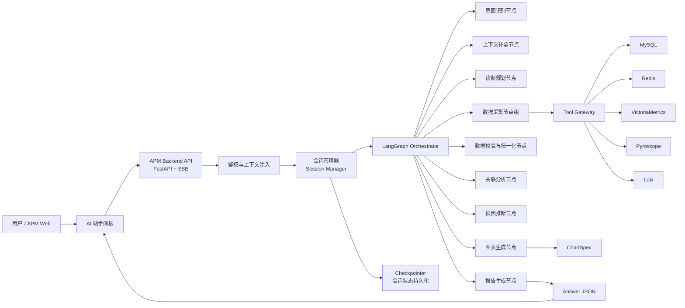
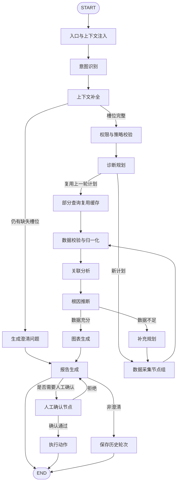
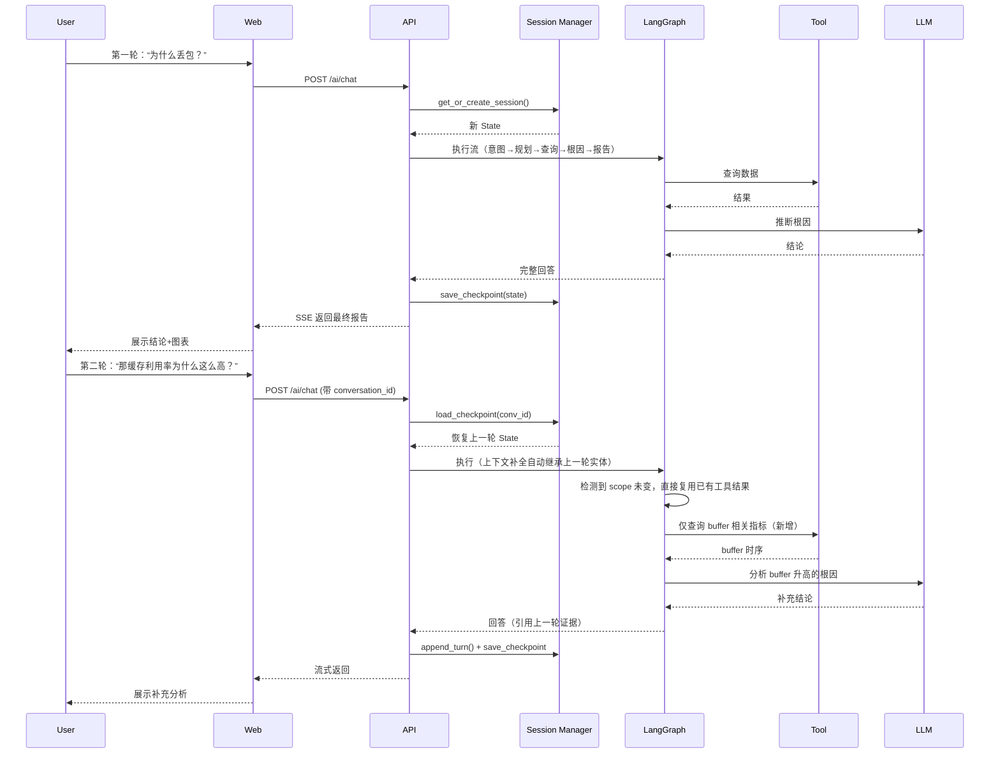
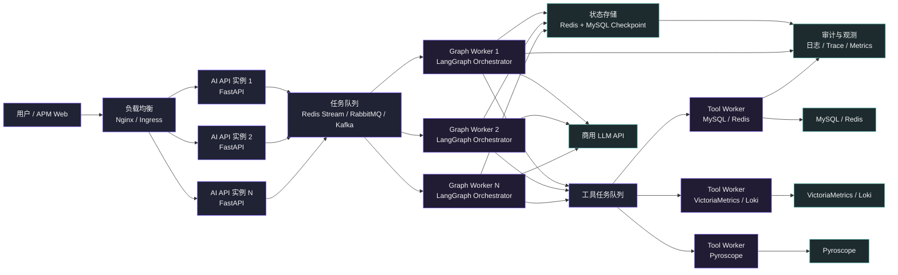
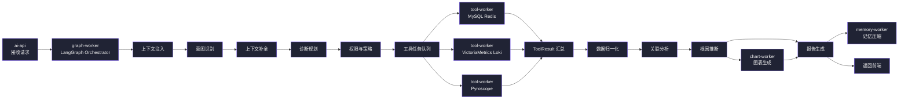
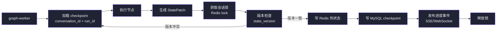
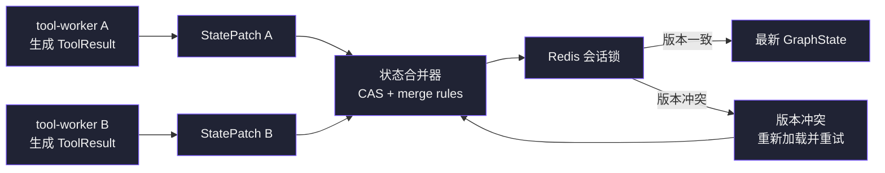
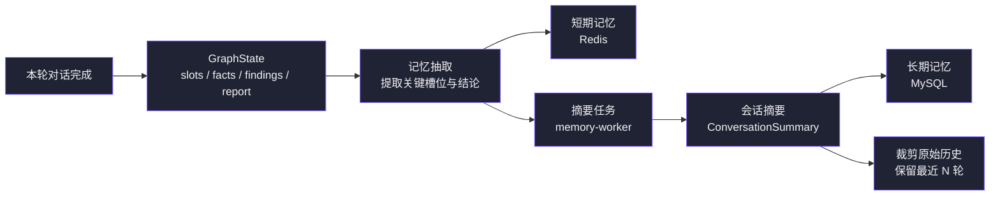

# 1 APM AI 助手 LangGraph 技术选型与实施方案（优化版）

> 版本：v0.2  
> 日期：2026-07-01  
> 适用范围：APM Web 端 AI 助手、异常智能分析、多源观测数据关联分析、多轮对话  
> 约束：Python 后端、商用大模型 API、LangGraph、多数据源安全读写

---

## 1.1 背景与目标（同原版，略作补充）

在原有目标基础上，**多轮对话**是 APM AI 助手的核心体验要求。用户往往不会一次性给出全部信息，而是通过连续追问逐步深入。例如：

- 第一轮：“为什么丢包？”
- 第二轮：“那缓存利用率为什么这么高？”
- 第三轮：“能看看当时其他端口的表现吗？”
- 第四轮：“帮我生成一份排障报告，包含火焰图链接。”

因此，AI 助手必须维护会话状态、理解指代（“当时”“这么高”“其他端口”）、支持上下文补全、允许用户澄清或修改条件，并在必要时回溯或修正之前的推理。

---

## 1.2 技术选型结论（不变）

---

## 1.3 总体架构（补充多轮对话相关组件）



**新增核心模块**：
- **会话管理器**：负责创建、恢复、归档会话；管理会话生命周期；维护对话历史摘要；处理多轮上下文继承。
- **Checkpointer**：LangGraph 内置，支持会话状态持久化到 Redis/PostgreSQL，实现断点续传和会话重放。

---

## 1.4 LangGraph 状态设计（扩展多轮对话字段）

```python
from typing import TypedDict, Literal, Any, Optional
from datetime import datetime

class DeviceScope(TypedDict):
    tenant_id: str
    user_id: str
    device_ids: list[str]
    allowed_ports: list[str]

class QueryPlanItem(TypedDict):
    source: Literal["mysql", "redis", "victoriametrics", "pyroscope", "loki"]
    purpose: str
    query_name: str
    params: dict[str, Any]
    risk_level: Literal["low", "medium", "high"]

class ChartSpec(TypedDict):
    chart_id: str
    title: str
    chart_type: Literal["line", "bar", "heatmap", "table", "flamegraph_link"]
    echarts_option: dict[str, Any] | None
    data_ref: str

class ConversationTurn(TypedDict):
    turn_id: int
    user_question: str
    assistant_response: dict[str, Any]  # 完整回答
    intent: str
    scope: DeviceScope
    time_range: dict[str, str]
    root_causes: list[dict[str, Any]]
    charts: list[ChartSpec]

class APMAnalysisState(TypedDict):
    # ---- 基础信息 ----
    conversation_id: str
    user_id: str
    tenant_id: str
    created_at: datetime
    updated_at: datetime

    # ---- 当前轮次 ----
    turn_id: int
    user_question: str                    # 当前用户问题
    user_context: dict[str, Any]          # 当前页面上下文
    scope: DeviceScope                    # 当前有效权限范围
    intent: str
    target_entities: dict[str, Any]
    time_range: dict[str, str]
    missing_slots: list[str]              # 待澄清的槽位

    # ---- 多轮对话历史 ----
    history: list[ConversationTurn]       # 完整历史轮次（可截断）
    history_summary: str                  # 历史对话的 LLM 摘要（用于注入上下文）
    last_scope: Optional[DeviceScope]     # 上一轮的有效 scope
    last_time_range: Optional[dict[str, str]]

    # ---- 规划和执行 ----
    plan: list[QueryPlanItem]
    tool_results: dict[str, Any]
    normalized_facts: list[dict[str, Any]]
    findings: list[dict[str, Any]]
    root_causes: list[dict[str, Any]]
    charts: list[ChartSpec]
    final_answer: dict[str, Any]

    # ---- 控制与异常 ----
    errors: list[dict[str, Any]]
    audit_events: list[dict[str, Any]]
    is_clarification: bool                # 是否为澄清响应（需用户补充信息）
    requires_human_approval: bool         # 是否需要人工确认
    is_complete: bool                     # 是否已完成本轮分析
```

---

## 1.5 多轮对话关键设计

### 1.5.1 会话生命周期管理

| 阶段 | 动作 | 存储 |
|---|---|---|
| 创建 | 用户首次发送消息 → 生成 `conversation_id`，初始化 State | Redis（短期）+ MySQL（长期归档） |
| 进行中 | 每轮更新 State，保存 Checkpoint | Redis（实时）+ 异步归档到 MySQL |
| 恢复 | 用户携带 `conversation_id` 继续对话 → 从 Checkpointer 恢复最新 State | Redis 优先，若过期则从 MySQL 重建 |
| 归档 | 会话超过 24 小时无活动或用户主动结束 → 压缩历史，归档到 MySQL，清除 Redis | MySQL |
| 清理 | 超过 30 天未归档的会话 → 删除 | MySQL |

**会话管理器接口**：

```python
class SessionManager:
    def get_or_create_session(conversation_id: str | None, user_id: str) -> APMAnalysisState
    def save_checkpoint(state: APMAnalysisState) -> None
    def load_checkpoint(conversation_id: str) -> APMAnalysisState | None
    def append_turn(state: APMAnalysisState, turn: ConversationTurn) -> None
    def archive_session(conversation_id: str) -> None
    def summarize_history(state: APMAnalysisState) -> str   # 生成历史摘要
```

### 1.5.2 多轮上下文继承策略

每一轮开始时，系统自动将上一轮的有效信息继承到当前轮：

- **Scope 继承**：如果用户本轮未指定设备/端口，默认沿用上一轮的 `scope`（除非用户明确切换）。
- **时间范围继承**：如果用户未指定时间范围，沿用上一轮的 `time_range`。如果用户说“往前看”，则偏移窗口。
- **实体继承**：如果用户用指代词（“它”“这个端口”“当时”），需要从上一轮的 `target_entities` 或 `root_causes` 中解析。
- **分析结论继承**：如果用户追问“那缓存利用率为什么高”，则需将上一轮根因中的 `buffer utilization` 作为新的待分析实体。

**实现方式**：在 `上下文补全节点` 中，不仅读取当前页面上下文，还要读取 `history` 中最后一轮的结构化信息，进行合并和覆盖。

### 1.5.3 对话历史压缩与注入

为避免每轮都传递大量历史消息导致 token 浪费，采用**分层历史表示**：

| 层级 | 内容 | 存储位置 | 是否进 LLM |
|---|---|---|---|
| 原始消息 | 用户提问 + 完整回答（含图表） | MySQL 归档 | 否（仅用于审计） |
| 结构化上下文 | 每轮的关键实体、时间、结论、证据摘要 | Redis State 中的 `history`（最多保留最近 3 轮） | 是（以 JSON 格式注入 system prompt） |
| 摘要 | 用 LLM 将前 3 轮之前的对话压缩为 200-300 字摘要 | `history_summary` | 是（每次调用时拼接） |

**注入策略**：

```text
System Prompt:
你是一个 APM 运维助手。以下是本次会话的历史摘要：
{history_summary}

最近几轮交互：
{last_3_turns_context}

当前用户问题：{user_question}
当前设备：{device}，端口：{port}，时间范围：{time_range}
请基于以上信息回答。
```

### 1.5.4 指代消解与槽位继承

在 `上下文补全节点` 中增加指代消解逻辑：

- 使用 LLM 结合上一轮结论，解析“它”“那个”“当时”指代什么。
- 示例规则：
  - “它” → 上一轮 `target_entities` 中的主实体。
  - “当时” → 上一轮 `time_range`。
  - “这个端口” → 当前页面上下文中的端口，若不存在则用上一轮端口。
- 如果指代不明，设置 `missing_slots`，触发澄清问题。

### 1.5.5 多轮追问与澄清

#### 1.5.5.1 主动澄清

当系统检测到缺少关键槽位时，**不进行猜测**，而是返回 `is_clarification=True` 的响应，并向用户提出具体的澄清问题。

示例：

```json
{
  "type": "clarification",
  "message": "您提到了端口丢包，但没有指定具体设备或端口。请选择设备或提供端口名称。",
  "options": ["SW-Core-01/Gi1/0/24", "SW-Core-02/Gi1/0/48"],
  "missing_slots": ["device_id", "port"]
}
```

前端可展示为按钮或输入提示。

#### 1.5.5.2 被动追问

用户在得到分析结果后继续追问，例如：

- 用户：“为什么丢包？” → 系统给出根因。
- 用户：“那缓存利用率为什么这么高？” → 系统继承上一轮实体，重新规划查询，重点分析 buffer 指标，给出补充结论。

此时，系统需**在 State 中保留上一轮的 `tool_results` 和 `normalized_facts`**，避免重复查询已获取的数据，直接复用缓存事实。

### 1.5.6 多轮状态回滚与修正

若用户发现之前指定的设备或时间范围有误，可以主动修正：

- 用户：“不对，我说的设备是 SW-Core-02。”
- 系统应**重置**当前轮次的 `scope` 和依赖的 `tool_results`，并重新执行诊断规划，但**保留**历史对话记录以便对比。

实现方式：在 `上下文补全节点` 中检测到用户明确修改了之前的关键字段时，设置 `reset_scope=True`，并在规划节点中忽略之前过期的缓存。

---

## 1.6 节点设计（补充多轮相关逻辑）

### 1.6.1 `入口与上下文注入节点`（增强）

新增职责：
- 从会话管理器恢复历史 State。
- 将上一轮 `scope`、`time_range`、`target_entities` 作为默认值注入当前轮。
- 生成 `turn_id`（递增）。
- 判断当前问题是否为澄清回答（若上一轮返回 `is_clarification=True`，则本轮的输入可能是对澄清选项的选择）。

### 1.6.2 `上下文补全节点`（增强）

新增逻辑：
- **指代消解**：调用 LLM 或规则解析代词。
- **槽位继承**：从 `history[-1]` 中补全缺失的槽位。
- **冲突检测**：如果用户本轮提供的信息与历史冲突（如指定不同设备），则标记 `scope_changed=True`，并在后续节点中决定是否重新查询。
- **生成 missing_slots**：若仍有关键槽位缺失，设置 `is_clarification=True`，直接进入报告生成节点（返回澄清问题）。

### 1.6.3 `诊断规划节点`（增强）

新增职责：
- 如果 `scope` 未变化且上一轮有相似意图，尝试复用上一轮的查询计划（仅更新时间范围），避免重复规划。
- 如果上一轮已经有 `tool_results` 且当前问题仅涉及分析角度变化（如“那内存呢”），则只追加新的查询，复用已有数据。
- 标记哪些查询是“新增”的，哪些可以复用缓存。

### 1.6.4 `数据采集节点组`（增强）

- 在执行查询前，检查 `tool_results` 中是否已有相同 `query_name` + 相同参数的结果，若有则直接跳过。
- 查询结果不仅存入 `tool_results`，还关联 `turn_id`，便于后续轮次判断数据新鲜度。

### 1.6.5 `报告生成节点`（增强）

- 如果 `is_clarification=True`，生成澄清型回答，不进行根因推断。
- 否则，生成完整分析报告，并将本轮完整回答存入 `history`。
- 在回答中适当引用历史结论（如“上一轮我们发现……，本次进一步分析……”），增强连贯性。

---

## 1.7 边的设计（增加多轮分支）



**关键条件边**：

| 条件 | 来源节点 | 目标节点 | 说明 |
|---|---|---|---|
| 仍有缺失槽位 | 上下文补全 | 生成澄清问题 | 不进行数据查询，直接返回澄清 |
| 上一轮有相同计划且数据未过期 | 诊断规划 | 复用缓存 + 数据校验 | 节省查询成本 |
| 数据不足 | 根因推断 | 补充规划 | 追加更长时间窗口或新数据源 |
| 需要人工确认 | 报告生成 | 人工确认节点 | 高风险操作走审批流 |

---

## 1.8 多轮对话数据流示例



---

## 1.9 多轮对话安全策略补充

- **会话超时**：无活动超过 15 分钟，系统自动结束会话，用户再次提问需重新创建（但保留历史归档）。
- **权限变更处理**：如果用户在不同轮次间权限发生变化（如管理员切换为只读用户），系统在每轮开始时重新校验，并清除上一轮缓存的查询结果。
- **跨租户隔离**：会话严格绑定 `tenant_id`，不同租户的对话不可互相访问。
- **敏感信息脱敏**：历史摘要中不包含密码、密钥、IP 等敏感字段，仅保留设备名、端口、指标等非敏感信息。

---

## 1.10 多轮对话性能优化

| 优化点 | 策略 |
|---|---|
| 历史摘要生成 | 异步生成，不阻塞当前轮次（若摘要未就绪，则只注入最近 2 轮原始上下文） |
| 缓存复用 | 相同参数查询结果在会话生命周期内缓存，TTL = 会话剩余时间 |
| 并行查询 | 多数据源并发，非依赖项并行执行 |
| 延迟加载 | 图表数据仅在需要时从 `data_ref` 加载，不随回答一并传输 |
| Checkpoint 压缩 | 每 10 轮将 State 中的 `history` 截断至最近 5 轮，旧轮次归档到 MySQL |

---

## 1.11 多轮对话验收指标（补充）

| 指标 | 目标 |
|---|---|
| 指代消解准确率 | >= 85%（人工评估） |
| 上下文继承正确率 | >= 90%（用户无需重复输入相同信息） |
| 澄清响应用户满意度 | >= 80%（用户能明确理解问题） |
| 多轮完整分析耗时 | 单轮平均增加不超过 2 秒（含历史恢复和摘要注入） |
| 会话恢复成功率 | >= 99%（从 Checkpoint 恢复无错误） |

---

## 1.12 推荐的多轮实现优先级（MVP 阶段）

第一版先支持：

1. **基础历史继承**：自动沿用上一轮设备、端口、时间范围。
2. **简单指代消解**：处理“它”“这个”等代词，规则为主。
3. **澄清流程**：槽位缺失时返回可点选的选项。
4. **会话恢复**：用户刷新页面后，通过 `conversation_id` 恢复最新状态。
5. **历史摘要自动生成**：每轮结束后异步生成摘要，存于 Redis。

暂缓：

- 复杂多意图合并（如同时问两个问题）。
- 用户主动编辑历史轮次内容。
- 跨会话知识迁移。

---

## 1.13 分布式部署设计

当 AI 助手从 MVP 进入生产环境后，单进程部署会遇到以下问题：

- 多用户并发会导致 LLM 调用、数据源查询和图表生成互相阻塞。
- LangGraph 执行时间可能较长，Web 请求不能一直占用同一个进程。
- 多轮会话状态需要跨实例恢复，不能只保存在本地内存。
- 数据采集节点访问 VictoriaMetrics、Loki、Pyroscope 等慢数据源时，需要异步化和限流。
- 多个节点并发执行时，必须保证状态写入有顺序、有版本、有冲突处理。

因此，建议采用“无状态 API 层 + 分布式任务执行层 + 集中式状态存储 + 消息队列”的部署方式。

### 1.13.1 如何分布式部署

#### 1.13.1.1 推荐部署架构



#### 1.13.1.2 部署单元划分

| 部署单元            |   是否无状态 |  建议副本数 | 职责                                    |
| --------------- | ------: | -----: | ------------------------------------- |
| `ai-api`        |       是 |    2~4 | 接收 Web 请求、鉴权、创建会话、推送 SSE/WebSocket 事件 |
| `graph-worker`  | 否，但状态外置 |    2~6 | 执行 LangGraph 主流程、调度节点、写入 checkpoint   |
| `tool-worker`   |       是 |    2~8 | 执行数据库查询、日志查询、profile 查询、限流与脱敏         |
| `memory-worker` |       是 |    1~3 | 异步生成历史摘要、长期记忆、记忆压缩                    |
| `chart-worker`  |       是 |    1~3 | 生成 ChartSpec、准备图表数据引用                 |
| `redis`         |     有状态 |  集群或主从 | 热状态、会话锁、队列、缓存、短期记忆                    |
| `mysql`         |     有状态 | 主从或高可用 | 持久化会话、checkpoint、审计、长期摘要              |
| `message-queue` |     有状态 |    高可用 | 异步任务分发、削峰填谷                           |

#### 1.13.1.3 请求处理方式

| 阶段     | 处理方式                                                    |
| ------ | ------------------------------------------------------- |
| 用户发起提问 | `ai-api` 创建 `conversation_id`、`turn_id`、`run_id`        |
| 提交任务   | `ai-api` 将运行任务写入消息队列                                    |
| 图执行    | `graph-worker` 拉取任务，恢复 `GraphState`，执行 LangGraph        |
| 工具调用   | `graph-worker` 将慢查询提交给 `tool-worker` 或直接调用 Tool Gateway |
| 状态更新   | 每个关键节点完成后写 checkpoint                                   |
| 结果返回   | `ai-api` 通过 SSE/WebSocket 将进度、图表、报告推给前端                 |

第一版可采用轻量实现：

| 阶段       | MVP 实现                                 |
| -------- | -------------------------------------- |
| API 层    | 2 个 FastAPI 实例                         |
| Graph 执行 | 2 个 Celery/RQ Worker 或独立 Python Worker |
| 队列       | Redis Stream 或 Celery Redis Broker     |
| 状态       | Redis 保存热状态，MySQL 保存最终 checkpoint      |
| 工具调用     | 先内置在 Graph Worker，慢查询再拆到 Tool Worker   |

### 1.13.2 里面的节点如何划分

节点划分原则：

1. **轻量、低延迟、强交互节点**放在 `graph-worker` 内同步执行。
2. **慢查询、IO 密集、可并发节点**拆到 `tool-worker`。
3. **可异步补充、不影响首屏的节点**拆到后台 worker。
4. **必须串行保证状态一致的节点**由 LangGraph Orchestrator 控制执行顺序。

| LangGraph 节点 | 推荐部署位置 | 是否可并行 | 原因 |
|---|---|---:|---|
| 入口与上下文注入节点 | `graph-worker` | 否 | 需要初始化本轮状态 |
| 意图识别节点 | `graph-worker` | 否 | 依赖用户输入，耗时较短 |
| 上下文补全节点 | `graph-worker` | 否 | 需要读取会话焦点和槽位 |
| 诊断规划节点 | `graph-worker` | 否 | 生成后续执行计划 |
| 权限与策略节点 | `graph-worker` 或 Tool Gateway | 否 | 必须在查询前完成 |
| 数据采集节点组 | `tool-worker` | 是 | 多数据源 IO 密集，适合并发 |
| 数据校验与归一化节点 | `graph-worker` | 可部分并行 | 汇总工具结果，生成统一 Fact |
| 关联分析节点 | `graph-worker` | 否 | 需要完整事实表 |
| 根因推断节点 | `graph-worker` | 否 | 依赖分析结果和证据 |
| 图表生成节点 | `chart-worker` 或 `graph-worker` | 可并行 | 可与报告生成部分并行 |
| 报告生成节点 | `graph-worker` | 否 | 需要最终 findings 和 charts |
| 记忆压缩节点 | `memory-worker` | 是 | 不应阻塞当前回答 |

节点执行关系：



### 1.13.3 状态如何同步

分布式部署后，不能依赖 Python 进程内存保存 LangGraph State。建议把状态拆成三层：

| 状态层        | 存储         | 保存内容                                         | 生命周期  |
| ---------- | ---------- | -------------------------------------------- | ----- |
| 热状态        | Redis      | 当前轮 `GraphState`、节点进度、临时 ToolResult、SSE 事件游标 | 分钟到小时 |
| Checkpoint | MySQL      | 每轮关键节点后的状态快照、最终报告、审计引用                       | 长期    |
| 大对象引用      | 对象存储或内部数据表 | 大型时序数组、图表数据、profile 链接                       | 按业务策略 |

状态同步流程：



建议状态结构增加版本字段：

```python
class DistributedGraphState(BaseModel):
    conversation_id: str
    turn_id: str
    run_id: str
    state_version: int
    parent_version: int | None = None
    status: Literal["running", "waiting", "completed", "failed"]
    current_node: str | None = None
    slots: dict
    short_memory: dict
    tool_results: list
    facts: list
    findings: list
    charts: list
    final_report: dict | None = None
    updated_at: str
```

同步规则：

| 规则                     | 说明                            |
| ---------------------- | ----------------------------- |
| 每个节点只提交 `StatePatch`   | 不直接覆盖整个 state，减少冲突            |
| 每次写入递增 `state_version` | 用于并发控制和回放                     |
| Redis 保存最新热状态          | 提供快速恢复和进度读取                   |
| MySQL 保存 checkpoint    | 用于可靠恢复、审计和长期追溯                |
| 大对象只存引用                | 避免把大数组、大日志、大 profile 放入 State |

### 1.13.4 多个节点同时更新状态如何处理

分布式场景下，多个节点同时更新状态主要出现在数据采集节点组、图表生成节点、记忆压缩节点。处理原则是：**主状态串行提交，分支结果并行产出，最终由聚合节点合并**。

#### 1.13.4.1 状态更新冲突类型

| 冲突类型    | 示例                           | 处理策略                           |
| ------- | ---------------------------- | ------------------------------ |
| 同字段覆盖   | 两个 worker 同时写 `tool_results` | 禁止直接覆盖，改为 append-only patch    |
| 版本冲突    | Worker 基于旧版本 state 写入        | CAS 失败后重新加载最新 state，再合并        |
| 顺序冲突    | 报告生成早于慢查询结果完成                | 报告先基于已完成结果生成，慢查询作为补充事件         |
| 重复写入    | 队列重试导致同一工具结果写两次              | 使用 `query_id` 幂等去重             |
| 用户新一轮打断 | 用户修改条件后旧任务继续返回               | 检查 `run_id`，旧 run 的结果不得写入新 run |

#### 1.13.4.2 推荐的 StatePatch 模式

每个节点只输出补丁：

```python
class StatePatch(BaseModel):
    conversation_id: str
    turn_id: str
    run_id: str
    base_version: int
    node_name: str
    patch_id: str
    operations: list[dict]
    idempotency_key: str
```

补丁示例：

```json
{
  "conversation_id": "conv_001",
  "turn_id": "turn_003",
  "run_id": "run_abc",
  "base_version": 12,
  "node_name": "tool_worker_victoriametrics",
  "patch_id": "patch_001",
  "idempotency_key": "q_vm_001",
  "operations": [
    {
      "op": "append_unique",
      "path": "/tool_results",
      "key": "query_id",
      "value": {
        "query_id": "q_vm_001",
        "status": "success"
      }
    }
  ]
}
```

#### 1.13.4.3 合并规则

| 字段             | 合并方式                                 |
| -------------- | ------------------------------------ |
| `tool_results` | 按 `query_id` append unique           |
| `facts`        | 按 `fact_id` append unique            |
| `findings`     | 由 `root_cause_node` 统一覆盖当前轮 findings |
| `charts`       | 按 `chart_id` append unique           |
| `final_report` | 只允许 `report_node` 写入                 |
| `slots`        | 只允许上下文补全节点和用户澄清节点写入                  |
| `short_memory` | 只允许记忆节点写入                            |
| `errors`       | append-only                          |

并发写入流程：



实践建议：

1. `graph-worker` 是主状态写入者，`tool-worker` 尽量只写结果表或提交 patch。
2. 对并行工具结果使用 append-only，不使用覆盖写。
3. 每个节点输出必须带 `node_name`、`run_id`、`base_version`。
4. 每个工具查询必须带 `query_id` 和 `idempotency_key`。
5. 对用户新提问生成新的 `turn_id` 和 `run_id`，旧 run 的异步结果只能进入历史，不得影响当前轮。

### 1.13.5 多轮对话的记忆如何实现，如何做记忆压缩

多轮记忆不建议简单保存完整聊天记录并全部传给 LLM。应采用“短期工作记忆 + 会话摘要 + 长期诊断记忆 + 原始历史归档”的分层设计。

#### 1.13.5.1 记忆分层

| 记忆类型 | 存储位置 | 内容 | 用途 |
|---|---|---|---|
| 工作记忆 | Redis / GraphState | 当前设备、端口、时间范围、问题类型、槽位、当前 findings | 当前轮推理和追问 |
| 最近消息 | Redis | 最近 2~5 轮用户问题和助手回答 | 指代消解和上下文补全 |
| 会话摘要 | Redis + MySQL | 压缩后的诊断过程、关键结论、关键证据 ID | 降低 token 成本 |
| 长期诊断记忆 | MySQL | 历史会话摘要、报告、用户反馈 | 会话恢复和审计 |
| 大对象引用 | 对象存储 / 指标系统 | 图表数据引用、profile 链接、日志查询引用 | 避免状态膨胀 |

#### 1.13.5.2 记忆写入流程



#### 1.13.5.3 记忆结构

```python
class ConversationMemory(BaseModel):
    conversation_id: str
    tenant_id: str
    user_id: str
    current_focus: dict
    recent_turns: list[dict]
    running_summary: str
    key_facts: list[dict]
    key_findings: list[dict]
    unresolved_questions: list[str]
    data_refs: list[dict]
    version: int
```

字段说明：

| 字段 | 说明 |
|---|---|
| `current_focus` | 当前诊断对象，例如设备、端口、时间窗口 |
| `recent_turns` | 最近 2~5 轮原文，用于指代消解 |
| `running_summary` | 压缩后的对话摘要 |
| `key_facts` | 可复用事实，只保存摘要和 `fact_id` |
| `key_findings` | 上轮关键结论，只保存标题、置信度、证据 ID |
| `unresolved_questions` | 仍需澄清或未完成的问题 |
| `data_refs` | 图表、profile、日志等大对象引用 |

#### 1.13.5.4 记忆压缩策略

| 策略    | 说明                                   |
| ----- | ------------------------------------ |
| 轮次窗口  | LLM 输入只保留最近 2~5 轮原文                  |
| 滚动摘要  | 每轮结束后，将旧轮次合并进 `running_summary`      |
| 事实保留  | 不保留完整原始数据，只保留 `fact_id`、摘要、时间范围、数据引用 |
| 结论保留  | 保留 `finding_id`、结论、置信度、证据 ID         |
| 大对象外置 | 时序数组、日志样例、火焰图不进入 prompt，只存引用         |
| 摘要版本化 | 每次压缩生成 `summary_version`，支持回滚和审计     |

压缩触发条件：

| 触发条件 | 动作 |
|---|---|
| 对话超过 5 轮 | 压缩第 1~3 轮，只保留最近 2 轮原文 |
| prompt token 预计超过阈值 | 优先压缩旧轮次和工具结果 |
| 单轮工具结果过大 | 只保留统计摘要和 data_ref |
| 会话结束或超时 | 生成最终摘要并归档到 MySQL |

#### 1.13.5.5 记忆注入策略

每轮调用 LLM 时，不注入完整历史，而是按优先级注入：

| 优先级 | 注入内容                            |
| --- | ------------------------------- |
| P0  | 当前用户问题、当前页面上下文、当前权限上下文          |
| P1  | `current_focus`：设备、端口、时间范围、问题类型 |
| P2  | 最近 2 轮原文                        |
| P3  | `running_summary`               |
| P4  | 上轮关键 `findings` 和 `fact_id`     |
| P5  | 必要的 `data_ref`，不注入大对象原文         |

记忆压缩后的 LLM 输入示例：

```json
{
  "current_question": "CPU 有影响吗？",
  "current_focus": {
    "device_id": "sw-001",
    "interface_id": "Eth1/1",
    "time_range": "2026-07-02 10:00~10:30",
    "issue_type": "port_packet_loss"
  },
  "recent_turns": [
    {
      "user": "我的端口为什么丢包？",
      "assistant_summary": "Eth1/1 的 TX 丢包与出口缓存利用率升高同窗。"
    }
  ],
  "running_summary": "用户正在排查 sw-001 Eth1/1 在 10:00~10:30 的端口丢包问题，上一轮初步判断出口队列拥塞可能性较高。",
  "key_findings": [
    {
      "finding_id": "finding_001",
      "conclusion": "TX 丢包与出口缓存利用率升高同窗",
      "evidence_fact_ids": ["fact_001", "fact_002"]
    }
  ]
}
```

### 1.13.6 分布式部署落地建议

| 阶段 | 建议方案 | 说明 |
|---|---|---|
| MVP | `ai-api` + `graph-worker` + Redis + MySQL | 先把状态外置，解决多实例会话恢复 |
| 灰度 | 增加 `tool-worker` | 将 VictoriaMetrics、Loki、Pyroscope 查询异步化 |
| 生产 | 增加 `memory-worker`、`chart-worker`、消息队列高可用 | 支持更高并发和更稳定的多轮体验 |
| 大规模 | 按租户或数据源拆 worker 池 | 防止大租户或慢数据源影响全局 |

部署关键指标：

| 指标 | 建议目标 |
|---|---|
| API P95 响应首包时间 | <= 1 秒 |
| Graph 单轮执行 P90 | <= 30 秒 |
| Checkpoint 写入成功率 | >= 99.9% |
| 状态版本冲突自动恢复率 | >= 99% |
| 记忆压缩任务成功率 | >= 99% |
| Redis 热状态恢复成功率 | >= 99.9% |

---

## 1.14 总结

通过以上设计，APM AI 助手具备了完整的**多轮对话能力**，从会话管理、上下文继承、指代消解、澄清机制到历史压缩和缓存复用，均与 LangGraph 的有状态编排深度集成。这使得用户在排查 APM 异常时，可以像与专家对话一样逐步深入，极大提升了诊断效率和用户体验。

同时，所有扩展都遵循原有安全、审计、可观测性原则，确保在多轮场景下仍能保持系统稳定和数据安全。

---

*本方案已补充多轮对话完整设计，后续可根据实际业务反馈迭代优化。*
