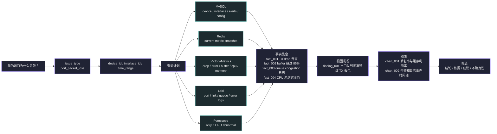
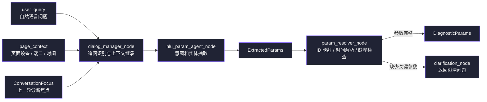
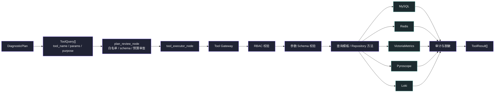
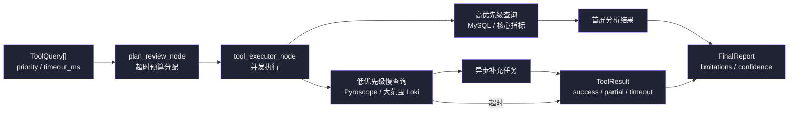
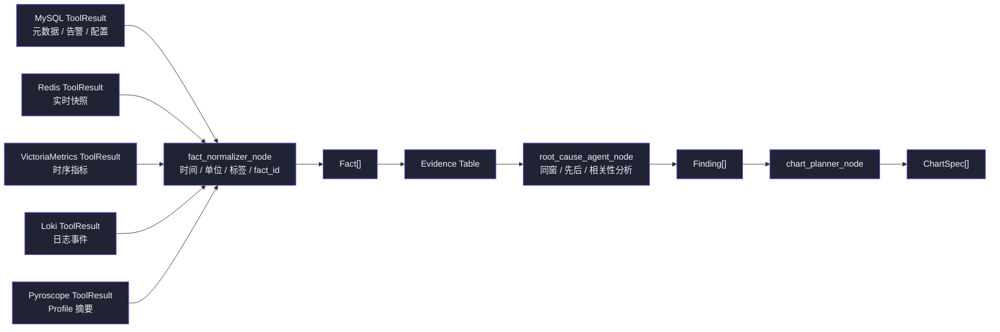
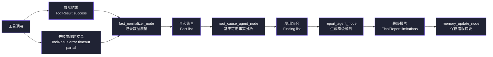
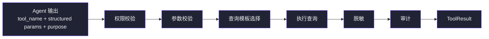

# 1 APM AI 助手 LangGraph 多 Agent 完整设计文档

> 版本：v1.0  
> 日期：2026-07-02  
> 适用范围：APM Web 端 AI 助手、异常智能分析、多源观测数据关联分析、图表化诊断报告  
> 目标读者：APM 后端工程师、前端工程师、测试工程师、产品经理  
> 技术基线：Python 后端、FastAPI/Flask、LangGraph、商用大模型 API、ECharts、MySQL、Redis、VictoriaMetrics、Pyroscope、Loki

## 1.1 1、设计目标

APM AI 助手的目标不是做一个普通聊天机器人，而是在现有 APM 系统上增加一个可以执行诊断闭环的智能分析入口。用户可以用自然语言提出问题，例如“我的端口为什么丢包？”、“这个交换机 CPU 升高和丢包有关系吗？”、“和昨天相比异常在哪里？”，AI 助手需要自动规划数据收集步骤，安全访问多种数据源，完成多源关联分析，并返回带有证据和图表的诊断结果。

### 1.1.1 业务目标

| 目标       | 说明                          | 第一版验收标准                               |
| -------- | --------------------------- | ------------------------------------- |
| 降低排障门槛   | 用户不用知道指标名、查询语法和存储位置，也能发起诊断  | 支持“端口丢包”“CPU 升高”“内存异常”3 类自然语言问题       |
| 提升异常分析效率 | 自动收集设备元数据、端口指标、系统资源、日志和历史告警 | 单次端口丢包分析在 30 秒内返回首屏结论，60 秒内返回完整报告     |
| 给出可追溯结论  | 每个根因判断必须关联指标、日志、告警或配置证据     | 报告中的主要结论必须引用 `fact_id` 或 `finding_id` |
| 图表化呈现    | 将关键时序指标、对比指标、日志事件标记嵌入回答     | 至少支持丢包趋势、CPU/内存趋势、端口缓存利用率趋势 3 类图表     |
| 支持多轮追问   | 能继承上一轮的设备、端口、时间范围和诊断焦点      | 支持“CPU 有影响吗”“展开日志”“和昨天比呢”等追问          |
| 平滑接入现有系统 | 复用已有 APM 后端权限、数据层和 Web 图表能力 | 不允许 LLM 直接连接数据库，所有访问经过后端 Tool Gateway |

### 1.1.2 技术目标

| 目标         | 设计约束                                                                                  |
| ---------- | ------------------------------------------------------------------------------------- |
| 多 Agent 协作 | 使用 LangGraph 将任务拆为参数理解、计划生成、数据获取、事实归一化、根因分析、图表生成、报告生成等节点                              |
| 数据源安全接入    | MySQL、Redis、VictoriaMetrics、Pyroscope、Loki 均通过受控工具函数访问，不暴露任意 SQL、LogQL、MetricsQL 生成能力 |
| 可控输出       | 所有 Agent 输出结构化 JSON，并使用 Pydantic/JSON Schema 校验                                       |
| 可观测与可审计    | 记录每次会话、工具调用、查询参数、耗时、数据源错误和最终报告版本                                                      |
| 可演进        | 第一版优先实现确定性流程和固定模板，后续逐步增强 Agent 自主规划能力                                                 |

### 1.1.3 非目标

| 非目标 | 原因 |
| --- | --- |
| 不本地部署大模型 | 团队缺乏模型部署与推理优化经验，且项目目标是业务能力落地 |
| 不让 LLM 直接写 SQL/LogQL/MetricsQL | 风险高，难以控制权限、注入、查询成本和误查范围 |
| 第一版不追求全自动闭环处置 | 先聚焦分析与建议，不直接执行高风险变更 |
| 第一版不支持任意图表代码生成 | 前端安全风险较高，先使用受控 ChartSpec 和白名单模板 |

## 1.2 2、核心功能详细说明

### 1.2.1 核心功能说明

#### 1.2.1.1 异常智能分析

用户输入自然语言问题后，系统按以下闭环执行：

1. 识别问题类型，例如端口丢包、CPU 异常、内存异常、进程性能异常、日志异常。
2. 从页面上下文、会话上下文和自然语言中提取设备、端口、时间范围、指标类型、对比对象。
3. 自动生成诊断计划，明确需要访问哪些数据源、查询哪些指标、查询窗口和优先级。
4. 通过 Tool Gateway 安全查询 MySQL、Redis、VictoriaMetrics、Pyroscope、Loki。
5. 将异构数据归一化为统一事实对象，包含时间范围、指标值、日志事件、告警事件和证据 ID。
6. 对事实进行关联分析，判断异常是否同窗出现，是否存在明显先后关系，是否存在历史相似告警。
7. 生成结论、依据、置信度、建议动作和不确定性说明。
8. 生成可渲染图表描述，交给 Web 端 ECharts 组件展示。

#### 1.2.1.2 多 Agent 协作

建议采用“Agent 节点 + 确定性节点”混合架构。不是所有节点都需要 LLM，能用代码确定完成的工作应优先用确定性节点。

| 节点类型 | 适合任务 | 示例 |
| --- | --- | --- |
| Agent 节点 | 语义理解、计划生成、根因推断、报告组织 | NLU Agent、Planner Agent、Analysis Agent、Report Agent |
| 确定性节点 | 权限校验、参数补全、工具调用、数据归一化、图表模板填充 | RBAC Node、Tool Executor、Fact Builder、Chart Builder |
| Hybrid 节点 | 需要规则和模型共同判断 | Dialog Manager、Query Plan Reviewer |

#### 1.2.1.3 五类数据源接入

| 数据源             | 存储内容                    | AI 助手使用方式                | 典型查询                             |
| --------------- | ----------------------- | ------------------------ | -------------------------------- |
| MySQL           | 设备元数据、端口信息、告警事件、配置、用户权限 | 通过固定 DAO/Repository 工具查询 | 查询设备、端口、告警历史、配置变更                |
| Redis           | 实时指标缓存、会话状态、短期热点数据      | 读取实时快照、写入会话状态和中间任务状态     | 获取当前 CPU、当前端口丢包、会话焦点             |
| VictoriaMetrics | 大规模时序指标                 | 通过指标白名单和模板化 MetricsQL 查询 | 查询端口丢包率、CPU、内存、端口缓存利用率           |
| Pyroscope       | 进程级持续性能剖析               | 仅在 CPU/进程异常时按需查询         | 查询指定进程的 CPU profile、热点函数         |
| Loki            | 交换机与系统日志                | 通过日志标签白名单和关键词模板查询        | 查询端口 down/up、link flap、队列拥塞、错误日志 |

#### 1.2.1.4 多轮对话

多轮对话需要维护会话焦点，而不是简单拼接历史消息。

会话焦点包括：

| 字段 | 说明 | 示例 |
| --- | --- | --- |
| `device_id` | 当前诊断设备 | `sw-001` |
| `interface_id` | 当前端口 | `Eth1/1` |
| `time_range` | 当前异常窗口 | `2026-07-02 10:00:00 ~ 10:30:00` |
| `issue_type` | 当前问题类型 | `port_packet_loss` |
| `last_plan_id` | 上次诊断计划 | `plan_20260702_001` |
| `last_findings` | 上轮核心发现 | 丢包与端口缓存利用率升高同窗 |

典型追问处理：

| 用户追问 | 继承内容 | 新增动作 |
| --- | --- | --- |
| “CPU 有影响吗？” | 继承设备、端口、时间范围 | 增加系统 CPU、进程 CPU、Pyroscope 查询 |
| “和昨天比呢？” | 继承设备、端口、指标 | 增加前一天同时间窗口对比查询 |
| “展开日志” | 继承设备、端口、异常窗口 | 增加 Loki 日志查询和事件聚类 |

#### 1.2.1.5 图表生成与前端集成

AI 助手不直接返回任意 JavaScript 代码，而是返回内部受控的 `ChartSpec`。后端或前端将 `ChartSpec` 转换为 ECharts option。

第一版支持以下图表：

| 图表类型 | 用途 | 数据来源 | 展示方式 |
| --- | --- | --- | --- |
| `timeseries_line` | 展示指标趋势 | VictoriaMetrics、Redis | 折线图 |
| `multi_axis_timeseries` | 展示丢包率与 CPU/缓存利用率关系 | VictoriaMetrics | 双轴折线图 |
| `event_timeline` | 展示告警和日志事件 | MySQL、Loki | 时间轴 |
| `comparison_line` | 展示今天与昨天对比 | VictoriaMetrics | 双序列折线图 |
| `profile_summary` | 展示进程热点摘要 | Pyroscope | 表格或火焰图链接 |

### 1.2.2 难点功能说明

#### 1.2.2.1 开发难点识别

| 难点              | 技术实现挑战                                              | 团队能力挑战                           | 应对思路                                                                   |
| --------------- | --------------------------------------------------- | -------------------------------- | ---------------------------------------------------------------------- |
| 复杂分析任务的规划与编排    | “端口为什么丢包”需要自动拆解为设备识别、端口指标、缓存利用率、CPU、日志、告警、配置等多个查询步骤 | 团队熟悉 Python，但缺少 Agent 状态机和任务分解经验 | 用 LangGraph 固化诊断流程；第一版采用“规则模板 + Planner Agent”混合方式；为每类问题预置诊断 playbook  |
| 自然语言参数映射        | 用户可能省略设备、端口、时间，如“刚才为什么丢包”                           | 需要理解上下文继承和澄清策略                   | 引入 Dialog Manager 和 Param Resolver；缺少关键参数时优先从页面上下文补全，仍缺失则提问澄清          |
| 不同数据库的安全工具设计与调用 | SQL、MetricsQL、LogQL 查询语义不同，且存在注入、越权、大范围查询风险         | 团队可能倾向让 LLM 直接生成查询语句             | 建立 Tool Gateway；LLM 只能选择工具和传递结构化参数；所有查询模板化、白名单化、限流、审计                  |
| 认证与权限控制         | AI 查询范围必须与当前用户、租户、角色一致                              | 需要复用现有 RBAC，并将权限贯穿 Agent 状态      | Entry Context 注入 `tenant_id/user_id/roles`；每个工具调用前执行权限校验；禁止跨租户查询       |
| 高延迟查询           | Pyroscope、大范围时序、Loki 日志扫描可能耗时较长                     | 团队需要设计异步任务、流式响应和降级 UX            | 使用异步工具调用、超时预算、分阶段返回；先返回首屏摘要，再补充慢查询结果                                   |
| 多源数据聚合与关联分析     | 各数据源时间戳精度、标签、设备标识可能不一致                              | 需要设计统一事实模型和时间对齐规则                | 建立 `Fact`、`Evidence`、`Finding` 模型；统一时间窗口、设备 ID、端口 ID、指标单位              |
| 图表生成与前端集成       | LLM 输出 ECharts option 可能包含不安全字段或不可渲染配置              | 前端需要支持 AI 消息中的图表块                | 只允许输出 `ChartSpec`；通过 JSON Schema 校验；前端使用白名单渲染器转换为 ECharts option       |
| 异常处理与降级策略       | 某个数据源不可用时不能导致整次分析失败                                 | 需要将部分失败体现在报告中                    | 每个 ToolResult 带 `status/error/latency`；Analysis Agent 基于可用证据分析，并输出不确定性 |
| 与现有 APM 后端集成    | 需要接入已有 API、鉴权、数据层、告警模型                              | 需要避免重写现有数据访问逻辑                   | AI 后端作为现有 APM 后端的一个模块；优先复用现有 Repository 和图表能力                          |
| 与 Web 前端集成      | 聊天流、图表块、进度状态、错误提示要统一                                | 需要新增 AI 消息协议和渲染组件                | 定义 `AssistantMessage` 协议；支持文本块、图表块、证据块、进度块                             |
| 提示词工程           | 多 Agent 容易输出不稳定，报告可能编造                              | 团队缺少 prompt 约束经验                 | 每个 Agent 都要求 JSON Schema 输出；结论必须引用证据；建立评测集持续回归                         |
| 多智能体协作策略        | Agent 过多会增加延迟和调试难度                                  | 需要控制复杂度                          | 第一版 4 个 Agent 足够：NLU、Planner、Analysis、Report；其他节点用代码实现                 |
| 安全与合规           | 日志和配置可能包含敏感信息                                       | 需要脱敏、审计和最小权限                     | Tool Gateway 做字段脱敏；报告中默认隐藏敏感值；保留审计日志                                   |
| 查询成本控制          | 大范围时序和日志查询会影响后端性能                                   | 需要限流、缓存和超时                       | 默认时间窗 30 分钟，最大 24 小时；对常用诊断结果缓存 5~10 分钟；慢查询异步化                          |

#### 1.2.2.2 端口丢包诊断拆解示例

用户问题：“我的端口为什么丢包？”

系统拆解：

| 步骤  | 目标            | 数据源                        | 输出                                       |
| --- | ------------- | -------------------------- | ---------------------------------------- |
| 1   | 识别设备、端口、时间窗口  | 页面上下文、Redis 会话、MySQL       | `DiagnosticParams`                       |
| 2   | 查询端口基础信息      | MySQL                      | 端口速率、描述、所属设备、管理状态                        |
| 3   | 查询丢包指标        | VictoriaMetrics、Redis      | RX/TX drop、error、discard 时序              |
| 4   | 查询端口缓存与队列     | VictoriaMetrics            | buffer utilization、queue drop            |
| 5   | 查询系统资源        | VictoriaMetrics            | CPU、内存、关键进程 CPU                          |
| 6   | 查询历史告警        | MySQL                      | 同窗口和近 24 小时告警                            |
| 7   | 查询相关日志        | Loki                       | link flap、congestion、CRC、driver error 日志 |
| 8   | 必要时查询 profile | Pyroscope                  | CPU 异常时的进程热点                             |
| 9   | 归一化和关联        | 内存状态                       | `FactSet`、`FindingSet`                   |
| 10  | 生成图表和报告       | Chart Builder、Report Agent | 图表块、诊断报告                                 |

## 1.3 3、整体框架

### 1.3.1 整体框架图

```mermaid
flowchart LR
    user["用户"]
    web["APM Web AI 助手<br/>Chat UI / Context Provider / ECharts Renderer"]
    api["FastAPI / Flask API<br/>Auth / Session / Streaming / Audit"]
    state["会话管理<br/>Conversation State"]
    orchestrator["LangGraph Orchestrator<br/>Diagnostic Graph"]

    user -->|自然语言问题| web
    web -->|user_query + page_context| api
    api -->|initial_state| state
    state -->|DiagnosticGraphState| orchestrator

    orchestrator --> entry["入口上下文节点<br/>entry_context_node"]
    entry -->|context_ready| dialog["多轮对话管理节点<br/>dialog_manager_node"]
    dialog -->|need_param_mapping| nlu["NLU 参数映射 Agent<br/>nlu_param_agent_node"]
    nlu -->|params_extracted| resolver["参数解析节点<br/>param_resolver_node"]
    resolver -->|need_clarification| clarify["澄清节点<br/>clarification_node"]
    resolver -->|params_resolved| guard["权限与策略节点<br/>permission_guard_node"]
    guard -->|authorized| planner["诊断规划 Agent<br/>diagnostic_planner_agent_node"]
    guard -->|unauthorized| web
    planner -->|plan_ready| review["计划审查节点<br/>plan_review_node"]
    review -->|plan_rejected| planner
    review -->|plan_approved| executor["数据采集节点组<br/>tool_executor_node"]
    executor -->|tool_results_ready| normalizer["数据归一化节点<br/>fact_normalizer_node"]
    normalizer -->|facts_ready| analysis["根因推断 Agent<br/>root_cause_agent_node"]
    analysis -->|findings_ready| chart["可视化生成节点<br/>chart_planner_node"]
    chart -->|charts_ready| report["报告生成 Agent<br/>report_agent_node"]
    report -->|report_ready| memory["记忆更新节点<br/>memory_update_node"]
    memory -->|done| web
    report -->|markdown + ChartSpec + evidence| web

    executor -->|受控工具调用| gateway["Tool Gateway<br/>RBAC / Query Templates / Rate Limit / Timeout / Masking / Audit"]
    gateway --> mysql["MySQL<br/>设备元数据 / 告警 / 配置"]
    gateway --> redis["Redis<br/>实时指标 / 会话状态"]
    gateway --> vm["VictoriaMetrics<br/>CPU / 内存 / 端口时序指标"]
    gateway --> pyro["Pyroscope<br/>进程 CPU Profile"]
    gateway --> loki["Loki<br/>交换机与系统日志"]

    classDef main fill:#202334,stroke:#7c5cff,color:#f2f2f2;
    classDef agent fill:#211b33,stroke:#8b6dff,color:#f2f2f2;
    classDef data fill:#1d2b2f,stroke:#4db6ac,color:#f2f2f2;
    class user,web,api,state,orchestrator,gateway main;
    class nlu,planner,analysis,report agent;
    class mysql,redis,vm,pyro,loki data;
```



### 1.3.2 每个节点和边的作用，有哪些功能

#### 1.3.2.1 节点职责表

| 节点                              | 类型            | 是否调用 LLM | 主要输入                 | 主要输出                 | 职责                           |
| ------------------------------- | ------------- | -------- | -------------------- | -------------------- | ---------------------------- |
| `entry_context_node`            | Deterministic | 否        | 用户请求、页面上下文、鉴权信息      | `RuntimeContext`     | 注入用户、租户、角色、页面设备、页面时间范围       |
| `dialog_manager_node`           | Hybrid        | 可选       | 历史会话、当前问题            | `ConversationFocus`  | 判断是否延续上一主题，继承设备/端口/时间范围      |
| `nlu_param_agent_node`          | Agent         | 是        | 用户问题、会话焦点            | `ExtractedParams`    | 将自然语言映射为结构化参数                |
| `param_resolver_node`           | Deterministic | 否        | 抽取参数、页面上下文、MySQL 元数据 | `DiagnosticParams`   | 补全设备、端口、时间范围、指标名称            |
| `clarification_node`            | Deterministic | 否        | 缺失参数                 | `AssistantMessage`   | 生成澄清问题并暂停图执行                 |
| `permission_guard_node`         | Deterministic | 否        | 用户上下文、诊断参数           | `PermissionDecision` | 校验租户、设备、端口、数据源访问权限           |
| `diagnostic_planner_agent_node` | Agent         | 是        | 诊断参数、问题类型            | `DiagnosticPlan`     | 生成数据收集计划和分析步骤                |
| `plan_review_node`              | Deterministic | 否        | 诊断计划                 | `ReviewedPlan`       | 校验计划是否合法、是否超过查询预算            |
| `tool_executor_node`            | Deterministic | 否        | 受控查询计划               | `ToolResult[]`       | 并发调用 Tool Gateway，执行查询、超时和重试 |
| `fact_normalizer_node`          | Deterministic | 否        | 工具结果                 | `FactSet`            | 统一时间、单位、标签、证据 ID             |
| `root_cause_agent_node`         | Agent         | 是        | 事实集、诊断参数             | `FindingSet`         | 关联分析和根因推断                    |
| `chart_planner_node`            | Deterministic | 否        | 事实集、发现集              | `ChartSpec[]`        | 生成受控图表描述                     |
| `report_agent_node`             | Agent         | 是        | 发现集、图表、证据            | `FinalReport`        | 生成面向用户的诊断报告                  |
| `memory_update_node`            | Deterministic | 否        | 本轮参数、发现和报告           | `ConversationFocus`  | 更新会话焦点和摘要                    |

#### 1.3.2.2 边职责表

| 边                    | 起点                              | 终点                              | 触发条件               | 作用            |
| -------------------- | ------------------------------- | ------------------------------- | ------------------ | ------------- |
| `context_ready`      | START                           | `entry_context_node`            | 用户发起问题             | 初始化图状态        |
| `dialog_ready`       | `entry_context_node`            | `dialog_manager_node`           | 上下文注入完成            | 加载历史会话焦点      |
| `need_param_mapping` | `dialog_manager_node`           | `nlu_param_agent_node`          | 需要理解当前问题           | 进入自然语言解析      |
| `params_extracted`   | `nlu_param_agent_node`          | `param_resolver_node`           | NLU 输出通过 schema 校验 | 执行参数补全        |
| `need_clarification` | `param_resolver_node`           | `clarification_node`            | 关键参数缺失             | 返回澄清问题        |
| `params_resolved`    | `param_resolver_node`           | `permission_guard_node`         | 参数完整               | 执行权限校验        |
| `unauthorized`       | `permission_guard_node`         | END                             | 权限不足               | 返回无权限说明       |
| `authorized`         | `permission_guard_node`         | `diagnostic_planner_agent_node` | 权限通过               | 生成诊断计划        |
| `plan_ready`         | `diagnostic_planner_agent_node` | `plan_review_node`              | 计划生成完成             | 审查查询安全和成本     |
| `plan_rejected`      | `plan_review_node`              | `diagnostic_planner_agent_node` | 计划不合法但可修复          | 要求 Planner 修正 |
| `plan_approved`      | `plan_review_node`              | `tool_executor_node`            | 计划合法               | 执行工具查询        |
| `tool_results_ready` | `tool_executor_node`            | `fact_normalizer_node`          | 查询完成或部分完成          | 归一化事实         |
| `facts_ready`        | `fact_normalizer_node`          | `root_cause_agent_node`         | 事实构建完成             | 执行根因分析        |
| `findings_ready`     | `root_cause_agent_node`         | `chart_planner_node`            | 发现生成完成             | 生成图表          |
| `charts_ready`       | `chart_planner_node`            | `report_agent_node`             | 图表生成完成             | 汇总报告          |
| `report_ready`       | `report_agent_node`             | `memory_update_node`            | 报告完成               | 更新会话记忆        |
| `done`               | `memory_update_node`            | END                             | 状态持久化完成            | 返回最终结果        |

### 1.3.3 在节点和边之间传递的核心数据结构

#### 1.3.3.1 数据结构的说明和使用方式

LangGraph 中建议使用单一状态对象 `DiagnosticGraphState`，每个节点只读写自己负责的字段。所有字段都需要可序列化，便于审计、重放和排错。

```python
from typing import Any, Literal, Optional
from pydantic import BaseModel, Field


class RuntimeContext(BaseModel):
    tenant_id: str
    user_id: str
    roles: list[str]
    locale: str = "zh-CN"
    page_device_id: Optional[str] = None
    page_interface_id: Optional[str] = None
    page_time_range: Optional[dict[str, str]] = None


class ConversationFocus(BaseModel):
    topic_id: Optional[str] = None
    issue_type: Optional[str] = None
    device_id: Optional[str] = None
    interface_id: Optional[str] = None
    time_range: Optional[dict[str, str]] = None
    last_plan_id: Optional[str] = None
    last_findings: list[str] = Field(default_factory=list)


class DiagnosticParams(BaseModel):
    issue_type: Literal[
        "port_packet_loss",
        "system_cpu_high",
        "memory_high",
        "process_cpu_high",
        "log_anomaly",
        "unknown",
    ]
    device_id: str
    interface_id: Optional[str] = None
    time_range: dict[str, str]
    compare_time_range: Optional[dict[str, str]] = None
    metrics: list[str] = Field(default_factory=list)
    user_question: str


class ToolQuery(BaseModel):
    query_id: str
    source: Literal["mysql", "redis", "victoriametrics", "pyroscope", "loki"]
    tool_name: str
    params: dict[str, Any]
    timeout_ms: int = 5000
    priority: Literal["high", "medium", "low"] = "medium"
    purpose: str


class DiagnosticPlan(BaseModel):
    plan_id: str
    issue_type: str
    queries: list[ToolQuery]
    analysis_steps: list[str]
    expected_charts: list[str]


class ToolResult(BaseModel):
    query_id: str
    source: str
    status: Literal["success", "partial", "timeout", "error", "skipped"]
    latency_ms: int
    data: Any = None
    error_message: Optional[str] = None


class Fact(BaseModel):
    fact_id: str
    source: str
    fact_type: Literal["metric", "log", "alert", "metadata", "profile", "realtime"]
    subject: dict[str, str]
    time_range: Optional[dict[str, str]] = None
    value: Any
    unit: Optional[str] = None
    confidence: float = 1.0


class Finding(BaseModel):
    finding_id: str
    title: str
    severity: Literal["info", "warning", "critical"]
    conclusion: str
    evidence_fact_ids: list[str]
    confidence: float
    uncertainties: list[str] = Field(default_factory=list)


class ChartSpec(BaseModel):
    chart_id: str
    chart_type: Literal[
        "timeseries_line",
        "multi_axis_timeseries",
        "event_timeline",
        "comparison_line",
        "profile_summary",
    ]
    title: str
    data_ref_fact_ids: list[str]
    encoding: dict[str, Any]
    display: dict[str, Any] = Field(default_factory=dict)


class FinalReport(BaseModel):
    summary: str
    findings: list[Finding]
    charts: list[ChartSpec]
    recommendations: list[str]
    limitations: list[str]


class DiagnosticGraphState(BaseModel):
    request_id: str
    session_id: str
    user_query: str
    runtime_context: Optional[RuntimeContext] = None
    conversation_focus: Optional[ConversationFocus] = None
    extracted_params: dict[str, Any] = Field(default_factory=dict)
    diagnostic_params: Optional[DiagnosticParams] = None
    plan: Optional[DiagnosticPlan] = None
    tool_results: list[ToolResult] = Field(default_factory=list)
    facts: list[Fact] = Field(default_factory=list)
    findings: list[Finding] = Field(default_factory=list)
    charts: list[ChartSpec] = Field(default_factory=list)
    final_report: Optional[FinalReport] = None
    errors: list[dict[str, Any]] = Field(default_factory=list)
```

使用原则：

| 原则 | 说明 |
| --- | --- |
| 节点只写自己的字段 | 例如 Tool Executor 只写 `tool_results`，不直接写 `findings` |
| 所有输出必须校验 | Agent 输出先通过 JSON Schema/Pydantic 校验，再进入下一条边 |
| 查询结果与结论分离 | 原始查询结果保存在 `tool_results`，可引用事实保存在 `facts` |
| 结论必须引用证据 | `Finding.evidence_fact_ids` 必须非空 |
| 图表引用事实 | `ChartSpec.data_ref_fact_ids` 指向用于渲染的数据事实 |

#### 1.3.3.2 各个节点之间数据是如何交互

##### 1.3.3.2.1 采用什么数据结构交互

节点之间统一通过 `DiagnosticGraphState` 交互。每个节点接收完整 state，返回局部字段更新。

```python
def entry_context_node(state: DiagnosticGraphState) -> dict:
    return {"runtime_context": build_runtime_context(state)}


def tool_executor_node(state: DiagnosticGraphState) -> dict:
    results = execute_plan(state.plan, state.runtime_context)
    return {"tool_results": results}
```

边只判断状态，不直接修改状态。

```python
def route_after_param_resolver(state: DiagnosticGraphState) -> str:
    if state.errors and state.errors[-1]["code"] == "MISSING_REQUIRED_PARAM":
        return "need_clarification"
    return "params_resolved"
```

##### 1.3.3.2.2 数据流图


端口丢包场景中的数据流：



## 1.4 4、详细设计

### 1.4.1 每个节点的功能点和数据结构

#### 1.4.1.1 `entry_context_node`

功能点：

| 功能 | 说明 |
| --- | --- |
| 注入身份 | 从后端请求上下文读取 `tenant_id`、`user_id`、`roles` |
| 注入页面上下文 | 读取当前 Web 页面选中的设备、端口、时间范围 |
| 生成请求 ID | 用于日志、审计、链路追踪 |

输入：`user_query`、HTTP auth context、page context。  
输出：`RuntimeContext`。

#### 1.4.1.2 `dialog_manager_node`

功能点：

| 功能 | 说明 |
| --- | --- |
| 判断是否追问 | 判断“CPU 有影响吗”是否继承上一轮诊断目标 |
| 维护会话焦点 | 从 Redis 或数据库加载上一轮 `ConversationFocus` |
| 处理主题切换 | 用户明确指定新设备或新端口时切换焦点 |

输出示例：

```json
{
  "topic_id": "topic_20260702_001",
  "issue_type": "port_packet_loss",
  "device_id": "sw-001",
  "interface_id": "Eth1/1",
  "time_range": {
    "start": "2026-07-02T10:00:00+08:00",
    "end": "2026-07-02T10:30:00+08:00"
  },
  "last_findings": ["finding_001"]
}
```

#### 1.4.1.3 `nlu_param_agent_node`

功能点：

| 功能 | 说明 |
| --- | --- |
| 意图识别 | 识别是诊断、对比、解释、追问还是日志展开 |
| 参数抽取 | 抽取设备、端口、时间、指标、对比窗口 |
| 置信度输出 | 对不确定参数给出置信度和候选项 |

Prompt 约束：

```text
你只能输出符合 schema 的 JSON。
不要生成 SQL、LogQL、MetricsQL。
如果缺少设备、端口或时间范围，请标记 missing_fields。
如果用户问题是追问，请标记 follow_up=true，并说明需要继承哪些字段。
```

输出结构：

```json
{
  "intent": "diagnose",
  "issue_type": "port_packet_loss",
  "entities": {
    "device_name": null,
    "interface_name": null,
    "time_expression": "刚才"
  },
  "follow_up": false,
  "missing_fields": ["device_id", "interface_id"],
  "confidence": 0.82
}
```

#### 1.4.1.4 `param_resolver_node`

功能点：

| 功能 | 说明 |
| --- | --- |
| 页面上下文补全 | 用户未说设备时，优先使用当前页面选中设备 |
| 自然语言时间解析 | 将“刚才”“最近半小时”“昨天同一时间”转为明确时间窗口 |
| 元数据解析 | 将设备名、端口名映射到内部 ID |
| 关键参数检查 | 缺少设备、端口、时间时产生澄清 |

第一版默认时间窗口：

| 场景 | 默认窗口 |
| --- | --- |
| 用户未指定时间 | 最近 30 分钟 |
| 用户说“刚才” | 最近 30 分钟 |
| 用户说“今天” | 当天 00:00 到当前时间，超过 6 小时则先采样 |
| 用户说“昨天对比” | 昨天同一时间长度窗口 |

#### 1.4.1.5 `permission_guard_node`

功能点：

| 功能 | 说明 |
| --- | --- |
| 租户隔离 | 所有设备和数据查询必须带 `tenant_id` |
| 设备权限 | 用户必须拥有目标设备可读权限 |
| 数据源权限 | 部分角色可禁用日志或 profile 查询 |
| 审计记录 | 记录用户、目标对象、查询类型 |

权限失败输出：

```json
{
  "summary": "当前账号没有访问设备 sw-001 的权限。",
  "findings": [],
  "charts": [],
  "recommendations": ["请切换到有权限的账号，或联系管理员授权。"],
  "limitations": ["未执行任何数据源查询。"]
}
```

#### 1.4.1.6 `diagnostic_planner_agent_node`

功能点：

| 功能 | 说明 |
| --- | --- |
| 选择诊断 playbook | 根据 `issue_type` 选择端口丢包、CPU、内存等流程 |
| 生成查询清单 | 只生成工具名和结构化参数，不生成查询语句 |
| 设定优先级 | 首屏关键数据优先，慢查询低优先级 |
| 设定图表预期 | 指定需要生成的图表类型 |

端口丢包计划示例：

```json
{
  "plan_id": "plan_20260702_001",
  "issue_type": "port_packet_loss",
  "queries": [
    {
      "query_id": "q_meta_001",
      "source": "mysql",
      "tool_name": "get_interface_metadata",
      "params": {"device_id": "sw-001", "interface_id": "Eth1/1"},
      "timeout_ms": 2000,
      "priority": "high",
      "purpose": "确认端口速率、管理状态和描述"
    },
    {
      "query_id": "q_vm_001",
      "source": "victoriametrics",
      "tool_name": "query_interface_packet_loss",
      "params": {
        "device_id": "sw-001",
        "interface_id": "Eth1/1",
        "start": "2026-07-02T10:00:00+08:00",
        "end": "2026-07-02T10:30:00+08:00",
        "step": "60s"
      },
      "timeout_ms": 5000,
      "priority": "high",
      "purpose": "确认丢包发生时间和方向"
    }
  ],
  "analysis_steps": [
    "判断 RX/TX 丢包方向",
    "检查缓存利用率是否同窗升高",
    "检查 CPU/内存是否同窗异常",
    "检查日志和告警是否提供直接证据"
  ],
  "expected_charts": ["multi_axis_timeseries", "event_timeline"]
}
```

#### 1.4.1.7 `plan_review_node`

功能点：

| 检查项 | 规则 |
| --- | --- |
| 工具白名单 | `tool_name` 必须在工具注册表中 |
| 数据源白名单 | 只允许 MySQL、Redis、VictoriaMetrics、Pyroscope、Loki |
| 时间范围 | 默认最大 24 小时，超过需降采样或要求用户确认 |
| 查询数量 | 第一版单轮最多 12 个工具查询 |
| 超时预算 | 第一版首屏 30 秒，总预算 60 秒 |
| 参数合法性 | 设备 ID、端口 ID 必须来自后端解析结果 |

#### 1.4.1.8 `tool_executor_node`

功能点：

| 功能 | 说明 |
| --- | --- |
| 并发查询 | 高优先级查询并发执行 |
| 超时控制 | 每个工具独立超时，整体有预算 |
| 重试 | 对短暂网络错误重试 1 次 |
| 部分失败 | 单个数据源失败不终止全流程 |
| 慢查询异步 | Pyroscope 和大范围 Loki 可异步补充 |

工具执行策略：

| 优先级 | 示例 | 超时 | 处理方式 |
| --- | --- | --- | --- |
| high | MySQL 元数据、核心丢包指标 | 2~5 秒 | 首屏必须等待 |
| medium | CPU、内存、告警 | 5 秒 | 首屏尽量等待 |
| low | Pyroscope、宽范围日志 | 8~15 秒 | 可异步补充或降级 |

#### 1.4.1.9 `fact_normalizer_node`

功能点：

| 功能 | 说明 |
| --- | --- |
| 时间对齐 | 统一时区和时间粒度 |
| 单位归一 | CPU 百分比、内存 MB/GB、丢包率百分比 |
| 标签归一 | 统一设备、端口、进程标签 |
| 证据编号 | 为每条可引用事实生成 `fact_id` |
| 数据质量标记 | 标记缺失、采样、超时、部分结果 |

事实示例：

```json
{
  "fact_id": "fact_001",
  "source": "victoriametrics",
  "fact_type": "metric",
  "subject": {
    "device_id": "sw-001",
    "interface_id": "Eth1/1",
    "metric": "tx_drop_rate"
  },
  "time_range": {
    "start": "2026-07-02T10:00:00+08:00",
    "end": "2026-07-02T10:30:00+08:00"
  },
  "value": {
    "max": 2.8,
    "avg": 0.9,
    "peak_time": "2026-07-02T10:14:00+08:00",
    "series_ref": "series_tx_drop_rate_001"
  },
  "unit": "%",
  "confidence": 0.98
}
```

#### 1.4.1.10 `root_cause_agent_node`

功能点：

| 功能 | 说明 |
| --- | --- |
| 关联分析 | 判断丢包、缓存、CPU、日志、告警是否同窗 |
| 根因推断 | 基于证据判断更可能的原因 |
| 置信度 | 输出 0~1 置信度 |
| 不确定性 | 明确哪些数据缺失或不足 |

根因判断规则示例：

| 证据组合 | 倾向根因 |
| --- | --- |
| TX drop 升高 + egress buffer 高 + queue congestion 日志 | 出口队列拥塞 |
| RX error/drop 升高 + CRC/error 日志 + link flap | 物理链路或对端问题 |
| 丢包同窗 CPU 95% + 关键进程 CPU 升高 + Pyroscope 热点集中 | CPU 资源竞争影响转发或采集 |
| 丢包升高但 CPU/缓存/日志均无异常 | 证据不足，需要扩大查询或检查外部链路 |

#### 1.4.1.11 `chart_planner_node`

功能点：

| 功能 | 说明 |
| --- | --- |
| 选择图表模板 | 根据 `Finding` 和 `Fact` 选择图表 |
| 绑定数据 | 图表只引用 `fact_id` 或后端保存的 `series_ref` |
| 控制显示 | 设置标题、单位、阈值线、事件标记 |
| 安全校验 | 输出 `ChartSpec`，禁止脚本、HTML 和任意 JS |

ChartSpec 示例：

```json
{
  "chart_id": "chart_001",
  "chart_type": "multi_axis_timeseries",
  "title": "Eth1/1 丢包率与出口缓存利用率趋势",
  "data_ref_fact_ids": ["fact_001", "fact_002"],
  "encoding": {
    "x": {"field": "timestamp", "type": "time"},
    "y_left": {"field": "tx_drop_rate", "unit": "%"},
    "y_right": {"field": "egress_buffer_utilization", "unit": "%"},
    "events": ["fact_003", "fact_004"]
  },
  "display": {
    "thresholds": [
      {"field": "egress_buffer_utilization", "value": 80, "label": "缓存高水位"}
    ],
    "height": 320
  }
}
```

#### 1.4.1.12 `report_agent_node`

功能点：

| 功能 | 说明 |
| --- | --- |
| 生成摘要 | 用 2~4 句话说明最可能原因 |
| 展示证据 | 每个结论关联事实 ID |
| 给出建议 | 面向运维人员的下一步动作 |
| 说明限制 | 对缺失数据、超时查询、置信度不足进行说明 |

报告结构：

```json
{
  "summary": "Eth1/1 在 10:12 到 10:18 出现明显 TX 丢包，更可能由出口队列拥塞导致。",
  "findings": [
    {
      "finding_id": "finding_001",
      "title": "出口队列拥塞与 TX 丢包同窗出现",
      "severity": "warning",
      "conclusion": "TX 丢包峰值与出口缓存利用率超过 85% 的时间重合，并伴随 queue congestion 日志。",
      "evidence_fact_ids": ["fact_001", "fact_002", "fact_003"],
      "confidence": 0.86,
      "uncertainties": []
    }
  ],
  "charts": ["chart_001", "chart_002"],
  "recommendations": [
    "检查 Eth1/1 出方向流量是否突增。",
    "核查该端口下游链路带宽和 QoS 队列配置。",
    "如果业务允许，可对异常窗口前后的 top talker 或端口流量做进一步分析。"
  ],
  "limitations": ["本次未发现 CPU 与丢包有直接同窗关系。"]
}
```

#### 1.4.1.13 `memory_update_node`

功能点：

| 功能 | 说明 |
| --- | --- |
| 更新会话焦点 | 保存设备、端口、时间窗口、问题类型 |
| 保存摘要 | 保存本轮发现，供追问使用 |
| 控制上下文长度 | 不把完整历史消息传给 LLM，只传摘要和关键事实 |
| 过期策略 | Redis 中会话焦点默认保留 24 小时 |

### 1.4.2 节点内部设计通用规范

#### 1.4.2.1 节点内部的数据结构的设计

节点内部应遵循“输入模型、处理上下文、输出模型”三段式。


以 `diagnostic_planner_agent_node` 为例：

```python
class PlannerInput(BaseModel):
    diagnostic_params: DiagnosticParams
    available_tools: list[str]
    query_budget: dict[str, int]
    playbook_hints: list[str]


class PlannerInternalContext(BaseModel):
    issue_type: str
    required_evidence: list[str]
    optional_evidence: list[str]
    max_queries: int
    max_time_range_hours: int


class PlannerOutput(BaseModel):
    plan: DiagnosticPlan
    rejected_reasons: list[str] = []
```

每个 Agent 节点必须具备：

| 机制 | 说明 |
| --- | --- |
| Schema 校验 | LLM 输出不符合结构时重试 1 次 |
| 安全边界 | Prompt 中明确禁止生成查询语言和伪造数据 |
| 最大 token 控制 | 只输入必要事实和摘要，不输入全量原始数据 |
| 错误兜底 | LLM 失败时使用规则模板生成保守结果 |
| 可测试样例 | 每个 Agent 至少 10 条单元测试样例 |

#### 1.4.2.2 节点内部的数据流图

以 `root_cause_agent_node` 为例：


以 `chart_planner_node` 为例：


### 1.4.3 难点专项详细设计

本节针对前文识别的 8 类核心难点，逐项说明解决方式、处理节点、节点内部处理逻辑、数据流转方式、处理流程和数据流图。设计原则是：LLM 负责语义理解、规划和解释；确定性节点负责权限、查询、安全、成本、状态和格式校验。

#### 1.4.3.1 复杂分析任务的规划与编排

| 项目 | 设计 |
| --- | --- |
| 解决方式 | 将复杂问题拆成“参数识别 -> 参数补全 -> 权限校验 -> 诊断计划 -> 计划审查 -> 工具执行 -> 事实归一化 -> 根因分析 -> 图表与报告”的固定主链路；不同问题类型通过诊断 playbook 控制差异。 |
| 主要处理节点 | `diagnostic_planner_agent_node`、`plan_review_node`、`tool_executor_node`。 |
| 辅助节点 | `nlu_param_agent_node`、`param_resolver_node`、`fact_normalizer_node`、`root_cause_agent_node`。 |
| 核心输入 | `DiagnosticParams`、`ConversationFocus`、可用工具清单、查询预算、问题类型。 |
| 核心输出 | `DiagnosticPlan`、`ReviewedPlan`、`ToolQuery[]`、`analysis_steps`、`expected_charts`。 |

节点如何处理：

| 节点 | 处理逻辑 |
| --- | --- |
| `diagnostic_planner_agent_node` | 根据 `issue_type` 选择诊断 playbook，例如端口丢包 playbook；生成需要查询的数据源、工具名、参数、优先级、超时时间和分析步骤。 |
| `plan_review_node` | 校验计划是否超出权限、时间范围、查询数量、数据源白名单和成本预算；不合法时返回 Planner 修正。 |
| `tool_executor_node` | 按优先级并发执行查询，高优先级结果用于首屏分析，低优先级结果可异步补充。 |

数据如何流转：

`DiagnosticParams` -> `DiagnosticPlan` -> `ReviewedPlan` -> `ToolQuery[]` -> `ToolResult[]` -> `Fact[]` -> `Finding[]`。

处理流程：

1. `nlu_param_agent_node` 识别用户问题属于端口丢包、CPU 高、内存高等类型。
2. `param_resolver_node` 补齐设备、端口、时间范围。
3. `diagnostic_planner_agent_node` 选择对应 playbook，生成查询计划。
4. `plan_review_node` 对计划进行安全和成本审查。
5. `tool_executor_node` 执行计划，收集多源结果。
6. `fact_normalizer_node` 将结果转成统一事实。
7. `root_cause_agent_node` 基于事实输出根因发现。

数据流图：



```mermaid
flowchart LR
    params["DiagnosticParams<br/>issue_type / device / interface / time_range"]
    playbook["诊断 Playbook<br/>端口丢包 / CPU / 内存"]
    planner["diagnostic_planner_agent_node<br/>生成诊断计划"]
    review["plan_review_node<br/>安全与成本审查"]
    queries["ToolQuery[]<br/>工具名 / 参数 / 优先级 / 超时"]
    executor["tool_executor_node<br/>并发执行查询"]
    results["ToolResult[]"]
    facts["Fact[]"]
    findings["Finding[]"]

    params --> playbook --> planner --> review
    review -->|plan_approved| queries --> executor --> results --> facts --> findings
    review -->|plan_rejected| planner

    classDef node fill:#202334,stroke:#7c5cff,color:#f2f2f2;
    class params,playbook,planner,review,queries,executor,results,facts,findings node;
```

#### 1.4.3.2 自然语言参数映射

| 项目 | 设计 |
| --- | --- |
| 解决方式 | 使用“会话焦点 + 页面上下文 + NLU Agent + 参数解析器”的组合方式，不让 LLM 单独决定最终设备和端口。 |
| 主要处理节点 | `dialog_manager_node`、`nlu_param_agent_node`、`param_resolver_node`、`clarification_node`。 |
| 核心输入 | `user_query`、`page_context`、`ConversationFocus`、设备和端口元数据。 |
| 核心输出 | `ExtractedParams`、`DiagnosticParams`、缺参澄清问题。 |

节点如何处理：

| 节点 | 处理逻辑 |
| --- | --- |
| `dialog_manager_node` | 判断当前问题是否为追问；如果是“CPU 有影响吗”，继承上一轮设备、端口、时间窗口。 |
| `nlu_param_agent_node` | 输出结构化 JSON，包括意图、问题类型、实体、时间表达、是否追问、缺失字段和置信度。 |
| `param_resolver_node` | 使用页面上下文和 MySQL 元数据把自然语言实体解析为内部 ID；把“刚才”“昨天同一时间”转成明确时间范围。 |
| `clarification_node` | 如果缺少关键参数且无法补全，返回澄清问题并暂停本轮图执行。 |

数据如何流转：

`user_query + page_context + ConversationFocus` -> `ExtractedParams` -> `DiagnosticParams`。

处理流程：

1. 读取用户问题和页面上下文。
2. 加载 Redis 中的 `ConversationFocus`。
3. 判断是否继承上一轮上下文。
4. 调用 NLU Agent 输出结构化参数。
5. 参数解析节点进行 ID 映射、时间解析和缺参检查。
6. 参数完整则进入权限校验；参数缺失则生成澄清问题。

数据流图：



#### 1.4.3.3 不同数据库的安全工具设计与调用

| 项目 | 设计 |
| --- | --- |
| 解决方式 | 建立 Tool Gateway。Agent 只能选择工具并传结构化参数，不能生成 SQL、MetricsQL、LogQL 或数据库连接信息。 |
| 主要处理节点 | `diagnostic_planner_agent_node`、`plan_review_node`、`tool_executor_node`、Tool Gateway。 |
| 核心输入 | `ToolQuery[]`、`RuntimeContext`、工具注册表、权限策略、查询模板。 |
| 核心输出 | `ToolResult[]`、审计日志、脱敏后的结果。 |

节点如何处理：

| 节点 | 处理逻辑 |
| --- | --- |
| `diagnostic_planner_agent_node` | 只输出 `tool_name`、`params`、`purpose`、`timeout_ms`、`priority`。 |
| `plan_review_node` | 检查工具是否存在、参数是否符合 schema、时间窗口是否超限、数据源是否允许。 |
| `tool_executor_node` | 调用 Tool Gateway，不直接访问数据库；记录调用耗时和错误。 |
| Tool Gateway | 执行 RBAC、参数校验、模板化查询、限流、脱敏、审计，再访问具体数据源。 |

数据如何流转：

`DiagnosticPlan` -> `ToolQuery[]` -> `Tool Gateway` -> `MySQL/Redis/VictoriaMetrics/Pyroscope/Loki` -> `ToolResult[]`。

处理流程：

1. Planner 生成结构化工具调用计划。
2. Plan Review 使用工具注册表校验工具名和参数 schema。
3. Tool Executor 按优先级调用 Tool Gateway。
4. Tool Gateway 根据数据源选择受控模板或 Repository 方法。
5. 查询结果脱敏后封装为 `ToolResult`。
6. 审计模块记录调用上下文、参数摘要、耗时和状态。

数据流图：



#### 1.4.3.4 高延迟查询

| 项目 | 设计 |
| --- | --- |
| 解决方式 | 查询分级、并发执行、超时预算、阶段性返回、慢查询异步补充。 |
| 主要处理节点 | `plan_review_node`、`tool_executor_node`、`report_agent_node`、`memory_update_node`。 |
| 核心输入 | `ToolQuery.priority`、`timeout_ms`、全局查询预算、数据源响应状态。 |
| 核心输出 | 首屏报告、完整报告、慢查询补充结果、降级说明。 |

节点如何处理：

| 节点 | 处理逻辑 |
| --- | --- |
| `plan_review_node` | 为每个查询分配超时预算；限制 Pyroscope、Loki、大范围 VictoriaMetrics 查询窗口。 |
| `tool_executor_node` | 高优先级查询同步等待；低优先级查询异步执行；超时后返回 `status=timeout`。 |
| `report_agent_node` | 基于已完成结果生成报告，并在 `limitations` 中说明未完成或超时数据。 |
| `memory_update_node` | 保存慢查询任务 ID，后续补充结果可写入同一会话。 |

数据如何流转：

`ToolQuery(priority, timeout_ms)` -> `ToolResult(status, latency_ms)` -> `Fact(data_quality)` -> `FinalReport(limitations)`。

处理流程：

1. Planner 为查询设置优先级。
2. Plan Review 检查总预算并调整超时时间。
3. Tool Executor 并发执行查询。
4. 高优先级查询完成后进入首屏分析。
5. 低优先级查询超时或未完成时标记为 `partial/timeout`。
6. 报告中明确说明哪些数据缺失，降低对应结论置信度。

数据流图：



#### 1.4.3.5 多源数据聚合与关联分析

| 项目 | 设计 |
| --- | --- |
| 解决方式 | 将所有数据源结果归一为 `Fact`，再由根因分析节点基于统一事实做时间对齐、指标相关性和证据关联。 |
| 主要处理节点 | `fact_normalizer_node`、`root_cause_agent_node`、`chart_planner_node`。 |
| 核心输入 | `ToolResult[]`，包括指标、日志、告警、元数据、profile 摘要。 |
| 核心输出 | `Fact[]`、`Finding[]`、`ChartSpec[]`。 |

节点如何处理：

| 节点 | 处理逻辑 |
| --- | --- |
| `fact_normalizer_node` | 统一设备 ID、端口 ID、时间窗口、时区、单位、标签和证据编号。 |
| `root_cause_agent_node` | 基于事实表判断异常是否同窗、是否存在先后关系、是否有日志或告警直接证据。 |
| `chart_planner_node` | 根据发现选择能支撑结论的图表，例如丢包率与缓存利用率双轴图。 |

数据如何流转：

`ToolResult[]` -> `Fact[]` -> `Evidence Table` -> `Finding[]` -> `ChartSpec[]`。

处理流程：

1. Tool Executor 返回不同数据源的 `ToolResult`。
2. Fact Normalizer 将结果转成统一 `Fact`。
3. 对时序数据提取峰值、均值、异常开始时间和 `series_ref`。
4. 对日志数据提取事件时间、关键词、样例行和日志摘要。
5. Root Cause Agent 基于事实生成发现，每个发现引用 `fact_id`。
6. Chart Planner 使用 `fact_id` 和 `series_ref` 生成图表。

数据流图：



#### 1.4.3.6 异常处理与降级策略

| 项目 | 设计 |
| --- | --- |
| 解决方式 | 所有节点使用结构化错误，工具调用允许部分失败；报告必须呈现降级原因和结论置信度变化。 |
| 主要处理节点 | `tool_executor_node`、`fact_normalizer_node`、`root_cause_agent_node`、`report_agent_node`。 |
| 核心输入 | `ToolResult.status`、`error_message`、`latency_ms`、`state.errors`。 |
| 核心输出 | `Fact.confidence`、`Finding.uncertainties`、`FinalReport.limitations`。 |

节点如何处理：

| 节点 | 处理逻辑 |
| --- | --- |
| `tool_executor_node` | 捕获 timeout、error、partial、skipped；不因单个数据源失败中断全图。 |
| `fact_normalizer_node` | 对缺失数据生成数据质量标记，不伪造事实。 |
| `root_cause_agent_node` | 基于可用事实分析；如果关键证据缺失，降低置信度并写入 `uncertainties`。 |
| `report_agent_node` | 在报告的 `limitations` 中说明哪些数据源失败，以及这对结论的影响。 |

数据如何流转：

`ToolError` -> `ToolResult(status=error/timeout)` -> `Fact(data_quality)` -> `Finding.uncertainties` -> `FinalReport.limitations`。

处理流程：

1. 工具调用失败时生成结构化 `ToolResult`。
2. Fact Normalizer 跳过不可用原始数据，并记录数据缺口。
3. Root Cause Agent 只基于可用事实推断。
4. Report Agent 输出降级说明。
5. Memory Update 保存错误状态，便于用户追问或后续重试。

数据流图：



#### 1.4.3.7 多智能体协作策略

| 项目 | 设计 |
| --- | --- |
| 解决方式 | 控制 Agent 数量，只在语义理解、诊断规划、根因推断、报告生成使用 Agent；其他环节使用确定性节点。 |
| 主要处理节点 | `nlu_param_agent_node`、`diagnostic_planner_agent_node`、`root_cause_agent_node`、`report_agent_node`。 |
| 协调节点 | LangGraph Orchestrator、`plan_review_node`、`fact_normalizer_node`。 |
| 核心输入 | 上游结构化状态、JSON Schema、事实和证据。 |
| 核心输出 | 结构化参数、诊断计划、根因发现、最终报告。 |

节点如何处理：

| Agent | 处理逻辑 | 输出约束 |
| --- | --- | --- |
| NLU Agent | 理解用户语言，抽取意图和实体 | `ExtractedParams` |
| Planner Agent | 生成查询计划和分析步骤 | `DiagnosticPlan` |
| Root Cause Agent | 基于事实表做解释和根因排序 | `Finding[]` |
| Report Agent | 生成面向用户的报告 | `FinalReport` |

协作规则：

1. Agent 之间不直接互相调用，只通过 `DiagnosticGraphState` 传递结构化数据。
2. 每个 Agent 输出必须经过 schema 校验。
3. 每个 Agent 只能看到完成当前任务所需的最小上下文。
4. 关键安全动作不交给 Agent，包括权限校验、查询执行、图表渲染。

数据如何流转：

`ExtractedParams` -> `DiagnosticParams` -> `DiagnosticPlan` -> `Fact[]` -> `Finding[]` -> `FinalReport`。

数据流图：


#### 1.4.3.8 查询成本控制

| 项目 | 设计 |
| --- | --- |
| 解决方式 | 在计划审查和工具执行阶段统一控制查询窗口、查询数量、并发数、数据量、缓存和慢查询。 |
| 主要处理节点 | `plan_review_node`、`tool_executor_node`、Tool Gateway、`memory_update_node`。 |
| 核心输入 | `DiagnosticPlan`、查询预算、数据源限流策略、缓存命中状态。 |
| 核心输出 | 调整后的 `ReviewedPlan`、降采样参数、缓存结果、成本审计记录。 |

节点如何处理：

| 节点 | 处理逻辑 |
| --- | --- |
| `plan_review_node` | 限制单轮最多 12 个工具查询；限制最大时间窗口；为 VictoriaMetrics 自动设置 step；拒绝过宽查询。 |
| `tool_executor_node` | 控制并发数；优先执行高价值查询；对重复查询读取缓存。 |
| Tool Gateway | 按用户、租户、数据源限流；记录 row_count、series_count、log_line_count。 |
| `memory_update_node` | 保存可复用的查询摘要和 `series_ref`，供追问复用。 |

数据如何流转：

`DiagnosticPlan` -> `QueryBudget` -> `ReviewedPlan` -> `Cache Check` -> `ToolResult` -> `CostAudit`。

处理流程：

1. Planner 生成原始查询计划。
2. Plan Review 计算预计成本。
3. 如果超过预算，缩短时间窗口、加大 step、降低日志范围或删除低优先级查询。
4. Tool Executor 先查缓存，未命中再访问数据源。
5. Tool Gateway 做限流和结果大小控制。
6. 执行完成后写入成本审计和会话缓存。

数据流图：



```mermaid
flowchart LR
    raw_plan["DiagnosticPlan<br/>原始查询计划"]
    budget["QueryBudget<br/>数量 / 时间 / 并发 / 数据量"]
    review["plan_review_node<br/>成本评估与计划裁剪"]
    reviewed["ReviewedPlan<br/>step / window / priority"]
    cache["缓存检查<br/>Redis / series_ref"]
    executor["tool_executor_node<br/>并发控制"]
    gateway["Tool Gateway<br/>限流 / 结果大小控制"]
    source["数据源<br/>VM / Loki / MySQL / Redis / Pyroscope"]
    result["ToolResult"]
    audit["CostAudit<br/>latency / rows / series / logs"]
    memory["memory_update_node<br/>缓存摘要"]

    raw_plan --> budget --> review --> reviewed --> cache
    cache -->|hit| result
    cache -->|miss| executor --> gateway --> source --> result
    result --> audit --> memory

    classDef node fill:#202334,stroke:#7c5cff,color:#f2f2f2;
    class raw_plan,budget,review,reviewed,cache,executor,gateway,source,result,audit,memory node;
```

## 1.5 5、Tool Gateway 详细设计

### 1.5.1 总体原则

Tool Gateway 是 AI 助手访问数据源的唯一入口。LLM 不能直接连接数据库，不能直接输出 SQL、MetricsQL、LogQL，也不能绕过后端权限控制。



### 1.5.2 工具注册表示例

| 工具名 | 数据源 | 参数 | 查询范围 | 第一版优先级 |
| --- | --- | --- | --- | --- |
| `get_device_metadata` | MySQL | `device_id` | 单设备 | P0 |
| `get_interface_metadata` | MySQL | `device_id`, `interface_id` | 单端口 | P0 |
| `list_alerts` | MySQL | `device_id`, `time_range`, `alert_types` | 最大 24 小时 | P0 |
| `get_realtime_metric_snapshot` | Redis | `device_id`, `interface_id` | 当前快照 | P0 |
| `query_interface_packet_loss` | VictoriaMetrics | `device_id`, `interface_id`, `time_range`, `step` | 最大 24 小时 | P0 |
| `query_interface_buffer` | VictoriaMetrics | `device_id`, `interface_id`, `time_range`, `step` | 最大 24 小时 | P0 |
| `query_system_resource` | VictoriaMetrics | `device_id`, `time_range`, `metrics` | 最大 24 小时 | P0 |
| `query_process_resource` | VictoriaMetrics | `device_id`, `process_name`, `time_range` | 最大 6 小时 | P1 |
| `query_switch_logs` | Loki | `device_id`, `interface_id`, `time_range`, `keywords` | 最大 6 小时 | P0 |
| `query_process_profile` | Pyroscope | `device_id`, `process_name`, `time_range` | 最大 30 分钟 | P1 |

### 1.5.3 查询安全策略

| 风险 | 策略 |
| --- | --- |
| SQL 注入 | MySQL 工具只使用 ORM/参数化查询，不拼接用户输入 |
| MetricsQL 注入 | VictoriaMetrics 工具使用固定模板和指标白名单 |
| LogQL 注入 | Loki 工具使用标签白名单和关键词枚举，不允许任意 LogQL |
| 越权查询 | 工具执行前统一校验 `tenant_id/user_id/device_id` |
| 大范围查询 | 限制最大时间窗口、自动 step 降采样 |
| 敏感信息泄露 | 日志、配置、profile 输出前做字段脱敏 |
| 查询风暴 | 每用户、每租户、每数据源限流 |

### 1.5.4 各数据源工具设计要点

#### 1.5.4.1 MySQL

用途：

| 数据 | 示例 |
| --- | --- |
| 设备元数据 | 设备型号、软件版本、管理 IP、租户 |
| 端口元数据 | 端口名称、速率、描述、管理状态 |
| 告警事件 | 告警级别、开始/恢复时间、告警类型 |
| 配置 | QoS、队列、采集配置、阈值 |

工具要求：

| 要求 | 说明 |
| --- | --- |
| 参数化查询 | 禁止字符串拼接 SQL |
| 字段级脱敏 | IP、账号、SN 等按策略脱敏 |
| 审计 | 记录访问对象和字段集合 |

#### 1.5.4.2 Redis

用途：

| 数据 | 示例 |
| --- | --- |
| 实时指标 | 当前 CPU、当前内存、当前端口丢包 |
| 会话焦点 | 当前诊断设备、端口、时间范围 |
| 临时结果 | 慢查询任务状态、图表数据引用 |

工具要求：

| 要求 | 说明 |
| --- | --- |
| Key 规范 | `apm:{tenant_id}:device:{device_id}:metric:*` |
| TTL | 会话焦点 24 小时，临时图表数据 30 分钟 |
| 隔离 | Key 中必须包含租户 ID |

#### 1.5.4.3 VictoriaMetrics

用途：

| 指标 | 示例 |
| --- | --- |
| 端口丢包 | RX/TX drop、discard、error |
| 端口缓存 | buffer utilization、queue drop |
| 系统资源 | CPU、内存 |
| 进程资源 | process CPU、process memory |

工具要求：

| 要求 | 说明 |
| --- | --- |
| 指标白名单 | 只允许注册过的指标名 |
| 标签白名单 | 只允许 `tenant_id/device_id/interface_id/process_name` 等标签 |
| 自动 step | 30 分钟窗口用 60s，6 小时窗口用 5m，24 小时窗口用 15m |
| 数据压缩 | 返回摘要和 series_ref，避免将大数组直接塞给 LLM |

#### 1.5.4.4 Pyroscope

用途：

| 场景 | 查询条件 |
| --- | --- |
| 系统 CPU 高 | 关键进程 CPU 同窗升高 |
| 进程 CPU 高 | 已定位具体进程 |
| 丢包疑似 CPU 影响 | 丢包与 CPU 同窗升高 |

工具要求：

| 要求 | 说明 |
| --- | --- |
| 按需查询 | 只有 CPU 相关证据出现时调用 |
| 时间窗口限制 | 第一版最大 30 分钟 |
| 返回摘要 | 默认返回 top 函数、占比、profile 链接，不把完整火焰图传给 LLM |
| 慢查询降级 | 超时则报告“profile 数据暂不可用” |

#### 1.5.4.5 Loki

用途：

| 日志类型 | 关键词 |
| --- | --- |
| 链路变化 | `link up`, `link down`, `flap` |
| 队列拥塞 | `queue`, `congestion`, `buffer` |
| 物理错误 | `CRC`, `FCS`, `error`, `discard` |
| 进程异常 | `oom`, `restart`, `crash` |

工具要求：

| 要求 | 说明 |
| --- | --- |
| 标签模板 | `{tenant_id, device_id}` 为强制标签 |
| 关键词白名单 | 不允许用户自由拼接任意正则 |
| 日志聚合 | 返回时间、级别、摘要、命中关键词、样例行 |
| 敏感脱敏 | 对 IP、账号、路径、token 做脱敏 |

## 1.6 6、图表生成与前端集成设计

### 1.6.1 消息协议

后端返回给前端的 AI 消息建议采用块结构。

```json
{
  "message_id": "msg_001",
  "session_id": "sess_001",
  "status": "completed",
  "blocks": [
    {
      "type": "markdown",
      "content": "Eth1/1 的 TX 丢包更可能与出口队列拥塞有关。"
    },
    {
      "type": "chart",
      "chart_spec": {
        "chart_id": "chart_001",
        "chart_type": "multi_axis_timeseries",
        "title": "丢包率与缓存利用率趋势"
      }
    },
    {
      "type": "evidence",
      "fact_ids": ["fact_001", "fact_002", "fact_003"]
    }
  ]
}
```

### 1.6.2 ChartSpec 到 ECharts 的转换


前端只允许渲染白名单字段：

| 字段 | 是否允许 | 说明 |
| --- | --- | --- |
| `title` | 允许 | 文本转义 |
| `series` | 允许 | 来自后端数据，不来自 LLM 原始文本 |
| `xAxis/yAxis` | 允许 | 由模板生成 |
| `tooltip` | 允许 | 固定 formatter |
| `dataZoom` | 允许 | 固定配置 |
| `formatter` 函数 | 禁止 | 防止脚本注入 |
| HTML | 禁止 | 防止 XSS |

### 1.6.3 前端交互

| 能力 | 说明 |
| --- | --- |
| 流式状态 | 展示“正在查询端口指标”“正在分析日志”等阶段 |
| 图表块 | 聊天消息中嵌入 ECharts |
| 证据展开 | 点击结论可展开对应指标、日志、告警 |
| 追问入口 | 图表下方提供“对比昨天”“展开日志”“检查 CPU”快捷追问 |
| 降级提示 | 数据源超时时在报告限制部分显示 |

## 1.7 7、多轮对话设计

### 1.7.1 会话记忆分层

| 层级 | 保存内容 | 存储 | TTL |
| --- | --- | --- | --- |
| 短期焦点 | 当前设备、端口、时间范围、问题类型 | Redis | 24 小时 |
| 诊断摘要 | 上轮发现、图表、证据 ID | MySQL 或 Redis | 7 天 |
| 原始消息 | 用户问题、助手回答 | MySQL | 按产品策略 |
| 工具审计 | 工具调用、参数、耗时、错误 | MySQL/日志系统 | 按审计策略 |

### 1.7.2 追问路由

| 追问类型 | 判断依据 | 处理方式 |
| --- | --- | --- |
| 继承分析 | “它”“这个端口”“CPU 有影响吗” | 继承上一轮焦点 |
| 对比分析 | “和昨天比”“和上周比” | 生成 `compare_time_range` |
| 深挖日志 | “展开日志”“有什么日志” | 基于上一轮窗口增加 Loki 查询 |
| 切换对象 | 用户明确说新设备/端口 | 新建 topic |
| 澄清 | 缺少关键上下文 | 返回澄清问题 |

## 1.8 8、异常处理与降级策略

### 1.8.1 数据源异常

| 异常 | 系统行为 | 报告表现 |
| --- | --- | --- |
| MySQL 不可用 | 无法确认元数据和权限时终止 | “元数据服务不可用，无法确认设备权限” |
| Redis 不可用 | 不影响历史诊断，但不能读取实时快照和会话焦点 | “实时快照不可用，已基于历史时序分析” |
| VictoriaMetrics 超时 | 降采样重试；仍失败则只基于实时和告警分析 | “时序指标不可用，结论置信度降低” |
| Loki 超时 | 降低日志窗口或跳过日志 | “日志证据缺失，无法确认设备侧事件” |
| Pyroscope 超时 | 跳过 profile 分析 | “未能获取进程火焰图，无法进一步定位 CPU 热点” |
| LLM API 失败 | 使用规则模板生成保守报告 | “本次使用基础规则分析，解释能力受限” |

### 1.8.2 用户体验降级

| 场景 | 策略 |
| --- | --- |
| 查询超过 3 秒 | 前端显示阶段进度 |
| 查询超过 10 秒 | 返回阶段性结果和“继续分析中”状态 |
| 查询超过 30 秒 | 返回首屏报告，慢查询异步补充 |
| 总耗时超过 60 秒 | 停止本轮查询，报告已完成部分和未完成部分 |

## 1.9 9、安全与权限控制

### 1.9.1 安全边界

| 边界 | 策略 |
| --- | --- |
| 身份边界 | AI 后端复用现有登录态和 token |
| 租户边界 | 每个工具调用必须携带 `tenant_id` |
| 数据边界 | LLM 只看到必要摘要，不看到全量敏感日志 |
| 查询边界 | 工具模板化、白名单化、限流 |
| 输出边界 | Markdown 转义，ChartSpec 白名单渲染 |

### 1.9.2 审计字段

每次工具调用记录：

| 字段 | 示例 |
| --- | --- |
| `request_id` | `req_20260702_001` |
| `session_id` | `sess_001` |
| `user_id` | `u_001` |
| `tenant_id` | `t_001` |
| `tool_name` | `query_interface_packet_loss` |
| `params_hash` | 参数摘要，不记录敏感明文 |
| `latency_ms` | `1240` |
| `status` | `success` |
| `row_count` | `1800` |
| `error_code` | `null` |

## 1.10 10、提示词工程与多智能体协作策略

### 1.10.1 通用 Agent Prompt 约束

所有 Agent 必须包含以下约束：

```text
你是 APM 系统中的诊断节点，只能基于输入事实和可用工具工作。
不得编造数据源中没有的信息。
不得生成 SQL、MetricsQL、LogQL 或任何数据库连接信息。
输出必须是符合给定 JSON Schema 的 JSON。
如果证据不足，请输出 uncertainties。
每个结论必须引用 evidence_fact_ids。
如果用户问题缺少关键参数，请请求澄清，而不是假设具体设备或端口。
```

### 1.10.2 Agent 数量控制

第一版建议只保留 4 个 Agent：

| Agent | 原因 |
| --- | --- |
| NLU Agent | 自然语言理解是 LLM 优势 |
| Planner Agent | 诊断计划需要根据问题动态选择 |
| Root Cause Agent | 需要综合多源证据解释 |
| Report Agent | 需要生成可读报告 |

以下节点第一版不建议 Agent 化：

| 节点 | 原因 |
| --- | --- |
| 权限校验 | 必须确定性和可审计 |
| 工具执行 | 必须受控、可重试、可限流 |
| 图表生成 | 安全要求高，使用模板更稳 |
| 数据归一化 | 规则明确，代码实现更可靠 |

## 1.11 11、与现有 APM 后端和 Web 前端的集成

### 1.11.1 后端集成

新增模块建议：

```text
apm_ai_assistant/
  api/
    chat.py
    sessions.py
  graph/
    state.py
    graph_builder.py
    nodes/
      entry_context.py
      dialog_manager.py
      nlu_param_agent.py
      param_resolver.py
      permission_guard.py
      diagnostic_planner_agent.py
      plan_review.py
      tool_executor.py
      fact_normalizer.py
      root_cause_agent.py
      chart_planner.py
      report_agent.py
      memory_update.py
  tools/
    gateway.py
    registry.py
    mysql_tools.py
    redis_tools.py
    victoriametrics_tools.py
    loki_tools.py
    pyroscope_tools.py
  security/
    rbac.py
    masking.py
    audit.py
  charts/
    chart_spec.py
    echarts_adapter.py
  evals/
    cases/
      port_packet_loss_single_turn.yaml
      port_packet_loss_multi_turn.yaml
```

### 1.11.2 API 设计

| API | 方法 | 用途 |
| --- | --- | --- |
| `/api/ai/chat` | POST | 发起问题，支持流式返回 |
| `/api/ai/sessions/{session_id}` | GET | 获取会话历史 |
| `/api/ai/sessions/{session_id}/focus` | GET | 获取当前会话焦点 |
| `/api/ai/messages/{message_id}/charts/{chart_id}/data` | GET | 获取图表序列数据 |
| `/api/ai/feedback` | POST | 用户反馈报告是否有用 |

### 1.11.3 前端组件

| 组件 | 作用 |
| --- | --- |
| `AiAssistantPanel` | AI 助手侧边栏或独立页面 |
| `AiChatMessage` | 渲染文本、图表、证据、限制说明 |
| `AiChartBlock` | 将 ChartSpec 渲染为 ECharts |
| `EvidenceDrawer` | 展示指标、日志、告警证据 |
| `ProgressTimeline` | 展示当前分析进度 |
| `SuggestedFollowUps` | 展示追问快捷入口 |

## 1.12 12、分阶段实施方案

### 1.12.1 人员分工假设

团队 3 名 Python 开发人员，建议分工：

| 角色 | 主要职责 |
| --- | --- |
| 后端 A | LangGraph 状态机、Agent 节点、API |
| 后端 B | Tool Gateway、五类数据源工具、安全审计 |
| 后端/前端 C | ChartSpec、Web 组件、联调、测试集 |

### 1.12.2 里程碑计划

| 阶段 | 周期 | 目标 | 交付物 |
| --- | --- | --- | --- |
| M0：技术预研 | 1 周 | 跑通 LangGraph + 商用 LLM + 简单工具调用 | Demo：输入问题，返回固定诊断计划 |
| M1：端口丢包 MVP | 2 周 | 支持单轮端口丢包分析 | NLU、参数补全、MySQL/VictoriaMetrics/Loki 工具、基础报告 |
| M2：图表与证据 | 2 周 | 支持 ChartSpec、ECharts 渲染、证据展开 | 丢包趋势图、资源对比图、事件时间轴 |
| M3：多轮对话 | 2 周 | 支持追问、上下文继承、对比分析 | Redis 会话焦点、追问路由、昨天对比 |
| M4：扩展数据源 | 2 周 | 接入 Redis 实时快照和 Pyroscope profile | 实时指标、CPU profile 摘要、慢查询降级 |
| M5：安全与评测 | 2 周 | 完善权限、审计、评测集和回归测试 | 工具审计、脱敏、10+ 典型测试案例 |
| M6：灰度上线 | 1~2 周 | 小范围用户试用和问题收敛 | 灰度开关、反馈入口、监控看板 |

总计建议：10~13 周。

### 1.12.3 第一版范围建议

第一版必须做：

| 能力 | 范围 |
| --- | --- |
| 问题类型 | 端口丢包 |
| 数据源 | MySQL、VictoriaMetrics、Loki，Redis 用于会话 |
| 图表 | 丢包趋势、缓存利用率趋势、日志/告警时间轴 |
| 多轮 | 继承设备、端口、时间范围 |
| 安全 | Tool Gateway、RBAC、查询白名单、审计 |

第一版暂缓：

| 能力 | 暂缓原因 |
| --- | --- |
| 任意问题通用诊断 | 范围过大，难以验收 |
| 自动处置 | 风险高，需要更成熟的权限和审批 |
| 任意 ECharts option 生成 | 安全风险高 |
| 深度 Pyroscope 分析 | 查询成本和解释复杂度高，可在 M4 增加 |

## 1.13 13、测试与评估方案

### 1.13.1 测试集

| 用例 | 预期结果 |
| --- | --- |
| 端口 TX 丢包 + 缓存高 + 拥塞日志 | 判断出口队列拥塞，置信度高 |
| 端口 RX 丢包 + CRC 错误 + link flap | 判断物理链路或对端问题 |
| 丢包 + CPU 正常 | 说明 CPU 不是主要证据 |
| 丢包 + CPU 高 + profile 热点 | 判断 CPU 可能参与影响 |
| 缺少设备上下文 | 返回澄清问题 |
| 第二轮问“CPU 有影响吗” | 继承上一轮设备端口和时间 |
| 第二轮问“和昨天比呢” | 生成对比窗口和对比图 |
| Loki 不可用 | 继续基于指标和告警分析，声明日志缺失 |
| VictoriaMetrics 超时 | 降级为实时快照和告警分析 |
| 用户无设备权限 | 不执行查询，返回无权限 |

### 1.13.2 评估指标

| 指标 | 目标 |
| --- | --- |
| 参数识别准确率 | MVP 阶段 >= 85%，灰度阶段 >= 92% |
| 关键结论证据引用率 | 100% |
| 单轮首屏响应时间 | P90 <= 30 秒 |
| 完整报告响应时间 | P90 <= 60 秒 |
| 工具调用越权率 | 0 |
| ChartSpec 校验通过率 | >= 99% |
| 用户有效反馈率 | 灰度阶段收集 >= 30 条 |

## 1.14 14、风险清单

| 风险 | 影响 | 缓解措施 |
| --- | --- | --- |
| LLM 幻觉 | 错误根因误导用户 | 结论必须引用事实；证据不足时输出不确定性 |
| 工具查询成本过高 | 影响 APM 后端和数据源性能 | 限流、超时、降采样、缓存 |
| 多 Agent 调试困难 | 研发效率降低 | LangGraph 状态持久化、节点日志、测试集回放 |
| 前端渲染安全 | XSS 或不稳定图表 | ChartSpec 白名单，不执行动态 JS |
| 用户问题过于宽泛 | 无法准确诊断 | 澄清机制和建议问题模板 |
| 数据源字段不统一 | 关联分析失败 | 建立设备、端口、进程统一 ID 映射 |
| 团队 AI 经验不足 | 交付延期 | 第一版限制 Agent 数量，优先工程可控方案 |

## 1.15 15、推荐结论

APM AI 助手建议采用 LangGraph 作为核心编排框架，使用“少量 Agent + 多个确定性节点 + 受控 Tool Gateway”的架构。对 3 人 Python 团队而言，第一版应聚焦端口丢包这一核心用例，先跑通自然语言参数映射、多源查询、证据化根因分析、ChartSpec 图表生成和多轮追问。等工具层、安全层、评测集稳定后，再逐步扩展 CPU、内存、进程 profile 和更复杂的日志关联分析。

第一版最关键的工程边界是：

1. LLM 不直接访问数据库。
2. Agent 不生成任意查询语言。
3. 图表不返回任意 JS 代码。
4. 每个结论必须有证据 ID。
5. 数据源失败时允许降级，但必须在报告中说明。

按照该方案推进，可以在 10~13 周内交付一个可灰度上线、可审计、可扩展的 APM AI 助手基础版本。
