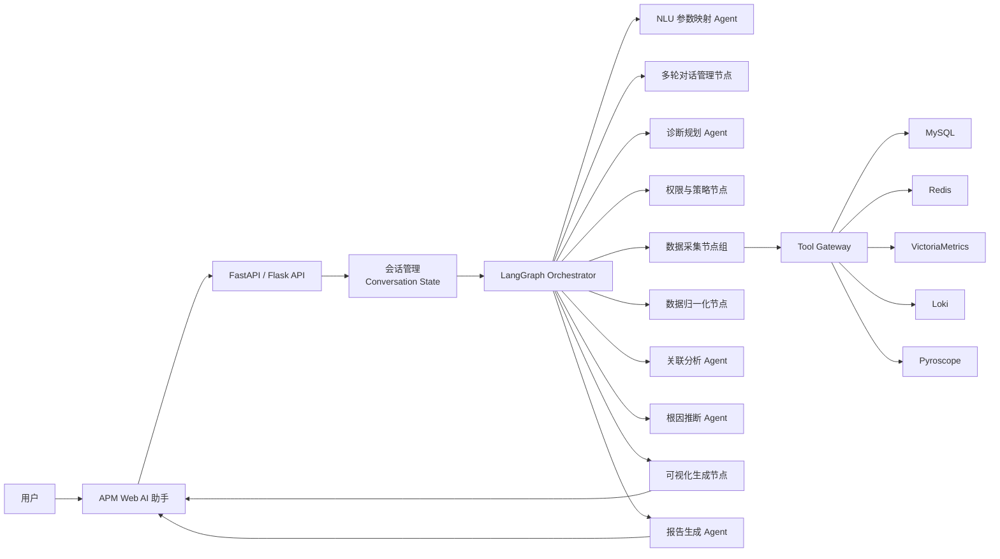
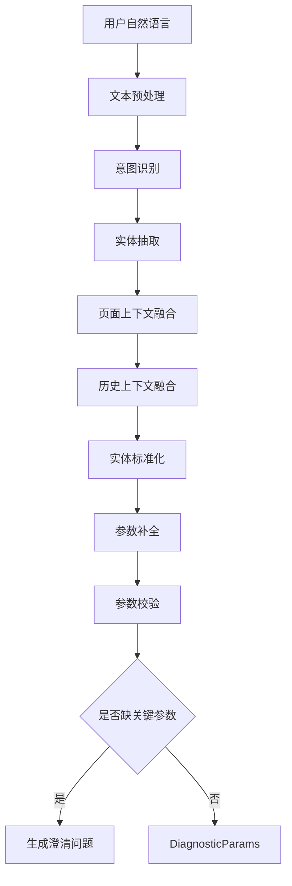
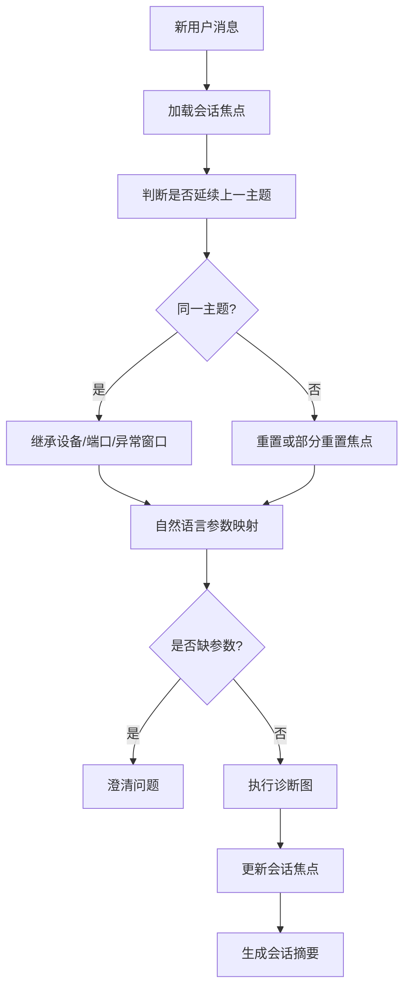
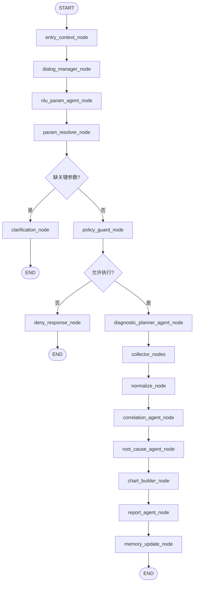
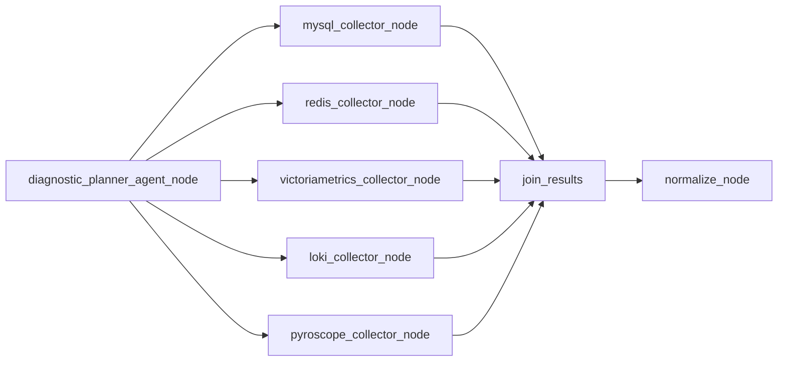
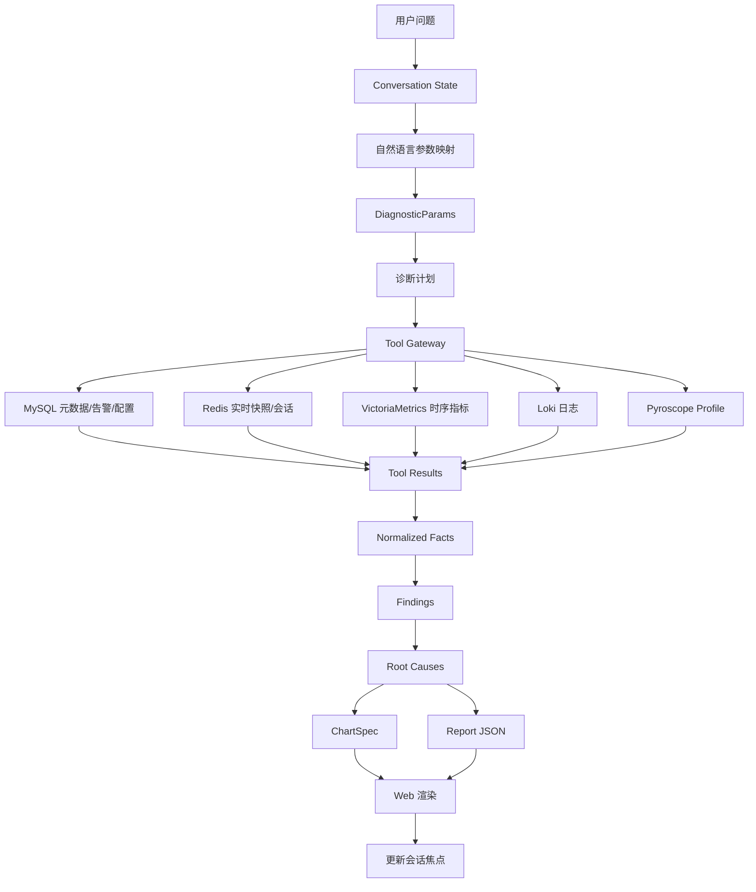
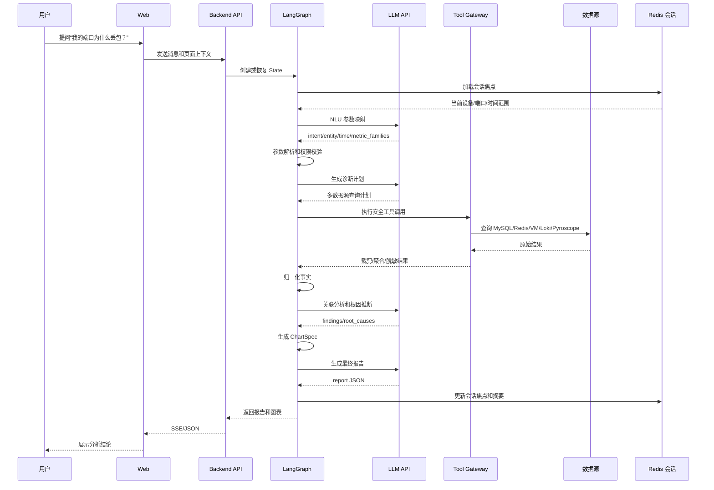

# 1 APM AI 助手 LangGraph 技术选型与实施方案 v2

> 版本：v0.2  
> 日期：2026-07-01  
> 重点增强：自然语言到参数映射、多轮对话、节点 Agent 化设计  
> 适用范围：APM Web 端 AI 助手、异常智能分析、多源观测数据关联分析

## 1.1 设计目标

APM AI 助手需要在 Web 端支持用户用自然语言完成异常分析，核心能力包括：

- 理解用户问题，并将自然语言映射为结构化诊断参数。
- 基于 LangGraph 编排多步骤诊断流程。
- 安全访问 MySQL、Redis、VictoriaMetrics、Pyroscope、Loki。
- 支持多轮对话、上下文继承、追问、澄清和二次分析。
- 输出包含结论、证据、图表、建议动作的结构化报告。
- 复用现有 Web 图表能力，生成 ECharts option 或内部 ChartSpec。

推荐采用：

```text
Web Chat UI
  -> APM Backend API
  -> LangGraph Orchestrator
  -> Agent Nodes / Deterministic Nodes
  -> Tool Gateway
  -> MySQL / Redis / VictoriaMetrics / Pyroscope / Loki
  -> Report + Charts
```

## 1.2 节点总览

| 节点                               | 是否 Agent | 类型            | 主要职责                        |
| -------------------------------- | -------- | ------------- | --------------------------- |
| `entry_context_node`             | 否        | Deterministic | 注入用户、租户、页面上下文               |
| `dialog_manager_node`            | 部分       | Hybrid        | 判断是否延续上一主题，多轮焦点管理           |
| `nlu_param_agent_node`           | 是        | Agent         | 自然语言到结构化参数映射                |
| `param_resolver_node`            | 否        | Deterministic | 实体标准化、时间解析、参数校验             |
| `clarification_node`             | 是        | Agent         | 生成澄清问题                      |
| `policy_guard_node`              | 否        | Deterministic | 权限、范围、风险校验                  |
| `diagnostic_planner_agent_node`  | 是        | Agent         | 生成多数据源查询计划                  |
| `mysql_collector_node`           | 否        | Tool Node     | 查询 MySQL                    |
| `redis_collector_node`           | 否        | Tool Node     | 查询 Redis                    |
| `victoriametrics_collector_node` | 否        | Tool Node     | 查询 VictoriaMetrics          |
| `loki_collector_node`            | 否        | Tool Node     | 查询 Loki                     |
| `pyroscope_collector_node`       | 否        | Tool Node     | 查询 Pyroscope                |
| `normalize_node`                 | 否        | Deterministic | 统一实体、时间、单位、事实结构             |
| `correlation_agent_node`         | 是        | Agent         | 多源证据关联                      |
| `root_cause_agent_node`          | 是        | Agent         | 根因推断和置信度评估                  |
| `chart_builder_node`             | 否        | Deterministic | 生成 ChartSpec/ECharts option |
| `report_agent_node`              | 是        | Agent         | 生成最终报告                      |
| `memory_update_node`             | 否        | Deterministic | 更新会话焦点、摘要和审计                |

## 1.3 总体架构



设计原则：

- LangGraph 负责流程控制，Agent 负责需要语义推理的任务。
- 数据访问必须经过 Tool Gateway，Agent 不直接访问数据库。
- LLM 不直接拼接 SQL、LogQL、MetricsQL。
- 所有大结果先聚合、降采样、摘要化，再进入 LLM。
- 多轮对话必须有显式状态，不依赖模型“记住”。

## 1.4 技术选型

| 层级 | 选型 | 说明 |
|---|---|---|
| 编排框架 | LangGraph | 使用 State、Node、Edge、Conditional Edge 表达诊断流程 |
| LLM | 商用 API | OpenAI、智谱、百度千帆等，通过统一 LLM Provider 抽象接入 |
| 后端 | FastAPI 优先 | 支持 async、SSE、WebSocket，便于流式返回 |
| 状态存储 | Redis + MySQL | Redis 保存活跃会话，MySQL 保存审计和长期会话摘要 |
| 数据访问 | Tool Gateway | 统一权限、限流、审计、参数校验 |
| 图表协议 | ChartSpec / ECharts option | 后端生成图表配置，前端渲染 |
| 评测 | 离线案例集 + 回放 | 用真实告警案例评估 Agent 输出质量 |

## 1.5 LangGraph State 设计

```python
from typing import TypedDict, Literal, Any

# 对话轮次记录
class ConversationTurn(TypedDict):
    role: Literal["user", "assistant", "system", "tool"]
    content: str
    created_at: str
    refs: list[str]

# 实体候选对象
class EntityCandidate(TypedDict):
    entity_type: Literal["device", "port", "process", "alert", "metric", "time_range"]
    raw_text: str
    normalized_value: str | None
    confidence: float
    source: Literal["question", "page_context", "history", "mysql", "redis"]

# 诊断结构化参数
class DiagnosticParams(TypedDict):
    tenant_id: str
    user_id: str
    intent: str
    device_id: str | None
    device_name: str | None
    port_name: str | None
    process_name: str | None
    alert_id: str | None
    metric_families: list[str]
    start_time: str | None
    end_time: str | None
    compare_start_time: str | None
    compare_end_time: str | None
    granularity: str
    direction: Literal["rx", "tx", "both", "unknown"]
    severity: Literal["info", "warning", "critical", "unknown"]

# 查询计划项
class QueryPlanItem(TypedDict):
    source: Literal["mysql", "redis", "victoriametrics", "pyroscope", "loki"]
    query_name: str
    purpose: str
    params: dict[str, Any]
    depends_on: list[str]
    risk_level: Literal["low", "medium", "high"]

class APMAnalysisState(TypedDict):
    conversation_id: str
    current_turn_id: str
    user_question: str
    conversation_history: list[ConversationTurn] # 对话轮次记录
    conversation_summary: str
    page_context: dict[str, Any]
    diagnostic_params: DiagnosticParams # 诊断结构化参数
    entity_candidates: list[EntityCandidate] # 实体候选对象
    missing_slots: list[str]
    clarification_question: str | None
    query_plan: list[QueryPlanItem] # 查询计划项
    tool_results: dict[str, Any]
    normalized_facts: list[dict[str, Any]]
    findings: list[dict[str, Any]]
    root_causes: list[dict[str, Any]]
    charts: list[dict[str, Any]]
    final_answer: dict[str, Any]
    audit_events: list[dict[str, Any]]
    errors: list[dict[str, Any]]
```

### 1.5.1 state说明
**核心类型定义**（`ConversationTurn`、`EntityCandidate`、`DiagnosticParams`、`QueryPlanItem`、`APMAnalysisState`）。它们共同构成了 LangGraph 的**数据契约（Data Contract）**。
- **`ConversationTurn`** = 原始对话的“存档带”（历史原文）
    
- **`EntityCandidate`** = LLM 猜的“可疑人名单”（待核实）
    
- **`DiagnosticParams`** = 质检员开出的“标准工单”（确定、安全的结构化参数）
    
- **`QueryPlanItem`** = 仓库管理员列的“取货清单”（要去哪个数据库拿什么）
    
- **`APMAnalysisState`** = 传送带上正在流转的“主控箱”（包含上述所有零件和最终结论）
### 1.5.2 ConversationTurn（对话轮次记录）

- **它是什么**：单次对话交互的**原始归档**。用于记录用户、助手、系统或工具之间的一次完整收发。
    
- **关键字段详解**：
    
    - `role`：限定了 `user/assistant/system/tool`，确保了多轮拼接时角色清晰，不会被误注入。
        
    - `content`：原始文本内容（不截断、不摘要）。
        
    - `created_at`：ISO 时间戳，用于后续排查时序问题。
        
    - `refs`：`list[str]`，存储该轮次引用的文档 ID、数据源 ID（方便溯源）。
        
- **在流程中的位置**：由 `entry_context_node` 初始化，`memory_update_node` 追加写入，`dialog_manager_node` 读取以判断上下文延续性。
    
- **设计意图**：严格遵守“不依赖模型记住”的原则。所有原始记录都显式存放在 State 中，方便回溯和重放。

### 1.5.3 EntityCandidate（实体候选对象）

- **它是什么**：LLM 从自然语言中“猜”出来的**模糊实体草稿**。它还不确定，需要后端代码二次校验。
    
- **关键字段详解**：
    
    - `entity_type`：限定为设备、端口、进程、告警、指标、时间范围。
        
    - `raw_text`：用户原话（如 `"我的端口"`、`"SW-Core"`）。
        
    - `normalized_value`：标准化后的值（如 `Gi1/0/24`），初始为 `None`。
        
    - `confidence`：置信度打分（0~1），用于筛选低质量候选。
        
    - `source`：标记这个实体是从哪里提取的（问题原文、页面上下文、历史记录还是数据库查到的）。
        
- **在流程中的位置**：由 `nlu_param_agent_node` 产出，由 `param_resolver_node` 消费并转化为确定性 ID。
    
- **设计意图**：**解耦“LLM 猜测”与“系统确定”**。LLM 只管提候选，后端通过 MySQL 元数据和优先级规则（文档 1.5.7 节）决定最终用哪个。这极大降低了 LLM 幻觉导致的实体误判风险。

### 1.5.4 DiagnosticParams（诊断结构化参数）

- **它是什么**：经过校验和标准化后的**最终确定性参数集**。它是下游所有数据查询和诊断计划的**唯一合法输入**。
    
- **关键字段详解**：
    
    - 租户/用户 ID：强制注入，用于权限隔离。
        
    - `intent`：意图标签（如 `port_packet_loss_diagnosis`）。
        
    - 实体 ID（`device_id`、`port_name` 等）：**必须来自 `EntityCandidate` 标准化后或页面上下文**，绝不直接拿用户原始文本。
        
    - `metric_families`：指标族列表（如端口丢包、CPU），由意图模板映射而来。
        
    - `start_time/end_time`：**绝对时间（ISO 8601）**，所有相对时间（“刚才”）在此节点被强制转换。
        
    - `direction`/`severity`：使用 `Literal` 限定枚举值，杜绝非法输入。
        
- **在流程中的位置**：由 `param_resolver_node` 组装产出，供 `policy_guard_node`（鉴权）和 `diagnostic_planner_agent_node`（生成计划）直接使用。
    
- **设计意图**：这是**安全隔离墙**。后续的 Tool Gateway 只认这个结构体里的值，LLM 完全无法绕过它去拼接 SQL 或 LogQL，从根源上防止了注入攻击。

### 1.5.5 `QueryPlanItem`（查询计划项）

- **它是什么**：针对**单个数据源**的**原子化查询指令**。诊断计划节点会生成一组这样的 Item，构成完整的执行蓝图。
    
- **关键字段详解**：
    
    - `source`：限定去哪个数据源拿（MySQL/Redis/VM/Loki/Pyroscope）。
        
    - `query_name`：业务语义名称（如 `get_port_metadata`、`query_tx_drops`）。
        
    - `purpose`：人类可读的目的说明（如“验证出口队列是否拥塞”），这个字段会进审计日志。
        
    - `params`：传给该数据源工具的具体参数字典（**经过校验的**）。
        
    - `depends_on`：`list[str]`，**声明依赖关系**。如果为空，LangGraph 会将该节点与其它无依赖的节点并行执行（文档 1.9.2 节）。
        
    - `risk_level`：标记查询风险（低/中/高），供 `policy_guard_node` 二次拦截。
        
- **在流程中的位置**：由 `diagnostic_planner_agent_node` 生成，被对应的 `xxx_collector_node` 逐一消费。
    
- **设计意图**：将“要什么数据”与“怎么拿数据”完全剥离。Agent 只负责业务层面的假设验证规划，具体的 SQL/LogQL 拼接由 Tool Node 的模板引擎完成，做到了**可审计、可并行、可限流**。

### 1.5.6 `APMAnalysisState`（全局主控状态）

- **它是什么**：LangGraph 运行时**唯一流转的大盘子（God Object）**。它包含了上述所有结构体，以及中间产物和最终输出。
    
- **结构分层解析**（自上而下）：
    
    1. **会话标识层**：`conversation_id`、`current_turn_id`、`user_question`。
        
    2. **历史与上下文层**：`conversation_history`（原始记录）、`conversation_summary`（压缩摘要，用于长记忆）、`page_context`（前端页面带来的强上下文）。
        
    3. **映射与澄清层**：`diagnostic_params`（最终工单）、`entity_candidates`（候选草稿）、`missing_slots` + `clarification_question`（中断信号，触发澄清流程）。
        
    4. **执行与证据层**：`query_plan`（蓝图）、`tool_results`（**原始返回值，不进 LLM**）、`normalized_facts`（**降采样/脱敏/聚合后的事实，只让这一层进 LLM**）。
        
    5. **推理与输出层**：`findings`（关联发现）、`root_causes`（根因列表）、`charts`（ECharts Option，前端直接渲染）。
        
    6. **可观测层**：`audit_events`（全量审计）、`errors`（错误快照）。
        
- **设计精髓**：
    
    - **阶段隔离**：原始数据（`tool_results`）和 LLM 输入（`normalized_facts`）严格分离，确保 Token 消耗可控且幻觉空间极小。
        
    - **断路机制**：一旦 `missing_slots` 被填充，条件边立刻终止后续所有昂贵的工具调用，直接进入澄清。

### 1.5.7 总结：它们如何串联工作？
```ad-summary
用户提问 -> `APMAnalysisState` 初始化。

1. `nlu_param_agent_node` 把问题变成 **`EntityCandidate`** 列表。
    
2. `param_resolver_node` 结合页面上下文，把候选标准化为 **`DiagnosticParams`**；若缺参数，则塞入 `missing_slots` 并触发澄清。
    
3. `diagnostic_planner_agent_node` 根据 `DiagnosticParams` 生成一组 **`QueryPlanItem`**（如查 MySQL、查 VM）。
    
4. 采集节点执行 `QueryPlanItem`，将原始结果存入 `tool_results`，`normalize_node` 清洗后生成 `normalized_facts`。
    
5. 后续的推理 Agent（RCA、报告）只读 `normalized_facts` 和 `findings`，最终产出 `charts` 和 `final_answer`。
    
6. `memory_update_node` 将本轮焦点写入 Redis（映射为 `ConversationFocus`），**但不把整个巨大的 State 落库**，只落摘要和审计。
```

这套设计让 **LLM 只在“语义理解”和“推理总结”处介入**，而“数据获取”和“参数校验”完全由确定性代码掌控，非常适合 APM 这种对准确性和安全性要求极高的场景。如果对某个具体字段的 Reducer（归约器）写法有疑问，也可以随时问我。

## 1.6 自然语言到参数映射设计

### 1.6.1 目标

自然语言到参数映射负责把用户的模糊表达转换成后续工具可以安全使用的结构化参数。

示例：

```text
用户：我的端口为什么丢包？
页面上下文：device_id=sw-core-01, port=Gi1/0/24
映射结果：
  intent = port_packet_loss_diagnosis
  device_id = sw-core-01
  port_name = Gi1/0/24
  metric_families = ["port_packet_loss", "port_buffer", "port_traffic", "system_resource"]
  time_range = 最近 1 小时
  direction = both
```

### 1.6.2 参数映射处理链路



### 1.6.3 参数映射字段

| 参数 | 来源 | 示例 | 补全策略 |
|---|---|---|---|
| `intent` | 用户问题 | `port_packet_loss_diagnosis` | LLM 分类 + 关键词规则 |
| `device_id` | 页面上下文、问题、历史 | `sw-core-01` | 优先页面，其次历史，其次名称解析 |
| `port_name` | 页面上下文、问题、历史 | `Gi1/0/24` | 端口详情页自动补全 |
| `process_name` | 问题、历史 | `snmpd` | 进程问题才需要 |
| `alert_id` | 页面上下文、问题 | `alert-123` | 告警详情页自动补全 |
| `metric_families` | intent 映射 | `port_packet_loss` | 由意图模板生成 |
| `start_time/end_time` | 问题、页面、默认值 | 最近 1 小时 | 用户指定优先 |
| `granularity` | 时间范围 | `30s` | 按时间范围自动计算 |
| `direction` | 问题关键词 | `tx` | 未指定则 both |
| `severity` | 问题关键词 | `critical` | 未指定 unknown |

### 1.6.4 意图分类设计

第一版意图集合建议控制在可维护范围内：

| intent                       | 用户说法            | 需要数据源                                |
| ---------------------------- | --------------- | ------------------------------------ |
| `port_packet_loss_diagnosis` | 为什么丢包、端口掉包、接口丢包 | MySQL、Redis、VictoriaMetrics、Loki     |
| `system_cpu_diagnosis`       | CPU 为什么高、系统负载高  | MySQL、VictoriaMetrics、Loki、Pyroscope |
| `process_cpu_diagnosis`      | 哪个进程 CPU 高、进程卡住 | MySQL、VictoriaMetrics、Pyroscope、Loki |
| `memory_diagnosis`           | 内存为什么涨、是否泄漏     | VictoriaMetrics、Loki、Pyroscope       |
| `alert_explanation`          | 这个告警什么意思、为什么触发  | MySQL、VictoriaMetrics、Loki           |
| `log_investigation`          | 查一下日志、有没有异常日志   | Loki、MySQL                           |
| `metric_trend_query`         | 最近趋势如何、帮我画图     | VictoriaMetrics、Redis                |
| `unknown`                    | 无法识别            | 无，进入澄清                               |

### 1.6.5 规则 + LLM 混合映射

不要完全依赖 LLM。建议采用三层映射：

#### 1.6.5.1 第一层：确定性规则

用于处理高置信关键词：

| 关键词 | intent/参数 |
|---|---|
| 丢包、掉包、packet loss、drop | `port_packet_loss_diagnosis` |
| CPU 高、负载高 | `system_cpu_diagnosis` 或 `process_cpu_diagnosis` |
| 内存、泄漏、OOM | `memory_diagnosis` |
| 火焰图、profile、热点函数 | `process_cpu_diagnosis` + Pyroscope |
| 日志、报错、error | `log_investigation` |

#### 1.6.5.2 第二层：LLM structured output

要求 LLM 输出固定 JSON：

```json
{
  "intent": "port_packet_loss_diagnosis",
  "entities": [
    {
      "entity_type": "port",
      "raw_text": "我的端口",
      "normalized_value": null,
      "confidence": 0.61
    }
  ],
  "time_expression": "最近一小时",
  "direction": "unknown",
  "needs_clarification": false
}
```

#### 1.6.5.3 第三层：后端标准化与校验

后端根据 MySQL 元数据和页面上下文做标准化：

- 设备名转 `device_id`。
- 端口别名转标准端口名。
- “刚才”“上午”“昨天晚上”转绝对时间。
- “这台设备”“这个端口”从页面上下文或历史中解析。

### 1.6.6 时间表达式映射

| 自然语言     | 映射                         |
| -------- | -------------------------- |
| 最近一小时    | `now-1h` 到 `now`           |
| 刚才       | `now-15m` 到 `now`          |
| 今天上午     | 当天 `00:00` 到 `12:00`，按用户时区 |
| 昨天晚上     | 昨天 `18:00` 到 `23:59:59`    |
| 告警发生前后   | 告警时间前后各 30 分钟              |
| 和昨天同一时间比 | 当前窗口 + 昨日同窗口 compare range |


实现要求：

- 所有相对时间在后端转换为绝对时间。
- 存入 State 时使用 ISO 8601。
- 每次报告中显示用户可理解的本地时间。

### 1.6.7 实体解析优先级

设备、端口、进程等实体的优先级：

1. 用户当前问题中明确指定的实体。
2. Web 页面上下文，例如设备详情页、端口详情页、告警详情页。
3. 最近一轮对话中正在分析的实体。
4. 会话摘要中的当前焦点实体。
5. MySQL 模糊搜索结果。
6. 无法唯一确定时进入澄清问题。

示例：

```text
第一轮：帮我看看 SW-Core-01 的 Gi1/0/24 为什么丢包
第二轮：那 CPU 有影响吗？

第二轮映射：
  device_id = sw-core-01
  port_name = Gi1/0/24
  intent = system_resource_correlation
  time_range = 继承第一轮异常窗口
```

### 1.6.8 参数校验与澄清

关键参数缺失时不进入数据采集：

| 缺失项 | 澄清问题 |
|---|---|
| 多个设备匹配 | “我找到多个匹配设备，请选择 SW-Core-01 还是 SW-Access-01？” |
| 缺少设备 | “你想分析哪台交换机？也可以先进入设备详情页再提问。” |
| 缺少端口 | “你想分析哪个端口？例如 Gi1/0/24。” |
| 时间范围过大 | “这个查询跨度较大，是否先分析最近 24 小时？” |
| 无权限 | “当前账号没有访问该对象的权限。” |

## 1.7 多轮对话设计

### 1.7.1 多轮对话目标

多轮对话不是简单拼接历史消息，而是要维护可控状态：

- 当前分析对象：设备、端口、进程、告警。
- 当前时间范围和异常窗口。
- 已查询数据和证据。
- 已得出的结论和置信度。
- 用户后续追问要继承哪些上下文。
- 用户切换主题时要重置哪些上下文。

### 1.7.2 会话状态分层

| 层级 | 内容 | 存储 | 用途 |
|---|---|---|---|
| 短期 turn state | 当前轮问题、参数、工具结果 | LangGraph State | 当前轮执行 |
| 活跃会话状态 | 当前焦点设备、端口、异常窗口、最近结论 | Redis | 多轮追问 |
| 长期摘要 | 会话摘要、用户反馈、典型案例 | MySQL 或向量库 | 审计、复盘、优化 |
| 原始审计 | 工具调用、参数、耗时、错误 | MySQL/日志系统 | 合规与排障 |

### 1.7.3 多轮上下文结构

```python
class ConversationFocus(TypedDict):
    active_device_id: str | None
    active_port_name: str | None
    active_process_name: str | None
    active_alert_id: str | None
    active_time_range: dict[str, str] | None
    active_anomaly_window: dict[str, str] | None
    last_intent: str | None
    last_root_causes: list[dict]
    last_chart_refs: list[str]
    last_data_refs: list[str]
```

`ConversationFocus` 是存储在 **Redis** 中的“跨轮次记忆核心”，它的设计初衷是**轻量化**（仅存储跨轮复用必需的字段），专门用于支撑多轮对话中的“上下文继承”。下面我把每个字段掰开揉碎，结合 APM 实际场景详细解释：

---

#### 1.7.3.1 第一组：当前分析目标（“我们在看什么？”）

| 字段 | 类型 | 详细解释 |
| :--- | :--- | :--- |
| **`active_device_id`** | `str \| None` | **当前正在分析的设备 ID**（如 `sw-core-01`）。<br>• 当用户第一轮说“看看 SW-Core-01”，这里就存 `sw-core-01`。<br>• 第二轮用户说“CPU 有影响吗？”，`dialog_manager_node` 读到这里，直接把设备继承下去。<br>• 如果用户说“换一台 SW-Access-02”，这里就会被覆写。 |
| **`active_port_name`** | `str \| None` | **当前正在分析的端口名**（如 `Gi1/0/24`）。<br>• 端口是 APM 网络诊断中最核心的实体。只要用户没明确说“换端口”，这个值会一直保留。<br>• 即使第三轮用户只问“日志展开看看”，端口名依然从这继承，保证查 Loki 时能精准命中该端口的日志。 |
| **`active_process_name`** | `str \| None` | **当前正在分析的进程名**（如 `snmpd`、`java`）。<br>• 仅在 CPU/内存诊断场景下使用。例如用户问“哪个进程 CPU 高”，助手定位到 `snmpd` 后，这里就存下来。<br>• 后续追问“这个进程的内存呢？”，就能直接继承，无需用户重复进程名。 |
| **`active_alert_id`** | `str \| None` | **当前正在处理的告警 ID**（如 `alert-123`）。<br>• 当用户从告警详情页发起提问（如“这个告警什么意思”），页面上下文会把告警 ID 注入这里。<br>• 多轮追问中，如果用户问“告警触发前后发生了什么”，这里能确保时间范围自动锚定到告警发生时刻。 |

> **设计意图**：这四个字段是**互斥或组合**的。比如设备+端口组合用于网络诊断，设备+进程组合用于系统诊断。它们决定了后续所有查询的 **“作用域”**。

---

#### 1.7.3.2 第二组：时间锚点（“我们看哪个时间段？”）

| 字段 | 类型 | 详细解释 |
| :--- | :--- | :--- |
| **`active_time_range`** | `dict[str, str] \| None` | **广义时间范围**（如 `{"start": "2026-07-01T09:30:00+08:00", "end": "2026-07-01T10:30:00+08:00"}`）。<br>• 这是用户最初请求的大致时间窗口（例如“最近一小时”）。<br>• 用于**宏观趋势查询**（如画趋势图、查询整体指标）。 |
| **`active_anomaly_window`** | `dict[str, str] \| None` | **精确的异常事件窗口**（如 `{"start": "2026-07-01T10:12:00+08:00", "end": "2026-07-01T10:18:00+08:00"}`）。<br>• **这是比 `active_time_range` 更精细的定位**。它通常由根因分析节点（RCA）识别出的突增时段。<br>• 在文档的端口丢包案例中，助手发现“10:12-10:18”是丢包峰值，就把这个窗口写进来。<br>• 当用户第二轮追问“CPU 有影响吗？”，查询计划会**优先使用 `active_anomaly_window`** 去查 CPU，因为要检查“异常窗口内 CPU 是否同步升高”，而不是查整个“最近一小时”。|

> **优先级规则**：当两者同时存在时，**`active_anomaly_window` 优先于 `active_time_range`**。因为异常窗口是精确的“事故现场”，广义时间范围只是备选。

---

#### 1.7.3.3 第三组：上一轮的产出摘要（“我们刚刚发现了什么？”）

| 字段 | 类型 | 详细解释 |
| :--- | :--- | :--- |
| **`last_intent`** | `str \| None` | **上一轮识别出的意图**（如 `port_packet_loss_diagnosis`）。<br>• 用于 `dialog_manager_node` 判断本轮是否属于同一主题。<br>• 如果上一轮是 `port_packet_loss_diagnosis`，本轮问“CPU 有影响吗？”会被分类为 `correlation_question`（关联追问），而不是开启全新的诊断。 |
| **`last_root_causes`** | `list[dict]` | **上一轮推断出的根因列表**（包含原因、置信度、证据 ID）。<br>• 主要用途：**证据追问**。当用户问“依据是什么？”时，`report_agent_node` 直接读这里的缓存，**无需重新查询数据源**，秒回。<br>• 同时也用于避免重复推理——如果本轮只是要求“换个说法解释”，直接复用这里的结果即可。 |
| **`last_chart_refs`** | `list[str]` | **上一轮生成的图表 ID 列表**（如 `["chart-001", "chart-002"]`）。<br>• 用于图表追问，例如用户说“把刚才的图画成折线图”，系统知道要拿哪几个图表配置做转换。<br>• 也用于前端去重——避免同一个图表在连续两轮中被重复渲染。 |
| **`last_data_refs`** | `list[str]` | **上一轮查询的数据源引用 ID 列表**（如 `["data-ref-mysql-001", "data-ref-vm-003"]`）。<br>• 每个数据引用指向 `tool_results` 中某次具体查询的结果快照（存储于对象存储或 MySQL blob）。<br>• 用途：**深挖追问**（如“把日志展开看看”）。`dialog_manager_node` 拿到这些 ID，就能判断“日志是否已经在上一轮查过了”，如果查过且只查了摘要，本轮只需在相同 `data_ref` 基础上做更细粒度的查询，而不必重头查全量数据。|

---

#### 1.7.3.4 补充说明：它如何与 `APMAnalysisState` 协作？

- **读操作**：每一轮开始时，`dialog_manager_node` 从 Redis 读取 `ConversationFocus`，将其中的 `active_device_id`、`active_port_name`、`active_anomaly_window` 等值**覆写**到本轮新建的 `APMAnalysisState.diagnostic_params` 中。
- **写操作**：每一轮结束时，`memory_update_node` 根据本轮实际的 `diagnostic_params` 和 `root_causes`，**更新** Redis 中的 `ConversationFocus`（注意不是把整个 State 序列化进去，而是只提取这 11 个字段）。

**关键原则**：`ConversationFocus` 只存“元数据”（ID、时间窗、引用 ID），**绝不存储**原始日志、时序点、SQL 结果等大体积数据。这保证了 Redis 读写极快，且内存占用可控。

### 1.7.4 多轮对话流程


#### 1.7.4.1 同一主题逻辑判断
以下是完整的判断逻辑链条，按优先级从高到低排列：

##### 1.7.4.1.1 第一层：硬规则过滤（确定性代码，零成本优先）

这一层不需要调 LLM，直接通过比较 State 中的结构化数据得出结论：

1. **实体锚点是否发生“硬切换”？**
   - 比较本轮 `nlu_param_agent_node` 产出的候选实体，与 Redis 中 `ConversationFocus` 的 `active_device_id`、`active_port_name`。
   - 如果用户明确提到**完全不同的设备名**（例如从 `SW-Core-01` 变成 `SW-Access-02`），且没有关联词（如“和刚才那台对比”），直接判定为**切换主题**，重置相关焦点。
   - 如果用户提到**同一个设备的不同端口**，判定为**延续主题**（仅更换分析对象细节）。

2. **时间窗口是否明确重置？**
   - 如果用户明确指定了新的绝对时间（如“看看昨天下午 3 点”），而上一轮焦点是“最近 1 小时”，则判定为**新主题**或**独立对比主题**。
   - 如果用户没有提时间，默认继承 `active_anomaly_window`，判定为**延续**。

---

##### 1.7.4.1.2 第二层：意图逻辑关联（规则 + 意图字典）

查看 `last_intent`（上一轮意图）与当前轮 `intent` 的关系，参照文档 1.7.5 节的“追问类型识别”：

| 上一轮意图 | 当前轮意图/行为 | 判断结果 | 处理策略 |
| :--- | :--- | :--- | :--- |
| `port_packet_loss_diagnosis` | `log_investigation`（查日志） | **延续（深挖）** | 继承设备、端口、异常窗口，只追加 Loki 查询 |
| `port_packet_loss_diagnosis` | `system_resource_correlation`（查 CPU） | **延续（关联）** | 继承实体和时间窗口，新增指标族 |
| `port_packet_loss_diagnosis` | `alert_explanation`（解释告警） | **可能延续** | 需看告警是否属于该设备，若是则继承设备 ID |
| `port_packet_loss_diagnosis` | `memory_diagnosis`（内存诊断） | **大概率延续** | 如果用户没提新设备，默认分析同一设备的内存（系统资源关联） |
| `port_packet_loss_diagnosis` | `metric_trend_query`（画个 CPU 趋势图） | **延续（图表）** | 复用设备 ID，仅改时间范围或指标 |
| 任意意图 | 用户说“再看另一个”、“换一台” | **硬切换** | 重置焦点，进入全新诊断流程 |

> **关键点**：如果当前意图与上一轮意图在业务上**毫无关联**（例如上一轮查端口丢包，本轮问“今天天气如何”），直接判定为不延续。

---

##### 1.7.4.1.3 第三层：指代消解（Reference Resolution）

利用文档 1.8.2 节中的 `Reference Resolver` 模块，解析模糊指代词：

- **“这个端口”**、**“刚才那台”**、**“它”** → 映射到 `ConversationFocus` 中的 `active_device_id`/`active_port_name`，判定为**延续**。
- **“换个别的”**、**“再看一个”** → 判定为**切换**，明确重置字段。

---

##### 1.7.4.1.4 第四层：LLM 语义分类（兜底软判断）

当硬规则和意图字典无法明确判断时（例如用户问得特别模糊，或意图不在预设映射表里），才调用 LLM 进行分类。

`dialog_manager_node` 将以下信息拼成 Prompt 喂给 LLM：

- 当前用户问题。
- 最近 3-5 轮对话摘要（`conversation_summary`）。
- 当前 Redis 中的 `ConversationFocus`（焦点对象）。

要求 LLM 输出固定 JSON 结构（文档 1.8.2 节）：

```json
{
  "is_follow_up": true,                      // 核心判断：是否延续
  "follow_up_type": "correlation_question",  // 追问类型（关联/深挖/对比等）
  "inherit_fields": ["device_id", "port_name", "active_anomaly_window"], // 要继承什么
  "reset_fields": []                         // 要清空什么
}
```

---

##### 1.7.4.1.5 判断的核心输出与后续动作

无论采用哪一层判断，最终 `dialog_manager_node` 都会产出明确的**继承/重置指令**，并以此覆写当前轮的 `APMAnalysisState.diagnostic_params`：

- **判定为“延续”**：将 Redis 中的 `device_id`、`port_name`、`active_anomaly_window` 直接赋给当前 `diagnostic_params`，跳过实体解析中的“从零搜索”，极大提速。
- **判定为“切换”**：清空上一轮绑定的 `device_id` 和 `port_name`，仅保留租户和用户 ID，让后续 `nlu_param_agent_node` 和 `param_resolver_node` 重新从页面上下文或用户问题中提取新实体。

---

##### 1.7.4.1.6 MVP 阶段简化建议（文档 1.18 节）

文档明确指出，对于 3 人团队的第一版，**不急于实现复杂的 LLM 分类**，多轮对话只支持“继承设备、端口、异常窗口”。此时判断逻辑极度简化：

- **只看实体 ID**：如果当前问题中没有出现新的设备名，且页面上下文没变，默认继承焦点；
- **只看时间表达**：如果用户没提“换时间”，默认沿用上一轮的 `active_anomaly_window`；
- **遇到“换一台”、“再看别的”等硬关键词**，直接用正则匹配并强制重置。

等到阶段 2 再逐步引入 LLM 来处理复杂的“关联追问”和“指代消解”。这符合“规则先行，LLM 兜底”的 APM 场景最佳实践。
```text
// 最终的判断逻辑伪代码
function isSameTopic(current_question, page_context, redis_focus):
    // 1. 硬规则：实体切换检测
    if extract_new_device(current_question) and new_device != redis_focus.active_device_id:
        return false, "switch_device"
    
    // 2. 硬规则：关键词重置检测
    if match_reset_keywords(current_question): // "换一台", "重新分析"
        return false, "manual_reset"
    
    // 3. 意图逻辑匹配
    current_intent = classify_intent_by_rules(current_question)
    if is_related_intent(redis_focus.last_intent, current_intent):
        return true, "intent_follow_up" // 继承焦点
    
    // 4. MVP 阶段：保守原则，无法判断时默认延续（减少用户重复输入）
    //    生产阶段：交给 LLM 做语义判断
    if not feature_flag("llm_topic_classifier"):
        return true, "conservative_inherit"
    
    // 5. LLM 兜底判断
    return llm_classify(current_question, redis_focus)
```

### 1.7.5 追问类型识别

| 追问类型 | 示例                | 处理策略                     |
| ---- | ----------------- | ------------------------ |
| 证据追问 | “依据是什么？”          | 复用上一轮 evidence，不重新查数据    |
| 深挖追问 | “看看日志细节”          | 继承设备和异常窗口，只查 Loki        |
| 关联追问 | “CPU 有影响吗？”       | 继承设备和时间窗口，补查 CPU 指标      |
| 对比追问 | “和昨天比呢？”          | 继承实体，新增 compare range    |
| 图表追问 | “画个趋势图”           | 复用已有数据或补查指标，生成 ChartSpec |
| 切换对象 | “再看 SW-Access-02” | 切换设备，重建参数                |
| 处置追问 | “该怎么处理？”          | 基于根因生成建议，必要时人工确认         |

### 1.7.6 会话焦点更新规则

每轮结束时更新：

- 如果本轮明确指定设备，则更新 `active_device_id`。
- 如果本轮明确指定端口，则更新 `active_port_name`。
- 如果识别出异常窗口，则更新 `active_anomaly_window`。
- 如果生成图表，则记录 `last_chart_refs`。
- 如果本轮只是解释上一轮结论，不更新核心焦点。
- 如果用户明确说“换一台”“再看另一个”，重置相关焦点。

### 1.7.7 多轮案例

第一轮：

```text
用户：我的端口为什么丢包？
页面上下文：SW-Core-01 / Gi1/0/24
助手：最可能是出口队列拥塞，异常窗口为 10:12-10:18。
```

第二轮：

```text
用户：CPU 有影响吗？
```

参数映射：

```json
{
  "intent": "system_resource_correlation",
  "device_id": "sw-core-01",
  "port_name": "Gi1/0/24",
  "start_time": "2026-07-01T10:12:00+08:00",
  "end_time": "2026-07-01T10:18:00+08:00",
  "metric_families": ["system_cpu", "process_cpu"]
}
```

回答：

```text
从同一异常窗口看，系统 CPU 保持在 35%-42%，关键进程 CPU 也没有同步升高。
因此 CPU 不是本次端口丢包的主要原因。
```

第三轮：

```text
用户：那把日志展开看看
```

参数映射：

```json
{
  "intent": "log_investigation",
  "device_id": "sw-core-01",
  "port_name": "Gi1/0/24",
  "start_time": "2026-07-01T10:12:00+08:00",
  "end_time": "2026-07-01T10:18:00+08:00",
  "keywords": ["queue", "drop", "congestion", "Gi1/0/24"]
}
```

## 1.8 LangGraph 节点与 Agent 设计

### 1.8.1 节点分类原则

不是所有节点都应该是 Agent。

适合做 Agent 的节点：

- 需要自然语言理解。
- 需要生成诊断计划。
- 需要跨事实推理。
- 需要组织自然语言报告。

不适合做 Agent 的节点：

- 权限校验。
- 参数校验。
- 数据查询。
- 数据脱敏。
- 降采样。
- 审计。
- 图表 option 的确定性拼装。

### 1.8.2 节点总览

| 节点                               | 是否 Agent | 类型            | 主要职责                        |
| -------------------------------- | -------- | ------------- | --------------------------- |
| `entry_context_node`             | 否        | Deterministic | 注入用户、租户、页面上下文               |
| `dialog_manager_node`            | 部分       | Hybrid        | 判断是否延续上一主题，多轮焦点管理           |
| `nlu_param_agent_node`           | 是        | Agent         | 自然语言到结构化参数映射                |
| `param_resolver_node`            | 否        | Deterministic | 实体标准化、时间解析、参数校验             |
| `clarification_node`             | 是        | Agent         | 生成澄清问题                      |
| `policy_guard_node`              | 否        | Deterministic | 权限、范围、风险校验                  |
| `diagnostic_planner_agent_node`  | 是        | Agent         | 生成多数据源查询计划                  |
| `mysql_collector_node`           | 否        | Tool Node     | 查询 MySQL                    |
| `redis_collector_node`           | 否        | Tool Node     | 查询 Redis                    |
| `victoriametrics_collector_node` | 否        | Tool Node     | 查询 VictoriaMetrics          |
| `loki_collector_node`            | 否        | Tool Node     | 查询 Loki                     |
| `pyroscope_collector_node`       | 否        | Tool Node     | 查询 Pyroscope                |
| `normalize_node`                 | 否        | Deterministic | 统一实体、时间、单位、事实结构             |
| `correlation_agent_node`         | 是        | Agent         | 多源证据关联                      |
| `root_cause_agent_node`          | 是        | Agent         | 根因推断和置信度评估                  |
| `chart_builder_node`             | 否        | Deterministic | 生成 ChartSpec/ECharts option |
| `report_agent_node`              | 是        | Agent         | 生成最终报告                      |
| `memory_update_node`             | 否        | Deterministic | 更新会话焦点、摘要和审计                |

## 1.9 节点详细设计

### 1.9.1 `entry_context_node`

是否 Agent：否。

作用：

- 接收用户消息。
- 注入用户身份、租户、RBAC scope。
- 注入 Web 页面上下文。
- 初始化或恢复 LangGraph State。

输入：

- `message`
- `conversation_id`
- `page_context`
- `auth_context`

输出：

- `APMAnalysisState`

模块：

| 模块 | 作用 |
|---|---|
| Request Parser | 解析 API 请求 |
| Auth Context Injector | 注入 user_id、tenant_id、device_scope |
| Page Context Normalizer | 标准化页面上下文 |
| State Initializer | 初始化当前轮 State |

### 1.9.2 `dialog_manager_node`

是否 Agent：部分。建议 MVP 先用规则，复杂追问再引入轻量 LLM。

作用：

- 加载会话焦点。
- 判断当前问题是否延续上一轮。
- 决定继承、重置或部分重置上下文。

Agent 设计：

| 模块 | 作用 |
|---|---|
| Focus Loader | 从 Redis/MySQL 加载当前会话焦点 |
| Topic Continuity Classifier | 判断是否同一主题 |
| Reference Resolver | 解析“这个端口”“刚才那个告警”等指代 |
| Focus Merge Policy | 决定继承哪些字段 |

LLM 输入：

- 当前问题。
- 最近 3-5 轮摘要。
- 当前焦点对象。

LLM 输出：

```json
{
  "is_follow_up": true,
  "follow_up_type": "correlation_question",
  "inherit_fields": ["device_id", "port_name", "active_anomaly_window"],
  "reset_fields": []
}
```

### 1.9.3 `nlu_param_agent_node`

是否 Agent：是。

作用：

- 完成自然语言理解。
- 输出候选意图、实体、时间表达式、指标族、方向等。

Agent 内部模块：

| 模块 | 作用 |
|---|---|
| Intent Classifier | 将问题分类到 APM 诊断意图 |
| Entity Extractor | 抽取设备、端口、进程、告警、指标 |
| Time Expression Extractor | 抽取“最近一小时”“昨天晚上”等时间表达 |
| Metric Family Mapper | 根据意图映射指标族 |
| Direction Detector | 判断 RX、TX、both |
| Confidence Scorer | 给意图和实体打置信度 |
| Structured Output Formatter | 输出固定 JSON |

工具权限：

- 不访问真实数据源。
- 可访问只读的意图词典、指标字典、端口命名规则。

输出：

```json
{
  "intent": "port_packet_loss_diagnosis",
  "entities": [
    {"entity_type": "port", "raw_text": "我的端口", "confidence": 0.6}
  ],
  "metric_families": ["port_packet_loss", "port_buffer", "port_traffic"],
  "time_expression": null,
  "direction": "both",
  "missing_slots": []
}
```

### 1.9.4 `param_resolver_node`

是否 Agent：否。

作用：

- 将候选实体解析为系统 ID。
- 合并页面上下文、会话上下文和 NLU 结果。
- 将相对时间转换为绝对时间。
- 校验参数完整性。

模块：

| 模块 | 作用 |
|---|---|
| Entity Normalizer | 设备名、端口别名、进程名标准化 |
| Metadata Resolver | 通过 MySQL 元数据解析 ID |
| Time Resolver | 相对时间转绝对时间 |
| Default Param Filler | 填充默认时间范围、粒度、方向 |
| Param Validator | 校验是否缺关键参数 |

说明：

- 该节点可以调用 MySQL 元数据工具，但只允许查小范围元数据。
- 如果一个名称匹配多个设备，不能强行选择，必须进入澄清。

### 1.9.5 `clarification_node`

是否 Agent：是。

作用：

- 根据缺失或冲突参数生成简短澄清问题。
- 将可选项返回前端。

Agent 内部模块：

| 模块 | 作用 |
|---|---|
| Missing Slot Analyzer | 分析缺少哪些关键槽位 |
| Option Formatter | 把候选设备、端口、时间范围格式化 |
| Clarification Generator | 生成一句清晰问题 |

示例输出：

```json
{
  "type": "clarification",
  "message": "我找到两台匹配设备，请选择要分析哪一台。",
  "options": [
    {"label": "SW-Core-01", "value": "sw-core-01"},
    {"label": "SW-Core-02", "value": "sw-core-02"}
  ]
}
```

### 1.9.6 `policy_guard_node`

是否 Agent：否。

作用：

- 权限校验。
- 风险校验。
- 查询范围校验。
- 数据源访问策略校验。

模块：

| 模块 | 作用 |
|---|---|
| RBAC Checker | 检查用户是否能访问目标设备 |
| Tenant Scope Enforcer | 强制注入 tenant_id |
| Time Range Limiter | 限制最大查询时间跨度 |
| Query Budget Controller | 控制每轮最大工具调用数 |
| Write Operation Gate | 写操作风险分级，必要时人工确认 |

### 1.9.7 `diagnostic_planner_agent_node`

是否 Agent：是。

作用：

- 根据诊断参数生成多数据源查询计划。
- 说明每个查询要验证什么假设。
- 决定哪些查询可以并发，哪些需要依赖前序结果。

Agent 内部模块：

| 模块 | 作用 |
|---|---|
| SOP Selector | 选择端口丢包、CPU、内存等诊断 SOP |
| Hypothesis Generator | 生成候选原因假设 |
| Evidence Requirement Mapper | 将假设映射到所需证据 |
| Data Source Planner | 决定查询 MySQL/Redis/VM/Loki/Pyroscope |
| Dependency Planner | 生成查询依赖关系 |
| Risk Annotator | 标记风险等级 |

端口丢包假设示例：

| 假设 | 需要证据 | 数据源 |
|---|---|---|
| 出口队列拥塞 | TX drops、buffer、出方向流量、queue 日志 | VM、Redis、Loki |
| 链路抖动 | link down/up、接口状态变化 | Loki、MySQL |
| CPU 饱和 | 系统 CPU、进程 CPU、profile | VM、Pyroscope |
| 配置变更 | 最近端口/QoS 配置变更 | MySQL |
| 对端/下游瓶颈 | 出方向接近速率上限、对端状态 | VM、MySQL |

### 1.9.8 数据采集节点组

是否 Agent：否，全部是 Tool Node。

原因：

- 数据采集必须确定、可审计、可限流。
- Agent 只能生成业务语义查询计划，不能直接执行任意查询语言。

#### 1.9.8.1 `mysql_collector_node`

模块：

| 模块 | 作用 |
|---|---|
| Query Template Selector | 选择预定义 SQL 模板 |
| Parameter Binder | 参数化绑定，避免注入 |
| Scope Injector | 注入 tenant_id 和 device_scope |
| Result Projector | 字段裁剪 |
| Audit Logger | 记录查询审计 |

#### 1.9.8.2 `redis_collector_node`

模块：

| 模块 | 作用 |
|---|---|
| Key Builder | 构造白名单 namespace key |
| TTL Policy Checker | 写操作 TTL 校验 |
| Snapshot Reader | 读取实时指标 |
| Session Writer | 写入 AI 会话状态 |

#### 1.9.8.3 `victoriametrics_collector_node`

模块：

| 模块 | 作用 |
|---|---|
| Metric Template Mapper | 业务指标族到 MetricsQL 模板 |
| Range Query Builder | 构造 query_range |
| Step Calculator | 按时间范围计算 step |
| Downsampler | 降采样 |
| Anomaly Segment Extractor | 提取异常片段 |

#### 1.9.8.4 `loki_collector_node`

模块：

| 模块 | 作用 |
|---|---|
| LogQL Template Mapper | 业务语义到 LogQL 模板 |
| Label Scope Injector | 注入租户、设备、端口 label |
| Log Deduplicator | 日志去重 |
| Pattern Grouper | 日志模式聚合 |
| Sensitive Masker | 敏感字段脱敏 |

#### 1.9.8.5 `pyroscope_collector_node`

模块：

| 模块 | 作用 |
|---|---|
| Profile Target Resolver | 确定应用/进程 profile target |
| Profile Window Mapper | 对齐异常时间窗口 |
| Top Function Extractor | 提取热点函数 |
| Flamegraph Link Builder | 生成火焰图链接 |

### 1.9.9 `normalize_node`

是否 Agent：否。

作用：

- 将所有工具结果转成统一事实结构。
- 对齐时间、单位、实体名称。
- 标记数据质量问题。

模块：

| 模块 | 作用 |
|---|---|
| Time Aligner | 对齐不同时区和采样间隔 |
| Unit Normalizer | 统一百分比、字节、drops/s |
| Entity Aligner | 统一 device_id、port_name、process_name |
| Data Quality Checker | 检查缺失、延迟、异常采样 |
| Fact Builder | 生成 normalized_facts |

### 1.9.10 `correlation_agent_node`

是否 Agent：是。

作用：

- 在 normalized facts 上做多源关联。
- 找出共现、先后关系、排除证据。

Agent 内部模块：

| 模块 | 作用 |
|---|---|
| Timeline Builder | 构建事件时间线 |
| Co-occurrence Analyzer | 分析指标、日志、告警是否同窗出现 |
| Lead-lag Analyzer | 分析哪个信号先发生 |
| Contradiction Checker | 找出互相矛盾的证据 |
| Finding Generator | 输出候选发现 |

注意：

- 该 Agent 只看事实摘要，不看原始大数据。
- 输出必须引用 fact_id。

### 1.9.11 `root_cause_agent_node`

是否 Agent：是。

作用：

- 基于 findings 推断根因。
- 生成主因、次因、排除项和置信度。

Agent 内部模块：

| 模块 | 作用 |
|---|---|
| Hypothesis Evaluator | 对每个候选假设打分 |
| Evidence Weigher | 权衡正向证据和反向证据 |
| Exclusion Reasoner | 说明排除了哪些原因 |
| Confidence Calibrator | 输出置信度 |
| Recommendation Mapper | 根据根因生成建议动作 |

输出：

```json
{
  "root_causes": [
    {
      "cause": "出口队列拥塞导致 TX 丢包",
      "confidence": 0.86,
      "supporting_fact_ids": ["fact-001", "fact-003", "fact-008"],
      "excluded_causes": [
        {"cause": "系统 CPU 饱和", "reason": "CPU 未同步升高"}
      ],
      "recommended_actions": []
    }
  ]
}
```

### 1.9.12 `chart_builder_node`

是否 Agent：否。

作用：

- 生成 ChartSpec/ECharts option。
- 决定图表类型可使用规则，不需要 LLM。

模块：

| 模块 | 作用 |
|---|---|
| Chart Intent Mapper | 根据 intent 选择图表模板 |
| Series Builder | 将时序数据转换成 series |
| Axis Formatter | 配置单位、时间轴、双轴 |
| Event Marker Builder | 添加告警和日志事件标记 |
| Option Validator | 校验 ECharts option |

### 1.9.13 `report_agent_node`

是否 Agent：是。

作用：

- 将根因、证据、图表和建议组织成用户可读报告。
- 明确不确定项。
- 不得编造未出现在 evidence 中的信息。

Agent 内部模块：

| 模块 | 作用 |
|---|---|
| Audience Adapter | 根据用户角色调整表达深度 |
| Evidence Presenter | 将证据链转成简洁说明 |
| Action Writer | 输出可执行建议 |
| Uncertainty Writer | 明确缺失数据和低置信点 |
| Response Formatter | 输出前端 JSON |

### 1.9.14 `memory_update_node`

是否 Agent：否。

作用：

- 更新 Redis 会话焦点。
- 生成/更新会话摘要。
- 写审计记录。

模块：

| 模块 | 作用 |
|---|---|
| Focus Updater | 更新 active device/port/time window |
| Summary Builder | 生成简短摘要 |
| Data Ref Recorder | 记录图表和数据引用 |
| Audit Persister | 写入审计 |

## 1.10 边与条件边设计

### 1.10.1 主流程



### 1.10.2 数据采集并发边



### 1.10.3 条件边

| 条件 | 来源 | 目标 | 说明 |
|---|---|---|---|
| 缺少关键实体 | `param_resolver_node` | `clarification_node` | 提问澄清 |
| 主题延续 | `dialog_manager_node` | `nlu_param_agent_node` | 继承焦点参数 |
| 用户切换对象 | `dialog_manager_node` | `nlu_param_agent_node` | 重置部分焦点 |
| 无权限 | `policy_guard_node` | `deny_response_node` | 返回拒绝 |
| 查询计划为空 | `diagnostic_planner_agent_node` | `clarification_node` | 说明无法诊断 |
| 部分数据源失败 | `collector_nodes` | `normalize_node` | 降级分析 |
| 证据不足 | `root_cause_agent_node` | `diagnostic_planner_agent_node` | 补充查询，限制最多 1 次 |
| 用户只问解释 | `nlu_param_agent_node` | `report_agent_node` | 不查新数据 |
| 用户要求图表 | `nlu_param_agent_node` | `chart_builder_node` | 复用或补查指标 |

## 1.11 数据流转



数据进入 LLM 的边界：

| 数据 | 是否进入 LLM | 说明 |
|---|---|---|
| 原始 SQL 结果 | 否 | 先字段裁剪和摘要 |
| 原始日志 | 否 | 先脱敏、去重、聚合 |
| 原始时序点 | 否 | 图表用 data_ref，LLM 看摘要 |
| 原始 profile | 否 | LLM 看 top functions 和 profile 链接 |
| normalized facts | 是 | 根因推断核心输入 |
| findings | 是 | 报告生成核心输入 |

## 1.12 时序图



## 1.13 Tool Gateway 安全设计

### 1.13.1 统一工具调用模型

```python
class ToolRequest(TypedDict):
    conversation_id: str
    user_id: str
    tenant_id: str
    tool_name: str
    params: dict
    query_budget: dict
    reason: str

class ToolResponse(TypedDict):
    success: bool
    data: dict
    data_ref: str | None
    summary: str
    error: dict | None
    audit_id: str
```

### 1.13.2 五类数据源工具

| 数据源 | 工具示例 | 读 | 写 | 安全约束 |
|---|---|---|---|---|
| MySQL | `get_port_metadata`, `get_recent_alerts` | 是 | 默认否 | 参数化、只读账号、tenant scope |
| Redis | `get_realtime_snapshot`, `save_ai_focus` | 是 | 是 | 白名单 key、写入 TTL |
| VictoriaMetrics | `query_metric_range` | 是 | 否 | 指标模板、max points、step 限制 |
| Loki | `query_logs` | 是 | 否 | LogQL 模板、limit、脱敏 |
| Pyroscope | `query_profile_summary` | 是 | 否 | 时间窗口限制、只返回摘要/链接 |

### 1.13.3 写操作策略

允许直接写：

- Redis AI 会话状态。
- Redis 临时任务进度。
- MySQL 审计记录。
- 用户反馈记录。

需要人工确认：

- 修改告警阈值。
- 静默告警。
- 创建处置任务。
- 修改设备配置。

禁止：

- Agent 自主写设备配置。
- Agent 自主删除数据。
- Agent 自主执行任意 SQL。

## 1.14 前后端协议

### 1.14.1 请求

```json
{
  "conversation_id": "conv-001",
  "message": "那 CPU 有影响吗？",
  "page_context": {
    "device_id": "sw-core-01",
    "port": "Gi1/0/24",
    "page_type": "port_detail"
  }
}
```

### 1.14.2 响应

```json
{
  "conversation_id": "conv-001",
  "turn_id": "turn-002",
  "type": "analysis_report",
  "summary": "CPU 不是本次丢包的主要原因。",
  "confidence": 0.82,
  "evidence": [
    {
      "fact_id": "fact-011",
      "text": "10:12-10:18 系统 CPU 保持在 35%-42%。",
      "source": "victoriametrics"
    }
  ],
  "charts": [],
  "actions": [],
  "uncertainties": []
}
```

### 1.14.3 澄清响应

```json
{
  "conversation_id": "conv-001",
  "type": "clarification",
  "message": "你想分析哪个端口？",
  "options": [
    {"label": "Gi1/0/23", "value": "Gi1/0/23"},
    {"label": "Gi1/0/24", "value": "Gi1/0/24"}
  ]
}
```

## 1.15 案例：端口丢包多轮诊断

### 1.15.1 第一轮：原因分析

用户：

```text
我的端口为什么丢包？
```

页面上下文：

```json
{
  "device_id": "sw-core-01",
  "device_name": "SW-Core-01",
  "port": "Gi1/0/24",
  "page_type": "port_detail"
}
```

自然语言映射：

```json
{
  "intent": "port_packet_loss_diagnosis",
  "device_id": "sw-core-01",
  "port_name": "Gi1/0/24",
  "metric_families": ["port_packet_loss", "port_buffer", "port_traffic", "system_resource"],
  "start_time": "2026-07-01T09:30:00+08:00",
  "end_time": "2026-07-01T10:30:00+08:00",
  "direction": "both"
}
```

查询计划：

| 数据源 | 查询 | 目的 |
|---|---|---|
| MySQL | 端口元数据、近期告警、配置变更 | 确认对象和历史事件 |
| Redis | 当前端口状态、实时丢包、缓存利用率 | 获取当前状态 |
| VictoriaMetrics | 丢包率、缓存、流量、CPU/内存 | 识别趋势和相关性 |
| Loki | queue、drop、congestion、link flap 日志 | 获取日志证据 |
| Pyroscope | 按需查询进程 profile | CPU 异常时补充 |

归一化事实：

```json
[
  {
    "fact_id": "fact-001",
    "type": "metric_anomaly",
    "source": "victoriametrics",
    "text": "TX 丢包率在 10:12-10:18 从 0/s 升至 320/s。"
  },
  {
    "fact_id": "fact-002",
    "type": "metric_correlation",
    "source": "victoriametrics",
    "text": "同窗口 buffer utilization 从 45% 升至 92%。"
  },
  {
    "fact_id": "fact-003",
    "type": "log_event",
    "source": "loki",
    "text": "10:13:02 出现 egress queue congestion on Gi1/0/24。"
  }
]
```

回答：

```text
Gi1/0/24 的丢包主要发生在出方向，最可能原因是出口队列拥塞。

关键依据是：TX 丢包率在 10:12-10:18 明显升高，端口缓存利用率在同一窗口升至 92%，日志中也出现 egress queue congestion 和 tail drop threshold exceeded。系统 CPU 没有同步升高，链路也没有 flap 记录，因此 CPU 饱和或链路抖动不是主要原因。
```

### 1.15.2 第二轮：追问 CPU

用户：

```text
CPU 有影响吗？
```

多轮上下文继承：

```json
{
  "is_follow_up": true,
  "inherit_fields": ["device_id", "port_name", "active_anomaly_window"],
  "device_id": "sw-core-01",
  "port_name": "Gi1/0/24",
  "start_time": "2026-07-01T10:12:00+08:00",
  "end_time": "2026-07-01T10:18:00+08:00"
}
```

查询计划：

| 数据源 | 查询 | 目的 |
|---|---|---|
| VictoriaMetrics | 系统 CPU、关键进程 CPU | 判断是否与丢包同窗升高 |
| Pyroscope | 如进程 CPU 异常则查 profile | 分析热点 |

回答：

```text
CPU 不是本次丢包的主要原因。10:12-10:18 这个异常窗口内，系统 CPU 保持在 35%-42%，关键进程 CPU 也没有同步升高。当前证据更支持出口队列拥塞。
```

### 1.15.3 第三轮：展开日志

用户：

```text
把日志展开看看
```

映射结果：

```json
{
  "intent": "log_investigation",
  "device_id": "sw-core-01",
  "port_name": "Gi1/0/24",
  "start_time": "2026-07-01T10:12:00+08:00",
  "end_time": "2026-07-01T10:18:00+08:00",
  "keywords": ["queue", "drop", "congestion", "Gi1/0/24"]
}
```

回答结构：

```json
{
  "summary": "异常窗口内共有 2 类关键日志，均指向出口队列拥塞。",
  "log_groups": [
    {
      "pattern": "egress queue congestion",
      "count": 8,
      "first_seen": "2026-07-01T10:13:02+08:00",
      "last_seen": "2026-07-01T10:16:41+08:00"
    },
    {
      "pattern": "tail drop threshold exceeded",
      "count": 5,
      "first_seen": "2026-07-01T10:13:05+08:00",
      "last_seen": "2026-07-01T10:15:58+08:00"
    }
  ]
}
```

## 1.16 分阶段实施方案

### 1.16.1 阶段 0：准备，1 周

交付：

- 指标字典。
- 意图字典。
- 端口丢包诊断 SOP。
- Tool Gateway 工具白名单。
- 权限与查询预算策略。

### 1.16.2 阶段 1：MVP，3-4 周

目标：

- 支持端口丢包单轮诊断。
- 支持自然语言到参数映射。
- 支持 MySQL、Redis、VictoriaMetrics、Loki。
- 支持文本报告和 ECharts 图表。

节点范围：

- `entry_context_node`
- `nlu_param_agent_node`
- `param_resolver_node`
- `policy_guard_node`
- `diagnostic_planner_agent_node`
- 四个 collector node
- `normalize_node`
- `root_cause_agent_node`
- `chart_builder_node`
- `report_agent_node`

### 1.16.3 阶段 2：多轮对话，3-4 周

目标：

- 支持上下文继承、追问、澄清、主题切换。
- 支持 Redis 会话焦点。
- 支持会话摘要。

新增：

- `dialog_manager_node`
- `memory_update_node`
- `clarification_node`
- 多轮追问测试集。

### 1.16.4 阶段 3：扩展诊断，4-6 周

目标：

- 支持 CPU、内存、进程、告警解释。
- 深度接入 Pyroscope。
- 支持 profile 火焰图链接和 top function 摘要。

新增：

- CPU 诊断 SOP。
- 内存诊断 SOP。
- Profile Agent 能力。
- 相似历史告警查询。

### 1.16.5 阶段 4：半自动化处置，6-8 周

目标：

- 支持人工确认下的低风险处置。
- 支持工单、告警标注、阈值建议。

新增：

- Human Approval Node。
- Action Planner。
- 操作审计。

## 1.17 工程建议

### 1.17.1 推荐代码结构

```text
apm_ai/
  api/
    chat.py
    stream.py
  graph/
    state.py
    builder.py
    edges.py
    nodes/
      entry_context.py
      dialog_manager.py
      nlu_param_agent.py
      param_resolver.py
      clarification.py
      policy_guard.py
      diagnostic_planner_agent.py
      collectors.py
      normalize.py
      correlation_agent.py
      root_cause_agent.py
      chart_builder.py
      report_agent.py
      memory_update.py
  agents/
    prompts/
      nlu_param.md
      diagnostic_planner.md
      correlation.md
      root_cause.md
      report.md
    schemas/
      nlu_output.py
      plan_output.py
      rca_output.py
  tools/
    gateway.py
    mysql_tools.py
    redis_tools.py
    victoriametrics_tools.py
    loki_tools.py
    pyroscope_tools.py
  security/
    rbac.py
    policy.py
    masking.py
    audit.py
  memory/
    conversation_focus.py
    summary.py
  charts/
    chart_spec.py
    echarts_templates.py
  evals/
    cases/
      port_packet_loss_single_turn.yaml
      port_packet_loss_multi_turn.yaml
```

### 1.17.2 Agent Prompt 约束

所有 Agent prompt 都要包含：

- 只能基于输入事实回答。
- 不得编造数据源中没有的信息。
- 输出必须符合 JSON Schema。
- 不得生成任意 SQL、LogQL、MetricsQL。
- 不确定时输出 `uncertainties`。
- 结论必须引用 `fact_id` 或 `finding_id`。

### 1.17.3 评测集建议

至少准备：

- 端口 TX 丢包，由出口队列拥塞导致。
- 端口 RX 丢包，由物理链路错误导致。
- 丢包与 CPU 无关。
- 丢包与 CPU 高度相关。
- 缺少设备上下文，需要澄清。
- 用户第二轮追问“CPU 有影响吗？”
- 用户第二轮追问“和昨天比呢？”
- 用户切换到另一台设备。
- Loki 不可用时降级分析。
- VictoriaMetrics 查询超时时降级分析。

## 1.18 第一版落地建议

对 3 人 Python 团队，推荐第一版保持克制：

- Agent 节点只保留 4 个：`nlu_param_agent_node`、`diagnostic_planner_agent_node`、`root_cause_agent_node`、`report_agent_node`。
- 多轮对话第一阶段只支持“继承设备、端口、异常窗口”。
- Tool Gateway 必须优先完成，不能让 LLM 直接访问数据源。
- 图表生成先使用固定模板，不让 LLM 生成任意 ECharts option。
- 每个结论必须绑定证据 ID。

第一版闭环：

```text
用户问题
 -> 参数映射
 -> 参数解析
 -> 权限校验
 -> 诊断计划
 -> 多源查询
 -> 事实归一化
 -> 根因推断
 -> 图表生成
 -> 报告生成
 -> 会话焦点更新
```

