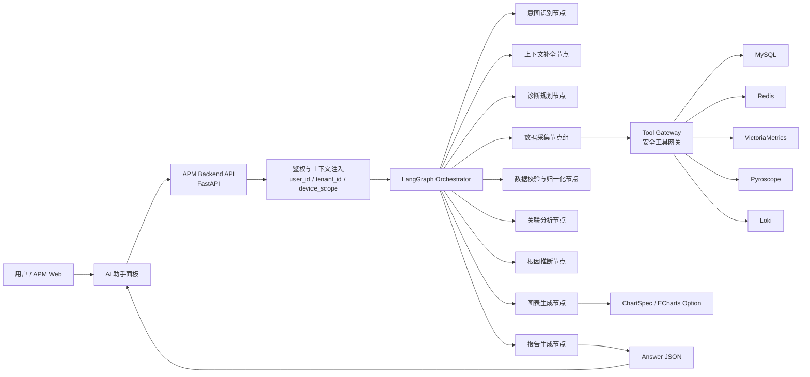
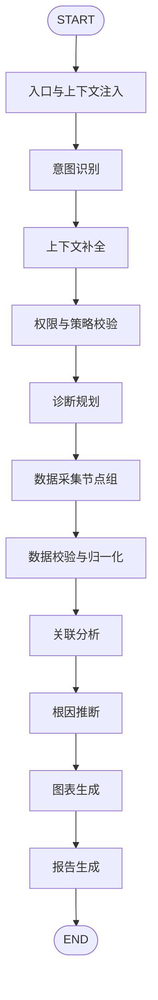
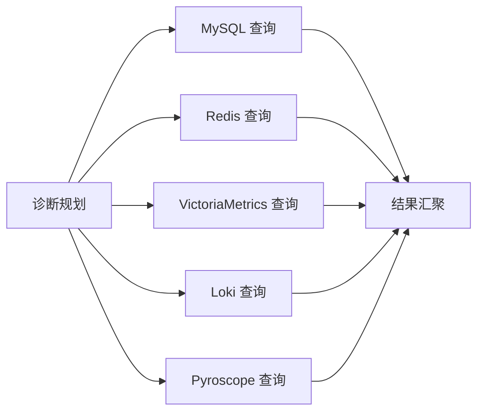
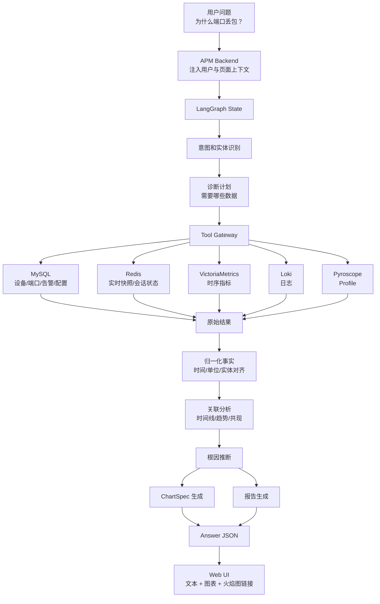
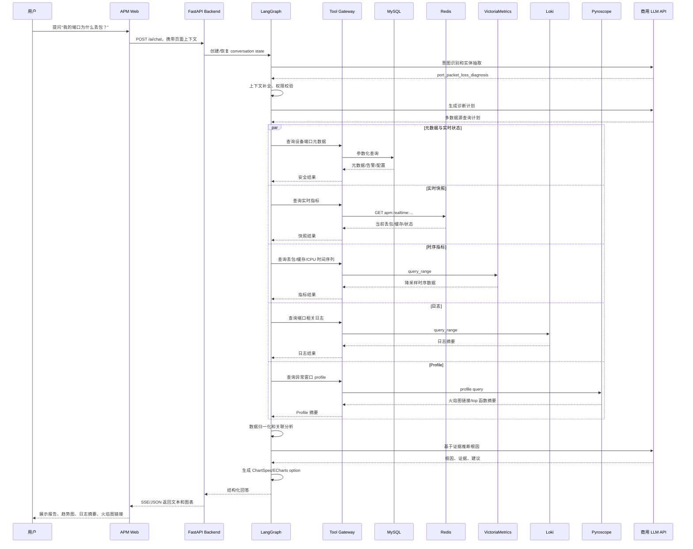

# APM AI 助手 LangGraph 技术选型与实施方案

> 版本：v0.1  
> 日期：2026-07-01  
> 适用范围：APM Web 端 AI 助手、异常智能分析、多源观测数据关联分析  
> 约束：Python 后端、商用大模型 API、LangGraph、多数据源安全读写

## 1. 背景与目标

APM 当前已经完成交换机性能与健康数据采集、异常检测、Web 图表呈现和告警触发。下一阶段需要在 Web 端新增 AI 助手，使用户可以用自然语言发起问题，例如：

- 我的端口为什么丢包？
- 这台交换机 CPU 异常升高的原因是什么？
- 过去 30 分钟是否有日志、告警和资源指标互相印证？
- 某进程 CPU 飙高时是否能看到对应的火焰图证据？

AI 助手需要完成从问题理解、数据规划、多源查询、关联分析、根因推断、报告生成到图表嵌入的闭环。

关键数据源：

| 数据源 | 用途 | AI 助手访问方式 |
|---|---|---|
| MySQL | 设备元数据、端口信息、告警事件、配置、用户权限 | SQL 工具，严格白名单和参数化查询 |
| Redis | 实时指标缓存、会话状态、临时分析上下文 | Redis 工具，限定 key namespace 和 TTL |
| VictoriaMetrics | CPU、内存、端口丢包、端口缓存等大规模时序指标 | PromQL/MetricsQL 查询工具 |
| Pyroscope | 进程级 CPU/内存等持续性能剖析数据、火焰图 | Profile 查询工具，返回 profile 链接或摘要 |
| Loki | 交换机日志、系统日志、异常上下文 | LogQL 查询工具 |

## 2. 技术选型结论

### 2.1 推荐架构

推荐采用“单入口 LangGraph 编排 + 多专职工具/子 Agent + 统一数据访问网关”的架构。

```text
Web Chat UI
  -> APM Backend API
  -> LangGraph Orchestrator
  -> Tool Gateway
  -> MySQL / Redis / VictoriaMetrics / Pyroscope / Loki
  -> Analysis / Chart Spec / Final Report
  -> Web UI 渲染文本、表格、ECharts 图表、Profile 链接
```

### 2.2 核心选型

| 层级 | 推荐选型 | 说明 |
|---|---|---|
| Agent 编排 | LangGraph | 适合有状态、多步骤、可恢复、可插入人工确认的运维分析流程 |
| LLM 接入 | 商用 API，优先 OpenAI 兼容接口抽象 | 屏蔽 OpenAI、智谱、百度千帆等差异，便于替换 |
| 后端框架 | FastAPI | Python 团队友好，天然支持 async、SSE、WebSocket |
| 图表协议 | 服务端返回 ECharts option JSON 或内部 ChartSpec | 复用 Web 端已有 ECharts 能力 |
| SQL 访问 | SQLAlchemy Core + 只读账号 + 参数化模板 | 限制 LLM 直接生成任意 SQL |
| Redis 访问 | redis-py | 只允许访问业务白名单 namespace |
| VictoriaMetrics 访问 | HTTP API，兼容 Prometheus query/query_range | 查询时序指标 |
| Loki 访问 | HTTP API，LogQL query_range | 查询日志上下文 |
| Pyroscope 访问 | HTTP API | 查询 profile 元数据、profile 链接和摘要 |
| 状态持久化 | LangGraph Checkpointer + Redis/PostgreSQL/MySQL | 支持会话恢复、审计和重放 |
| 权限控制 | RBAC + 数据源工具级 guardrail | 按用户、设备、租户、操作类型授权 |

### 2.3 为什么选择 LangGraph

APM 异常分析不是简单的“一问一答”，而是需要多轮规划、工具调用、结果校验、必要时补充查询、最后生成报告。LangGraph 的 State、Node、Edge、Conditional Edge 与 Checkpoint 机制适合表达这类确定性骨架 + LLM 灵活决策的流程。

相比直接使用普通 AgentExecutor，LangGraph 更适合：

- 明确控制每一步能访问哪些工具。
- 对关键节点做超时、重试、审计、降级。
- 将“查询数据”和“生成结论”分离，降低幻觉风险。
- 支持人在回路，例如高风险写操作前确认。
- 支持中断恢复，适合长耗时诊断任务。

## 3. 总体架构



## 4. LangGraph 状态设计

建议将整个分析过程建模为一个强类型 State。所有节点只读写自己负责的字段，便于审计与测试。

```python
from typing import TypedDict, Literal, Any

class DeviceScope(TypedDict):
    tenant_id: str
    user_id: str
    device_ids: list[str]
    allowed_ports: list[str]

class QueryPlanItem(TypedDict):
    source: Literal["mysql", "redis", "victoriametrics", "pyroscope", "loki"]
    purpose: str
    query_name: str
    params: dict[str, Any]
    risk_level: Literal["low", "medium", "high"]

class ChartSpec(TypedDict):
    chart_id: str
    title: str
    chart_type: Literal["line", "bar", "heatmap", "table", "flamegraph_link"]
    echarts_option: dict[str, Any] | None
    data_ref: str

class APMAnalysisState(TypedDict):
    conversation_id: str
    user_question: str
    user_context: dict[str, Any]
    scope: DeviceScope
    intent: str
    target_entities: dict[str, Any]
    time_range: dict[str, str]
    missing_slots: list[str]
    plan: list[QueryPlanItem]
    tool_results: dict[str, Any]
    normalized_facts: list[dict[str, Any]]
    findings: list[dict[str, Any]]
    root_causes: list[dict[str, Any]]
    charts: list[ChartSpec]
    final_answer: dict[str, Any]
    errors: list[dict[str, Any]]
    audit_events: list[dict[str, Any]]
```

## 5. 节点设计

### 5.1 `入口与上下文注入节点`

作用：

- 接收 Web 端问题。
- 注入 `user_id`、`tenant_id`、当前页面上下文、当前设备、当前端口、当前告警 ID。
- 生成 `conversation_id`。
- 加载会话历史摘要，但不要把完整历史无限制传给模型。

输入：

- 用户自然语言问题。
- Web 页面上下文，例如当前设备、端口、时间范围。

输出：

- 初始 `APMAnalysisState`。

### 5.2 `意图识别节点`

作用：

- 判断用户问题属于哪类任务：异常分析、指标解释、日志查询、告警总结、配置建议、闲聊等。
- 识别目标实体：设备、端口、进程、时间范围、指标类型。
- 判断是否需要多源诊断。

建议实现：

- 使用 LLM structured output，输出固定 JSON。
- 对明显问题使用规则兜底，例如出现“丢包”则优先映射到端口丢包诊断。

输出示例：

```json
{
  "intent": "port_packet_loss_diagnosis",
  "target_entities": {
    "device_name": "SW-Core-01",
    "port": "GigabitEthernet1/0/24"
  },
  "time_range": {
    "start": "now-1h",
    "end": "now"
  },
  "missing_slots": []
}
```

### 5.3 `上下文补全节点`

作用：

- 当用户没说清设备、端口、时间范围时，从当前页面上下文、最近告警、会话历史中补全。
- 如果仍缺关键槽位，返回澄清问题，而不是盲目查询。

典型逻辑：

- 当前用户在某设备详情页提问“为什么丢包”，默认使用当前设备。
- 当前页面选中了端口，默认使用该端口。
- 未提供时间范围时，默认近 1 小时，同时允许用户调整。

### 5.4 `权限与策略校验节点`

作用：

- 检查用户是否有权限访问目标设备、端口、告警和日志。
- 限制最大查询时间范围，例如默认不超过 24 小时。
- 限制每次查询的数据点数量、日志行数、profile 查询窗口。

强制策略：

- LLM 不直接持有数据库连接。
- 所有数据访问必须经过 Tool Gateway。
- 写操作默认禁用；确需写入时只允许写 Redis 会话、任务状态、反馈记录等低风险数据。
- 高风险操作，例如修改告警配置、静默告警，必须走人工确认节点。

### 5.5 `诊断规划节点`

作用：

- 根据意图和实体生成查询计划。
- 明确每个数据源查询的目的、参数、预期证据。
- 控制查询顺序：先查元数据和实时状态，再查时序、日志和 profile。

端口丢包推荐计划：

| 顺序 | 数据源 | 查询内容 | 目的 |
|---|---|---|---|
| 1 | MySQL | 设备、端口元数据、端口速率、端口状态、最近配置 | 确认对象和基础属性 |
| 2 | Redis | 当前端口丢包、缓存利用率、接口状态快照 | 获取实时状态 |
| 3 | VictoriaMetrics | 过去 1 小时丢包率、入出方向流量、端口缓存、系统 CPU/内存 | 识别趋势和相关性 |
| 4 | Loki | 同时间窗口内端口 flap、错误日志、驱动/队列日志 | 找日志证据 |
| 5 | MySQL | 历史告警和异常检测事件 | 找异常时间点 |
| 6 | Pyroscope | 相关进程在异常时间窗口的 profile | 判断是否由控制面/采集进程 CPU 异常引起 |

### 5.6 `数据采集节点组`

建议拆成多个专职节点，便于超时控制和并发执行。

#### `mysql_query_node`

作用：

- 查询设备、端口、告警、配置等关系数据。
- 使用预定义查询模板，不允许 LLM 拼接任意 SQL。

示例工具：

```python
@tool
def get_device_port_metadata(device_id: str, port_name: str) -> dict:
    """查询设备端口元数据、端口速率、管理状态、最近配置变更。"""
```

#### `redis_query_node`

作用：

- 查询实时指标快照、分析任务状态、短期缓存。
- 可写入 AI 会话摘要、临时分析结果、用户反馈。

限制：

- key 必须在 `apm:ai:*`、`apm:realtime:*` 等白名单 namespace。
- 写入必须设置 TTL。

#### `victoriametrics_query_node`

作用：

- 查询大规模时序指标。
- 返回降采样后的序列，避免把大量原始点直接塞给 LLM。

示例指标：

- `switch_port_rx_dropped_total`
- `switch_port_tx_dropped_total`
- `switch_port_buffer_utilization_ratio`
- `switch_system_cpu_usage_ratio`
- `switch_process_cpu_usage_ratio`

#### `loki_query_node`

作用：

- 查询时间窗口内日志。
- 按设备、端口、进程、级别过滤。
- 先做日志聚合和去重，再交给分析节点。

#### `pyroscope_query_node`

作用：

- 查询异常窗口的 profile。
- 生成火焰图链接或提取 top 函数摘要。
- 不建议把完整 profile 原始数据给 LLM。

### 5.7 `数据校验与归一化节点`

作用：

- 统一时间戳、设备 ID、端口名、单位。
- 检测缺失数据、采样间隔异常、查询失败。
- 把工具返回转换为 `normalized_facts`。

输出事实示例：

```json
{
  "type": "metric_anomaly",
  "source": "victoriametrics",
  "metric": "switch_port_tx_dropped_total",
  "entity": "SW-Core-01/Gi1/0/24",
  "time_window": "10:12-10:18",
  "evidence": "TX drop rate increased from 0/s to 320/s",
  "confidence": 0.92
}
```

### 5.8 `关联分析节点`

作用：

- 将指标、日志、告警、profile 按时间线对齐。
- 寻找先后关系和共现关系。
- 生成候选发现。

分析方法：

- 时间窗口重叠：丢包峰值是否与 CPU、缓存、日志告警同窗发生。
- 趋势相关：端口缓存利用率升高是否领先丢包。
- 事件对齐：配置变更、端口 flap、链路协商变化是否发生在异常前。
- profile 关联：异常窗口进程热点是否明显变化。

### 5.9 `根因推断节点`

作用：

- 基于事实和关联发现推断可能根因。
- 输出主因、次因、排除项、置信度和证据。

推荐输出结构：

```json
{
  "root_causes": [
    {
      "cause": "端口出口队列拥塞导致 TX 丢包",
      "confidence": 0.86,
      "evidence": [
        "TX drop 与 buffer utilization 在 10:12-10:18 同步升高",
        "系统 CPU 未明显升高，基本排除 CPU 饱和",
        "Loki 出现 egress queue congestion 日志"
      ],
      "recommended_actions": [
        "检查下游链路速率和双工状态",
        "查看该端口 QoS 队列配置",
        "确认是否有突发大流量或限速策略"
      ]
    }
  ]
}
```

### 5.10 `图表生成节点`

作用：

- 根据分析需要生成 ChartSpec。
- 不直接生成图片，而是生成 Web 可渲染的 ECharts option。
- 图表数据使用已降采样的时序数据，避免前端载入过大。

推荐图表：

- 端口丢包率趋势线。
- 端口缓存利用率与丢包率双轴图。
- 系统 CPU/内存与丢包对比图。
- 告警/日志事件时间线。
- Pyroscope 火焰图跳转卡片。

ChartSpec 示例：

```json
{
  "chart_id": "packet_loss_trend_001",
  "title": "Gi1/0/24 近 1 小时丢包率趋势",
  "chart_type": "line",
  "data_ref": "vm_query_result.packet_loss_rate",
  "echarts_option": {
    "tooltip": { "trigger": "axis" },
    "xAxis": { "type": "time" },
    "yAxis": { "type": "value", "name": "drops/s" },
    "series": [
      {
        "name": "TX drops/s",
        "type": "line",
        "showSymbol": false,
        "data": [["2026-07-01T10:10:00+08:00", 0], ["2026-07-01T10:15:00+08:00", 320]]
      }
    ]
  }
}
```

### 5.11 `报告生成节点`

作用：

- 将结论、证据、图表、建议动作组织为 Web 端可展示的结构化回答。
- 明确“不确定项”和“需要人工确认项”。
- 避免编造未查询到的数据。

输出建议：

```json
{
  "summary": "Gi1/0/24 的丢包主要集中在出方向，最可能原因是出口队列拥塞。",
  "confidence": 0.86,
  "evidence": [],
  "charts": [],
  "recommended_actions": [],
  "uncertainties": []
}
```

## 6. 边的设计

### 6.1 主流程边



### 6.2 条件边

| 条件 | 来源节点 | 目标节点 | 说明 |
|---|---|---|---|
| 缺少设备/端口/时间范围 | 上下文补全 | 澄清问题节点 | 让用户补充必要信息 |
| 无权限访问目标对象 | 权限与策略校验 | 拒绝响应节点 | 不泄露设备是否存在等敏感信息 |
| 查询计划包含高风险写操作 | 诊断规划 | 人工确认节点 | 确认后才执行 |
| 数据不足以推断 | 根因推断 | 补充规划节点 | 追加日志或更长时间窗口查询 |
| 部分数据源失败 | 数据采集节点组 | 降级分析节点 | 基于可用证据回答，并声明缺失 |
| 结果置信度低 | 根因推断 | 澄清问题节点或报告生成 | 请求更多上下文，或输出低置信结论 |

### 6.3 并发边

诊断规划完成后，以下查询可并发：



并发策略：

- MySQL 元数据查询优先执行，用于确认 device_id 和 port_id。
- VictoriaMetrics、Loki、Pyroscope 可在实体确认后并发执行。
- Redis 实时快照可与 MySQL 并行，但返回后需与元数据对齐。

## 7. 数据流转设计

### 7.1 数据流图



### 7.2 数据分层

| 层级 | 内容 | 是否进入 LLM 上下文 |
|---|---|---|
| 原始数据 | 大量时序点、日志行、profile 原始数据 | 否 |
| 降采样数据 | 图表所需点位、聚合后的日志事件 | 部分进入，主要给前端 |
| 归一化事实 | 异常时间段、峰值、事件摘要、相关性 | 是 |
| 证据链 | 支撑根因的关键事实 | 是 |
| 最终报告 | 结论、依据、建议、图表引用 | 是 |

原则：LLM 看“事实摘要和证据链”，Web 图表看“结构化图表数据”，原始数据留在后端和数据源。

## 8. 时序图



## 9. Tool Gateway 设计

### 9.1 目标

Tool Gateway 是 LLM/Agent 与真实数据源之间的唯一通道。它负责把“模型想查什么”转换为“系统允许查什么”。

核心职责：

- 权限校验：用户只能访问自己有权限的设备和租户数据。
- 查询白名单：只暴露经过审核的工具函数。
- 参数校验：时间范围、设备 ID、端口名、limit、step 全部校验。
- 查询改写：自动注入 tenant_id、device_id scope。
- 限流熔断：防止一次问题打爆 VictoriaMetrics 或 Loki。
- 审计记录：记录用户、工具名、参数摘要、耗时、结果大小。
- 脱敏：日志中的密码、Token、SNMP community 等敏感内容必须脱敏。

### 9.2 工具命名建议

| 工具 | 操作 | 说明 |
|---|---|---|
| `get_device_metadata` | read MySQL | 查设备基础信息 |
| `get_port_metadata` | read MySQL | 查端口速率、状态、配置 |
| `get_recent_alerts` | read MySQL | 查最近告警 |
| `get_realtime_metric_snapshot` | read Redis | 查实时快照 |
| `save_ai_session_summary` | write Redis | 写会话摘要，必须 TTL |
| `query_metric_range` | read VictoriaMetrics | 查时序指标 |
| `query_logs` | read Loki | 查日志 |
| `query_profile_summary` | read Pyroscope | 查 profile 摘要 |
| `create_chart_spec` | local | 生成图表 spec |

### 9.3 禁止直接暴露的能力

- 任意 SQL 执行。
- 任意 Redis key 扫描。
- 任意 LogQL/MetricsQL 透传。
- 任意配置修改。
- 无限制日志下载。
- 无限制 profile 原始数据导出。

## 10. 五类数据源接入方案

### 10.1 MySQL

用途：

- 设备表、端口表、告警事件表、配置表、用户权限表。

实现建议：

- 使用只读数据库账号。
- 使用 SQLAlchemy Core。
- 建立查询模板，例如 `select_device_by_name`、`select_recent_alerts`。
- 所有查询自动追加 `tenant_id` 和设备 scope。
- 查询返回前做字段裁剪。

示例：

```python
def get_recent_alerts(ctx, device_id: str, start: str, end: str, limit: int = 50):
    assert_device_allowed(ctx, device_id)
    limit = min(limit, 100)
    stmt = alerts.select().where(
        alerts.c.tenant_id == ctx.tenant_id,
        alerts.c.device_id == device_id,
        alerts.c.created_at.between(start, end),
    ).limit(limit)
    return db.execute(stmt).mappings().all()
```

### 10.2 Redis

用途：

- 实时指标快照。
- AI 会话短期状态。
- 用户反馈缓存。
- 任务进度缓存。

读写策略：

- 读：只允许读取 `apm:realtime:{tenant_id}:{device_id}:*` 等白名单。
- 写：只允许写 `apm:ai:{tenant_id}:{conversation_id}:*`，必须 TTL。
- 禁止：`KEYS *`、跨租户 key、无 TTL 写入。

### 10.3 VictoriaMetrics

用途：

- 查询指标趋势和异常窗口。

实现建议：

- 后端提供业务语义工具，LLM 传入 `metric_family`、设备、端口、时间范围，而不是直接传 PromQL。
- 工具内部将业务语义映射为 MetricsQL/PromQL。
- 对 query_range 强制 step 和 max_points。
- 对结果做降采样、聚合、异常片段提取。

示例业务查询：

```json
{
  "metric_family": "port_packet_loss",
  "device_id": "sw-001",
  "port": "Gi1/0/24",
  "start": "2026-07-01T09:30:00+08:00",
  "end": "2026-07-01T10:30:00+08:00",
  "step": "30s"
}
```

### 10.4 Loki

用途：

- 查询设备日志、系统日志、端口事件、驱动错误、队列拥塞日志。

实现建议：

- LLM 不直接写 LogQL。
- 工具支持 `device_id`、`port`、`keywords`、`level`、`start/end`。
- 日志返回前做：
  - 去重。
  - 按模式聚合。
  - 敏感信息脱敏。
  - 限制最大行数。

### 10.5 Pyroscope

用途：

- 异常窗口内进程 CPU 热点分析。
- 生成火焰图链接。
- 提供 top functions 摘要。

实现建议：

- 只在涉及进程 CPU、控制面异常、采集进程异常时查询。
- 查询窗口与指标异常窗口对齐。
- 返回火焰图 URL 和 top N 热点函数，不把完整 profile 送入 LLM。

## 11. 前后端接口设计

### 11.1 Chat 请求

```http
POST /api/ai/chat
Content-Type: application/json
```

```json
{
  "conversation_id": "optional",
  "message": "我的端口为什么丢包？",
  "page_context": {
    "device_id": "sw-001",
    "port": "Gi1/0/24",
    "time_range": {
      "start": "2026-07-01T09:30:00+08:00",
      "end": "2026-07-01T10:30:00+08:00"
    }
  }
}
```

### 11.2 Chat 响应

```json
{
  "conversation_id": "conv-123",
  "type": "analysis_report",
  "summary": "Gi1/0/24 的丢包主要集中在出方向，最可能原因是出口队列拥塞。",
  "confidence": 0.86,
  "sections": [
    {
      "title": "关键证据",
      "items": [
        "TX 丢包率在 10:12-10:18 从 0/s 升至 320/s。",
        "端口缓存利用率在同一窗口升至 92%。",
        "Loki 中出现 egress queue congestion 日志。"
      ]
    }
  ],
  "charts": [
    {
      "chart_id": "packet_loss_trend_001",
      "title": "丢包率趋势",
      "chart_type": "line",
      "echarts_option": {}
    }
  ],
  "actions": [
    "检查下游链路速率和双工状态。",
    "检查 QoS 队列和限速策略。",
    "确认 10:12 附近是否存在突发业务流量。"
  ],
  "uncertainties": [
    "当前未查询到对端设备指标，因此无法确认拥塞是否由对端链路限速引起。"
  ]
}
```

### 11.3 流式事件

推荐用 SSE 或 WebSocket 返回进度：

```text
event: step
data: {"node":"intent_classifier","status":"running","message":"正在识别问题类型"}

event: step
data: {"node":"victoriametrics_query","status":"done","message":"已获取端口丢包和缓存趋势"}

event: final
data: {"summary":"...","charts":[...]}
```

## 12. 安全设计

### 12.1 权限边界

- 用户权限由 APM 后端统一判断，Agent 不自行判断最终权限。
- 每个工具调用都必须携带 `tenant_id`、`user_id`、`device_scope`。
- 查询结果必须做字段级裁剪。
- 日志和配置内容必须脱敏。

### 12.2 查询安全

- 禁止 LLM 直接执行 SQL、LogQL、MetricsQL。
- 只允许调用业务语义工具。
- 强制最大时间范围和最大返回数据量。
- 对慢查询设置超时和熔断。
- 工具结果超过阈值时返回摘要和 data_ref，不直接返回大 payload。

### 12.3 写操作安全

默认只允许：

- 写 AI 会话状态。
- 写用户反馈。
- 写分析任务进度。
- 写审计事件。

需要人工确认：

- 修改告警阈值。
- 静默告警。
- 修改设备配置。
- 创建自动化处置任务。

### 12.4 审计

每次工具调用记录：

- conversation_id
- user_id
- tenant_id
- tool_name
- 参数摘要
- 数据源
- 开始/结束时间
- 返回结果大小
- 是否成功
- 错误码

## 13. 多 Agent 分工

虽然底层用 LangGraph 编排，但逻辑上可以拆成多个专职 Agent/节点：

| Agent/节点 | 职责 | 可访问工具 |
|---|---|---|
| Planner Agent | 理解问题、生成诊断计划 | 无数据源直接访问 |
| Inventory Agent | 查设备、端口、告警、配置 | MySQL |
| Metrics Agent | 查时序指标和实时快照 | VictoriaMetrics、Redis |
| Logs Agent | 查日志和日志摘要 | Loki |
| Profile Agent | 查 profile 摘要和火焰图 | Pyroscope |
| Correlation Agent | 做多源事实关联 | 只读 normalized facts |
| RCA Agent | 根因推断 | 只读 evidence |
| Visualization Agent | 生成 ChartSpec | 只读 chart data |
| Reporter Agent | 生成最终报告 | 只读 root causes/charts |

建议初期不要把每个 Agent 都做成独立 LLM。MVP 阶段可以用一个 LangGraph + 少量 LLM 节点 + 多个 deterministic tool node；等业务稳定后再拆成多个专职 Agent。

## 14. 分阶段实施方案

### 阶段 0：准备与边界定义，1 周

目标：

- 明确 AI 助手第一批支持的问题类型。
- 梳理指标、日志、告警、profile 的命名和标签规范。
- 定义工具白名单和权限模型。

交付物：

- 数据源字段与指标字典。
- 端口丢包诊断 SOP。
- AI 工具清单。
- 安全策略文档。

人员建议：

- 1 人负责后端工具网关。
- 1 人负责 LangGraph 原型。
- 1 人负责前端 AI 面板和图表协议。

### 阶段 1：MVP，3-4 周

目标：

- 支持“端口丢包原因分析”一个核心闭环。
- 接入 MySQL、Redis、VictoriaMetrics、Loki。
- 生成文本报告和 2-3 个 ECharts 图表。

范围：

- 暂不做复杂多轮处置。
- Pyroscope 可先只返回 profile 链接，不做深度 profile 分析。
- 只支持只读诊断。

交付物：

- `/api/ai/chat`。
- LangGraph 端口丢包诊断图。
- Tool Gateway v1。
- Web AI 助手面板。
- 审计日志。

验收标准：

- 用户在端口详情页提问“为什么丢包”，系统能自动识别当前设备和端口。
- 能返回丢包趋势图、缓存利用率对比图、相关日志摘要。
- 报告中每条结论都有证据来源。
- 无权限设备不可查询。

### 阶段 2：扩展诊断能力，4-6 周

目标：

- 扩展到 CPU 异常、内存异常、进程异常、链路 flap、告警总结。
- 深度接入 Pyroscope。
- 支持多轮追问和上下文记忆。

新增能力：

- “为什么系统 CPU 高？”
- “哪个进程导致 CPU 异常？”
- “这次告警和之前是否类似？”
- “把过去 24 小时异常汇总一下。”

交付物：

- Profile Agent。
- 事件时间线图。
- 相似异常检索。
- 会话 checkpoint 和恢复。

### 阶段 3：半自动化处置，6-8 周

目标：

- 在人工确认下执行低风险动作。
- 形成诊断建议闭环。

能力：

- 建议调整告警阈值。
- 创建工单。
- 标记误报。
- 生成排障命令建议。
- 对高风险动作走人工确认。

交付物：

- Human-in-the-loop 节点。
- Action 审批流。
- 用户反馈学习闭环。

### 阶段 4：平台化与优化，持续

目标：

- 提升准确率、性能和可维护性。
- 构建可观测的 AI 系统本身。

能力：

- Prompt/工具调用评测集。
- 离线回放真实告警案例。
- 模型供应商切换。
- 成本统计。
- Agent 运行质量监控。

## 15. 案例：端口为什么丢包

### 15.1 用户问题

用户位于设备 `SW-Core-01` 的端口详情页，当前选中端口 `Gi1/0/24`，提问：

> 我的端口为什么丢包？

### 15.2 上下文补全

系统从页面上下文获得：

```json
{
  "device_id": "sw-core-01",
  "device_name": "SW-Core-01",
  "port": "Gi1/0/24",
  "time_range": {
    "start": "2026-07-01T09:30:00+08:00",
    "end": "2026-07-01T10:30:00+08:00"
  }
}
```

### 15.3 诊断计划

```json
[
  {
    "source": "mysql",
    "purpose": "确认设备端口基础信息和近期告警",
    "query_name": "get_port_metadata",
    "params": {"device_id": "sw-core-01", "port": "Gi1/0/24"},
    "risk_level": "low"
  },
  {
    "source": "redis",
    "purpose": "获取当前端口实时状态",
    "query_name": "get_realtime_metric_snapshot",
    "params": {"device_id": "sw-core-01", "port": "Gi1/0/24"},
    "risk_level": "low"
  },
  {
    "source": "victoriametrics",
    "purpose": "查询丢包率、缓存利用率、流量、系统资源趋势",
    "query_name": "query_metric_range",
    "params": {"metric_family": "port_packet_loss_diagnosis"},
    "risk_level": "low"
  },
  {
    "source": "loki",
    "purpose": "查询同窗口端口和队列相关日志",
    "query_name": "query_logs",
    "params": {"keywords": ["drop", "queue", "congestion", "Gi1/0/24"]},
    "risk_level": "low"
  }
]
```

### 15.4 查询结果摘要

MySQL：

- 端口 `Gi1/0/24` 管理状态为 up，运行状态为 up。
- 端口速率 1Gbps。
- 10:14 触发过 `PORT_TX_DROP_HIGH` 告警。
- 最近 24 小时无端口配置变更。

Redis：

- 当前 TX drop rate：280 drops/s。
- 当前 RX drop rate：0 drops/s。
- 当前 buffer utilization：89%。

VictoriaMetrics：

- 10:12 开始 TX drop rate 从 0 升至 320 drops/s。
- 10:12-10:18 buffer utilization 从 45% 升至 92%。
- 系统 CPU 在 35%-42% 区间，无明显异常。
- 端口出方向流量接近 1Gbps，入方向流量无异常。

Loki：

- 10:13:02 出现 `egress queue congestion on Gi1/0/24`。
- 10:13:05 出现 `tail drop threshold exceeded`。
- 未发现 link down/up flap。

Pyroscope：

- 本次不触发深度 profile 分析，因为系统 CPU 和关键进程 CPU 未异常。

### 15.5 关联分析

时间线：

```mermaid
timeline
    title Gi1/0/24 丢包异常时间线
    10:12 : 出方向流量接近 1Gbps
          : Buffer 利用率开始上升
          : TX drop rate 开始升高
    10:13 : Loki 出现 egress queue congestion
          : Loki 出现 tail drop threshold exceeded
    10:14 : MySQL 告警 PORT_TX_DROP_HIGH
    10:18 : 丢包率开始回落
```

推理：

- 丢包只发生在 TX 方向，RX 正常。
- 丢包峰值与 buffer utilization 峰值高度重合。
- 同窗口日志出现出口队列拥塞和 tail drop。
- 系统 CPU、内存未出现异常，基本排除系统资源饱和导致。
- 无 link flap 日志，基本排除链路频繁抖动。

### 15.6 最终回答示例

```markdown
结论：Gi1/0/24 的丢包主要发生在出方向，最可能原因是出口队列拥塞。

证据：
1. TX 丢包率在 10:12-10:18 从 0/s 升至最高约 320/s，RX 丢包未同步升高。
2. 同一时间窗口端口 buffer utilization 从 45% 升至 92%。
3. Loki 日志在 10:13 出现 egress queue congestion 和 tail drop threshold exceeded。
4. 系统 CPU 保持在 35%-42%，未见资源饱和；也未发现端口 flap。

建议：
1. 检查 Gi1/0/24 下游链路速率、双工状态和是否存在对端限速。
2. 检查该端口 QoS 队列、整形、限速和突发流量策略。
3. 查看 10:12 附近是否有备份、批量同步或突发业务流量。
4. 如该端口长期接近 1Gbps，建议评估链路扩容或流量分担。
```

### 15.7 图表输出

前端应展示：

- 图 1：TX/RX 丢包率趋势线。
- 图 2：TX 丢包率与 buffer utilization 双轴图。
- 图 3：端口出方向流量与端口速率上限对比。
- 图 4：告警和日志事件时间线。

## 16. 开发落地建议

### 16.1 代码结构

```text
apm_ai/
  api/
    chat.py
  graph/
    state.py
    builder.py
    nodes/
      intent.py
      context.py
      planner.py
      collectors.py
      normalize.py
      correlate.py
      rca.py
      chart.py
      report.py
  tools/
    gateway.py
    mysql_tools.py
    redis_tools.py
    victoriametrics_tools.py
    loki_tools.py
    pyroscope_tools.py
  security/
    policy.py
    audit.py
    masking.py
  schemas/
    chart_spec.py
    answer.py
  evals/
    cases/
      port_packet_loss.yaml
```

### 16.2 MVP 优先级

优先做：

1. Tool Gateway 和权限策略。
2. 端口丢包 LangGraph 流程。
3. VictoriaMetrics + Loki + MySQL 查询工具。
4. ChartSpec 与前端 ECharts 渲染。
5. 审计和错误降级。

暂缓做：

- 自动修改配置。
- 复杂长期记忆。
- 多模型路由。
- 自主生成任意查询语言。
- 原始 profile 深度解释。

## 17. 风险与对策

| 风险 | 表现 | 对策 |
|---|---|---|
| LLM 幻觉 | 编造未查询到的指标或日志 | 报告必须引用 normalized facts，缺失数据明确说明 |
| 查询过重 | 大时间范围 query_range 或日志爆量 | 限制时间、step、limit、超时、降采样 |
| 权限泄露 | 用户查询到无权限设备 | 后端工具级 RBAC，自动注入 tenant scope |
| SQL/LogQL 注入 | 模型生成危险查询 | 禁止任意查询，使用业务语义工具 |
| 结果不可解释 | 只给结论没有依据 | 输出证据链、置信度、排除项 |
| 团队 AI 经验不足 | 难以维护复杂 Agent | 从单用例 MVP 开始，节点保持确定性，LLM 只做必要推理 |
| 成本失控 | 大量 token 和模型调用 | 摘要化工具结果、缓存、模型分级、流式进度 |

## 18. 验收指标

功能指标：

- 端口丢包问题自动识别准确率 >= 90%。
- 核心数据源查询成功率 >= 99%。
- 回答中关键结论证据覆盖率 = 100%。
- 无权限访问拦截率 = 100%。

体验指标：

- 常规问题首 token 响应 <= 3 秒。
- 完整分析结果 <= 15 秒。
- 图表可正常渲染。
- 支持用户继续追问。

质量指标：

- 工具调用全量审计。
- 关键节点单元测试覆盖。
- 至少 20 个真实/模拟异常案例离线回放。
- 每次上线前跑评测集。

## 19. 推荐的第一版 LangGraph 流程

第一版不要追求“完全自主 Agent”。建议采用受控图：

```text
START
 -> inject_context
 -> classify_intent
 -> fill_context
 -> policy_check
 -> build_plan
 -> collect_mysql / collect_redis / collect_vm / collect_loki
 -> normalize
 -> correlate
 -> infer_root_cause
 -> build_charts
 -> generate_report
 -> END
```

LLM 只参与：

- 意图识别。
- 诊断计划生成。
- 基于事实的根因推断。
- 报告表达。

确定性代码负责：

- 权限。
- 查询。
- 数据归一化。
- 降采样。
- 图表 option 生成。
- 审计。

这是对 3 人 Python 团队最稳妥的落地路径。

