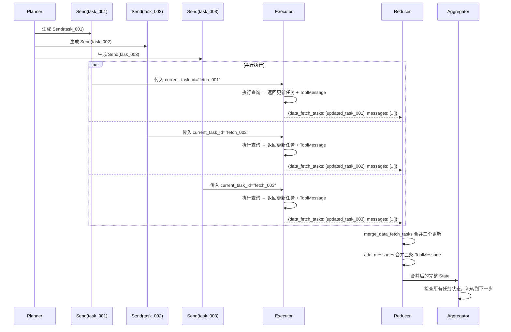

这是一个非常关键的设计问题。当规划节点产出了一个任务列表后，后续的“数据获取阶段”往往是多节点并行执行的，但每个节点需要清楚地知道自己该处理哪一项任务，避免重复执行或遗漏。

下面我以你们 APM 场景的 LangGraph 设计为例，说明常见的处理模式，并给出最合适的推荐方案。

---

## 0.1 问题的本质

State 里现在有：
- `data_fetch_plan`：规划好的任务清单（例如：查 VictoriaMetrics 丢包率、查 Loki 日志、查 MySQL 设备信息）
- `data_fetch_tasks`：实际执行的状态（初始为空或全是 pending）

需要在**执行阶段**让多个节点（或 worker）**自动从待办列表中领取属于自己的那一份工作**，并行处理，最后把结果写回状态。

---

## 0.2 方案一：按数据源拆分为独立节点（静态并行）

**思路**  
为每种数据源（MySQL、Redis、VictoriaMetrics、Pyroscope、Loki）创建一个专用节点，在编译图时将它们加为并行分支。  
每个节点启动后，从 `data_fetch_plan` 或 `data_fetch_tasks` 中**过滤出自己负责的 source**，然后依次执行这些任务，完成后回写状态。

**节点代码示例（VictoriaMetrics 专用节点）**  
```python
def fetch_victoriametrics(state: AgentState) -> dict:
    # 从 plan 或 tasks 中筛选出需要我处理的任务
    my_tasks = [
        t for t in state["data_fetch_tasks"]
        if t["source"] == "victoriametrics" and t["status"] == "pending"
    ]
    if not my_tasks:
        return {}  # 无任务则跳过

    updated_tasks = []
    for task in my_tasks:
        try:
            result = query_victoriametrics(task["query"], task["params"])
            updated_tasks.append({**task, "status": "success", "result": result, ...})
        except Exception as e:
            updated_tasks.append({**task, "status": "error", "error": str(e)})
    
    # 将 state 中原有的 tasks 与此处更新的合并，替换整个字段
    all_tasks = [t if t["task_id"] not in {u["task_id"] for u in updated_tasks} else ...]
    return {"data_fetch_tasks": merge_tasks(state["data_fetch_tasks"], updated_tasks)}
```

**优点**  
- 简单直观，不需要额外路由逻辑。
- 节点职责单一，易于调试。

**缺点**  
- 如果任务类型增加（比如以后接入更多数据源），需要新增节点并修改图结构。
- 每次执行节点都会遍历所有 tasks，当任务量很大时效率一般（但你们的场景任务量很小，完全没问题）。

---

## 0.3 方案二：单个通用执行节点 + 动态并行（Send API）

**思路**  
使用 LangGraph 的 `Send` 机制，将计划中的每一项任务作为一个独立的消息发送给同一个执行节点，实现 **“一个任务一个 worker”** 的动态并行。  
这样就不需要为每种数据源写单独的节点，而是用一个通用节点处理所有类型的任务。

**图定义示意**  
```python
from langgraph.graph import StateGraph, END
from langgraph.graph.message import Send

# 规划节点返回一个列表，告诉图接下来要生成多少个并行任务
def plan_tasks(state):
    tasks = [...]  # 生成 DataFetchTask 列表
    return {
        "data_fetch_plan": tasks,
        "data_fetch_tasks": [{"task_id": t["task_id"], "status": "pending", ...} for t in tasks]
    }

# 执行节点，根据传入的 task_id 找到对应的任务并执行
def execute_single_task(state):
    # state 中会包含当前分配到的 task_id（通常通过 Send 的 arg 传递）
    task_id = state["current_task_id"]
    task = next(t for t in state["data_fetch_tasks"] if t["task_id"] == task_id)
    # ... 执行任务并更新对应 task
    return updated_task

# 路由函数：根据计划生成多个 Send
def continue_to_execute(state):
    return [Send("execute_task", {"current_task_id": t["task_id"]}) for t in state["data_fetch_plan"]]

graph = StateGraph(AgentState)
graph.add_node("planner", plan_tasks)
graph.add_node("execute_task", execute_single_task)
graph.add_conditional_edges("planner", continue_to_execute, path_map=["execute_task"])
graph.add_edge("execute_task", "aggregator")  # 所有任务完成后汇总
```

**优点**  
- 灵活，新增数据源只需扩展执行节点的工具库，不需要改图。
- 真正的任务级并行，某个慢查询不会阻塞其他任务。

**缺点**  
- 需要理解 Send 的映射逻辑，团队初期可能有学习曲线。
- 聚合节点需要等待所有 Send 完成（LangGraph 会自动处理）。

---

## 0.4 方案三：Supervisor + Worker 按需领取（类似“抢单”模式）

**思路**  
用一个 Supervisor 节点分发任务，多个 Worker 节点从同一个 pending 队列中抢占执行。  
这在无状态函数中不太实用，因为每次节点调用都是 stateless 的（除非引入外部消息队列）。  
**不推荐**在 LangGraph 中用这种方式，它会失去图执行的可预测性。

---

## 0.5 推荐方案：混合模式（最适合你们）

考虑到你们的团队刚接触 Agent 开发，我建议采用 **方案一** 的变体，结合方案二的动态思想：

1. **为每种数据源定义一个工具函数（Tool）**，而不是一个节点。  
   这样规划节点（LLM）会直接生成一系列 `ToolCall`，LangChain 的 `ToolExecutor` 可以自动并行执行这些工具调用。

2. 在 LangGraph 中，将数据获取设计为一个 **ToolNode** 节点，它接收来自 planner 的 AIMessage（里面带有多个 `tool_calls`），**自动并行执行这些工具调用，并把结果作为 ToolMessage 追加到 messages**。

   这样你甚至不需要显式管理 `data_fetch_tasks`，工具调用和结果都记录在 messages 中，后续分析节点可以从消息历史里提取所有工具返回的数据。

   这是 LangGraph 官方推荐的 ReAct / Tool-calling 模式，**实现量最少，并行执行由 LangChain 内置支持**。

**示例**  
```python
from langgraph.prebuilt import ToolNode
from langchain_core.tools import tool

@tool
def query_victoriametrics(query: str, params: dict) -> str:
    """查询 VictoriaMetrics 时序数据，用于获取CPU、内存、丢包率等指标。"""
    # ... 实际查询逻辑
    return json.dumps({"values": [...]})

@tool
def query_loki(query: str, params: dict) -> str:
    """查询 Loki 日志，用于检索交换机错误日志等。"""
    # ...
    return json.dumps({"logs": [...]})

tools = [query_victoriametrics, query_loki, query_mysql, ...]
tool_node = ToolNode(tools)

# 图中规划节点生成 AIMessage(tool_calls=[...])，然后路由到 tool_node，工具并行执行。
```

这个模式下，**“谁拿哪个数据”的问题由 LLM 生成的 tool_call 决定，并行执行由框架自动完成**，你们只需关注工具函数的实现和 State 中对话历史的流转。

---

**总结**  
- 如果你们希望完全掌控并行流程，手动管理 `data_fetch_tasks`，用**方案一（按数据源拆节点）**。
- 如果想更快落地、减少自定义逻辑，直接用 **LangGraph 的 ToolNode**，让 LLM 自主决定调用哪些工具，框架自动并行执行。

根据你之前的设计，State 中已经有 `data_fetch_tasks` 并想手动管理，那可以在 fetch 阶段定义一个“调度节点”，由它返回多个 `Send` 给通用的“执行任务节点”，每个 Send 携带一个 `task_id`，这样并行粒度最细，也符合你现有的 State 字段。


---


下面基于 LangGraph 的 `Send` API 实现**单个通用执行节点 + 动态任务并行**模式，并重点说明数据流转、并行机制以及并行结果如何安全地合并回全局状态。

---

## 0.6 核心思路

1. **规划节点** (`planner`) 生成 `data_fetch_plan`（任务清单），然后**为每个任务生成一个 `Send` 对象**，指向同一个通用执行节点 `execute_task`。
2. 每个 `Send` 内部携带一个**任务标识**（如 `task_id`），LangGraph 框架会将它们**拆分成独立的并行执行分支**，分别调用 `execute_task`。
3. 通用执行节点根据传入的 `task_id` 从全局 `data_fetch_tasks` 中取出对应任务，执行实际查询，然后**只返回自己修改的那一个任务的状态**以及 `ToolMessage`。
4. 由于多个分支会同时尝试更新 `data_fetch_tasks` 列表，需要使用**自定义 reducer** 根据 `task_id` 进行**增量合并**，避免相互覆盖。
5. 所有并行分支完成后，汇总节点 `aggregate` 被触发，检查任务状态，并决定下一步（分析/重试等）。

---

## 0.7 关键设计：自定义 Reducer 解决并行写入冲突

原 `AgentState` 中 `data_fetch_tasks: List[DataFetchTask]` 默认是整体替换。若多个并行节点同时返回新的列表，只会保留最后一个，导致数据丢失。

我们需要一个 **reducer 函数**，它能根据 `task_id` 将每个节点返回的任务**合并到现有列表**中：

```python
from typing import List

def merge_data_fetch_tasks(existing: List[DataFetchTask], new: List[DataFetchTask]) -> List[DataFetchTask]:
    """
    将 new 中的任务按 task_id 合并到 existing 中，不存在则追加，存在则更新。
    """
    task_map = {t["task_id"]: t for t in existing}
    for task in new:
        task_map[task["task_id"]] = task
    # 保持原有顺序，更新的任务依然在原位置
    updated = []
    for t in existing:
        updated.append(task_map.pop(t["task_id"], t))
    updated.extend(task_map.values())  # 追加新增的任务
    return updated
```

然后在 `AgentState` 中使用它：

```python
class AgentState(TypedDict):
    messages: Annotated[List[BaseMessage], add_messages]
    # ...
    data_fetch_tasks: Annotated[List[DataFetchTask], merge_data_fetch_tasks]  # 使用自定义 reducer
    # 新增一个临时字段，用于在并行节点中标识当前任务
    current_task_id: Optional[str]
    # 其余字段保持不变...
```

同时增加 `current_task_id: Optional[str]` 字段，方便 `execute_task` 获取自己被分配的任务 ID。

---

## 0.8 完整代码实现

### 0.8.1 模拟数据查询函数

```python
import time, uuid

def query_victoriametrics(query: str, params: dict) -> dict:
    # 模拟时序数据
    return {"values": [[1740264000, 2.3], [1740264030, 2.8], [1740264060, 5.1]]}

def query_loki(query: str, params: dict) -> list:
    return {"logs": ["10:35 error: egress queue overrun", "10:36 error: egress queue overrun"]}
```

### 0.8.2 规划节点 (生成 Send 列表)

```python
from langgraph.graph import Send

def planner(state: AgentState) -> dict:
    # 生成任务计划（实际应调用 LLM，这里硬编码）
    plan = [
        DataFetchTask(
            task_id="fetch_001",
            source="victoriametrics",
            query="rate(port_drop_packets[5m])*100",
            params={"start": "...", "end": "..."},
            status="pending", result=None, error=None, summary=None, chart_config={}
        ),
        DataFetchTask(
            task_id="fetch_002",
            source="victoriametrics",
            query="port_queue_usage",
            params={"start": "...", "end": "..."},
            status="pending", result=None, error=None, summary=None, chart_config={}
        ),
        DataFetchTask(
            task_id="fetch_003",
            source="loki",
            query='{job="switch"} |= "error"',
            params={"start": "...", "end": "..."},
            status="pending", result=None, error=None, summary=None, chart_config={}
        )
    ]
    return {
        "data_fetch_plan": plan,
        "data_fetch_tasks": plan,   # 初始任务列表（reducer 会直接设置）
        "next_step": "execute"      # 仅示意，实际用 conditional edges
    }

# 条件边函数：根据 data_fetch_tasks 中的 pending 任务生成 Send 列表
def route_to_execute(state: AgentState):
    pending_tasks = [t for t in state["data_fetch_tasks"] if t["status"] == "pending"]
    if not pending_tasks:
        return "aggregate"  # 若无待执行任务，直接汇总
    # 为每个待执行任务生成一个 Send，携带 task_id
    sends = []
    for task in pending_tasks:
        sends.append(
            Send(
                node="execute_task", 
                arg={"current_task_id": task["task_id"]}  # 传递到节点 state 更新
            )
        )
    return sends
```

### 0.8.3 通用执行节点 (`execute_task`)

```python
def execute_task(state: AgentState) -> dict:
    task_id = state["current_task_id"]
    # 从全局任务列表中取出对应任务
    task = next(t for t in state["data_fetch_tasks"] if t["task_id"] == task_id)
    
    # 执行查询（可根据 task["source"] 分发到不同工具）
    try:
        if task["source"] == "victoriametrics":
            result = query_victoriametrics(task["query"], task["params"])
            summary = f"时序数据：{len(result['values'])} 个点"
        elif task["source"] == "loki":
            result = query_loki(task["query"], task["params"])
            summary = f"日志：{len(result['logs'])} 条"
        else:
            result = {}
            summary = "无数据"
        
        updated_task = {
            **task,
            "status": "success",
            "result": result,
            "summary": summary,
        }
        
        # 生成工具消息，与之前的 AIMessage(tool_calls) 关联（此处简化，tool_call_id 随机生成）
        tool_msg = ToolMessage(
            content=f"任务 {task_id} 完成: {summary}",
            tool_call_id=f"call_{task_id.split('_')[1]}",
            name=f"run_{task['source']}"
        )
    except Exception as e:
        updated_task = {**task, "status": "error", "error": str(e)}
        tool_msg = ToolMessage(
            content=f"任务 {task_id} 失败: {str(e)}",
            tool_call_id=f"call_{task_id.split('_')[1]}",
            name=f"run_{task['source']}"
        )
    
    return {
        "messages": [tool_msg],
        "data_fetch_tasks": [updated_task]  # 只返回自己更新的任务，reducer 会合并
    }
```

### 0.8.4 汇总节点 (`aggregate`)

```python
def aggregate(state: AgentState) -> dict:
    tasks = state["data_fetch_tasks"]
    failures = [t for t in tasks if t["status"] == "error"]
    if failures:
        return {"next_step": "end", "error_message": "部分数据获取失败"}
    return {"next_step": "analyze"}
```

### 0.8.5 构建图

```python
from langgraph.graph import StateGraph, END

graph = StateGraph(AgentState)

graph.add_node("planner", planner)
graph.add_node("execute_task", execute_task)
graph.add_node("aggregate", aggregate)

graph.set_entry_point("planner")
graph.add_conditional_edges("planner", route_to_execute, {"aggregate": "aggregate"})
# 并行节点执行完毕后都会到 aggregate
graph.add_edge("execute_task", "aggregate")
graph.add_edge("aggregate", END)  # 后续可继续连接分析节点

app = graph.compile()
```

---

## 0.9 数据流转与并行机制详解

### 0.9.1 流程示意图



### 0.9.2 并行如何实现？

- **`route_to_execute` 返回 `Send` 列表**。LangGraph 会将每个 `Send` 映射为一个独立的分支任务，这些分支**在同一个 superstep 内并发执行**（实际并发度受底层执行器控制，通常为线程/协程）。
- 每个 `Send` 在调用 `execute_task` 前会将 `{"current_task_id": "xxx"}` 合并到当前 State，于是每个分支看到的 `state["current_task_id"]` 不同，从而执行各自的任务。
- **框架等待所有分支完成后才进入下一节点**（此处为 `aggregate`），保证汇总时所有数据已就绪。

### 0.9.3 并行写入如何安全合并？

- `data_fetch_tasks` 使用自定义 reducer `merge_data_fetch_tasks`，它**根据 task_id 进行“增量更新”**，而不是整体替换列表。因此三个分支返回的三个部分列表会被合并成一个包含所有任务最新状态的完整列表。
- `messages` 使用 `add_messages` 自动追加所有 `ToolMessage`，顺序可能非严格 FIFO，但对于工具结果来说并不影响分析节点读取。

### 0.9.4 数据流转细节

1. **规划节点** 输出完整的任务列表（`data_fetch_tasks`），状态变为 `pending`。
2. **条件边** 识别出三个 `pending` 任务，生成三个 `Send` 对象。
3. **并行节点** ：
   - 分支1：`current_task_id = "fetch_001"` → 查询 VM → 返回 `{data_fetch_tasks: [success task_001], messages: [ToolMessage1]}`。
   - 分支2：`current_task_id = "fetch_002"` → 返回 `{data_fetch_tasks: [success task_002], messages: [ToolMessage2]}`。
   - 分支3：`current_task_id = "fetch_003"` → 返回 `{data_fetch_tasks: [success task_003], messages: [ToolMessage3]}`。
4. **Reducer 合并**：
   - `merge_data_fetch_tasks` 将三个任务更新合并到初始列表中，最终列表包含三个 `success` 状态的任务。
   - `add_messages` 将三条 `ToolMessage` 追加到 `messages` 历史中。
5. **汇总节点** 收到合并后的完整 State，发现全部成功，设置 `next_step = "analyze"`。

---

## 0.10 完整状态变化示例（简化）

**初始 `data_fetch_tasks`**:
```json
[
  {"task_id": "fetch_001", "status": "pending", ...},
  {"task_id": "fetch_002", "status": "pending", ...},
  {"task_id": "fetch_003", "status": "pending", ...}
]
```

**并行分支返回**:
- 分支1: `[{"task_id": "fetch_001", "status": "success", "summary": "丢包率..."}]`
- 分支2: `[{"task_id": "fetch_002", "status": "success", "summary": "队列占用..."}]`
- 分支3: `[{"task_id": "fetch_003", "status": "success", "summary": "日志..."}]`

**Reducer 合并后**:
```json
[
  {"task_id": "fetch_001", "status": "success", "summary": "丢包率..."},
  {"task_id": "fetch_002", "status": "success", "summary": "队列占用..."},
  {"task_id": "fetch_003", "status": "success", "summary": "日志..."}
]
```

整个过程**无需手动加锁**，reducer 模式保证了状态更新的原子性（在 LangGraph 内部实现）。

---

## 0.11 与你们当前 State 设计的契合度

- 保留了 `data_fetch_plan` / `data_fetch_tasks` 结构，只是为后者增加了自定义 reducer。
- 新增的 `current_task_id` 只是临时辅助字段，对原有业务流程无侵入。
- 后续分析节点可直接读取 `data_fetch_tasks` 中的 `summary` 和 `result` 进行分析，完全兼容之前的 `AnalysisResult` 和 `VisualizationTask` 设计。

这样既实现了灵活的任务级并行，又避免了为每种数据源编写独立节点的冗余代码，非常适合你们团队目前“逐步演进”的策略。