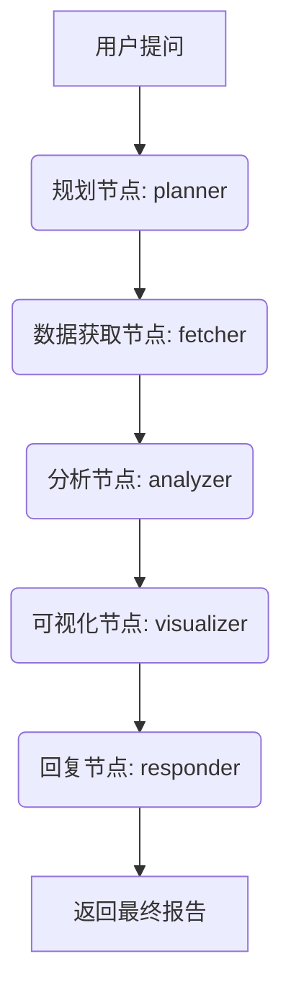

下面基于你定义的 `AgentState`，给出一个完整的 APM 异常分析流程，涵盖**规划 → 数据获取 → 分析 → 可视化 → 最终回复**五个节点，并展示每个节点如何读取、更新 State，以及 `add_messages` 是如何合并消息的。

---

## 0.1 流程概览



- **规划节点**：解析用户意图，生成 `data_fetch_plan`（数据获取任务清单）。
- **数据获取节点**：根据计划执行查询，回填 `data_fetch_tasks` 的状态和结果，并将结果摘要写入 `messages`（作为 `ToolMessage`）。
- **分析节点**：读取所有 `ToolMessage`，结合 `user_query`，调用大模型推理，填充 `analysis`。
- **可视化节点**：基于 `analysis` 和 `data_fetch_tasks`，生成 `visualization_tasks` 及 `final_response`。
- **回复节点**：将 `final_response` 转换为 `AIMessage` 追加到 `messages`，并设置 `next_step = "end"`。

---

## 0.2 初始状态构建（前端触发）

```python
from langchain_core.messages import HumanMessage

initial_state: AgentState = {
    "messages": [
        HumanMessage(content="我的端口 GigabitEthernet0/0/1 过去一小时为什么丢包？")
    ],
    "user_query": "我的端口 GigabitEthernet0/0/1 过去一小时为什么丢包？",
    "session_id": "session_12345",
    "extracted_entities": {},
    "data_fetch_plan": [],
    "data_fetch_tasks": [],
    "analysis": None,
    "visualization_tasks": [],
    "final_response": None,
    "next_step": "plan",
    "error_message": None,
    "metrics": {}
}
```

---

## 0.3 节点实现与状态流转

### 0.3.1 规划节点 (`planner`)

**职责**：  
提取实体（设备、端口、时间范围），规划所需数据源，生成 `data_fetch_plan`，并生成一条包含工具调用的 `AIMessage`。

```python
from langchain_core.messages import AIMessage
import uuid

def planner(state: AgentState) -> dict:
    user_q = state["user_query"]
    # 此处实际应调用 LLM 进行意图识别和任务规划，这里用硬编码模拟结果
    entities = {
        "device_id": "1",
        "port": "GigabitEthernet0/0/1",
        "time_range": "2026-07-06T10:00:00Z to 2026-07-06T11:00:00Z"
    }
    
    # 生成数据获取计划（三个任务：丢包率、队列占用率、错误日志）
    plan = [
        DataFetchTask(
            task_id="fetch_001",
            source="victoriametrics",
            query="rate(port_drop_packets{device_id='1',port='GigabitEthernet0/0/1'}[5m]) * 100",
            params={"start": "2026-07-06T10:00:00Z", "end": "2026-07-06T11:00:00Z"},
            status="pending",
            result=None,
            error=None,
            summary=None,
            chart_config={"chart_type": "line", "title": "丢包率趋势"}
        ),
        DataFetchTask(
            task_id="fetch_002",
            source="victoriametrics",
            query="avg(port_queue_usage{device_id='1',port='GigabitEthernet0/0/1'})",
            params={"start": "2026-07-06T10:00:00Z", "end": "2026-07-06T11:00:00Z"},
            status="pending",
            result=None,
            error=None,
            summary=None,
            chart_config=None
        ),
        DataFetchTask(
            task_id="fetch_003",
            source="loki",
            query='{job="switch"} |= "GigabitEthernet0/0/1" |= "error"',
            params={"start": "2026-07-06T10:00:00Z", "end": "2026-07-06T11:00:00Z"},
            status="pending",
            result=None,
            error=None,
            summary=None,
            chart_config=None
        )
    ]
    
    # 构建工具调用消息（这三个工具调用会在 fetcher 节点被并行执行）
    tool_calls = [
        {
            "name": "run_data_fetch_task",
            "args": {"task_id": "fetch_001", "source": "victoriametrics", "query": plan[0]["query"], "params": plan[0]["params"]},
            "id": f"call_{uuid.uuid4().hex[:8]}"
        },
        {
            "name": "run_data_fetch_task",
            "args": {"task_id": "fetch_002", "source": "victoriametrics", "query": plan[1]["query"], "params": plan[1]["params"]},
            "id": f"call_{uuid.uuid4().hex[:8]}"
        },
        {
            "name": "run_data_fetch_task",
            "args": {"task_id": "fetch_003", "source": "loki", "query": plan[2]["query"], "params": plan[2]["params"]},
            "id": f"call_{uuid.uuid4().hex[:8]}"
        }
    ]
    
    ai_msg = AIMessage(
        content="正在规划数据获取方案...",
        tool_calls=tool_calls,
        id=f"ai_{uuid.uuid4().hex[:8]}"
    )
    
    return {
        "messages": [ai_msg],
        "extracted_entities": entities,
        "data_fetch_plan": plan,
        "data_fetch_tasks": plan,  # 初始状态与 plan 相同，后续会更新
        "next_step": "fetch"
    }
```

**执行后状态**：  
- `messages` 在原有 `HumanMessage` 后追加了一条 `AIMessage`（带 `tool_calls`），共 2 条消息。
- `data_fetch_plan` 和 `data_fetch_tasks` 都被填充为 3 个 pending 任务。

---

### 0.3.2 数据获取节点 (`fetcher`)

**职责**：  
读取 `data_fetch_tasks` 中所有 `pending` 任务（或者直接从 `messages` 中提取工具调用），并发执行工具，将结果分别写入 `ToolMessage` 以及更新 `data_fetch_tasks` 中的对应项。

> 实际项目中可直接用 LangGraph 的 `ToolNode` 自动完成工具调用。这里为展示 State 更新，手动模拟。

```python
from langchain_core.messages import ToolMessage

# 模拟数据查询函数
def query_vm(query, params):
    # 模拟丢包率数据
    return {"values": [[1740264000, 2.3], [1740264030, 2.8], [1740264060, 5.1]]}

def query_loki(query, params):
    return {"logs": ["10:35: error: egress queue overrun", "10:36: error: egress queue overrun"]}

def fetcher(state: AgentState) -> dict:
    # 从 data_fetch_tasks 中找到 pending 任务（这里简化为直接处理所有任务）
    tasks = state["data_fetch_tasks"]
    updated_tasks = []
    tool_messages = []
    
    for task in tasks:
        if task["status"] != "pending":
            updated_tasks.append(task)
            continue
        
        # 根据 source 执行查询（实际可调用统一工具）
        try:
            if task["source"] == "victoriametrics":
                result = query_vm(task["query"], task["params"])
                summary = "丢包率从2.3%升至5.1%"
            elif task["source"] == "loki":
                result = query_loki(task["query"], task["params"])
                summary = "发现2条egress queue overrun错误日志"
            else:
                result = {}
                summary = "无数据"
            
            # 更新任务状态
            updated_task = {
                **task,
                "status": "success",
                "result": result,
                "summary": summary,
            }
            updated_tasks.append(updated_task)
            
            # 生成 ToolMessage，关联到对应工具调用（这里 tool_call_id 需要与 planner 生成的 id 匹配）
            # 实际 ToolNode 会自动处理，这里我们手动创建，并假设 id 已知
            tc_id = f"call_{task['task_id'].split('_')[1]}"  # 模拟映射
            tool_msg = ToolMessage(
                content=f"任务 {task['task_id']} 执行成功：{summary}",
                tool_call_id=tc_id,  # 必须与 AIMessage 中的工具调用 id 一致
                name="run_data_fetch_task"
            )
            tool_messages.append(tool_msg)
        except Exception as e:
            updated_task = {**task, "status": "error", "error": str(e)}
            updated_tasks.append(updated_task)
            tool_msg = ToolMessage(
                content=f"任务 {task['task_id']} 失败：{str(e)}",
                tool_call_id=f"call_{task['task_id'].split('_')[1]}",
                name="run_data_fetch_task"
            )
            tool_messages.append(tool_msg)
    
    return {
        "messages": tool_messages,          # 多个 ToolMessage 将被 add_messages 追加
        "data_fetch_tasks": updated_tasks,  # 整体替换为更新后的列表
        "next_step": "analyze"
    }
```

**执行后状态**（与 `add_messages` 合并后）：  
- `messages` 变为 3 条（HumanMessage, AIMessage）再追加 3 条 ToolMessage，共 5 条消息。
- `data_fetch_tasks` 中所有任务状态变为 `success`，并带有 `summary` 和 `result`。

---

### 0.3.3 分析节点 (`analyzer`)

**职责**：  
从 `messages` 中提取所有 `ToolMessage` 的内容，结合 `user_query`，调用大模型进行关联分析，输出 `AnalysisResult`。

```python
def analyzer(state: AgentState) -> dict:
    # 提取所有工具消息的内容
    tool_results = []
    for msg in state["messages"]:
        if isinstance(msg, ToolMessage):
            tool_results.append(msg.content)
    
    # 拼装提示词（实际会调用 LLM）
    prompt = f"用户问题：{state['user_query']}\n\n收集到的数据：\n" + "\n".join(tool_results)
    
    # 模拟大模型返回的分析结果
    analysis = AnalysisResult(
        hypothesis="端口输出队列溢出是导致丢包的直接原因，可能与瞬时流量突发有关。",
        evidence=["fetch_001: 丢包率在10:35突增至5.1%", "fetch_002: 输出队列占用率同时段达到98%", "fetch_003: 日志显示两次egress queue overrun"],
        confidence=0.92,
        recommendations=["检查对端设备突发流量源", "配置输出队列流量整形", "监控物理层CRC错误"]
    )
    
    # 同时生成可视化建议（后续节点会完善）
    vis_tasks = [
        VisualizationTask(
            task_id="vis_001",
            description="丢包率趋势图",
            chart_type="line",
            chart_config={},  # 由可视化节点填充
            related_tasks=["fetch_001"]
        ),
        VisualizationTask(
            task_id="vis_002",
            description="输出队列占用率趋势图",
            chart_type="line",
            chart_config={},
            related_tasks=["fetch_002"]
        )
    ]
    
    return {
        "analysis": analysis,
        "visualization_tasks": vis_tasks,
        "next_step": "visualize"
    }
```

**此时状态**：  
- `analysis` 被填充。
- `visualization_tasks` 被预置了两个待完善的图表任务。

---

### 0.3.4 可视化节点 (`visualizer`)

**职责**：  
根据 `analysis` 和 `data_fetch_tasks` 中的实际数据，为每个 `VisualizationTask` 生成完整的 `chart_config`，并构建最终回复 Markdown。

```python
def visualizer(state: AgentState) -> dict:
    updated_vis_tasks = []
    for vis in state["visualization_tasks"]:
        # 根据 related_tasks 找到原始数据
        data_points = []
        for tid in vis["related_tasks"]:
            # 从 data_fetch_tasks 中找到对应任务
            task = next(t for t in state["data_fetch_tasks"] if t["task_id"] == tid)
            if task["status"] == "success" and "values" in task.get("result", {}):
                data_points = task["result"]["values"]  # 例如 [[ts, val], ...]
        
        # 构建 ECharts 配置
        chart_config = {
            "title": {"text": vis["description"]},
            "xAxis": {"type": "time"},
            "yAxis": {"type": "value"},
            "series": [{
                "data": [[ts * 1000, val] for ts, val in data_points],  # 时间戳转毫秒
                "type": "line",
                "smooth": True
            }]
        }
        updated_vis_tasks.append({**vis, "chart_config": chart_config})
    
    # 构建最终回答 Markdown，嵌入图表占位符
    analysis = state["analysis"]
    final_md = f"""## 异常分析报告

**根因假设**：{analysis['hypothesis']}
**置信度**：{analysis['confidence']*100}%

**证据**：
{chr(10).join('- ' + e for e in analysis['evidence'])}

**建议**：
{chr(10).join('- ' + r for r in analysis['recommendations'])}

### 趋势图
{{{{chart:vis_001}}}}
{{{{chart:vis_002}}}}
"""
    return {
        "visualization_tasks": updated_vis_tasks,
        "final_response": final_md,
        "next_step": "respond"
    }
```

---

### 0.3.5 回复节点 (`responder`)

**职责**：  
将 `final_response` 打包成 `AIMessage` 追加到 `messages`，设置流程结束。

```python
def responder(state: AgentState) -> dict:
    final_msg = AIMessage(content=state["final_response"])
    return {
        "messages": [final_msg],
        "next_step": "end"
    }
```

**最终状态**：  
- `messages` 共有 6 条消息（1 Human + 1 AI(plan) + 3 Tool + 1 AI(final)），完整记录了对话历史。
- 前端可解析最后的 `AIMessage`，将 `{{chart:vis_001}}` 替换为实际图表组件。

---

## 0.4 关键点总结

1. **`messages` 的合并**  
   - `planner` 返回一条 `AIMessage`，`add_messages` 将其追加到 `HumanMessage` 后。  
   - `fetcher` 返回多条 `ToolMessage`，全部追加到消息列表末尾。  
   - `responder` 返回最终 `AIMessage`，追加完成。  
   整个过程无需手动管理列表，框架自动处理去重和顺序。

2. **`data_fetch_tasks` 更新**  
   节点返回新列表，整体替换旧列表（因为其 reducer 是默认的完全替换）。需注意保持其他字段不变。

3. **工具调用关联**  
   - `planner` 生成的 `AIMessage` 中的 `tool_calls[].id` 必须与 `fetcher` 返回的 `ToolMessage.tool_call_id` 匹配，这是 LangChain 内部关联的机制，也是 `add_messages` 能够正确识别替换的依据。

4. **状态驱动流程**  
   通过 `next_step` 字段进行路由，在图定义中可使用条件边决定下一个节点。

这个例子完整展示了如何在 LangGraph 中围绕自定义 `AgentState` 实现多步骤 Agent 协作，你可以直接基于此框架填充真实工具函数和 LLM 调用逻辑。