# LangGraph 九类多轮对话场景三节点设计

> 本文基于 9 个主类别多轮对话场景重新设计，核心只考虑三个节点：**意图识别节点**、**参数提取节点**、**意图澄清节点**。文档包含完整 State 设计、结构体与枚举注释、三节点整体流程、9 类主场景流程、State 输入输出示例，以及 27 个子场景测试用例。

---

## 1. 场景范围

| 编号 | 主类别 | 子类型 |
|---|---|---|
| C1 | 澄清场景 | 缺少必要实体、实体指代歧义、指标名称模糊、条件不充分、操作超出范围 |
| C2 | 追问场景 | 指标细化、时间窗口调整、增加实体范围、对比追加、原因追问、操作建议 |
| C3 | 上下文切换场景 | 话题重置、回溯历史意图、多话题交替 |
| C4 | 确认与修正场景 | 显式确认、隐式确认、用户主动修正 |
| C5 | 反馈与评价场景 | 正面/负面反馈、要求重试 |
| C6 | 中断与恢复场景 | 用户中断、系统中断 |
| C7 | 复合意图交替场景 | 澄清回复 + 新意图 |
| C8 | 上下文继承/省略场景 | 实体省略 |
| C9 | 领域特殊场景 | 异常分析深化、多数据源关联、基线/阈值定制、批量与迭代过滤 |

---

## 2. 三个核心节点

| 节点 | 职责 | 是否建议调用 LLM |
|---|---|---|
| 意图识别节点 | 判断用户当前输入属于什么主类别、子类型、是否新建意图、是否关联父意图、是否切换上下文 | 是，但可先做规则预判 |
| 参数提取节点 | 抽取和标准化实体、指标、时间、阈值、过滤条件、对比窗口、结果集引用，并做参数继承 | 可选；简单场景可规则化，复杂表达可调用 LLM |
| 意图澄清节点 | 根据缺失、歧义、确认、超能力、系统中断等状态，生成澄清问题或处理用户澄清回复 | 生成自然语言时可调用 LLM；规则模板也可覆盖常见场景 |

---

## 3. State 设计

### 3.1 枚举定义

```python
DialoguePhase = Literal[
    "idle",                    # 空闲状态，当前没有待澄清、待确认或待恢复事项
    "recognizing_intent",      # 正在进行意图识别
    "extracting_parameters",   # 正在进行参数提取、继承、标准化或补槽
    "clarifying",              # 正在等待用户回答澄清问题
    "confirming",              # 正在等待用户显式确认
    "ready_for_planning",      # 参数完整，已经可以进入任务规划节点
    "executing",               # 已进入任务执行阶段，本文只定义到规划前
    "paused",                  # 对话或任务被用户中断、系统错误或外部条件暂停
    "completed",               # 当前活跃意图已经完成
    "failed"                   # 当前意图处理失败，可能需要拒绝、转人工或恢复
]

MainScenario = Literal[
    "clarification",           # C1 澄清场景
    "follow_up",               # C2 追问场景
    "context_switch",          # C3 上下文切换场景
    "confirmation_correction", # C4 确认与修正场景
    "feedback_evaluation",     # C5 反馈与评价场景
    "interruption_recovery",   # C6 中断与恢复场景
    "compound_intent",         # C7 复合意图交替场景
    "context_inheritance",     # C8 上下文继承/省略场景
    "domain_specific"          # C9 领域特殊场景
]

SubScenario = Literal[
    "missing_required_entity",      # 缺少必要实体，例如缺设备名或端口名
    "entity_ambiguity",             # 实体指代歧义，例如一个名称匹配多台设备
    "metric_ambiguity",             # 指标名称模糊，例如“健康度”含义不明确
    "condition_insufficient",       # 条件不充分，例如缺阈值或时间范围
    "unsupported_operation",        # 操作超出系统能力范围
    "metric_drilldown",             # 指标细化，例如设备级 CPU 下钻到进程级 CPU
    "time_window_adjustment",       # 时间窗口调整，例如从最近 1 小时改为最近 24 小时
    "entity_scope_adjustment",      # 实体范围扩大或收缩
    "comparison_append",            # 追加历史或实体对比
    "reason_follow_up",             # 原因追问，查询告警、日志、关联事件
    "operation_advice",             # 操作建议或下一步排查建议
    "topic_reset",                  # 话题重置，发起全新查询
    "history_backtrack",            # 回溯历史意图
    "multi_topic_alternation",      # 多话题交替
    "explicit_confirmation",        # 显式确认
    "implicit_confirmation",        # 隐式确认
    "user_correction",              # 用户主动修正
    "positive_negative_feedback",   # 正面或负面反馈
    "retry_request",                # 要求重试
    "user_interruption",            # 用户中断后恢复
    "system_interruption",          # 系统中断后恢复
    "clarification_plus_new_intent",# 澄清回复加新意图
    "entity_omission",              # 实体省略，需要上下文继承
    "anomaly_deepening",            # 异常分析深化
    "multi_source_correlation",     # 多数据源关联
    "baseline_threshold_custom",    # 基线或阈值定制
    "batch_iterative_filtering"     # 批量与迭代过滤
]

IntentRelation = Literal[
    "new",                    # 全新意图，不依赖历史上下文
    "follow_up",              # 追问意图，依赖父意图结果或参数
    "clarification_answer",   # 澄清答案，用于补齐某个待澄清意图
    "context_switch",         # 话题切换产生的新意图
    "history_resume",         # 回溯或恢复历史意图
    "correction",             # 修正已有意图的部分参数
    "confirmation",           # 对待确认意图进行确认或取消
    "feedback",               # 对已有回答进行评价
    "retry",                  # 对已有意图重新查询
    "compound_part",          # 复合输入拆分后的一个子意图
    "policy_update"           # 更新用户偏好或领域策略
]

IntentStage = Literal[
    "created",                # 意图刚创建，尚未进行参数提取
    "parameter_extraction",   # 等待或正在进行参数提取
    "waiting_clarification",  # 缺参数或有歧义，等待用户澄清
    "waiting_confirmation",   # 等待用户显式确认
    "ready_for_planning",     # 参数完整，已准备进入任务规划
    "completed",              # 意图已完成
    "failed",                 # 意图失败
    "suspended"               # 意图被暂停，通常保存在上下文栈中
]

CapabilityStatus = Literal[
    "supported",                    # 系统支持该意图
    "supported_with_confirmation",  # 系统支持，但需要显式确认
    "unsupported",                  # 系统不支持该能力
    "needs_handoff"                 # 需要转人工或外部系统处理
]

ParameterValidationStatus = Literal[
    "valid",                # 参数完整且可执行
    "needs_clarification",  # 缺失或歧义，需要澄清
    "needs_confirmation",   # 参数完整但需要确认
    "unsupported",          # 能力不支持
    "invalid"               # 参数非法或自相矛盾
]

NextStage = Literal[
    "intent_recognition",    # 下一步进入意图识别节点
    "parameter_extraction",  # 下一步进入参数提取节点
    "intent_clarification",  # 下一步进入意图澄清节点
    "task_planning",         # 下一步进入任务规划节点
    "feedback_response",     # 下一步生成反馈类响应
    "refuse_or_handoff",     # 下一步拒绝或转人工
    "end"                    # 当前轮结束
]
```

### 3.2 AgentState

```python
class AgentState(TypedDict, total=False):
    # ========== 对话输入 ==========
    messages: Annotated[List[BaseMessage], add_messages]  # 完整消息历史，由 LangGraph 追加，用于多轮上下文判断
    user_query: str                                       # 当前轮用户原始输入
    normalized_query: str                                 # 当前输入的规范化文本
    conversation_id: str                                  # 会话 ID，用于 checkpoint 和跨轮记忆
    turn_id: str                                          # 当前轮次 ID，用于审计和澄清历史关联
    user_id: str                                          # 用户 ID，用于读取权限、画像和自定义阈值

    # ========== 意图识别 ==========
    recognized_event: RecognizedEvent                     # 意图识别节点输出的事件和场景分类
    parsed_intents: List[ParsedIntent]                    # 当前会话中所有意图，包含活跃、暂停、完成、失败意图
    active_intent_id: Optional[str]                       # 当前焦点意图 ID
    last_completed_intent_id: Optional[str]                # 最近完成的意图 ID，用于追问、省略和重试
    intent_counter: int                                   # 意图 ID 计数器，用于生成唯一 ID

    # ========== 参数提取 ==========
    extraction_targets: List[str]                         # 本轮需要进行参数提取或补槽的意图 ID
    parameter_results: Dict[str, ParameterResult]         # 各意图参数结果，key 为 intent_id

    # ========== 澄清与确认 ==========
    pending_clarifications: Dict[str, ClarificationRequest] # 待澄清请求，key 为 intent_id
    clarification_history: Dict[str, List[ClarificationTurn]] # 各意图的澄清问答历史
    pending_confirmations: Dict[str, ConfirmationRequest]  # 待确认请求，key 为 intent_id

    # ========== 上下文管理 ==========
    dialogue_phase: DialoguePhase                         # 当前对话阶段
    context_stack: List[ContextFrame]                     # 被中断或挂起的话题栈
    follow_up_context: Optional[FollowUpContext]          # 追问上下文摘要
    suspended_intent_ids: List[str]                       # 被暂停的意图 ID 列表

    # ========== 用户与领域记忆 ==========
    user_profile: UserProfile                             # 用户偏好，例如 CPU 高阈值
    domain_memory: DomainMemory                           # 领域记忆，例如实体别名、指标别名、结果集引用

    # ========== 任务规划前输出 ==========
    planner_input: Optional[PlannerInput]                 # 参数完整后传给任务规划节点的结构化输入
    planning_required: bool                               # 是否需要进入任务规划

    # ========== 错误与控制 ==========
    errors: List[GraphError]                              # 当前图执行过程中的错误
    retry_counts: Dict[str, int]                          # 意图或任务的重试次数
    next_stage: NextStage                                 # 下一跳节点
```

### 3.3 RecognizedEvent

```python
class RecognizedEvent(TypedDict, total=False):
    main_scenario: MainScenario             # 识别出的 9 大主类别
    sub_scenario: SubScenario               # 识别出的子类型
    relation: IntentRelation                # 当前输入与历史上下文的关系
    target_intent_id: Optional[str]         # 当前输入指向的已有意图 ID，例如澄清、修正、重试目标
    parent_intent_id: Optional[str]         # 父意图 ID，用于追问、下钻、修正、重试
    is_compound: bool                       # 是否为复合输入，一句话包含多个动作
    confidence: float                       # 意图识别置信度
    reason: str                             # 识别依据说明，便于调试和审计
```

### 3.4 ParsedIntent

```python
class ParsedIntent(TypedDict, total=False):
    id: str                                 # 意图唯一 ID，例如 intent_0
    main_scenario: MainScenario             # 该意图所属主类别
    sub_scenario: SubScenario               # 该意图所属子类型
    type: str                               # 业务意图类型，例如 metric_query、compare_query、root_cause_analysis
    relation: IntentRelation                # 与上下文的关系
    parent_intent_id: Optional[str]         # 父意图 ID
    root_intent_id: Optional[str]           # 根意图 ID，多级下钻时用于追溯最初问题
    raw_text: str                           # 触发该意图的用户文本片段
    confidence: float                       # 意图置信度
    capability_status: CapabilityStatus     # 系统能力支持状态
    stage: IntentStage                      # 当前意图处理阶段
```

### 3.5 ParameterResult

```python
class ParameterResult(TypedDict, total=False):
    intent_id: str                          # 参数所属意图 ID
    target_entities: List[EntityRef]        # 目标实体，如设备、端口、进程、链路
    metrics: List[MetricRef]                # 指标，如 cpu_usage、memory_usage、packet_loss
    time_range: Optional[TimeRange]         # 查询时间范围
    filters: Dict[str, Any]                 # 过滤条件，如阈值、设备范围、日志级别
    modifiers: Dict[str, Any]               # 修饰符，如 topN、trend、compare、force_refresh
    compare_windows: List[TimeRange]        # 对比查询使用的多个时间窗口
    entity_set_refs: List[EntitySetRef]     # 结果集引用，例如上一轮 Top10 设备集合
    inherited_from: Dict[str, str]          # 参数继承来源，key 为字段名，value 为父意图 ID 或结果集 ID
    missing_entities: List[str]             # 缺失实体槽位
    missing_filters: List[str]              # 缺失过滤条件或约束
    ambiguities: List[Ambiguity]            # 歧义列表，例如多个候选设备或指标
    default_applied: Dict[str, bool]        # 是否应用默认值，例如默认时间范围
    validation_status: ParameterValidationStatus # 参数校验状态
    extra_context: Dict[str, Any]           # 额外上下文，例如异常窗口、关联证据、指标别名解释
```

### 3.6 EntityRef

```python
class EntityRef(TypedDict, total=False):
    type: str                               # 实体类型，例如 device、interface、process、device_group
    id: Optional[str]                       # 标准化实体 ID
    name: str                               # 用户可读实体名称
    raw_text: str                           # 用户原始表达
    attributes: Dict[str, Any]              # 实体附加属性，例如 IP、角色、机房、槽位
    source: str                             # 实体来源，例如 current_query、parent_intent、clarification_reply
```

### 3.7 MetricRef

```python
class MetricRef(TypedDict, total=False):
    name: str                               # 标准化指标名，例如 cpu_usage
    raw_text: str                           # 用户原始指标表达，例如 CPU、健康度
    unit: Optional[str]                     # 指标单位，例如 percent、bps、count
    aggregation: Optional[str]              # 聚合方式，例如 avg、max、p95、top
    source: str                             # 指标来源，例如 current_query、parent_intent、metric_alias
```

### 3.8 TimeRange

```python
class TimeRange(TypedDict, total=False):
    start: Optional[str]                    # 起始时间，建议使用 ISO 8601
    end: Optional[str]                      # 结束时间，建议使用 ISO 8601
    relative: Optional[str]                 # 相对时间表达，例如 last_1h、last_24h
    timezone: str                           # 时区，例如 Asia/Shanghai
    source: str                             # 时间来源，例如 current_query、parent_intent、default
```

### 3.9 Ambiguity

```python
class Ambiguity(TypedDict, total=False):
    field: str                              # 发生歧义的字段，例如 device、metric
    raw_text: str                           # 用户原始表达
    candidates: List[Dict[str, Any]]        # 候选项列表
    question_hint: str                      # 生成澄清问题时使用的提示
```

### 3.10 ClarificationRequest

```python
class ClarificationRequest(TypedDict, total=False):
    intent_id: str                          # 需要澄清的意图 ID
    main_scenario: MainScenario             # 澄清所属主类别
    sub_scenario: SubScenario               # 澄清所属子类型
    missing_slots: List[str]                # 缺失槽位列表
    ambiguity_slots: List[str]              # 歧义槽位列表
    question: str                           # 面向用户的澄清问题
    options: List[Dict[str, Any]]           # 可选项，例如候选设备
    expected_answer_type: str               # 期望回答类型，例如 device、threshold、confirmation
    created_turn_id: str                    # 澄清创建轮次
    retry_count: int                        # 同一澄清已追问次数
```

### 3.11 ClarificationTurn

```python
class ClarificationTurn(TypedDict):
    role: Literal["assistant", "user"]       # 发言角色
    content: str                            # 澄清问题或用户回答内容
    turn_id: str                            # 所属轮次 ID
    resolved_slots: List[str]               # 本轮回答解决了哪些槽位
```

### 3.12 ConfirmationRequest

```python
class ConfirmationRequest(TypedDict):
    intent_id: str                          # 需要确认的意图 ID
    message: str                            # 确认提示文本
    risk_level: str                         # 风险等级，例如 low、medium、high
    expected_phrase: Optional[str]          # 期望用户回复的确认短语，例如“确认备份”
```

### 3.13 ContextFrame

```python
class ContextFrame(TypedDict, total=False):
    intent_id: str                          # 被压栈的意图 ID
    summary: str                            # 被压栈意图摘要
    phase_when_suspended: DialoguePhase     # 压栈时的对话阶段
    parameter_snapshot: Optional[ParameterResult] # 压栈时的参数快照
    pushed_turn_id: str                     # 压栈发生的轮次
```

### 3.14 FollowUpContext

```python
class FollowUpContext(TypedDict, total=False):
    parent_intent_id: str                   # 追问依赖的父意图 ID
    summary: str                            # 父意图结果摘要
    reusable_entities: List[EntityRef]      # 可继承实体
    reusable_metrics: List[MetricRef]       # 可继承指标
    reusable_time_range: Optional[TimeRange] # 可继承时间范围
    result_refs: List[str]                  # 可继承结果引用，例如图表 ID、结果集 ID
```

### 3.15 DomainMemory

```python
class DomainMemory(TypedDict, total=False):
    entity_aliases: Dict[str, str]          # 实体别名映射，例如“核心A”到设备 ID
    metric_aliases: Dict[str, List[str]]    # 指标别名映射，例如“健康度”到告警、丢包等指标
    entity_sets: Dict[str, Any]             # 结果集缓存，例如 CPU Top10 设备集合
    baseline_rules: Dict[str, Any]          # 领域基线或阈值规则
```

### 3.16 UserProfile

```python
class UserProfile(TypedDict, total=False):
    thresholds: Dict[str, Any]              # 用户自定义阈值，例如 cpu_high=85
    default_time_range: Optional[str]       # 用户默认查询时间范围
    preferences: Dict[str, Any]             # 其他用户偏好，例如默认展示趋势图
    feedback_history: List[Dict[str, Any]]  # 用户反馈历史
```

### 3.17 PlannerInput

```python
class PlannerInput(TypedDict):
    ready_intent_ids: List[str]             # 已准备进入任务规划的意图 ID
    parameter_results: Dict[str, ParameterResult] # 任务规划所需参数
    reason: str                             # 进入任务规划的原因说明
    planning_hint: str                      # 规划建议，例如 template_metric_query、llm_root_cause
```

### 3.18 GraphError

```python
class GraphError(TypedDict, total=False):
    code: str                               # 错误码，例如 datasource_timeout
    message: str                            # 错误描述
    source_node: str                        # 错误来源节点
    intent_id: Optional[str]                # 关联意图 ID
    recoverable: bool                       # 是否可恢复
```

---

## 4. 三个节点整体流程

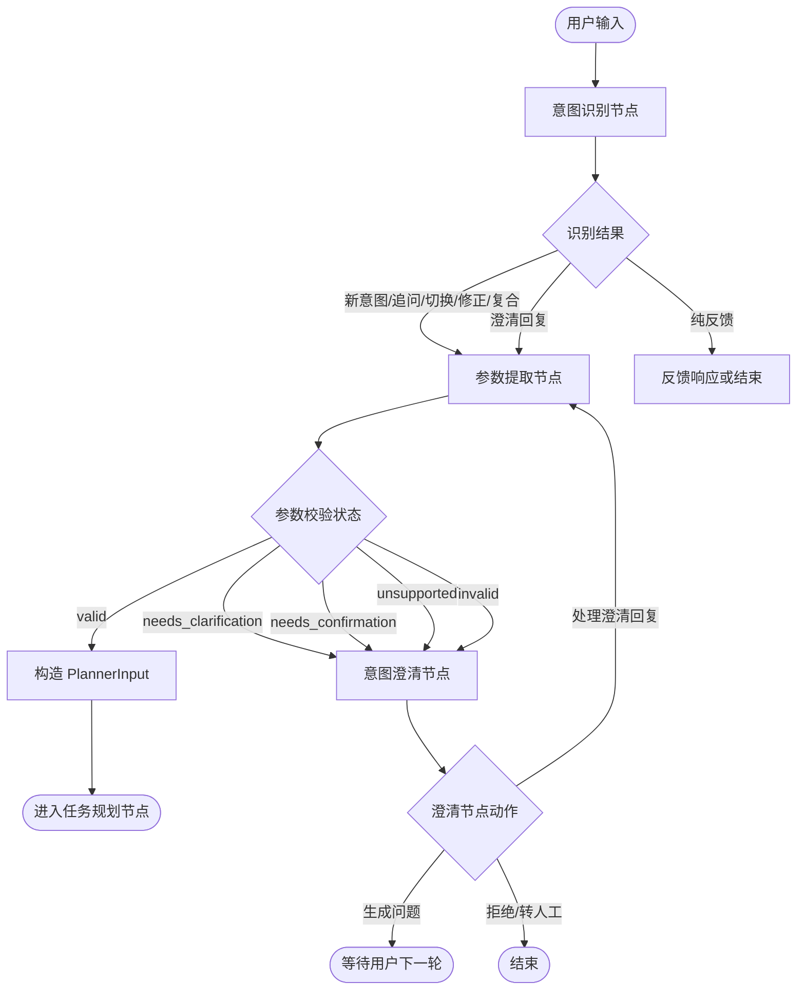

说明：

意图识别节点负责判断用户输入在 9 类主场景中的位置，并决定是否创建新意图、关联父意图、恢复历史意图或拆分复合输入。参数提取节点负责把自然语言转为结构化参数，并处理上下文继承。意图澄清节点负责所有“不能直接规划”的情况，包括缺失、歧义、确认、超能力、非法参数和系统恢复。

### 4.1 意图识别节点整体流程

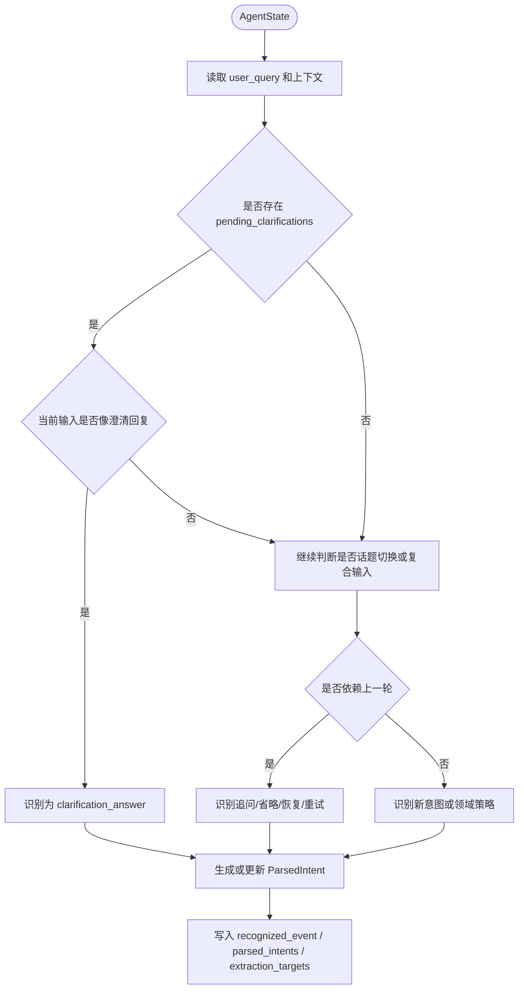

说明：

意图识别节点的输出不是最终可执行参数，而是“应该处理哪个意图”。它需要结合 `pending_clarifications`、`last_completed_intent_id`、`context_stack`、`final_response` 摘要等上下文。对于复合输入，它必须拆分多个 `ParsedIntent`，并把每个意图加入 `extraction_targets`。

输入 State：

| 字段 | 作用 |
|---|---|
| `user_query` | 当前用户输入 |
| `messages` | 最近对话历史 |
| `pending_clarifications` | 判断是否为澄清回复 |
| `parsed_intents` | 判断父意图、历史意图和当前活跃意图 |
| `active_intent_id` | 当前焦点 |
| `last_completed_intent_id` | 追问、省略、重试的默认父意图 |
| `context_stack` | 回溯历史意图 |
| `domain_memory` | 判断领域策略、实体别名、结果集引用 |

输出 State：

| 字段 | 作用 |
|---|---|
| `recognized_event` | 9 类主场景和子类型识别结果 |
| `parsed_intents` | 新增或更新意图 |
| `active_intent_id` | 当前焦点意图 |
| `extraction_targets` | 需要参数提取的意图 ID |
| `dialogue_phase` | 通常更新为 `extracting_parameters` |
| `next_stage` | 通常为 `parameter_extraction` |

### 4.2 参数提取节点整体流程

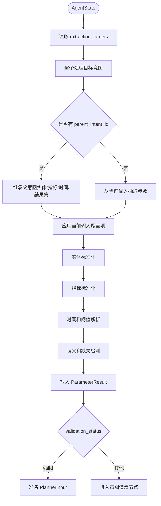

说明：

参数提取节点要避免简单地覆盖父意图。追问、省略、修正、回溯、批量过滤等场景都依赖参数继承：先复制父意图可复用的实体、指标、时间、结果集，再用当前输入覆盖变化部分。缺失和歧义必须结构化写入 `missing_entities`、`missing_filters`、`ambiguities`。

输入 State：

| 字段 | 作用 |
|---|---|
| `extraction_targets` | 本轮需要处理的意图 ID |
| `parsed_intents` | 每个意图的类型、关系和父意图 |
| `parameter_results` | 父意图参数和历史参数 |
| `pending_clarifications` | 澄清回复只补对应槽位 |
| `user_profile` | 应用用户阈值和默认偏好 |
| `domain_memory` | 实体、指标、结果集标准化 |

输出 State：

| 字段 | 作用 |
|---|---|
| `parameter_results` | 写入标准化参数 |
| `pending_clarifications` | 参数缺失或歧义时写入 |
| `pending_confirmations` | 需要确认时写入 |
| `planner_input` | 参数完整时构造 |
| `dialogue_phase` | `ready_for_planning`、`clarifying`、`confirming` |
| `next_stage` | `task_planning` 或 `intent_clarification` |

### 4.3 意图澄清节点整体流程

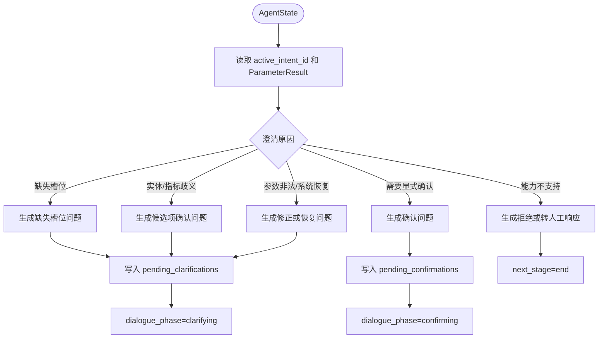

说明：

意图澄清节点不仅生成“缺什么”的问题，也处理确认、拒绝和恢复。它的输出必须结构化写入 `pending_clarifications` 或 `pending_confirmations`，这样下一轮意图识别才能判断用户是否在回答澄清问题。对于超出能力的操作，不进入任务规划，直接拒绝或转人工。

输入 State：

| 字段 | 作用 |
|---|---|
| `active_intent_id` | 当前需要澄清的意图 |
| `parameter_results` | 判断缺失、歧义、非法或确认状态 |
| `parsed_intents` | 判断能力支持状态和意图类型 |
| `pending_clarifications` | 避免重复追问 |
| `pending_confirmations` | 处理确认场景 |
| `errors` | 系统中断恢复时生成恢复问题 |

输出 State：

| 字段 | 作用 |
|---|---|
| `pending_clarifications` | 新增或更新澄清请求 |
| `pending_confirmations` | 新增或更新确认请求 |
| `clarification_history` | 记录澄清问题 |
| `dialogue_phase` | `clarifying`、`confirming`、`failed` |
| `next_stage` | `end`、`parameter_extraction`、`refuse_or_handoff` |

---

## 5. 九类主场景流程、State 输入输出与示例

### 5.1 C1 澄清场景

覆盖：缺少必要实体、实体指代歧义、指标名称模糊、条件不充分、操作超出范围。

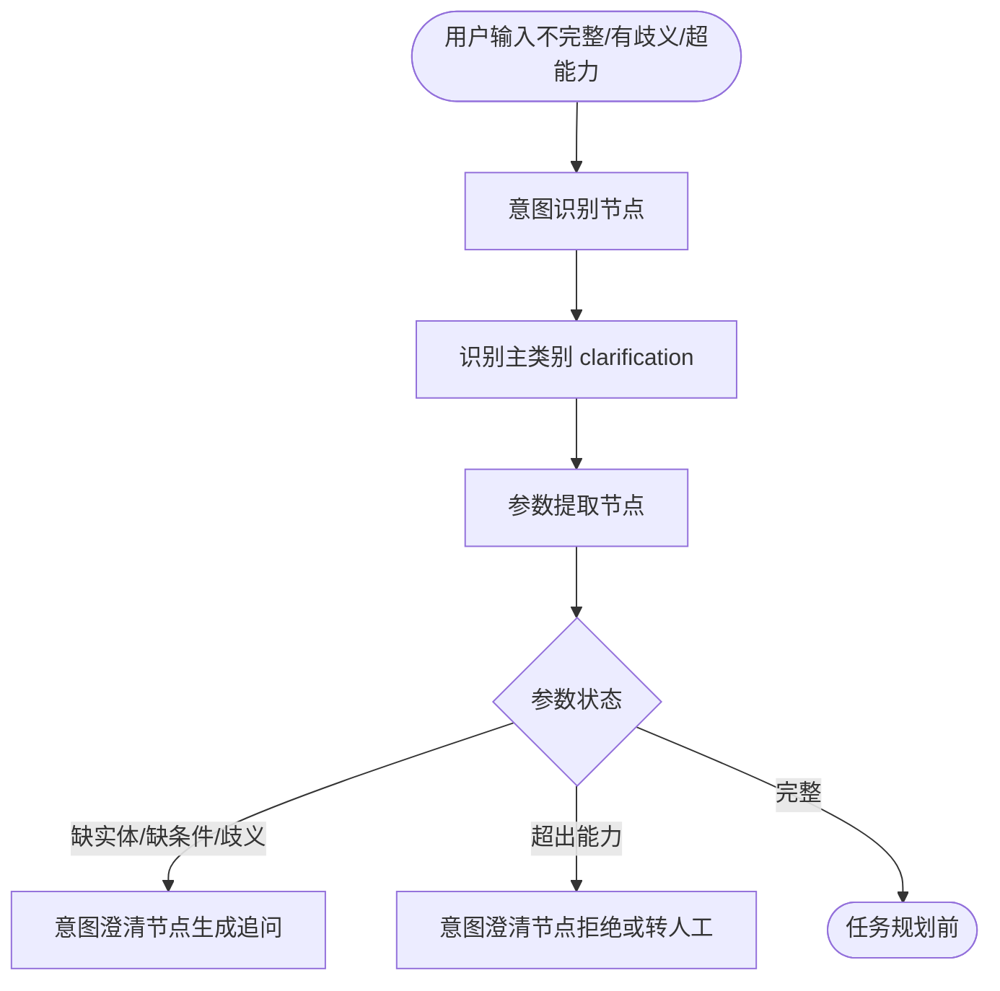

说明：

澄清场景中，意图识别通常可以识别出业务目标，例如查询 CPU，但参数提取发现设备、阈值、时间或指标定义不完整。此时不应继续规划，而是通过意图澄清节点生成结构化追问。操作超出范围也归入该类，但输出是拒绝或转人工。

State 输入：

```json
{
  "user_query": "找一下 CPU 高的设备",
  "dialogue_phase": "idle",
  "parsed_intents": [],
  "pending_clarifications": {},
  "user_profile": {}
}
```

State 输出：

```json
{
  "recognized_event": {
    "main_scenario": "clarification",
    "sub_scenario": "condition_insufficient",
    "relation": "new",
    "confidence": 0.91,
    "reason": "用户表达了 CPU 高，但没有给出高的阈值"
  },
  "parsed_intents": [
    {
      "id": "intent_0",
      "main_scenario": "clarification",
      "sub_scenario": "condition_insufficient",
      "type": "filtered_metric_query",
      "relation": "new",
      "capability_status": "supported",
      "stage": "waiting_clarification"
    }
  ],
  "parameter_results": {
    "intent_0": {
      "intent_id": "intent_0",
      "target_entities": [{"type": "device_group", "name": "all_devices", "source": "default_scope"}],
      "metrics": [{"name": "cpu_usage", "raw_text": "CPU"}],
      "time_range": {"relative": "last_1h", "timezone": "Asia/Shanghai", "source": "default"},
      "missing_filters": ["cpu_threshold"],
      "validation_status": "needs_clarification"
    }
  },
  "pending_clarifications": {
    "intent_0": {
      "intent_id": "intent_0",
      "main_scenario": "clarification",
      "sub_scenario": "condition_insufficient",
      "missing_slots": ["cpu_threshold"],
      "question": "CPU 高具体指超过多少百分比？",
      "expected_answer_type": "threshold",
      "retry_count": 0
    }
  },
  "dialogue_phase": "clarifying",
  "next_stage": "end"
}
```

### 5.2 C2 追问场景

覆盖：指标细化、时间窗口调整、增加实体范围、对比追加、原因追问、操作建议。

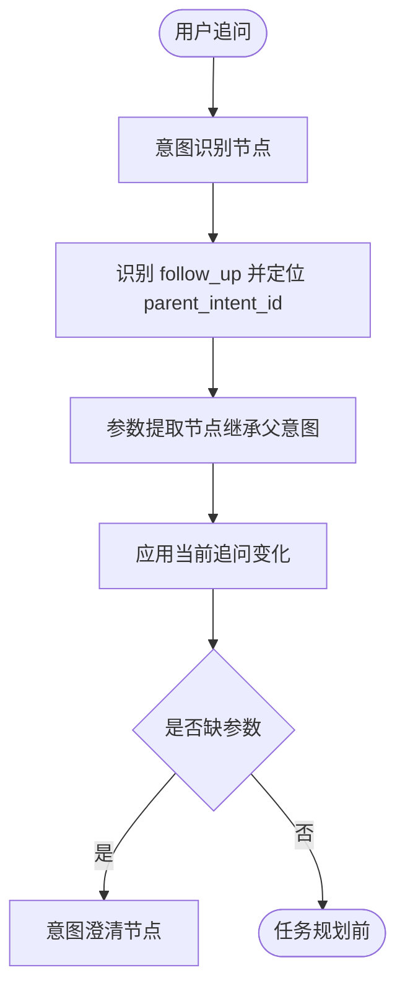

说明：

追问场景必须保留父子意图关系。用户问“哪个进程占用最高？”时，设备和时间来自上一轮，当前输入只新增“进程维度”和“Top1 排序”。对比、原因追问、操作建议都按同样方式继承父意图。

State 输入：

```json
{
  "user_query": "哪个进程占用最高？",
  "last_completed_intent_id": "intent_1",
  "parameter_results": {
    "intent_1": {
      "target_entities": [{"type": "device", "id": "dev_a", "name": "设备A"}],
      "metrics": [{"name": "cpu_usage"}],
      "time_range": {"relative": "last_1h", "source": "current_query"}
    }
  },
  "dialogue_phase": "completed"
}
```

State 输出：

```json
{
  "recognized_event": {
    "main_scenario": "follow_up",
    "sub_scenario": "metric_drilldown",
    "relation": "follow_up",
    "parent_intent_id": "intent_1",
    "confidence": 0.94
  },
  "parsed_intents": [
    {
      "id": "intent_2",
      "main_scenario": "follow_up",
      "sub_scenario": "metric_drilldown",
      "type": "metric_drilldown",
      "relation": "follow_up",
      "parent_intent_id": "intent_1",
      "stage": "ready_for_planning"
    }
  ],
  "parameter_results": {
    "intent_2": {
      "intent_id": "intent_2",
      "target_entities": [{"type": "device", "id": "dev_a", "source": "parent_intent"}],
      "metrics": [{"name": "process_cpu_usage", "raw_text": "进程占用"}],
      "time_range": {"relative": "last_1h", "source": "parent_intent"},
      "modifiers": {"dimension": "process", "rank": "top_1"},
      "inherited_from": {"target_entities": "intent_1", "time_range": "intent_1"},
      "validation_status": "valid"
    }
  },
  "planner_input": {
    "ready_intent_ids": ["intent_2"],
    "reason": "追问参数完整，继承父意图设备和时间",
    "planning_hint": "template_metric_drilldown"
  },
  "dialogue_phase": "ready_for_planning",
  "next_stage": "task_planning"
}
```

### 5.3 C3 上下文切换场景

覆盖：话题重置、回溯历史意图、多话题交替。

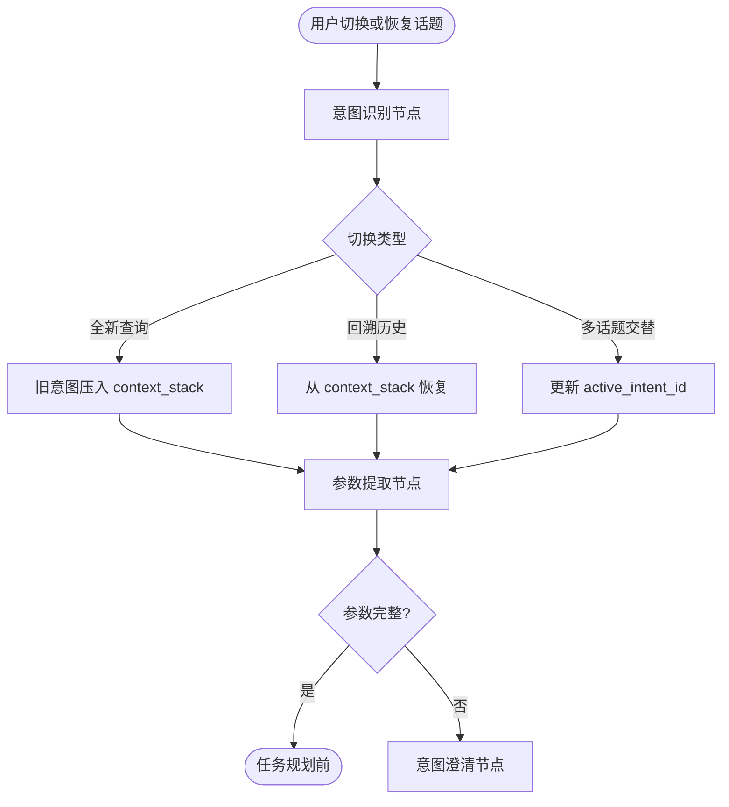

说明：

上下文切换的核心是保护未完成意图。用户正在澄清 A，又问 B，就把 A 放入 `context_stack`，B 成为新的 `active_intent_id`。用户说“刚才那个继续”时，再恢复栈中的意图。

State 输入：

```json
{
  "user_query": "先不查这个了，查一下设备B的内存",
  "dialogue_phase": "clarifying",
  "active_intent_id": "intent_3",
  "pending_clarifications": {
    "intent_3": {"intent_id": "intent_3", "missing_slots": ["device"], "question": "请问要查哪台设备？"}
  }
}
```

State 输出：

```json
{
  "recognized_event": {
    "main_scenario": "context_switch",
    "sub_scenario": "topic_reset",
    "relation": "context_switch",
    "confidence": 0.93
  },
  "context_stack": [
    {
      "intent_id": "intent_3",
      "summary": "正在澄清 CPU 查询的设备",
      "phase_when_suspended": "clarifying"
    }
  ],
  "parsed_intents": [
    {
      "id": "intent_4",
      "main_scenario": "context_switch",
      "sub_scenario": "topic_reset",
      "type": "metric_query",
      "relation": "context_switch",
      "stage": "ready_for_planning"
    }
  ],
  "parameter_results": {
    "intent_4": {
      "target_entities": [{"type": "device", "id": "dev_b", "name": "设备B"}],
      "metrics": [{"name": "memory_usage"}],
      "time_range": {"relative": "last_1h", "source": "default"},
      "validation_status": "valid"
    }
  },
  "active_intent_id": "intent_4",
  "next_stage": "task_planning"
}
```

### 5.4 C4 确认与修正场景

覆盖：显式确认、隐式确认、用户主动修正。

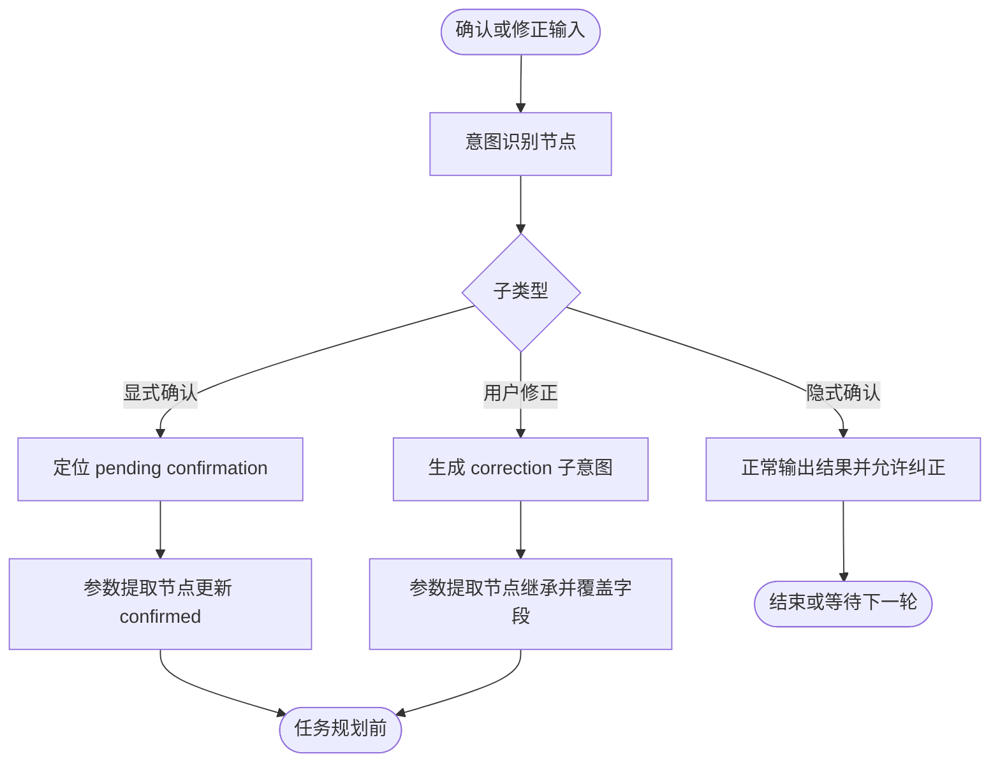

说明：

显式确认通常用于配置备份等风险操作。用户主动修正则不应修改历史结果，而应生成修正子意图，继承父意图的指标和时间，只覆盖错误字段。

State 输入：

```json
{
  "user_query": "不是设备A，是设备B",
  "last_completed_intent_id": "intent_5",
  "parameter_results": {
    "intent_5": {
      "target_entities": [{"type": "device", "id": "dev_a", "name": "设备A"}],
      "metrics": [{"name": "cpu_usage"}],
      "time_range": {"relative": "last_1h"}
    }
  }
}
```

State 输出：

```json
{
  "recognized_event": {
    "main_scenario": "confirmation_correction",
    "sub_scenario": "user_correction",
    "relation": "correction",
    "parent_intent_id": "intent_5",
    "confidence": 0.96
  },
  "parsed_intents": [
    {
      "id": "intent_6",
      "type": "metric_query",
      "relation": "correction",
      "parent_intent_id": "intent_5",
      "stage": "ready_for_planning"
    }
  ],
  "parameter_results": {
    "intent_6": {
      "target_entities": [{"type": "device", "id": "dev_b", "name": "设备B", "source": "correction"}],
      "metrics": [{"name": "cpu_usage", "source": "parent_intent"}],
      "time_range": {"relative": "last_1h", "source": "parent_intent"},
      "validation_status": "valid"
    }
  },
  "next_stage": "task_planning"
}
```

### 5.5 C5 反馈与评价场景

覆盖：正面/负面反馈、要求重试。

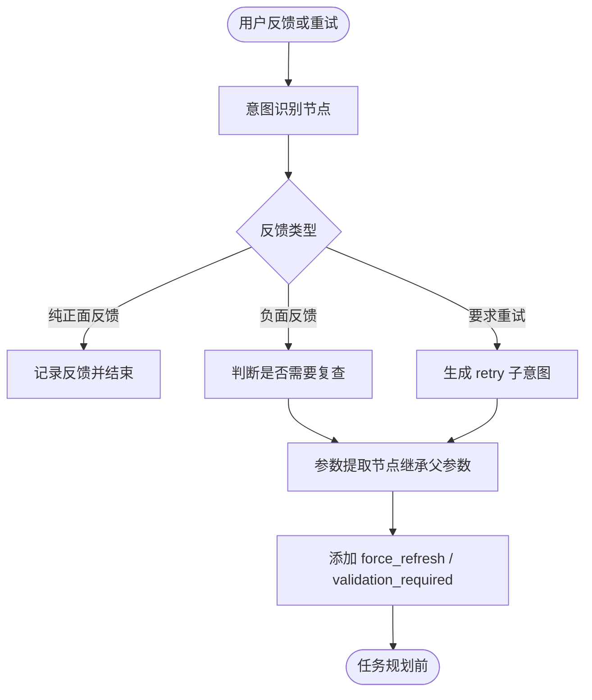

说明：

正面反馈不需要进入参数提取；负面反馈如果指向具体结果，应生成复查意图；要求重试则继承父意图参数并添加刷新标记。

State 输入：

```json
{
  "user_query": "再查一次 CPU，可能已经降下来了",
  "last_completed_intent_id": "intent_7",
  "parameter_results": {
    "intent_7": {
      "target_entities": [{"type": "device", "id": "dev_a"}],
      "metrics": [{"name": "cpu_usage"}],
      "time_range": {"relative": "last_1h"}
    }
  }
}
```

State 输出：

```json
{
  "recognized_event": {
    "main_scenario": "feedback_evaluation",
    "sub_scenario": "retry_request",
    "relation": "retry",
    "parent_intent_id": "intent_7",
    "confidence": 0.95
  },
  "parsed_intents": [
    {
      "id": "intent_8",
      "type": "metric_query",
      "relation": "retry",
      "parent_intent_id": "intent_7",
      "stage": "ready_for_planning"
    }
  ],
  "parameter_results": {
    "intent_8": {
      "target_entities": [{"type": "device", "id": "dev_a", "source": "parent_intent"}],
      "metrics": [{"name": "cpu_usage"}],
      "time_range": {"relative": "latest", "source": "retry_request"},
      "modifiers": {"force_refresh": true, "ignore_cache": true},
      "validation_status": "valid"
    }
  },
  "retry_counts": {"intent_7": 1},
  "next_stage": "task_planning"
}
```

### 5.6 C6 中断与恢复场景

覆盖：用户中断、系统中断。

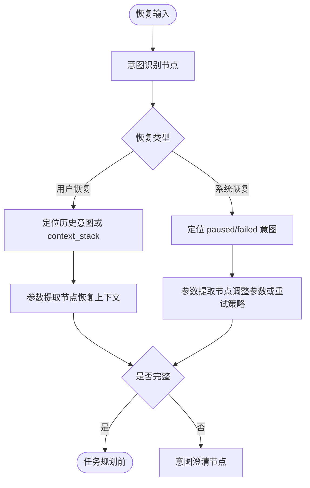

说明：

用户中断后恢复依赖历史意图和上下文栈。系统中断后恢复通常依赖错误信息和系统上一轮给出的恢复选项，例如“重试或缩小时间范围”。

State 输入：

```json
{
  "user_query": "缩小到最近24小时再查",
  "dialogue_phase": "paused",
  "active_intent_id": "intent_9",
  "errors": [{"code": "datasource_timeout", "source_node": "task_executor", "intent_id": "intent_9", "recoverable": true}]
}
```

State 输出：

```json
{
  "recognized_event": {
    "main_scenario": "interruption_recovery",
    "sub_scenario": "system_interruption",
    "relation": "history_resume",
    "target_intent_id": "intent_9"
  },
  "parameter_results": {
    "intent_9": {
      "time_range": {"relative": "last_24h", "source": "recovery_reply"},
      "modifiers": {"retry": true, "reduce_scope": true},
      "validation_status": "valid"
    }
  },
  "retry_counts": {"intent_9": 1},
  "next_stage": "task_planning"
}
```

### 5.7 C7 复合意图交替场景

覆盖：澄清回复 + 新意图。

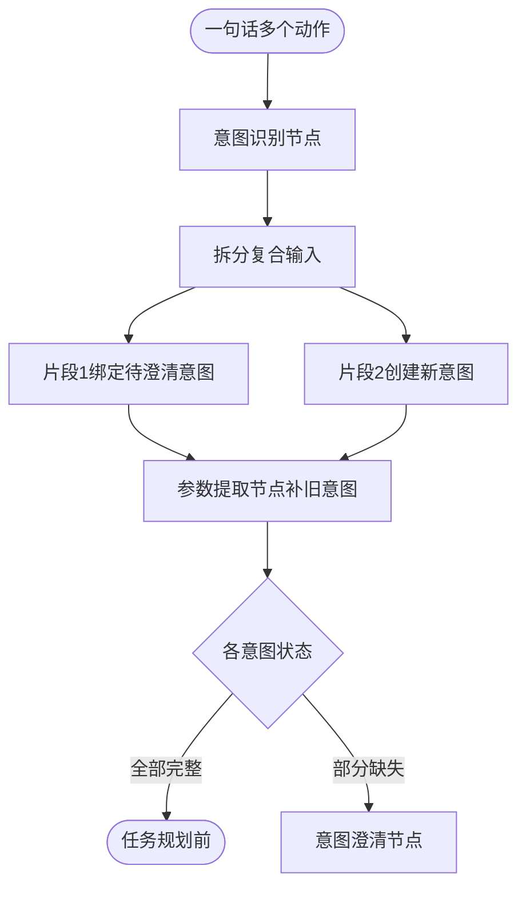

说明：

复合意图不能简单归为澄清或新查询。它需要拆分用户输入，并分别绑定到已有意图或新意图。每个意图独立校验，互不污染。

State 输入：

```json
{
  "user_query": "设备A是10.1.1.1，另外看下设备B的丢包",
  "pending_clarifications": {
    "intent_10": {"intent_id": "intent_10", "missing_slots": ["device"], "question": "请提供要查询 CPU 的设备"}
  }
}
```

State 输出：

```json
{
  "recognized_event": {
    "main_scenario": "compound_intent",
    "sub_scenario": "clarification_plus_new_intent",
    "relation": "compound_part",
    "is_compound": true
  },
  "parsed_intents": [
    {
      "id": "intent_10",
      "relation": "clarification_answer",
      "stage": "ready_for_planning"
    },
    {
      "id": "intent_11",
      "type": "metric_query",
      "relation": "compound_part",
      "stage": "ready_for_planning"
    }
  ],
  "parameter_results": {
    "intent_10": {
      "target_entities": [{"type": "device", "name": "设备A", "attributes": {"ip": "10.1.1.1"}}],
      "validation_status": "valid"
    },
    "intent_11": {
      "target_entities": [{"type": "device", "name": "设备B"}],
      "metrics": [{"name": "packet_loss"}],
      "time_range": {"relative": "last_1h", "source": "default"},
      "validation_status": "valid"
    }
  },
  "planner_input": {
    "ready_intent_ids": ["intent_10", "intent_11"],
    "reason": "复合输入中的两个意图均已完成参数提取",
    "planning_hint": "template_multi_intent"
  },
  "next_stage": "task_planning"
}
```

### 5.8 C8 上下文继承/省略场景

覆盖：实体省略。

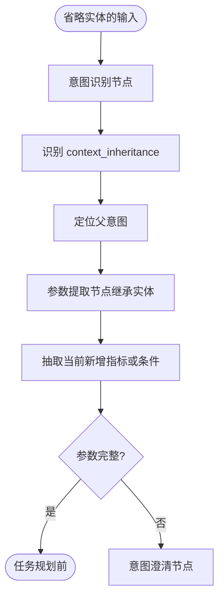

说明：

上下文继承/省略场景和追问相似，但重点是用户省略了必要实体。例如“内存呢？”没有设备名，必须从上一轮继承设备。如果没有可靠父意图，应进入澄清。

State 输入：

```json
{
  "user_query": "内存呢？",
  "last_completed_intent_id": "intent_12",
  "parameter_results": {
    "intent_12": {
      "target_entities": [{"type": "device", "id": "dev_a", "name": "设备A"}],
      "metrics": [{"name": "cpu_usage"}],
      "time_range": {"relative": "last_1h"}
    }
  }
}
```

State 输出：

```json
{
  "recognized_event": {
    "main_scenario": "context_inheritance",
    "sub_scenario": "entity_omission",
    "relation": "follow_up",
    "parent_intent_id": "intent_12"
  },
  "parsed_intents": [
    {
      "id": "intent_13",
      "type": "metric_query",
      "relation": "follow_up",
      "parent_intent_id": "intent_12",
      "stage": "ready_for_planning"
    }
  ],
  "parameter_results": {
    "intent_13": {
      "target_entities": [{"type": "device", "id": "dev_a", "source": "parent_intent"}],
      "metrics": [{"name": "memory_usage", "raw_text": "内存"}],
      "time_range": {"relative": "last_1h", "source": "parent_intent"},
      "validation_status": "valid"
    }
  },
  "next_stage": "task_planning"
}
```

### 5.9 C9 领域特殊场景

覆盖：异常分析深化、多数据源关联、基线/阈值定制、批量与迭代过滤。

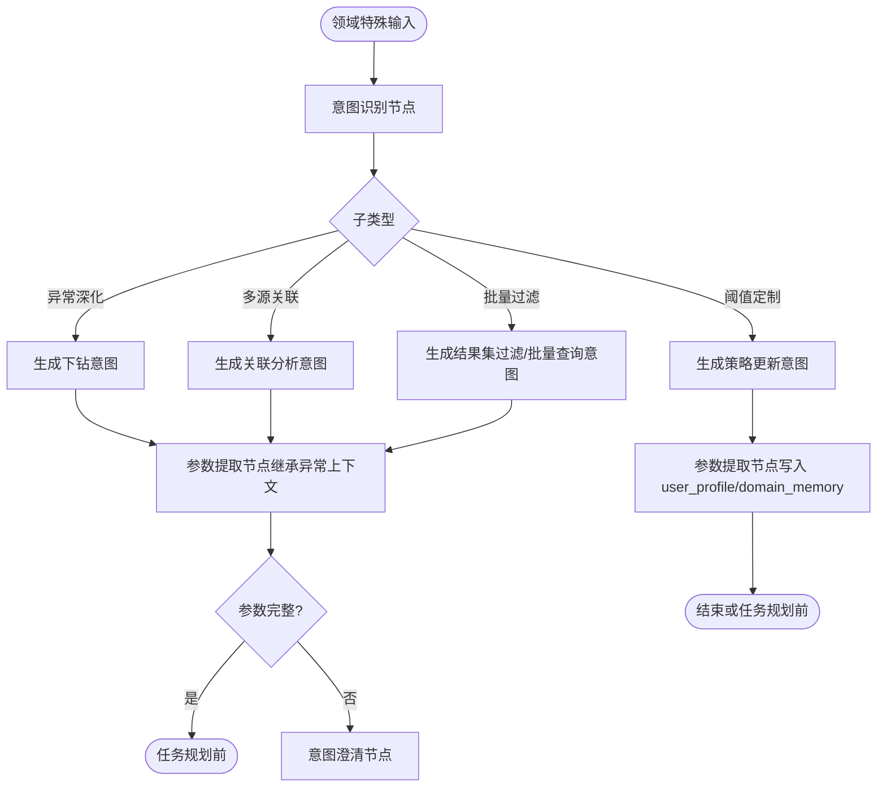

说明：

领域特殊场景需要充分利用结构化记忆。批量过滤应使用 `entity_set_refs`，不要把大量设备列表塞进 prompt。基线/阈值定制主要更新 `user_profile` 或 `domain_memory`，不一定进入任务规划。

State 输入：

```json
{
  "user_query": "以后 CPU 超过85%就算高",
  "user_profile": {"thresholds": {}},
  "domain_memory": {}
}
```

State 输出：

```json
{
  "recognized_event": {
    "main_scenario": "domain_specific",
    "sub_scenario": "baseline_threshold_custom",
    "relation": "policy_update",
    "confidence": 0.97
  },
  "parsed_intents": [
    {
      "id": "intent_14",
      "type": "set_threshold_policy",
      "relation": "policy_update",
      "stage": "completed"
    }
  ],
  "parameter_results": {
    "intent_14": {
      "metrics": [{"name": "cpu_usage", "raw_text": "CPU"}],
      "filters": {"cpu_high_threshold": 85},
      "validation_status": "valid"
    }
  },
  "user_profile": {
    "thresholds": {"cpu_high": 85}
  },
  "planning_required": false,
  "next_stage": "end"
}
```

---

## 6. 各场景测试用例

| 编号 | 主类别 | 子类型 | 前置状态 | 用户输入 | 期望主场景 | 期望子类型 | 期望节点结果 |
|---|---|---|---|---|---|---|---|
| T01 | 澄清场景 | 缺少必要实体 | 无 | 查一下 CPU 使用率 | `clarification` | `missing_required_entity` | 生成 `missing_entities=["device"]`，进入意图澄清 |
| T02 | 澄清场景 | 实体指代歧义 | 实体库中“核心交换机A”匹配两台设备 | 看一下核心交换机A的 CPU | `clarification` | `entity_ambiguity` | 写入 `ambiguities[field=device]`，要求用户选择候选设备 |
| T03 | 澄清场景 | 指标名称模糊 | 指标字典无“健康度”标准定义 | 查设备A的健康度 | `clarification` | `metric_ambiguity` | 写入 `ambiguities[field=metric]` 或 `missing_filters=["metric_definition"]` |
| T04 | 澄清场景 | 条件不充分 | 无用户阈值配置 | 找一下 CPU 高的设备 | `clarification` | `condition_insufficient` | 缺 `cpu_threshold`，追问阈值 |
| T05 | 澄清场景 | 操作超出范围 | 系统只支持查询分析 | 重启设备A | `clarification` | `unsupported_operation` | `capability_status="unsupported"`，拒绝或转人工 |
| T06 | 追问场景 | 指标细化 | 上轮查设备A CPU | 哪个进程占用最高？ | `follow_up` | `metric_drilldown` | 生成子意图，继承设备A和时间，指标为 `process_cpu_usage` |
| T07 | 追问场景 | 时间窗口调整 | 上轮查设备A过去1小时丢包 | 看最近24小时趋势 | `follow_up` | `time_window_adjustment` | 继承设备和指标，覆盖时间为 `last_24h` |
| T08 | 追问场景 | 增加实体范围 | 上轮查核心交换机下联设备丢包 | 只看接入层1到5号 | `follow_up` | `entity_scope_adjustment` | 增加 `filters.access_layer_index=[1,5]` |
| T09 | 追问场景 | 对比追加 | 上轮查设备A丢包 | 对比一下上周同期 | `follow_up` | `comparison_append` | 生成 `compare_windows` |
| T10 | 追问场景 | 原因追问 | 上轮发现丢包升高 | 有没有相关告警或日志？ | `follow_up` | `reason_follow_up` | 指标扩展为告警和日志，时间继承异常窗口 |
| T11 | 追问场景 | 操作建议 | 上轮发现 CPU 持续 90% | 我该检查什么？ | `follow_up` | `operation_advice` | 生成诊断建议意图，规划提示为 `llm_diagnostic_advice` |
| T12 | 上下文切换场景 | 话题重置 | 正在澄清设备名 | 先不查这个了，查设备B的内存 | `context_switch` | `topic_reset` | 当前意图压栈，新建设备B内存查询 |
| T13 | 上下文切换场景 | 回溯历史意图 | `context_stack` 有丢包问题 | 刚才说的丢包问题继续看看 | `context_switch` | `history_backtrack` | 弹出历史意图，恢复为 active |
| T14 | 上下文切换场景 | 多话题交替 | 已查设备A CPU，正在查设备B端口 | 设备A现在降下来了吗？ | `context_switch` | `multi_topic_alternation` | 定位设备A CPU 历史意图，生成刷新/对比子意图 |
| T15 | 确认与修正场景 | 显式确认 | 待确认配置备份 | 确认备份 | `confirmation_correction` | `explicit_confirmation` | 标记 `confirmed=true`，进入任务规划 |
| T16 | 确认与修正场景 | 隐式确认 | 查询设备A CPU 完成 | 用户无纠正 | `confirmation_correction` | `implicit_confirmation` | 回复中包含理解结果，不产生新意图 |
| T17 | 确认与修正场景 | 用户主动修正 | 上轮查设备A CPU | 不是设备A，是设备B的CPU | `confirmation_correction` | `user_correction` | 生成修正子意图，实体覆盖为设备B |
| T18 | 反馈与评价场景 | 正面/负面反馈 | 上轮有分析报告 | 这个分析很准 | `feedback_evaluation` | `positive_negative_feedback` | 记录正面反馈，不进入参数提取 |
| T19 | 反馈与评价场景 | 正面/负面反馈 | 上轮查丢包率 | 丢包率数据错了 | `feedback_evaluation` | `positive_negative_feedback` | 生成复查意图或要求澄清错误点 |
| T20 | 反馈与评价场景 | 要求重试 | 上轮查设备A CPU | 再查一次 CPU，可能已经降下来了 | `feedback_evaluation` | `retry_request` | 继承父参数，添加 `force_refresh=true` |
| T21 | 中断与恢复场景 | 用户中断 | 10 分钟前查设备A | 继续看刚才那台设备 | `interruption_recovery` | `user_interruption` | 恢复最近相关意图，刷新状态 |
| T22 | 中断与恢复场景 | 系统中断 | 日志查询超时，等待恢复选择 | 缩小到最近24小时再查 | `interruption_recovery` | `system_interruption` | 更新时间范围并设置 retry |
| T23 | 复合意图交替场景 | 澄清回复 + 新意图 | 正在澄清 CPU 查询设备 | 设备A是10.1.1.1，另外看下设备B的丢包 | `compound_intent` | `clarification_plus_new_intent` | 拆分为补槽旧意图和新增设备B丢包意图 |
| T24 | 上下文继承/省略场景 | 实体省略 | 上轮查设备A CPU | 内存呢？ | `context_inheritance` | `entity_omission` | 继承设备A和时间，指标改为内存 |
| T25 | 领域特殊场景 | 异常分析深化 | 上轮发现整机 CPU 高 | 哪个槽位最高？ | `domain_specific` | `anomaly_deepening` | 下钻到槽位维度，继承异常窗口 |
| T26 | 领域特殊场景 | 多数据源关联 | 上轮发现丢包升高 | 再看关联告警和对应时段日志 | `domain_specific` | `multi_source_correlation` | 指标扩展为告警和日志，过滤条件关联丢包异常 |
| T27 | 领域特殊场景 | 基线/阈值定制 | 无 | 以后 CPU 超过85%就算高 | `domain_specific` | `baseline_threshold_custom` | 更新 `user_profile.thresholds.cpu_high=85` |
| T28 | 领域特殊场景 | 批量与迭代过滤 | 上轮得到 CPU Top10 结果集 | 过滤掉核心交换机，查这些设备的内存 | `domain_specific` | `batch_iterative_filtering` | 使用 `entity_set_refs` 引用 Top10 并增加过滤 |

---

## 7. 实现建议

1. 意图识别节点可以做一次 LLM，但应先用规则处理“确认”“重试”“纯反馈”“短澄清回复”等低成本场景。
2. 参数提取节点对简单指标查询可模板化，对复杂时间、复合意图、领域下钻再调用 LLM。
3. 意图澄清节点应尽量模板化，只有需要生成复杂自然语言解释时再调用 LLM。
4. 所有追问、省略、修正、重试、恢复都必须保留 `parent_intent_id`。
5. 所有缺失和歧义都必须写入 `pending_clarifications`，不要只依赖自然语言历史。
6. 批量结果必须通过 `entity_set_refs` 传递，不要把大量实体列表塞进 prompt。
7. 进入任务规划前必须满足：`validation_status="valid"`，必要确认已完成，能力边界为 `supported` 或 `supported_with_confirmation` 且已确认。

