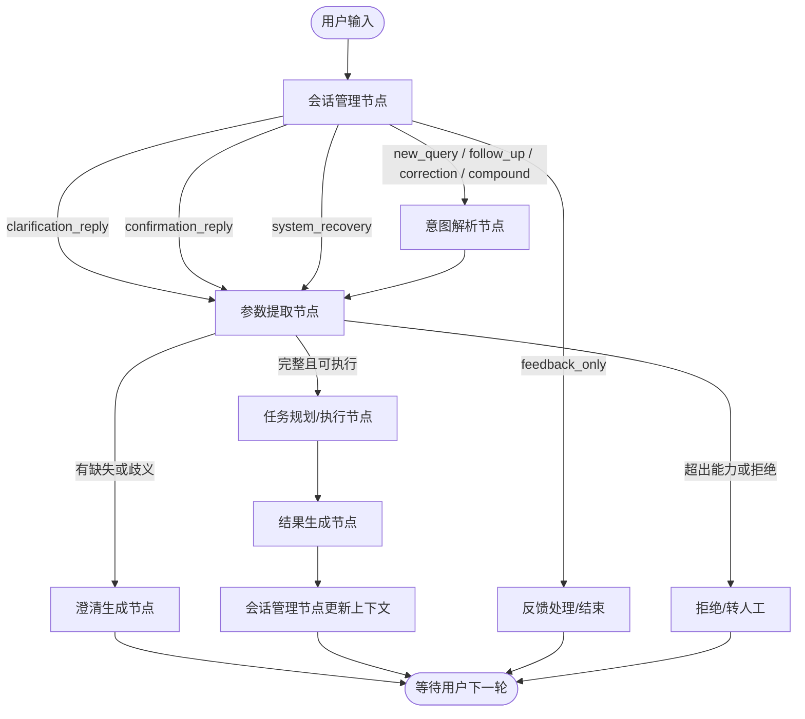
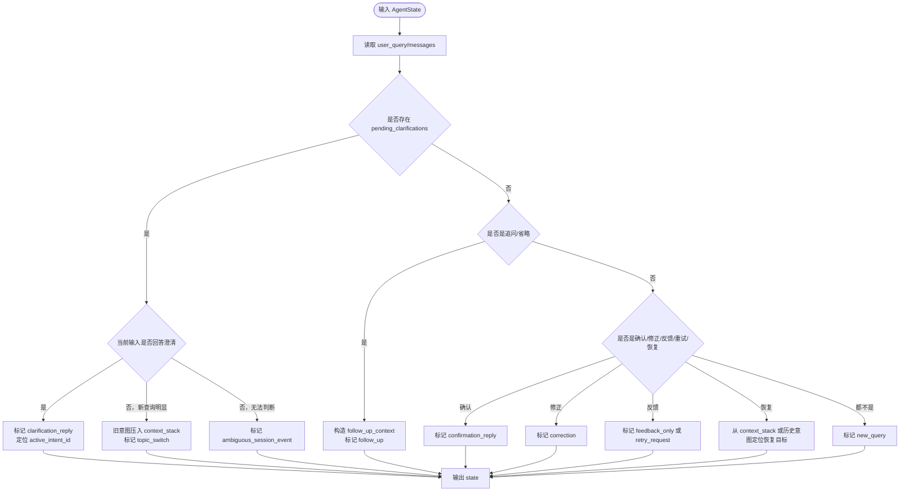
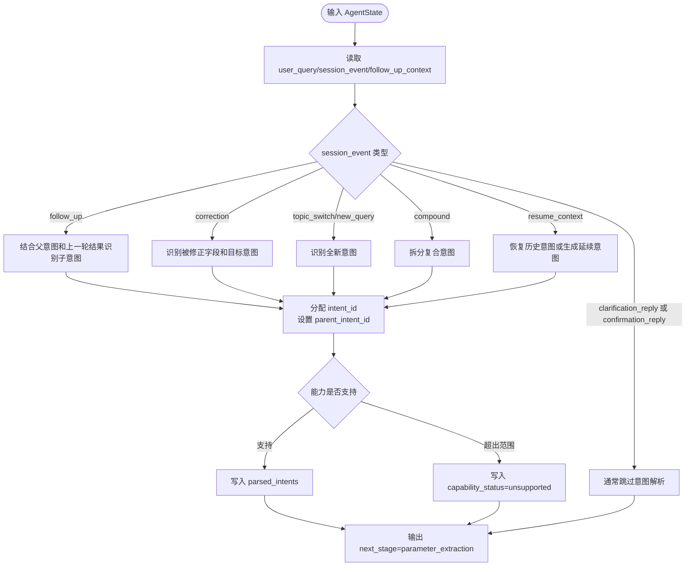
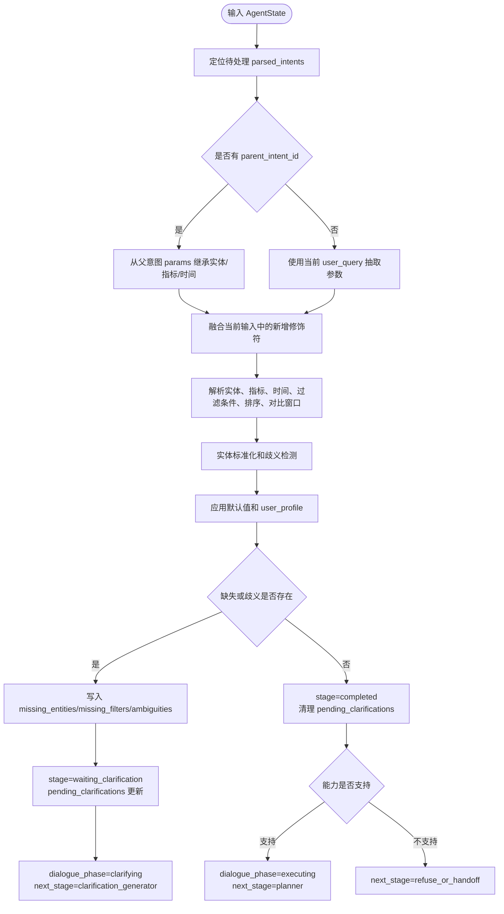

# 1 LangGraph 多轮对话三节点设计

> 基于《多轮对话场景.md》整理。目标是围绕 **意图解析节点**、**参数提取节点**、**会话管理节点** 三个核心节点，给出处理流程、输入输出 `state` 契约，以及覆盖原文所有多轮对话场景的数据流示例。

---

## 1.1 总体设计

三类节点的职责边界：

| 节点 | 关注问题 | 核心产物 |
|---|---|---|
| 会话管理节点 | 当前这句话应该按新问题、追问、澄清回复、话题切换、恢复、反馈还是确认来处理 | `dialogue_phase`、`active_intent_id`、`context_stack`、`pending_clarifications`、`session_event` |
| 意图解析节点 | 用户想做什么，是否产生新意图、子意图、修正意图或复合意图 | `parsed_intents[]`、`parent_intent_id`、`intent.type`、`intent.relation_to_context` |
| 参数提取节点 | 为意图补齐哪些实体、指标、时间、过滤条件、阈值、排序、对比窗口 | `params`、`missing_entities`、`missing_filters`、`default_applied`、`stage` |

推荐 LangGraph 主流程：



---

## 1.2 统一 State 模型

```python
class AgentState(TypedDict):
    # 对话上下文
    messages: List[BaseMessage]
    user_query: str

    # 意图与参数
    parsed_intents: List[ParsedIntent]
    intent_counter: int

    # 多轮对话控制
    dialogue_phase: str
    active_intent_id: Optional[str]
    pending_clarifications: Dict[str, List[str]]
    context_stack: List[str]
    follow_up_context: Optional[str]
    user_profile: Dict[str, Any]
    session_event: Optional[str]

    # 执行与结果
    plan_tasks: List[DataTask]
    task_results: Dict[str, Any]
    analysis_report: Optional[str]
    final_response: Optional[str]

    # 控制与监控
    next_stage: str
    errors: List[str]
    retry_counts: Dict[str, int]
```

```python
@dataclass
class ParsedIntent:
    id: str
    intent: IntentResult
    params: Optional[ParameterResult] = None
    stage: str = "parameter_extraction"
    clarification_history: List[Dict] = field(default_factory=list)
    parent_intent_id: Optional[str] = None
```

```python
@dataclass
class IntentResult:
    type: str
    domain: str
    confidence: float
    relation_to_context: str
    raw_text: str
    capability_status: str = "supported"
```

```python
@dataclass
class ParameterResult:
    target_entities: List[Dict]
    metrics: List[str]
    time_range: Optional[Dict]
    filters: Dict[str, Any]
    modifiers: Dict[str, Any]
    missing_entities: List[str]
    missing_filters: List[str]
    ambiguities: List[Dict]
    default_applied: Dict[str, bool]
    extra_context: Dict[str, Any]
```

---

## 1.3 会话管理节点

### 1.3.1 处理流程图



### 1.3.2 输入 State

| 字段 | 说明 |
|---|---|
| `user_query` | 当前用户输入 |
| `messages` | 历史对话，用于判断是否追问、确认、恢复 |
| `dialogue_phase` | 当前阶段，例如 `idle`、`clarifying`、`follow_up`、`executing` |
| `active_intent_id` | 当前正在澄清、追问或执行的意图 |
| `pending_clarifications` | 是否有待补齐槽位 |
| `parsed_intents` | 历史和当前活跃意图 |
| `context_stack` | 被中断或挂起的话题 |
| `final_response` / `analysis_report` | 上一轮结果摘要，供追问判断 |
| `user_profile` | 用户偏好和长期配置，例如阈值 |

### 1.3.3 输出 State

| 字段 | 更新规则 |
|---|---|
| `session_event` | 设置为 `new_query`、`follow_up`、`clarification_reply`、`topic_switch`、`correction`、`confirmation_reply`、`feedback_only`、`retry_request`、`resume_context`、`system_recovery` 等 |
| `dialogue_phase` | 对应改为 `idle`、`follow_up`、`clarifying`、`executing` 或 `paused` |
| `active_intent_id` | 追问、澄清、恢复时定位目标意图；新话题时切换到新意图或置空等待意图解析 |
| `context_stack` | 话题切换时压入被中断意图，恢复时弹出 |
| `follow_up_context` | 追问/省略时写入上一轮结果摘要 |
| `next_stage` | 决定下一跳：`intent_recognition`、`parameter_extraction`、`feedback_handler`、`clarification_generator` |

---

## 1.4 意图解析节点

### 1.4.1 处理流程图



### 1.4.2 输入 State

| 字段 | 说明 |
|---|---|
| `user_query` | 当前文本 |
| `session_event` | 会话管理节点判断出的事件类型 |
| `dialogue_phase` | 判断是否是追问或澄清过程 |
| `active_intent_id` | 追问、修正、恢复时的父意图候选 |
| `parsed_intents` | 继承、修正、复合拆分时需要读取历史意图 |
| `intent_counter` | 用于生成新的 `intent_id` |
| `follow_up_context` | 追问时注入上一轮结果摘要 |
| `context_stack` | 回溯历史意图时使用 |

### 1.4.3 输出 State

| 字段 | 更新规则 |
|---|---|
| `parsed_intents` | 新增或更新一个/多个 `ParsedIntent` |
| `intent_counter` | 每新增一个意图自增 |
| `active_intent_id` | 指向当前最需要处理的意图 |
| `parsed_intents[].intent.type` | 如 `metric_query`、`root_cause_analysis`、`compare_query`、`operation_advice`、`set_preference` |
| `parsed_intents[].intent.relation_to_context` | `new`、`follow_up`、`correction`、`clarification_answer`、`topic_switch`、`resume`、`compound_part` |
| `parsed_intents[].parent_intent_id` | 追问、下钻、对比、恢复时关联父意图 |
| `parsed_intents[].stage` | 默认 `parameter_extraction`；超出能力时为 `failed` |
| `next_stage` | 通常为 `parameter_extraction`；纯反馈可跳过 |

---

## 1.5 参数提取节点

### 1.5.1 处理流程图



### 1.5.2 输入 State

| 字段 | 说明 |
|---|---|
| `user_query` | 当前文本，用于抽取新参数或澄清答案 |
| `session_event` | 判断是否执行澄清补槽、修正、重试、确认 |
| `active_intent_id` | 定位当前参数提取目标 |
| `parsed_intents` | 读取和更新意图参数；追问时读取父意图 |
| `pending_clarifications` | 澄清回复时只补对应缺失项 |
| `follow_up_context` | 追问场景的上下文摘要 |
| `user_profile` | 默认阈值、默认时间窗口、用户自定义解释 |

### 1.5.3 输出 State

| 字段 | 更新规则 |
|---|---|
| `parsed_intents[].params.target_entities` | 设备、端口、进程、链路等实体，包含标准化 ID |
| `parsed_intents[].params.metrics` | CPU、内存、丢包率、端口流量、日志、告警等 |
| `parsed_intents[].params.time_range` | 绝对时间窗口；未显式指定时标记默认来源 |
| `parsed_intents[].params.filters` | 阈值、设备范围、端口范围、日志级别等 |
| `parsed_intents[].params.modifiers` | top、trend、compare、drill_down、retry、confirm 等修饰符 |
| `parsed_intents[].params.missing_entities` | 缺失实体 |
| `parsed_intents[].params.missing_filters` | 缺失条件 |
| `parsed_intents[].params.ambiguities` | 实体、指标、时间等歧义候选 |
| `pending_clarifications` | 缺失时写入；补齐后清除 |
| `dialogue_phase` | 有缺失为 `clarifying`，完整为 `executing` |
| `next_stage` | `clarification_generator`、`planner`、`refuse_or_handoff` |

---

## 1.6 场景数据流示例

以下示例按原文场景逐项展开。每个示例都展示用户多轮输入如何经过三个节点，并给出关键 `state` 变化。

### 1.6.1 澄清场景：缺少必要实体

用户第 1 轮：

```text
查一下 CPU 使用率
```

数据流：

```json
{
  "会话管理节点输出": {
    "session_event": "new_query",
    "dialogue_phase": "idle",
    "active_intent_id": null,
    "next_stage": "intent_recognition"
  },
  "意图解析节点输出": {
    "parsed_intents": [
      {
        "id": "intent_0",
        "intent": {
          "type": "metric_query",
          "domain": "network_monitoring",
          "relation_to_context": "new",
          "raw_text": "查一下 CPU 使用率"
        },
        "stage": "parameter_extraction"
      }
    ],
    "active_intent_id": "intent_0"
  },
  "参数提取节点输出": {
    "intent_0.params": {
      "target_entities": [],
      "metrics": ["cpu_usage"],
      "time_range": {"value": "last_1h", "source": "default"},
      "missing_entities": ["device"],
      "missing_filters": [],
      "default_applied": {"time_range": true}
    },
    "pending_clarifications": {
      "intent_0": ["device"]
    },
    "dialogue_phase": "clarifying",
    "next_stage": "clarification_generator"
  }
}
```

系统追问：

```text
请问要查询哪台设备的 CPU 使用率？
```

用户第 2 轮：

```text
核心交换机01
```

数据流：

```json
{
  "会话管理节点输出": {
    "session_event": "clarification_reply",
    "active_intent_id": "intent_0",
    "next_stage": "parameter_extraction"
  },
  "参数提取节点输出": {
    "intent_0.clarification_history": [
      {"role": "assistant", "content": "请问要查询哪台设备的 CPU 使用率？"},
      {"role": "user", "content": "核心交换机01"}
    ],
    "intent_0.params": {
      "target_entities": [{"type": "device", "name": "核心交换机01", "id": "dev_core_01"}],
      "metrics": ["cpu_usage"],
      "time_range": {"value": "last_1h", "source": "default"},
      "missing_entities": []
    },
    "pending_clarifications": {},
    "dialogue_phase": "executing",
    "next_stage": "planner"
  }
}
```

### 1.6.2 澄清场景：实体指代歧义

用户：

```text
看一下核心交换机A的 CPU
```

数据流：

```json
{
  "会话管理节点输出": {
    "session_event": "new_query",
    "next_stage": "intent_recognition"
  },
  "意图解析节点输出": {
    "parsed_intents": [
      {
        "id": "intent_1",
        "intent": {
          "type": "metric_query",
          "relation_to_context": "new",
          "raw_text": "看一下核心交换机A的 CPU"
        }
      }
    ],
    "active_intent_id": "intent_1"
  },
  "参数提取节点输出": {
    "intent_1.params": {
      "target_entities": [],
      "metrics": ["cpu_usage"],
      "ambiguities": [
        {
          "field": "device",
          "input": "核心交换机A",
          "candidates": [
            {"name": "核心交换机A-主", "id": "dev_core_a_1", "mgmt_ip": "10.1.1.10"},
            {"name": "核心交换机A-备", "id": "dev_core_a_2", "mgmt_ip": "10.1.1.11"}
          ]
        }
      ],
      "missing_entities": ["device_disambiguation"]
    },
    "pending_clarifications": {
      "intent_1": ["device_disambiguation"]
    },
    "dialogue_phase": "clarifying"
  }
}
```

系统追问：

```text
“核心交换机A”匹配到两台设备：核心交换机A-主（10.1.1.10）和核心交换机A-备（10.1.1.11）。请确认要查询哪一台？
```

用户回复：

```text
查主的
```

补槽结果：

```json
{
  "session_event": "clarification_reply",
  "intent_1.params.target_entities": [
    {"type": "device", "name": "核心交换机A-主", "id": "dev_core_a_1"}
  ],
  "intent_1.params.ambiguities": [],
  "pending_clarifications": {},
  "dialogue_phase": "executing",
  "next_stage": "planner"
}
```

### 1.6.3 澄清场景：指标名称模糊

用户：

```text
查一下设备A的健康度
```

数据流：

```json
{
  "会话管理节点输出": {
    "session_event": "new_query",
    "next_stage": "intent_recognition"
  },
  "意图解析节点输出": {
    "parsed_intents": [
      {
        "id": "intent_2",
        "intent": {
          "type": "metric_query",
          "relation_to_context": "new",
          "raw_text": "查一下设备A的健康度"
        }
      }
    ]
  },
  "参数提取节点输出": {
    "intent_2.params": {
      "target_entities": [{"type": "device", "name": "设备A", "id": "dev_a"}],
      "metrics": [],
      "ambiguities": [
        {
          "field": "metric",
          "input": "健康度",
          "candidates": ["cpu_usage", "memory_usage", "packet_loss", "alarm_count", "device_availability"]
        }
      ],
      "missing_filters": ["metric_definition"]
    },
    "pending_clarifications": {
      "intent_2": ["metric_definition"]
    },
    "dialogue_phase": "clarifying"
  }
}
```

用户澄清：

```text
就是看有没有告警和丢包
```

补槽结果：

```json
{
  "session_event": "clarification_reply",
  "intent_2.params.metrics": ["alarm_count", "packet_loss"],
  "intent_2.params.extra_context": {
    "metric_alias": {"健康度": ["alarm_count", "packet_loss"]}
  },
  "pending_clarifications": {},
  "dialogue_phase": "executing"
}
```

### 1.6.4 澄清场景：条件不充分

用户：

```text
找一下 CPU 高的设备
```

数据流：

```json
{
  "会话管理节点输出": {
    "session_event": "new_query"
  },
  "意图解析节点输出": {
    "parsed_intents": [
      {
        "id": "intent_3",
        "intent": {
          "type": "filtered_metric_query",
          "raw_text": "找一下 CPU 高的设备"
        }
      }
    ]
  },
  "参数提取节点输出": {
    "intent_3.params": {
      "target_entities": [{"type": "device_group", "name": "all_devices"}],
      "metrics": ["cpu_usage"],
      "filters": {},
      "missing_filters": ["cpu_threshold"],
      "time_range": {"value": "last_1h", "source": "default"}
    },
    "pending_clarifications": {
      "intent_3": ["cpu_threshold"]
    },
    "dialogue_phase": "clarifying"
  }
}
```

用户澄清：

```text
超过 90% 算高
```

补槽结果：

```json
{
  "intent_3.params.filters": {"cpu_usage": {">": 90}},
  "intent_3.params.missing_filters": [],
  "pending_clarifications": {},
  "dialogue_phase": "executing",
  "next_stage": "planner"
}
```

### 1.6.5 澄清场景：操作超出范围

用户：

```text
重启设备A
```

数据流：

```json
{
  "会话管理节点输出": {
    "session_event": "new_query"
  },
  "意图解析节点输出": {
    "parsed_intents": [
      {
        "id": "intent_4",
        "intent": {
          "type": "device_restart",
          "capability_status": "unsupported",
          "relation_to_context": "new",
          "raw_text": "重启设备A"
        },
        "stage": "failed"
      }
    ],
    "active_intent_id": "intent_4"
  },
  "参数提取节点输出": {
    "intent_4.params": {
      "target_entities": [{"type": "device", "name": "设备A", "id": "dev_a"}],
      "metrics": [],
      "extra_context": {
        "unsupported_reason": "当前系统仅支持查询、分析、建议，不支持直接重启设备"
      }
    },
    "dialogue_phase": "idle",
    "next_stage": "refuse_or_handoff"
  }
}
```

输出策略：

```text
当前系统不能直接重启设备A。可以帮你查询设备A当前状态、告警和最近日志，或提示联系管理员执行重启。
```

### 1.6.6 追问场景：指标细化

前置状态：

```json
{
  "active_intent_id": "intent_5",
  "parsed_intents": [
    {
      "id": "intent_5",
      "intent": {"type": "metric_query"},
      "params": {
        "target_entities": [{"type": "device", "name": "设备A", "id": "dev_a"}],
        "metrics": ["cpu_usage"],
        "time_range": {"value": "last_1h"}
      },
      "stage": "completed"
    }
  ],
  "final_response": "设备A 最近1小时 CPU 最高达到 92%。"
}
```

用户追问：

```text
哪个进程占用最高？
```

数据流：

```json
{
  "会话管理节点输出": {
    "session_event": "follow_up",
    "dialogue_phase": "follow_up",
    "active_intent_id": "intent_5",
    "follow_up_context": "上一轮查询设备A最近1小时CPU使用率，最高92%"
  },
  "意图解析节点输出": {
    "parsed_intents新增": {
      "id": "intent_6",
      "parent_intent_id": "intent_5",
      "intent": {
        "type": "metric_drilldown",
        "relation_to_context": "follow_up",
        "raw_text": "哪个进程占用最高？"
      }
    },
    "active_intent_id": "intent_6"
  },
  "参数提取节点输出": {
    "intent_6.params": {
      "target_entities": [{"type": "device", "name": "设备A", "id": "dev_a", "source": "parent_intent"}],
      "metrics": ["process_cpu_usage"],
      "time_range": {"value": "last_1h", "source": "parent_intent"},
      "modifiers": {"rank": "top_1", "dimension": "process"},
      "missing_entities": []
    },
    "dialogue_phase": "executing"
  }
}
```

### 1.6.7 追问场景：时间窗口调整

前置：上一轮完成 `intent_7`，查询“设备A过去1小时丢包率”。

用户：

```text
看最近 24 小时趋势
```

数据流：

```json
{
  "会话管理节点输出": {
    "session_event": "follow_up",
    "follow_up_context": "上一轮查询设备A过去1小时packet_loss"
  },
  "意图解析节点输出": {
    "parsed_intents新增": {
      "id": "intent_8",
      "parent_intent_id": "intent_7",
      "intent": {
        "type": "trend_query",
        "relation_to_context": "follow_up"
      }
    }
  },
  "参数提取节点输出": {
    "intent_8.params": {
      "target_entities": [{"type": "device", "id": "dev_a", "source": "parent_intent"}],
      "metrics": ["packet_loss"],
      "time_range": {"value": "last_24h", "source": "current_query"},
      "modifiers": {"view": "trend"},
      "default_applied": {"time_range": false}
    },
    "dialogue_phase": "executing"
  }
}
```

### 1.6.8 追问场景：增加实体范围

前置：上一轮查询“核心交换机下联设备丢包”。

用户：

```text
只看接入层1到5号
```

数据流：

```json
{
  "会话管理节点输出": {
    "session_event": "follow_up",
    "active_intent_id": "intent_9"
  },
  "意图解析节点输出": {
    "parsed_intents新增": {
      "id": "intent_10",
      "parent_intent_id": "intent_9",
      "intent": {
        "type": "filtered_metric_query",
        "relation_to_context": "follow_up"
      }
    }
  },
  "参数提取节点输出": {
    "intent_10.params": {
      "target_entities": [
        {"type": "device_group", "name": "核心交换机下联设备", "source": "parent_intent"}
      ],
      "metrics": ["packet_loss"],
      "filters": {
        "access_layer_index": {"between": [1, 5]}
      },
      "time_range": {"value": "last_1h", "source": "parent_intent"},
      "modifiers": {"scope_operation": "narrow"}
    }
  }
}
```

### 1.6.9 追问场景：对比追加

前置：上一轮查询“设备A当前丢包率”。

用户：

```text
能对比一下上周同期吗？
```

数据流：

```json
{
  "会话管理节点输出": {
    "session_event": "follow_up",
    "follow_up_context": "设备A当前丢包率查询"
  },
  "意图解析节点输出": {
    "parsed_intents新增": {
      "id": "intent_11",
      "parent_intent_id": "intent_7",
      "intent": {
        "type": "compare_query",
        "relation_to_context": "follow_up"
      }
    }
  },
  "参数提取节点输出": {
    "intent_11.params": {
      "target_entities": [{"type": "device", "id": "dev_a", "source": "parent_intent"}],
      "metrics": ["packet_loss"],
      "time_range": {"value": "last_1h", "source": "parent_intent"},
      "modifiers": {"compare": true},
      "extra_context": {
        "time_windows": [
          {"name": "current", "range": "last_1h"},
          {"name": "previous_week_same_period", "range": "last_1h shifted -7d"}
        ]
      }
    },
    "dialogue_phase": "executing"
  }
}
```

### 1.6.10 追问场景：原因追问

前置：上一轮发现“设备A丢包率突然升高”。

用户：

```text
有没有相关告警或日志？
```

数据流：

```json
{
  "会话管理节点输出": {
    "session_event": "follow_up",
    "follow_up_context": "设备A在最近30分钟丢包率从0.1%升至5%"
  },
  "意图解析节点输出": {
    "parsed_intents新增": {
      "id": "intent_12",
      "parent_intent_id": "intent_7",
      "intent": {
        "type": "root_cause_evidence_query",
        "relation_to_context": "follow_up"
      }
    }
  },
  "参数提取节点输出": {
    "intent_12.params": {
      "target_entities": [{"type": "device", "id": "dev_a", "source": "parent_intent"}],
      "metrics": ["alarm_event", "system_log", "interface_log"],
      "time_range": {"value": "around_parent_anomaly_window", "source": "parent_intent"},
      "filters": {
        "severity": ["warning", "critical"],
        "correlate_with": "packet_loss_spike"
      },
      "modifiers": {"correlation": true}
    }
  }
}
```

### 1.6.11 追问场景：操作建议

前置：上一轮结果显示“设备A CPU 持续 90% 以上”。

用户：

```text
我该检查什么？
```

数据流：

```json
{
  "会话管理节点输出": {
    "session_event": "follow_up",
    "follow_up_context": "设备A CPU 持续90%以上，时间窗口last_1h"
  },
  "意图解析节点输出": {
    "parsed_intents新增": {
      "id": "intent_13",
      "parent_intent_id": "intent_5",
      "intent": {
        "type": "operation_advice",
        "relation_to_context": "follow_up",
        "capability_status": "supported"
      }
    }
  },
  "参数提取节点输出": {
    "intent_13.params": {
      "target_entities": [{"type": "device", "id": "dev_a", "source": "parent_intent"}],
      "metrics": ["cpu_usage", "process_cpu_usage", "alarm_event", "system_log"],
      "time_range": {"value": "last_1h", "source": "parent_intent"},
      "modifiers": {"advice_mode": "diagnostic_steps"}
    }
  }
}
```

### 1.6.12 上下文切换场景：话题重置（全新查询）

前置：系统正在澄清 `intent_14`：“请问要查哪台设备的 CPU？”

用户：

```text
先不查这个了，查一下设备B的内存
```

数据流：

```json
{
  "会话管理节点输出": {
    "session_event": "topic_switch",
    "dialogue_phase": "idle",
    "context_stack": ["intent_14"],
    "active_intent_id": null,
    "next_stage": "intent_recognition"
  },
  "意图解析节点输出": {
    "parsed_intents新增": {
      "id": "intent_15",
      "parent_intent_id": null,
      "intent": {
        "type": "metric_query",
        "relation_to_context": "topic_switch",
        "raw_text": "查一下设备B的内存"
      }
    },
    "active_intent_id": "intent_15"
  },
  "参数提取节点输出": {
    "intent_15.params": {
      "target_entities": [{"type": "device", "name": "设备B", "id": "dev_b"}],
      "metrics": ["memory_usage"],
      "time_range": {"value": "last_1h", "source": "default"},
      "missing_entities": []
    },
    "dialogue_phase": "executing"
  }
}
```

### 1.6.13 上下文切换场景：回溯历史意图

前置：`context_stack = ["intent_14"]`，`intent_14` 是之前被暂停的“CPU高设备查询”。

用户：

```text
刚才那个 CPU 的问题继续
```

数据流：

```json
{
  "会话管理节点输出": {
    "session_event": "resume_context",
    "active_intent_id": "intent_14",
    "context_stack": [],
    "dialogue_phase": "clarifying",
    "next_stage": "parameter_extraction"
  },
  "意图解析节点输出": {
    "说明": "恢复已有意图，通常不新建 intent，只把 intent_14 重新设为焦点"
  },
  "参数提取节点输出": {
    "intent_14.stage": "waiting_clarification",
    "pending_clarifications": {
      "intent_14": ["device"]
    },
    "next_stage": "clarification_generator"
  }
}
```

系统继续追问：

```text
继续刚才的 CPU 查询，请问要查哪台设备？
```

### 1.6.14 上下文切换场景：多话题交替

用户连续输入：

```text
查设备A的CPU
再看设备B的端口流量
设备A现在降下来了吗？
```

数据流：

```json
{
  "第1轮": {
    "session_event": "new_query",
    "intent": {"id": "intent_16", "type": "metric_query"},
    "params": {
      "target_entities": [{"id": "dev_a"}],
      "metrics": ["cpu_usage"]
    },
    "dialogue_phase": "executing"
  },
  "第2轮": {
    "session_event": "topic_switch",
    "context_stack": ["intent_16"],
    "intent": {"id": "intent_17", "type": "metric_query"},
    "params": {
      "target_entities": [{"id": "dev_b"}],
      "metrics": ["interface_traffic"],
      "missing_entities": ["interface"]
    },
    "dialogue_phase": "clarifying"
  },
  "第3轮": {
    "session_event": "resume_context",
    "active_intent_id": "intent_16",
    "intent新增": {
      "id": "intent_18",
      "parent_intent_id": "intent_16",
      "type": "trend_or_latest_query"
    },
    "params": {
      "target_entities": [{"id": "dev_a", "source": "parent_intent"}],
      "metrics": ["cpu_usage"],
      "time_range": {"value": "latest", "source": "current_query"},
      "modifiers": {"compare_with_parent_result": true}
    }
  }
}
```

### 1.6.15 确认与修正场景：显式确认

用户：

```text
对所有交换机执行配置备份
```

数据流：

```json
{
  "会话管理节点输出": {
    "session_event": "new_query"
  },
  "意图解析节点输出": {
    "parsed_intents新增": {
      "id": "intent_19",
      "intent": {
        "type": "config_backup",
        "capability_status": "supported_with_confirmation"
      }
    }
  },
  "参数提取节点输出": {
    "intent_19.params": {
      "target_entities": [{"type": "device_group", "name": "all_switches"}],
      "modifiers": {"requires_confirmation": true, "risk_level": "medium"}
    },
    "dialogue_phase": "clarifying",
    "pending_clarifications": {
      "intent_19": ["explicit_confirmation"]
    },
    "next_stage": "confirmation_generator"
  }
}
```

系统确认：

```text
将对所有交换机执行配置备份。请回复“确认备份”后继续。
```

用户：

```text
确认备份
```

确认回复数据流：

```json
{
  "会话管理节点输出": {
    "session_event": "confirmation_reply",
    "active_intent_id": "intent_19"
  },
  "参数提取节点输出": {
    "intent_19.params.modifiers.confirmed": true,
    "pending_clarifications": {},
    "dialogue_phase": "executing",
    "next_stage": "planner"
  }
}
```

### 1.6.16 确认与修正场景：隐式确认

用户：

```text
查设备A的CPU
```

数据流：

```json
{
  "会话管理节点输出": {
    "session_event": "new_query"
  },
  "意图解析节点输出": {
    "parsed_intents新增": {
      "id": "intent_20",
      "intent": {"type": "metric_query"}
    }
  },
  "参数提取节点输出": {
    "intent_20.params": {
      "target_entities": [{"type": "device", "name": "设备A", "id": "dev_a"}],
      "metrics": ["cpu_usage"],
      "time_range": {"value": "last_1h", "source": "default"}
    },
    "dialogue_phase": "executing"
  }
}
```

最终回复中的隐式确认：

```text
设备A 最近1小时 CPU 平均 63%，峰值 78%。如果设备名不是你要查的对象，可以直接说“不是设备A，是设备B”。
```

此时若用户不纠正，会话管理节点将 `intent_20.stage` 保持 `completed`；若用户纠正，则进入“用户主动修正”。

### 1.6.17 确认与修正场景：用户主动修正

前置：刚完成 `intent_20`，查询了设备A CPU。

用户：

```text
不是设备A，是设备B
```

数据流：

```json
{
  "会话管理节点输出": {
    "session_event": "correction",
    "active_intent_id": "intent_20",
    "next_stage": "intent_recognition"
  },
  "意图解析节点输出": {
    "parsed_intents新增": {
      "id": "intent_21",
      "parent_intent_id": "intent_20",
      "intent": {
        "type": "metric_query",
        "relation_to_context": "correction",
        "raw_text": "不是设备A，是设备B"
      }
    }
  },
  "参数提取节点输出": {
    "intent_21.params": {
      "target_entities": [{"type": "device", "name": "设备B", "id": "dev_b", "source": "correction"}],
      "metrics": ["cpu_usage", "source:parent_intent"],
      "time_range": {"value": "last_1h", "source": "parent_intent"}
    },
    "dialogue_phase": "executing",
    "next_stage": "planner"
  }
}
```

### 1.6.18 反馈与评价场景：正面/负面反馈

用户正面反馈：

```text
这个分析很准
```

数据流：

```json
{
  "会话管理节点输出": {
    "session_event": "feedback_only",
    "dialogue_phase": "idle",
    "next_stage": "feedback_handler"
  },
  "意图解析节点输出": {
    "说明": "不生成业务查询意图"
  },
  "参数提取节点输出": {
    "说明": "不执行参数提取"
  },
  "状态更新": {
    "user_profile.feedback_history": [
      {"intent_id": "intent_12", "sentiment": "positive", "content": "这个分析很准"}
    ]
  }
}
```

用户负面反馈：

```text
丢包率数据错了
```

数据流：

```json
{
  "会话管理节点输出": {
    "session_event": "negative_feedback",
    "active_intent_id": "intent_7",
    "next_stage": "intent_recognition"
  },
  "意图解析节点输出": {
    "parsed_intents新增": {
      "id": "intent_22",
      "parent_intent_id": "intent_7",
      "intent": {
        "type": "result_challenge",
        "relation_to_context": "feedback"
      }
    }
  },
  "参数提取节点输出": {
    "intent_22.params": {
      "target_entities": [{"id": "dev_a", "source": "parent_intent"}],
      "metrics": ["packet_loss"],
      "time_range": {"value": "last_1h", "source": "parent_intent"},
      "modifiers": {"validation_required": true}
    },
    "next_stage": "planner"
  }
}
```

### 1.6.19 反馈与评价场景：要求重试

前置：上一轮查过设备A CPU。

用户：

```text
再查一次 CPU，可能已经降下来了
```

数据流：

```json
{
  "会话管理节点输出": {
    "session_event": "retry_request",
    "active_intent_id": "intent_20",
    "follow_up_context": "上一轮设备A CPU 查询"
  },
  "意图解析节点输出": {
    "parsed_intents新增": {
      "id": "intent_23",
      "parent_intent_id": "intent_20",
      "intent": {
        "type": "metric_query",
        "relation_to_context": "retry"
      }
    }
  },
  "参数提取节点输出": {
    "intent_23.params": {
      "target_entities": [{"id": "dev_a", "source": "parent_intent"}],
      "metrics": ["cpu_usage"],
      "time_range": {"value": "latest", "source": "retry_request"},
      "modifiers": {"force_refresh": true, "ignore_cache": true}
    },
    "retry_counts": {"intent_20": 1},
    "dialogue_phase": "executing"
  }
}
```

### 1.6.20 中断与恢复场景：用户中断

前置：10 分钟前完成 `intent_24`，查询“设备A端口丢包”。

用户：

```text
继续看刚才那台设备
```

数据流：

```json
{
  "会话管理节点输出": {
    "session_event": "resume_context",
    "active_intent_id": "intent_24",
    "follow_up_context": "10分钟前查询设备A端口丢包",
    "next_stage": "intent_recognition"
  },
  "意图解析节点输出": {
    "parsed_intents新增": {
      "id": "intent_25",
      "parent_intent_id": "intent_24",
      "intent": {
        "type": "status_refresh_query",
        "relation_to_context": "resume"
      }
    }
  },
  "参数提取节点输出": {
    "intent_25.params": {
      "target_entities": [{"id": "dev_a", "source": "parent_intent"}],
      "metrics": ["packet_loss", "interface_status"],
      "time_range": {"value": "latest", "source": "resume_default"},
      "modifiers": {"resume_after_idle": true}
    },
    "dialogue_phase": "executing"
  }
}
```

### 1.6.21 中断与恢复场景：系统中断

前置：`intent_26` 查询最近 30 天日志超时。

系统状态：

```json
{
  "active_intent_id": "intent_26",
  "errors": ["log_query_timeout"],
  "retry_counts": {"task_log_query": 1},
  "dialogue_phase": "paused",
  "pending_clarifications": {
    "intent_26": ["retry_or_reduce_time_range"]
  }
}
```

系统询问：

```text
查询超时。是否重试，或把时间范围缩小到最近24小时？
```

用户：

```text
缩小到最近24小时再查
```

数据流：

```json
{
  "会话管理节点输出": {
    "session_event": "system_recovery",
    "active_intent_id": "intent_26",
    "next_stage": "parameter_extraction"
  },
  "参数提取节点输出": {
    "intent_26.params.time_range": {"value": "last_24h", "source": "recovery_reply"},
    "intent_26.params.modifiers": {"retry": true, "reduce_scope": true},
    "pending_clarifications": {},
    "retry_counts": {"task_log_query": 2},
    "dialogue_phase": "executing",
    "next_stage": "planner"
  }
}
```

### 1.6.22 复合意图交替场景：澄清回复 + 新意图

前置：系统正在澄清 `intent_27` 的设备 IP。

系统追问：

```text
请提供要查询 CPU 的设备。
```

用户：

```text
设备A是10.1.1.1，另外看下设备B的丢包
```

数据流：

```json
{
  "会话管理节点输出": {
    "session_event": "compound",
    "active_intent_id": "intent_27",
    "dialogue_phase": "clarifying",
    "next_stage": "intent_recognition"
  },
  "意图解析节点输出": {
    "复合拆分": [
      {
        "part": "设备A是10.1.1.1",
        "target": "clarification_reply",
        "intent_id": "intent_27"
      },
      {
        "part": "另外看下设备B的丢包",
        "target": "new_query",
        "new_intent_id": "intent_28"
      }
    ],
    "parsed_intents新增": {
      "id": "intent_28",
      "intent": {
        "type": "metric_query",
        "relation_to_context": "compound_part"
      }
    }
  },
  "参数提取节点输出": {
    "intent_27.params.target_entities": [
      {"type": "device", "name": "设备A", "mgmt_ip": "10.1.1.1"}
    ],
    "intent_27.stage": "completed",
    "intent_28.params": {
      "target_entities": [{"type": "device", "name": "设备B", "id": "dev_b"}],
      "metrics": ["packet_loss"],
      "time_range": {"value": "last_1h", "source": "default"}
    },
    "pending_clarifications": {},
    "dialogue_phase": "executing",
    "next_stage": "planner"
  }
}
```

执行策略：规划节点可以生成两个任务，先补齐并执行 `intent_27`，再执行 `intent_28`，或并行执行。

### 1.6.23 上下文继承/省略场景：实体省略

前置：上一轮查询“设备A CPU”。

用户：

```text
内存呢？
```

数据流：

```json
{
  "会话管理节点输出": {
    "session_event": "follow_up",
    "active_intent_id": "intent_20",
    "follow_up_context": "上一轮查询设备A CPU"
  },
  "意图解析节点输出": {
    "parsed_intents新增": {
      "id": "intent_29",
      "parent_intent_id": "intent_20",
      "intent": {
        "type": "metric_query",
        "relation_to_context": "follow_up",
        "raw_text": "内存呢？"
      }
    }
  },
  "参数提取节点输出": {
    "intent_29.params": {
      "target_entities": [{"type": "device", "id": "dev_a", "source": "parent_intent"}],
      "metrics": ["memory_usage"],
      "time_range": {"value": "last_1h", "source": "parent_intent"},
      "missing_entities": [],
      "default_applied": {"target_entities": false, "time_range": false}
    },
    "dialogue_phase": "executing"
  }
}
```

### 1.6.24 领域特殊场景：异常分析深化

用户多轮：

```text
设备A CPU 为什么这么高？
哪个槽位最高？
哪个进程？
看对应日志
```

数据流：

```json
{
  "第1轮": {
    "session_event": "new_query",
    "intent": {
      "id": "intent_30",
      "type": "root_cause_analysis"
    },
    "params": {
      "target_entities": [{"id": "dev_a"}],
      "metrics": ["cpu_usage", "alarm_event", "system_log"],
      "time_range": {"value": "last_1h", "source": "default"},
      "modifiers": {"analysis_depth": "device"}
    }
  },
  "第2轮": {
    "session_event": "follow_up",
    "intent": {
      "id": "intent_31",
      "parent_intent_id": "intent_30",
      "type": "metric_drilldown"
    },
    "params": {
      "target_entities": [{"id": "dev_a", "source": "parent_intent"}],
      "metrics": ["slot_cpu_usage"],
      "modifiers": {"dimension": "slot", "rank": "top_1"}
    }
  },
  "第3轮": {
    "session_event": "follow_up",
    "intent": {
      "id": "intent_32",
      "parent_intent_id": "intent_31",
      "type": "metric_drilldown"
    },
    "params": {
      "target_entities": [
        {"id": "dev_a", "source": "ancestor_intent"},
        {"type": "slot", "id": "slot_3", "source": "parent_result"}
      ],
      "metrics": ["process_cpu_usage"],
      "modifiers": {"dimension": "process", "rank": "top_1"}
    }
  },
  "第4轮": {
    "session_event": "follow_up",
    "intent": {
      "id": "intent_33",
      "parent_intent_id": "intent_32",
      "type": "log_correlation_query"
    },
    "params": {
      "target_entities": [{"id": "dev_a"}, {"type": "process", "id": "proc_x"}],
      "metrics": ["system_log"],
      "time_range": {"value": "around_parent_anomaly_window"},
      "filters": {"keyword": ["cpu", "process", "slot_3"]}
    }
  }
}
```

关键点：每一次下钻都生成子意图，并通过 `parent_intent_id` 继承设备、时间、异常窗口，同时新增更细维度。

### 1.6.25 领域特殊场景：多数据源关联

用户多轮：

```text
先看设备A的丢包率
再看关联告警
最后看对应时段日志
```

数据流：

```json
{
  "第1轮参数": {
    "intent_id": "intent_34",
    "metrics": ["packet_loss"],
    "target_entities": [{"id": "dev_a"}],
    "time_range": {"value": "last_1h", "source": "default"}
  },
  "第2轮参数": {
    "intent_id": "intent_35",
    "parent_intent_id": "intent_34",
    "metrics": ["alarm_event"],
    "target_entities": [{"id": "dev_a", "source": "parent_intent"}],
    "time_range": {"value": "packet_loss_anomaly_window", "source": "parent_result"},
    "filters": {"correlate_with": "packet_loss"}
  },
  "第3轮参数": {
    "intent_id": "intent_36",
    "parent_intent_id": "intent_35",
    "metrics": ["system_log", "interface_log"],
    "target_entities": [{"id": "dev_a", "source": "ancestor_intent"}],
    "time_range": {"value": "alarm_and_packet_loss_overlap_window"},
    "filters": {
      "keyword": ["drop", "interface", "error", "link"],
      "severity": ["warning", "critical"]
    }
  }
}
```

状态控制：

```json
{
  "dialogue_phase": "executing",
  "follow_up_context": "多数据源链路：packet_loss -> alarm_event -> logs",
  "active_intent_id": "intent_36"
}
```

### 1.6.26 领域特殊场景：基线/阈值定制

用户：

```text
以后 CPU 超过 85% 就算高
```

数据流：

```json
{
  "会话管理节点输出": {
    "session_event": "new_query",
    "next_stage": "intent_recognition"
  },
  "意图解析节点输出": {
    "parsed_intents新增": {
      "id": "intent_37",
      "intent": {
        "type": "set_preference",
        "relation_to_context": "new",
        "raw_text": "以后 CPU 超过 85% 就算高"
      }
    }
  },
  "参数提取节点输出": {
    "intent_37.params": {
      "metrics": ["cpu_usage"],
      "filters": {"cpu_high_threshold": 85},
      "modifiers": {"preference_scope": "future_sessions"}
    },
    "user_profile": {
      "thresholds": {
        "cpu_high": 85
      }
    },
    "dialogue_phase": "idle",
    "next_stage": "preference_saved_response"
  }
}
```

后续用户：

```text
找一下 CPU 高的设备
```

参数提取直接应用用户配置：

```json
{
  "intent_38.params": {
    "target_entities": [{"type": "device_group", "name": "all_devices"}],
    "metrics": ["cpu_usage"],
    "filters": {"cpu_usage": {">": 85, "source": "user_profile"}},
    "missing_filters": [],
    "default_applied": {"cpu_threshold": false}
  },
  "dialogue_phase": "executing"
}
```

### 1.6.27 领域特殊场景：批量与迭代过滤

用户多轮：

```text
列出所有设备 CPU Top10
过滤掉核心交换机
查这些设备的内存
```

数据流：

```json
{
  "第1轮": {
    "session_event": "new_query",
    "intent": {
      "id": "intent_39",
      "type": "ranking_query"
    },
    "params": {
      "target_entities": [{"type": "device_group", "name": "all_devices"}],
      "metrics": ["cpu_usage"],
      "modifiers": {"rank": "top_10"},
      "time_range": {"value": "latest", "source": "default"}
    },
    "结果摘要": {
      "result_entity_set_id": "set_cpu_top10"
    }
  },
  "第2轮": {
    "session_event": "follow_up",
    "intent": {
      "id": "intent_40",
      "parent_intent_id": "intent_39",
      "type": "entity_set_filter"
    },
    "params": {
      "target_entities": [{"type": "entity_set", "id": "set_cpu_top10", "source": "parent_result"}],
      "filters": {"exclude_role": "core_switch"},
      "modifiers": {"result_entity_set_id": "set_cpu_top10_without_core"}
    }
  },
  "第3轮": {
    "session_event": "follow_up",
    "intent": {
      "id": "intent_41",
      "parent_intent_id": "intent_40",
      "type": "metric_query"
    },
    "params": {
      "target_entities": [{"type": "entity_set", "id": "set_cpu_top10_without_core", "source": "parent_result"}],
      "metrics": ["memory_usage"],
      "time_range": {"value": "latest", "source": "parent_intent"},
      "modifiers": {"batch_query": true}
    }
  }
}
```

关键点：批量查询不要把设备列表硬塞进自然语言上下文，应把结果集保存为结构化 `entity_set_id`，后续过滤和追问都引用这个集合。

---

## 1.7 LangGraph 落地建议

### 1.7.1 节点定义建议

```python
builder.add_node("session_manager", session_manager_node)
builder.add_node("intent_recognition", intent_recognition_node)
builder.add_node("parameter_extraction", parameter_extraction_node)
builder.add_node("clarification_generator", clarification_generator_node)
builder.add_node("planner", planner_node)
builder.add_node("refuse_or_handoff", refuse_or_handoff_node)
```

### 1.7.2 条件边建议

```python
builder.add_conditional_edges(
    "session_manager",
    route_after_session_manager,
    {
        "intent_recognition": "intent_recognition",
        "parameter_extraction": "parameter_extraction",
        "feedback_handler": "feedback_handler",
        "clarification_generator": "clarification_generator",
    },
)

builder.add_edge("intent_recognition", "parameter_extraction")

builder.add_conditional_edges(
    "parameter_extraction",
    route_after_parameter_extraction,
    {
        "clarification_generator": "clarification_generator",
        "planner": "planner",
        "refuse_or_handoff": "refuse_or_handoff",
    },
)
```

### 1.7.3 实现要点

1. `session_manager_node` 不做业务参数抽取，只判断当前输入与上下文的关系。
2. `intent_recognition_node` 可以生成多个 `ParsedIntent`，用于处理复合意图。
3. `parameter_extraction_node` 对每个意图独立补槽，不同意图的 `clarification_history` 不混用。
4. 追问必须设置 `parent_intent_id`，参数提取时显式继承父意图的实体、指标、时间或结果集。
5. 澄清必须写入 `pending_clarifications`，用户回复后只补对应意图的缺失字段。
6. 话题切换通过 `context_stack` 暂存未完成意图，恢复时重新激活。
7. 用户自定义阈值写入 `user_profile`，后续参数提取使用时要标记来源。

