# LangGraph 多轮对话优化设计

> 基于《LangGraph多轮对话三节点设计.md》优化。核心变化：将原来的 **会话管理节点** 和 **意图解析节点** 合并为一次 LLM 调用的 **对话理解节点**，降低链路耗时；参数提取和任务规划继续拆开，保证结构化参数质量和后续执行稳定性。

---

## 1. 设计目标

原设计链路：

```text
会话管理 LLM -> 意图解析 LLM -> 参数提取 LLM -> 任务规划 LLM
```

优化后链路：

```text
规则预路由 -> 对话理解 LLM -> 参数提取 LLM/规则 -> 参数校验路由 -> 任务规划
```

优化原则：

| 原则 | 说明 |
|---|---|
| 合并高相关 LLM 节点 | 会话状态判断和意图解析都依赖同一份上下文，合并为一次结构化输出 |
| 保留参数提取独立性 | 参数提取需要实体标准化、时间解析、槽位补齐和缺失检测，不建议完全塞进意图解析 |
| 规则优先 | 明确的确认、重试、简单澄清、纯反馈不必调用 LLM |
| 任务规划按复杂度触发 | 简单指标查询、趋势、对比、TopN 可模板化；根因分析、多数据源关联再走 LLM 规划 |
| State 驱动流程 | 节点之间只通过 `AgentState` 传递，避免节点强耦合 |

---

## 2. 八大意图定义

原始文档中“上下文继承/省略场景”只有一个子场景，工程上更适合并入“追问与上下文继承意图”。因此本文按 8 大意图组织，但覆盖原表全部 27 个子场景。

| 编号 | 八大意图 | 覆盖子场景 |
|---|---|---|
| I1 | 澄清意图 | 缺少必要实体、实体指代歧义、指标名称模糊、条件不充分、操作超出范围 |
| I2 | 追问与上下文继承意图 | 指标细化、时间窗口调整、增加实体范围、对比追加、原因追问、操作建议、实体省略 |
| I3 | 上下文切换意图 | 话题重置、回溯历史意图、多话题交替 |
| I4 | 确认与修正意图 | 显式确认、隐式确认、用户主动修正 |
| I5 | 反馈与重试意图 | 正面/负面反馈、要求重试 |
| I6 | 中断与恢复意图 | 用户中断、系统中断 |
| I7 | 复合意图交替 | 澄清回复 + 新意图 |
| I8 | 领域深化与策略意图 | 异常分析深化、多数据源关联、基线/阈值定制、批量与迭代过滤 |

---

## 3. 完整 State 设计

### 3.1 AgentState

```python
class AgentState(TypedDict, total=False):
    # ========== 输入与消息 ==========
    messages: Annotated[List[BaseMessage], add_messages]  # 完整对话消息历史，由 LangGraph 自动追加，用于追问、恢复和纠错判断
    user_query: str                                       # 当前轮用户原始输入，不做改写，便于审计和 LLM 理解
    normalized_query: str                                 # 当前输入的规范化文本，例如去除多余空白、统一中英文标点、标准化同义表达
    turn_id: str                                          # 当前对话轮次 ID，用于追踪澄清、确认、错误恢复发生在哪一轮
    conversation_id: str                                  # 会话 ID，用于跨轮读取上下文、checkpoint 和持久化
    user_id: str                                          # 用户 ID，用于读取用户画像、阈值偏好和权限边界

    # ========== 规则预路由 ==========
    pre_route: PreRouteResult                             # 规则预路由结果，决定是否跳过对话理解 LLM

    # ========== 对话理解 ==========
    understanding: ConversationUnderstandingResult         # 对话理解节点输出，合并会话事件判断和意图解析结果
    parsed_intents: List[ParsedIntent]                     # 当前会话中已创建的意图列表，包含活跃、完成、暂停、失败的意图
    intent_counter: int                                    # 意图 ID 计数器，每创建一个新意图递增，保证 intent_id 唯一
    active_intent_id: Optional[str]                        # 当前焦点意图 ID，澄清、确认、追问、恢复时优先处理该意图

    # ========== 参数提取 ==========
    extraction_targets: List[str]                          # 本轮需要进行参数提取或补槽的意图 ID 列表
    parameter_results: Dict[str, ParameterResult]          # 各意图的标准化参数结果，key 为 intent_id

    # ========== 多轮上下文控制 ==========
    dialogue_phase: DialoguePhase                          # 当前对话阶段，作为 LangGraph 条件路由的重要依据
    pending_clarifications: Dict[str, ClarificationRequest] # 待澄清问题，key 为 intent_id，用于下一轮识别澄清回复
    clarification_history: Dict[str, List[ClarificationTurn]] # 每个意图的澄清问答历史，用于补槽和避免重复追问
    context_stack: List[ContextFrame]                      # 话题栈，保存被打断或暂停的意图，支持“回到刚才的问题”
    follow_up_context: Optional[FollowUpContext]           # 追问上下文摘要，通常来自上一轮结果或分析报告
    last_completed_intent_id: Optional[str]                 # 最近完成的意图 ID，用于省略追问、重试和结果纠错
    suspended_intent_ids: List[str]                         # 被暂停但未完成的意图 ID 列表，便于恢复和清理

    # ========== 用户画像与领域偏好 ==========
    user_profile: UserProfile                              # 用户级偏好和长期记忆，例如“CPU 超过 85% 算高”
    domain_memory: Dict[str, Any]                          # 领域运行时记忆，例如实体别名、指标别名、上轮结果集 ID

    # ========== 执行前准备 ==========
    planner_input: Optional[PlannerInput]                  # 传给任务规划节点的结构化输入，只在参数完整后生成
    planning_required: bool                                # 是否需要进入任务规划；纯反馈、保存偏好等场景可为 false
    planning_mode: Literal["template", "llm", "none"]      # 任务规划方式：模板、LLM 或不需要规划

    # ========== 执行结果与错误 ==========
    plan_tasks: List[DataTask]                             # 任务规划输出的待执行任务列表，本文只定义规划前边界
    task_results: Dict[str, Any]                           # 工具或数据源执行结果，key 通常为 task_id
    analysis_report: Optional[str]                         # 分析报告摘要，用于后续原因追问和上下文继承
    final_response: Optional[str]                          # 上一轮最终回复文本，用于追问、省略、反馈判断
    errors: List[GraphError]                               # 图执行过程中的错误列表，用于系统中断和恢复
    retry_counts: Dict[str, int]                           # 重试计数，key 可以是 intent_id 或 task_id

    # ========== LangGraph 路由 ==========
    next_stage: str                                        # 下一跳节点名称，由各节点写入，供条件边路由使用
```

### 3.2 枚举字段

```python
DialoguePhase = Literal[
    "idle",                   # 空闲或新请求开始状态，没有正在等待用户补充的信息
    "understanding",          # 正在进行对话理解，即判断会话事件和意图
    "extracting_parameters",  # 正在进行参数提取、继承、标准化或补槽
    "clarifying",             # 正在等待用户回答澄清问题
    "confirming",             # 正在等待用户对高风险或重要操作进行显式确认
    "ready_for_planning",     # 参数完整，已经可以进入任务规划节点
    "executing",              # 任务已经进入执行阶段
    "paused",                 # 因用户中断、系统错误或等待外部条件而暂停
    "completed",              # 当前活跃意图已完成
    "failed"                  # 当前活跃意图处理失败，可能需要转人工或恢复
]

SessionEvent = Literal[
    "new_query",              # 用户发起一个全新查询或任务
    "follow_up",              # 用户基于上一轮结果继续追问或下钻
    "clarification_reply",    # 用户正在回答系统上一轮的澄清问题
    "topic_switch",           # 用户切换到另一个话题或新任务
    "resume_context",         # 用户要求恢复之前暂停或中断的问题
    "correction",             # 用户主动纠正之前的实体、指标、时间或条件
    "confirmation_reply",     # 用户回复确认或取消确认
    "feedback_only",          # 用户只是评价结果，不要求重新查询
    "negative_feedback",      # 用户表达结果错误或不满意，可能触发复查
    "retry_request",          # 用户要求重新查询或刷新结果
    "system_recovery",        # 用户针对系统错误恢复问题做出选择
    "compound",               # 当前输入包含多个动作，例如澄清回复加新查询
    "domain_policy_update",   # 用户设置领域偏好、阈值、基线等长期策略
    "unknown"                 # 无法可靠判断事件类型，需要降级澄清或兜底处理
]

IntentCategory = Literal[
    "clarification",                  # 澄清类意图，处理缺实体、歧义、条件不足和能力边界
    "follow_up_context_inheritance",  # 追问与上下文继承类意图，处理省略、下钻、对比和建议
    "context_switch",                 # 上下文切换类意图，处理新话题、回溯和多话题交替
    "confirmation_correction",        # 确认与修正类意图，处理显式确认、隐式确认和用户纠正
    "feedback_retry",                 # 反馈与重试类意图，处理评价、复查和刷新
    "interruption_recovery",          # 中断与恢复类意图，处理用户离开、系统超时和恢复选项
    "compound_intent",                # 复合意图，处理一句话内多个动作或多个查询
    "domain_deepening_policy"         # 领域深化与策略意图，处理根因分析、关联查询、阈值配置和批量过滤
]
```

### 3.3 PreRouteResult

```python
class PreRouteResult(TypedDict):
    should_call_llm: bool                   # 是否需要调用对话理解 LLM；false 表示规则已足够确定
    detected_event: Optional[SessionEvent]  # 规则识别出的会话事件，例如 confirmation_reply、retry_request
    confidence: float                       # 规则判断置信度，低于阈值时应进入 LLM
    target_intent_id: Optional[str]         # 规则定位到的目标意图，例如正在等待确认或澄清的 intent_id
    reason: str                             # 命中规则或放弃规则处理的原因，便于调试和审计
    next_stage: str                         # 规则建议的下一跳节点，例如 parameter_extraction 或 conversation_understanding
```

说明：`pre_route` 是低成本规则结果。它只处理强规则场景，例如“确认”“重试”“谢谢”“设备A”“90%”这类短澄清回复。规则不确定时，必须把 `should_call_llm` 设为 `true`，交给对话理解节点。

### 3.4 ConversationUnderstandingResult

```python
class ConversationUnderstandingResult(TypedDict):
    session_event: SessionEvent        # 当前输入和上下文之间的关系，例如追问、澄清回复、话题切换
    intent_category: IntentCategory    # 当前输入归属的八大意图类别
    dialogue_phase: DialoguePhase      # 对话理解后应进入的阶段
    active_intent_id: Optional[str]    # 本轮理解后聚焦处理的意图 ID
    context_action: Literal[
        "keep",              # 保持当前上下文不变
        "push_current",      # 将当前活跃意图压入 context_stack，通常用于话题切换
        "pop_context",       # 从 context_stack 恢复一个历史意图
        "replace_active",    # 用新意图替换当前活跃意图
        "merge_with_active", # 将当前输入合并到活跃意图，例如澄清补槽
        "split_compound",    # 拆分复合输入，一句话对应多个意图或动作
        "none"               # 不需要上下文操作
    ]
    extraction_targets: List[str]      # 本轮需要交给参数提取节点处理的意图 ID
    parsed_intents: List[ParsedIntent] # 本轮新增或更新的意图结构
    confidence: float                  # LLM 对理解结果的整体置信度
    route_reason: str                  # 为什么选择该事件、意图类别和下一跳
    next_stage: str                    # 下一跳节点，通常是 parameter_extraction
```

说明：合并后的对话理解节点一次性输出“当前输入和上下文的关系”以及“要生成或更新哪些意图”。`session_event` 解决原会话管理问题，`parsed_intents` 解决原意图解析问题。

### 3.5 ParsedIntent

```python
class ParsedIntent(TypedDict, total=False):
    id: str                            # 意图唯一 ID，例如 intent_0
    parent_intent_id: Optional[str]    # 父意图 ID，用于追问、修正、重试和下钻
    root_intent_id: Optional[str]      # 根意图 ID，用于多级下钻时追溯最初问题
    category: IntentCategory           # 八大意图类别
    type: str                          # 具体业务意图类型，例如 metric_query、compare_query、root_cause_analysis
    relation_to_context: Literal[
        "new",                  # 全新意图
        "follow_up",            # 基于父意图的追问
        "clarification_answer",  # 对系统澄清问题的回答
        "topic_switch",         # 话题切换产生的新意图
        "resume",               # 恢复历史上下文产生的意图
        "correction",           # 修正父意图中的部分参数
        "confirmation",         # 确认或取消某个待确认意图
        "feedback",             # 对已有结果的反馈
        "retry",                # 对父意图重新查询
        "compound_part",        # 复合输入拆分后的一部分
        "domain_policy"         # 用户设置领域策略或偏好
    ]
    raw_text: str                       # 触发该意图的用户原始文本片段
    capability_status: Literal[
        "supported",                    # 系统可直接支持
        "supported_with_confirmation",  # 系统支持但执行前需要用户显式确认
        "unsupported",                  # 超出系统能力边界
        "needs_handoff"                 # 需要人工或外部系统接管
    ]
    confidence: float                   # 意图识别置信度
    stage: Literal[
        "created",                 # 意图刚创建，还未开始参数提取
        "parameter_extraction",    # 正在等待或执行参数提取
        "waiting_clarification",   # 参数缺失或歧义，等待用户澄清
        "waiting_confirmation",    # 等待用户显式确认
        "ready_for_planning",      # 参数完整，可以进入任务规划
        "completed",               # 意图已经完成
        "failed",                  # 意图处理失败
        "suspended"                # 意图被话题切换中断，暂存于上下文栈
    ]
```

### 3.6 ParameterResult

```python
class ParameterResult(TypedDict, total=False):
    intent_id: str                         # 参数结果所属的意图 ID
    target_entities: List[EntityRef]       # 标准化后的目标实体，如设备、端口、进程、链路
    metrics: List[MetricRef]               # 标准化后的指标，如 cpu_usage、packet_loss、alarm_event
    time_range: Optional[TimeRange]        # 查询时间窗口，必须尽量转为绝对时间或明确相对时间
    filters: Dict[str, Any]                # 过滤条件，如阈值、端口范围、日志级别、设备角色
    modifiers: Dict[str, Any]              # 查询修饰符，如 topN、trend、drill_down、force_refresh
    compare_windows: List[TimeRange]       # 对比查询的多个时间窗口，如当前窗口和上周同期
    entity_set_refs: List[EntitySetRef]    # 结构化结果集引用，如上一轮 CPU Top10 设备集合
    inherited_from: Dict[str, str]         # 字段继承来源，key 为字段名，value 为父意图 ID 或结果集 ID
    missing_entities: List[str]            # 缺失的实体槽位，如 device、interface
    missing_filters: List[str]             # 缺失的过滤或条件槽位，如 threshold、time_range
    ambiguities: List[Ambiguity]           # 歧义列表，如一个设备名匹配多个实体
    default_applied: Dict[str, bool]       # 是否应用默认值，例如默认时间窗口、默认阈值
    validation_status: Literal[
        "valid",                # 参数完整且可进入任务规划
        "needs_clarification",  # 参数缺失或存在歧义，需要用户澄清
        "needs_confirmation",   # 参数完整但执行前需要用户显式确认
        "unsupported",          # 参数对应的能力不被系统支持
        "invalid"               # 参数不合法，例如时间范围冲突或实体不存在
    ]
    planner_hint: PlannerHint              # 给任务规划节点的提示，如建议模板规划或 LLM 规划
    extra_context: Dict[str, Any]          # 额外上下文，如异常窗口、关联依据、指标别名解释
```

### 3.7 ClarificationRequest

```python
class ClarificationRequest(TypedDict):
    intent_id: str                  # 需要澄清的意图 ID
    missing_slots: List[str]        # 缺失槽位列表，例如 device、threshold
    ambiguity_slots: List[str]      # 存在歧义的槽位列表，例如 device_disambiguation
    question: str                   # 面向用户生成的澄清问题
    options: List[Dict[str, Any]]   # 可选项列表，例如多个候选设备
    created_turn_id: str            # 该澄清请求创建于哪一轮
    retry_count: int                # 同一澄清问题已追问次数，防止无限追问
```

### 3.8 ContextFrame

```python
class ContextFrame(TypedDict):
    intent_id: str                               # 被暂停或压栈的意图 ID
    summary: str                                 # 该意图的简短摘要，用于恢复时提示用户或注入 LLM
    phase_when_suspended: DialoguePhase          # 被暂停时的对话阶段，例如 clarifying 或 executing
    parameter_snapshot: Optional[ParameterResult] # 压栈时的参数快照，恢复时可直接继续补槽或执行
    pushed_turn_id: str                          # 该上下文帧被压入栈的轮次 ID
```

### 3.9 PlannerInput

```python
class PlannerInput(TypedDict):
    ready_intent_ids: List[str]                         # 已完成参数校验、准备进入任务规划的意图 ID
    parameter_results: Dict[str, ParameterResult]       # 任务规划需要读取的参数结果集合
    planning_mode: Literal["template", "llm"]           # 规划方式，简单查询走模板，复杂分析走 LLM
    reason: str                                         # 选择该规划方式的原因
    execution_constraints: Dict[str, Any]               # 执行约束，如并发数、缓存策略、超时时间、权限限制
```

---

## 4. 从意图解析到任务规划前的完整流程

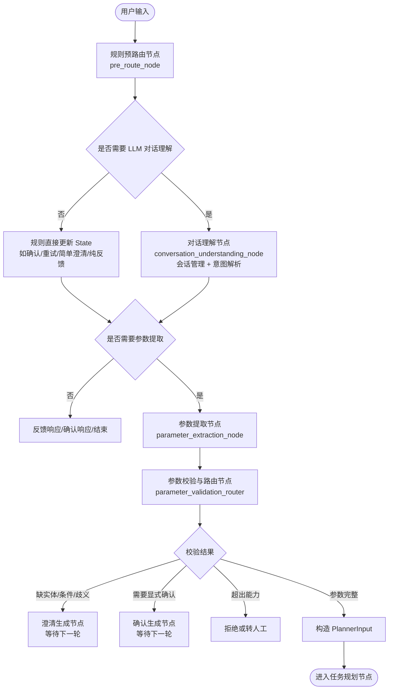

说明：

1. `规则预路由节点` 不调用 LLM，负责识别高置信、低语义复杂度的输入。典型包括“确认”“继续”“重试”“谢谢”“90%”“设备A”等。
2. `对话理解节点` 是唯一承接原“会话管理 + 意图解析”的 LLM 节点。它必须结构化输出 `session_event`、`intent_category`、`parsed_intents`、`context_action` 和 `extraction_targets`。
3. `参数提取节点` 可以是 LLM，也可以是“LLM + 规则/实体库”的组合。它关注槽位，不负责判断对话关系。
4. `参数校验与路由节点` 建议规则化实现。它根据 `missing_entities`、`missing_filters`、`ambiguities`、`capability_status` 决定是否澄清、确认、拒绝或进入任务规划。
5. 到 `PlannerInput` 为止，任务规划节点还未开始。本文只定义任务规划前的输入边界。

---

## 5. 通用节点 State 输入输出

### 5.1 规则预路由节点

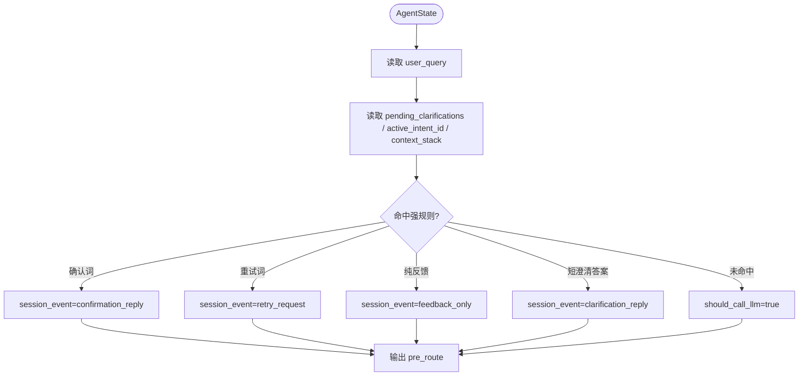

说明：

规则预路由的目标不是替代 LLM，而是减少没有必要的 LLM 调用。它只在置信度高时直接给出 `detected_event`。如果输入可能同时是澄清回复和新问题，例如“设备A，另外查设备B丢包”，必须设置 `should_call_llm=true`，交给对话理解节点拆分复合意图。

输入 State：

| 字段 | 用途 |
|---|---|
| `user_query` | 当前输入 |
| `pending_clarifications` | 判断短文本是否是澄清答案 |
| `active_intent_id` | 定位澄清、确认或重试目标 |
| `context_stack` | 判断“继续刚才的”是否可恢复 |
| `last_completed_intent_id` | 判断省略追问和重试 |

输出 State：

| 字段 | 写入内容 |
|---|---|
| `pre_route.should_call_llm` | 是否需要进入对话理解 LLM |
| `pre_route.detected_event` | 强规则识别到的事件 |
| `pre_route.target_intent_id` | 规则定位到的目标意图 |
| `next_stage` | `conversation_understanding`、`parameter_extraction`、`feedback_response` 等 |

### 5.2 对话理解节点

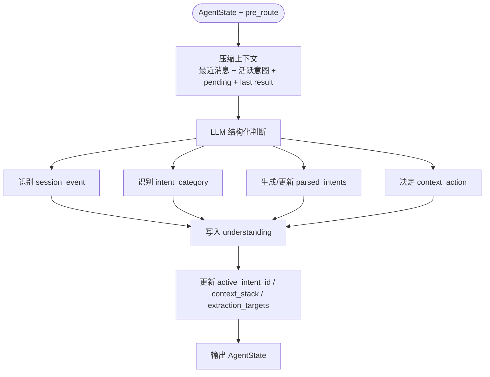

说明：

对话理解节点合并了原来的会话管理和意图解析。它只做“理解”，不做精细参数标准化。比如它可以识别“设备A的 CPU”涉及 `metric_query`，也可以给出粗槽位 `metric_text=CPU`，但标准化成 `cpu_usage`、解析设备 ID、判定缺失槽位，应交给参数提取节点。

输入 State：

| 字段 | 用途 |
|---|---|
| `user_query` | 当前用户输入 |
| `messages` | 近几轮上下文 |
| `pre_route` | 规则预判断结果 |
| `parsed_intents` | 历史意图、父意图、待澄清意图 |
| `active_intent_id` | 当前焦点 |
| `pending_clarifications` | 判断是否是澄清回复或复合输入 |
| `context_stack` | 话题切换和恢复 |
| `final_response` / `analysis_report` | 追问和原因分析的依据 |
| `user_profile` | 识别阈值定制类输入 |

输出 State：

| 字段 | 写入内容 |
|---|---|
| `understanding.session_event` | 当前输入的会话事件 |
| `understanding.intent_category` | 八大意图之一 |
| `understanding.parsed_intents` | 新增或更新的意图 |
| `understanding.context_action` | 是否压栈、弹栈、替换 active intent |
| `parsed_intents` | 合并后的意图列表 |
| `active_intent_id` | 当前处理焦点 |
| `extraction_targets` | 下一步需要参数提取的意图 ID |
| `next_stage` | 通常为 `parameter_extraction` |

### 5.3 参数提取节点

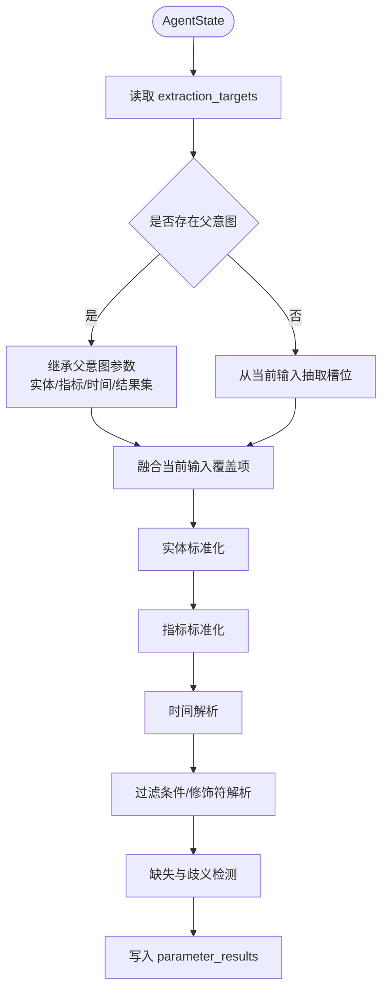

说明：

参数提取节点围绕 `extraction_targets` 工作。对追问、修正、恢复和领域下钻类输入，它必须先读取父意图或祖先意图，再用当前输入覆盖变化部分。例如“内存呢？”继承设备和时间，只覆盖指标；“看最近24小时趋势”继承设备和指标，只覆盖时间和展示修饰符。

输入 State：

| 字段 | 用途 |
|---|---|
| `extraction_targets` | 本轮要补槽的意图 ID |
| `parsed_intents` | 读取意图类型、父意图和上下文关系 |
| `parameter_results` | 读取父意图参数 |
| `pending_clarifications` | 澄清回复时只补缺失字段 |
| `user_profile` | 应用用户自定义阈值 |
| `domain_memory` | 读取实体别名、指标别名、结果集 |

输出 State：

| 字段 | 写入内容 |
|---|---|
| `parameter_results[intent_id]` | 标准化参数 |
| `parsed_intents[].stage` | `ready_for_planning`、`waiting_clarification`、`waiting_confirmation` 或 `failed` |
| `pending_clarifications` | 缺失或歧义时写入 |
| `planner_input` | 参数完整时准备规划输入 |
| `next_stage` | `parameter_validation_router` |

### 5.4 参数校验与路由节点

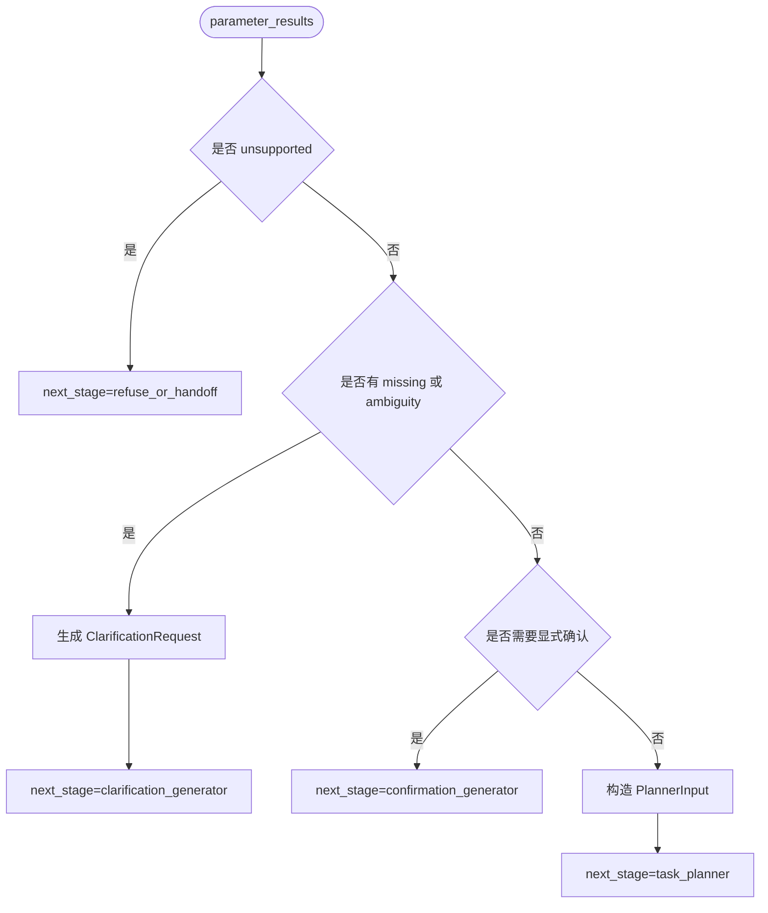

说明：

参数校验与路由节点应尽量规则化，避免再引入一次 LLM。它只读取结构化结果，不重新理解自然语言。所有“是否能进入任务规划”的判断都在这里收口，确保任务规划只接收完整、可执行、已确认的 `PlannerInput`。

输入 State：

| 字段 | 用途 |
|---|---|
| `parameter_results` | 检查缺失、歧义、确认要求 |
| `parsed_intents` | 检查能力边界和 stage |
| `pending_clarifications` | 合并或清理待澄清项 |
| `retry_counts` | 系统恢复或重试控制 |

输出 State：

| 字段 | 写入内容 |
|---|---|
| `pending_clarifications` | 需要追问时写入 |
| `dialogue_phase` | `clarifying`、`confirming`、`ready_for_planning` |
| `planner_input` | 参数完整时构造 |
| `planning_required` | 是否进入任务规划 |
| `planning_mode` | `template` 或 `llm` |
| `next_stage` | 下一跳节点 |

---

## 6. 八大意图的节点流程与 State

### 6.1 I1 澄清意图

覆盖场景：缺少必要实体、实体指代歧义、指标名称模糊、条件不充分、操作超出范围。

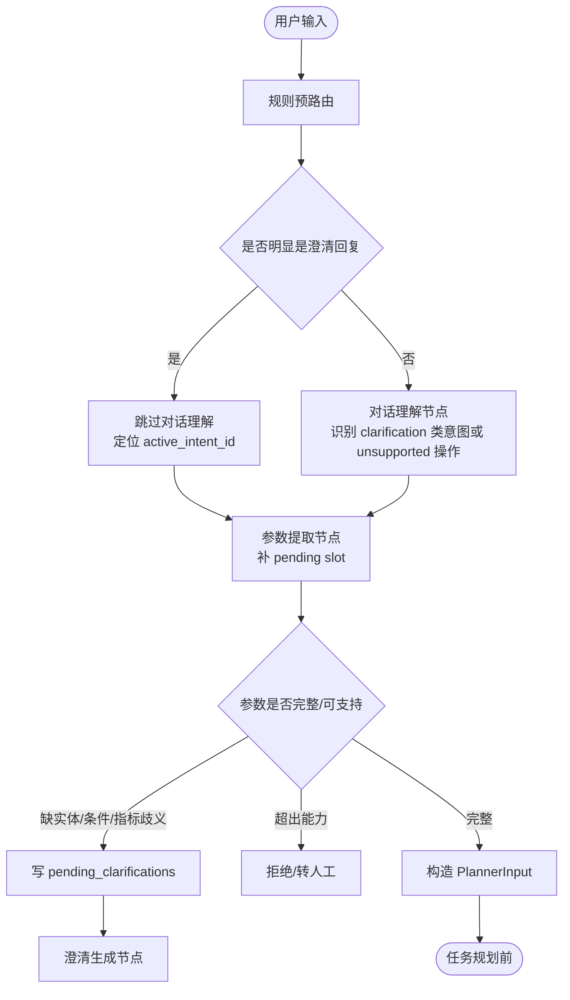

说明：

澄清意图的重点是把“缺什么”结构化保存，而不是立即反复调用 LLM。首次用户输入可能产生业务意图，例如 `metric_query`，参数提取后发现缺设备、阈值或指标定义。系统将缺失项写入 `pending_clarifications`，下一轮用户如果输入很短，规则预路由可直接判定为 `clarification_reply`，跳过对话理解 LLM，只进入参数提取补槽。

输入 State：

| 节点 | 关键输入 |
|---|---|
| 规则预路由 | `user_query`、`pending_clarifications`、`active_intent_id` |
| 对话理解 | `user_query`、历史消息、当前 pending、能力边界说明 |
| 参数提取 | `extraction_targets`、`pending_clarifications`、实体库、指标字典 |
| 参数校验路由 | `parameter_results`、`capability_status`、`missing_*`、`ambiguities` |

输出 State：

| 场景 | 核心输出 |
|---|---|
| 缺少必要实体 | `missing_entities=["device"]`，`pending_clarifications[intent_id].question="请问要查哪台设备？"` |
| 实体指代歧义 | `ambiguities[field=device].candidates=[...]`，进入澄清 |
| 指标名称模糊 | `missing_filters=["metric_definition"]` 或 `ambiguities[field=metric]` |
| 条件不充分 | `missing_filters=["threshold"]`，如 CPU 高缺阈值 |
| 操作超出范围 | `capability_status="unsupported"`，`next_stage="refuse_or_handoff"` |

State 示例：

```json
{
  "user_query": "找一下 CPU 高的设备",
  "understanding": {
    "session_event": "new_query",
    "intent_category": "clarification",
    "parsed_intents": [
      {
        "id": "intent_0",
        "type": "filtered_metric_query",
        "relation_to_context": "new",
        "stage": "parameter_extraction"
      }
    ],
    "extraction_targets": ["intent_0"]
  },
  "parameter_results": {
    "intent_0": {
      "metrics": ["cpu_usage"],
      "target_entities": [{"type": "device_group", "name": "all_devices"}],
      "time_range": {"value": "last_1h", "source": "default"},
      "missing_filters": ["cpu_threshold"],
      "validation_status": "needs_clarification"
    }
  },
  "pending_clarifications": {
    "intent_0": {
      "intent_id": "intent_0",
      "missing_slots": ["cpu_threshold"],
      "question": "CPU 高具体指超过多少百分比？",
      "options": []
    }
  },
  "dialogue_phase": "clarifying",
  "next_stage": "clarification_generator"
}
```

### 6.2 I2 追问与上下文继承意图

覆盖场景：指标细化、时间窗口调整、增加实体范围、对比追加、原因追问、操作建议、实体省略。

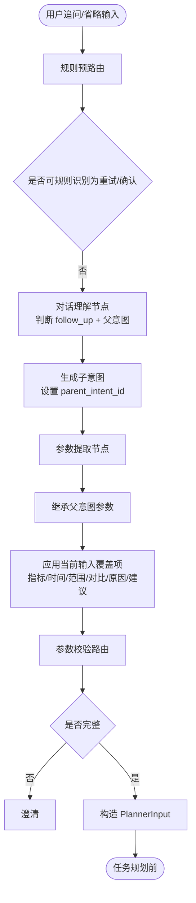

说明：

追问与上下文继承意图必须生成子意图，而不是直接覆盖父意图。这样“设备A CPU”之后的“内存呢？”可以成为 `intent_2`，继承设备和时间，仅替换指标为 `memory_usage`。对比、原因追问和操作建议也都通过 `parent_intent_id` 继承异常窗口、实体和上一轮结果摘要。

输入 State：

| 节点 | 关键输入 |
|---|---|
| 对话理解 | `last_completed_intent_id`、`final_response`、`analysis_report`、`parsed_intents` |
| 参数提取 | 父意图 `parameter_results[parent_id]`、当前输入文本 |
| 参数校验路由 | 继承后的完整参数、当前覆盖项 |

输出 State：

| 子场景 | 核心输出 |
|---|---|
| 指标细化 | `type="metric_drilldown"`，`modifiers.dimension="process/slot/interface"` |
| 时间窗口调整 | 覆盖 `time_range`，来源为 `current_query` |
| 增加实体范围 | `filters.scope` 或 `entity_set_refs` 更新 |
| 对比追加 | `compare_windows` 写入当前窗口和历史窗口 |
| 原因追问 | `type="root_cause_evidence_query"`，指标扩展到告警/日志 |
| 操作建议 | `type="operation_advice"`，`planner_hint.mode="diagnostic_steps"` |
| 实体省略 | `target_entities` 从父意图继承 |

State 示例：

```json
{
  "user_query": "内存呢？",
  "last_completed_intent_id": "intent_1",
  "parameter_results": {
    "intent_1": {
      "target_entities": [{"type": "device", "id": "dev_a", "name": "设备A"}],
      "metrics": ["cpu_usage"],
      "time_range": {"value": "last_1h"}
    },
    "intent_2": {
      "target_entities": [{"type": "device", "id": "dev_a", "source": "parent_intent"}],
      "metrics": ["memory_usage"],
      "time_range": {"value": "last_1h", "source": "parent_intent"},
      "inherited_from": {
        "target_entities": "intent_1",
        "time_range": "intent_1"
      },
      "validation_status": "valid"
    }
  },
  "understanding": {
    "session_event": "follow_up",
    "intent_category": "follow_up_context_inheritance",
    "parsed_intents": [
      {
        "id": "intent_2",
        "parent_intent_id": "intent_1",
        "type": "metric_query",
        "relation_to_context": "follow_up"
      }
    ],
    "extraction_targets": ["intent_2"]
  },
  "dialogue_phase": "ready_for_planning",
  "next_stage": "task_planner"
}
```

### 6.3 I3 上下文切换意图

覆盖场景：话题重置、回溯历史意图、多话题交替。

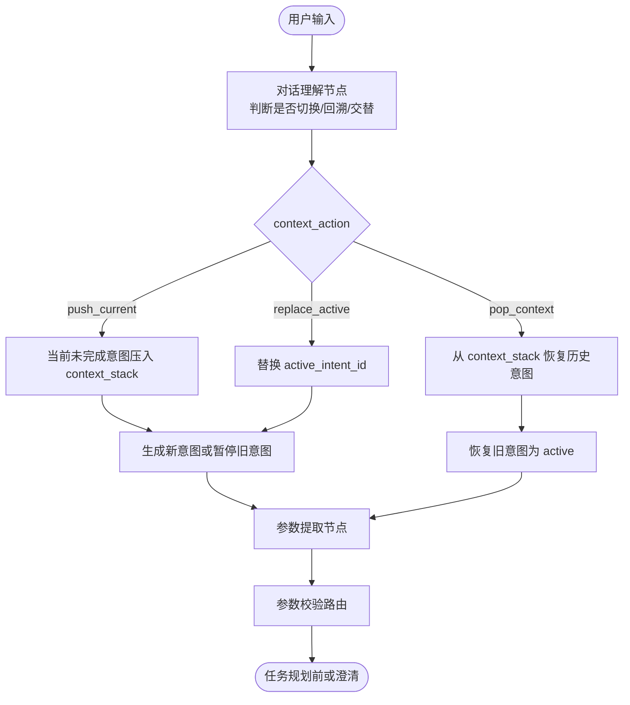

说明：

上下文切换的关键是不要丢失未完成任务。用户在澄清过程中突然问“查设备B内存”，系统应把原意图压入 `context_stack`，新建 `intent` 处理设备B。用户说“刚才那个继续”时，再从 `context_stack` 恢复旧意图。

输入 State：

| 节点 | 关键输入 |
|---|---|
| 对话理解 | `active_intent_id`、`pending_clarifications`、`context_stack`、历史摘要 |
| 参数提取 | 被恢复或新建的意图 |
| 参数校验路由 | 当前 active 意图参数 |

输出 State：

| 子场景 | 核心输出 |
|---|---|
| 话题重置 | 旧意图 `stage="suspended"`，`context_stack` 压入旧 frame |
| 回溯历史意图 | `context_stack` 弹出，恢复 `active_intent_id` |
| 多话题交替 | 多个意图并存，靠 `active_intent_id` 和 `context_stack` 定位 |

State 示例：

```json
{
  "user_query": "先不查这个了，查设备B的内存",
  "before": {
    "dialogue_phase": "clarifying",
    "active_intent_id": "intent_3",
    "pending_clarifications": {
      "intent_3": {"missing_slots": ["device"]}
    }
  },
  "understanding": {
    "session_event": "topic_switch",
    "intent_category": "context_switch",
    "context_action": "push_current",
    "parsed_intents": [
      {
        "id": "intent_4",
        "type": "metric_query",
        "relation_to_context": "topic_switch"
      }
    ],
    "extraction_targets": ["intent_4"]
  },
  "context_stack": [
    {
      "intent_id": "intent_3",
      "summary": "正在澄清 CPU 查询的设备",
      "phase_when_suspended": "clarifying"
    }
  ],
  "parameter_results": {
    "intent_4": {
      "target_entities": [{"type": "device", "id": "dev_b"}],
      "metrics": ["memory_usage"],
      "time_range": {"value": "last_1h", "source": "default"},
      "validation_status": "valid"
    }
  },
  "active_intent_id": "intent_4",
  "next_stage": "task_planner"
}
```

### 6.4 I4 确认与修正意图

覆盖场景：显式确认、隐式确认、用户主动修正。

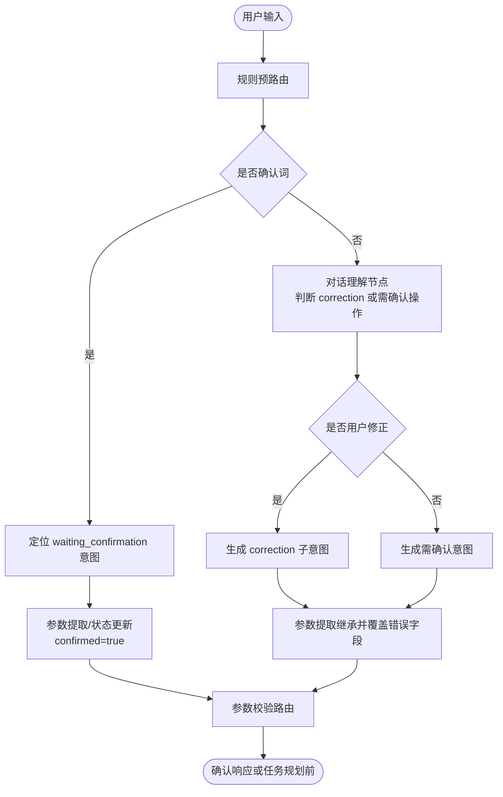

说明：

显式确认适合规则预路由直接处理，例如“确认备份”。用户主动修正需要对话理解节点识别被修正的字段，例如“不是设备A，是设备B”要生成一个 `correction` 子意图，继承父意图的指标和时间，只覆盖实体。

输入 State：

| 节点 | 关键输入 |
|---|---|
| 规则预路由 | `pending_clarifications` 中是否有 `explicit_confirmation` |
| 对话理解 | 上一轮结果、隐式确认文本、用户纠正句 |
| 参数提取 | 父意图参数、修正字段 |
| 参数校验路由 | 是否仍需确认、是否完整 |

输出 State：

| 子场景 | 核心输出 |
|---|---|
| 显式确认 | `modifiers.confirmed=true`，进入规划 |
| 隐式确认 | 回复中带理解结果，不改变流程；等待用户可能修正 |
| 用户主动修正 | 新建 `relation_to_context="correction"` 子意图 |

State 示例：

```json
{
  "user_query": "不是设备A，是设备B",
  "understanding": {
    "session_event": "correction",
    "intent_category": "confirmation_correction",
    "active_intent_id": "intent_5",
    "parsed_intents": [
      {
        "id": "intent_6",
        "parent_intent_id": "intent_5",
        "type": "metric_query",
        "relation_to_context": "correction"
      }
    ],
    "extraction_targets": ["intent_6"]
  },
  "parameter_results": {
    "intent_6": {
      "target_entities": [{"type": "device", "id": "dev_b", "source": "correction"}],
      "metrics": ["cpu_usage"],
      "time_range": {"value": "last_1h", "source": "parent_intent"},
      "inherited_from": {
        "metrics": "intent_5",
        "time_range": "intent_5"
      },
      "validation_status": "valid"
    }
  },
  "next_stage": "task_planner"
}
```

### 6.5 I5 反馈与重试意图

覆盖场景：正面/负面反馈、要求重试。

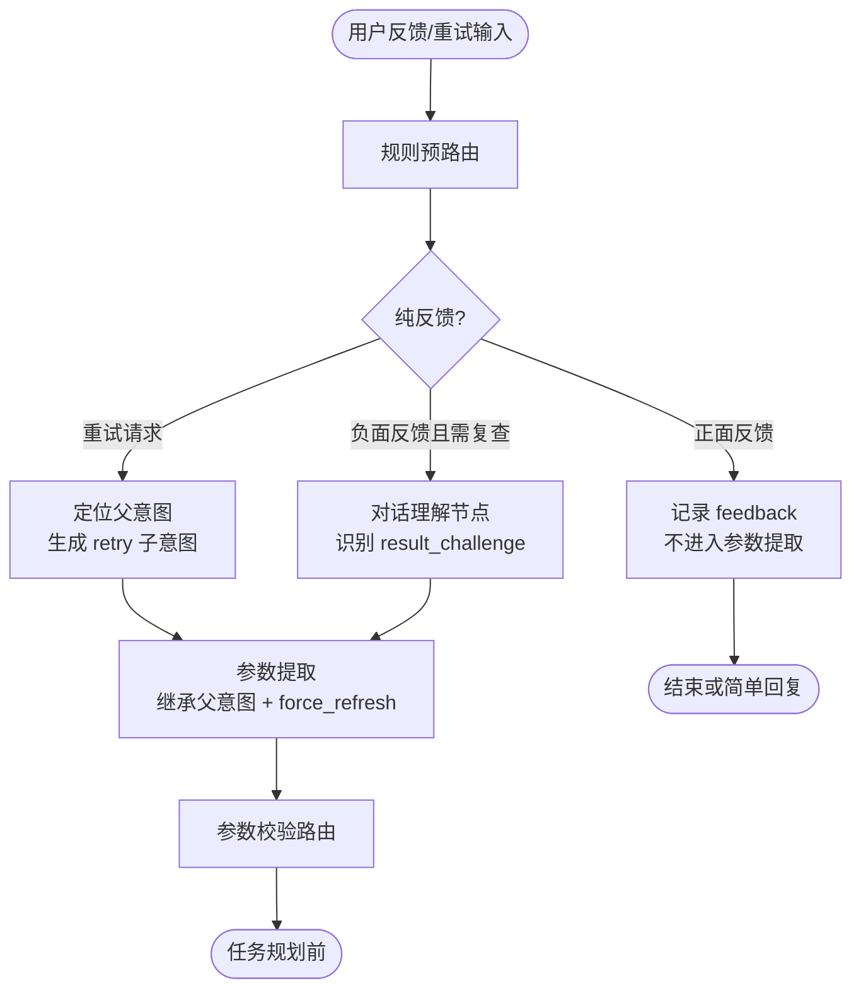

说明：

正面反馈通常不需要业务意图，也不需要参数提取。负面反馈要区分“纯评价”和“要求复查”。“丢包率数据错了”应生成 `result_challenge` 或 `retry` 子意图，继承父意图参数并加上 `force_refresh=true` 或 `validation_required=true`。

输入 State：

| 节点 | 关键输入 |
|---|---|
| 规则预路由 | 反馈词、重试词、上一轮意图 |
| 对话理解 | 负面反馈是否指向具体结果 |
| 参数提取 | 父意图参数、缓存策略 |
| 参数校验路由 | 是否可重试、重试次数 |

输出 State：

| 子场景 | 核心输出 |
|---|---|
| 正面反馈 | `user_profile.feedback_history` 增加记录 |
| 负面反馈 | `type="result_challenge"`，`validation_required=true` |
| 要求重试 | `modifiers.force_refresh=true`，`retry_counts` 更新 |

State 示例：

```json
{
  "user_query": "再查一次 CPU，可能已经降下来了",
  "pre_route": {
    "should_call_llm": false,
    "detected_event": "retry_request",
    "target_intent_id": "intent_7",
    "next_stage": "parameter_extraction"
  },
  "parsed_intents": [
    {
      "id": "intent_8",
      "parent_intent_id": "intent_7",
      "category": "feedback_retry",
      "type": "metric_query",
      "relation_to_context": "retry",
      "stage": "parameter_extraction"
    }
  ],
  "parameter_results": {
    "intent_8": {
      "target_entities": [{"id": "dev_a", "source": "parent_intent"}],
      "metrics": ["cpu_usage"],
      "time_range": {"value": "latest", "source": "retry_request"},
      "modifiers": {"force_refresh": true, "ignore_cache": true},
      "validation_status": "valid"
    }
  },
  "retry_counts": {"intent_7": 1},
  "next_stage": "task_planner"
}
```

### 6.6 I6 中断与恢复意图

覆盖场景：用户中断、系统中断。

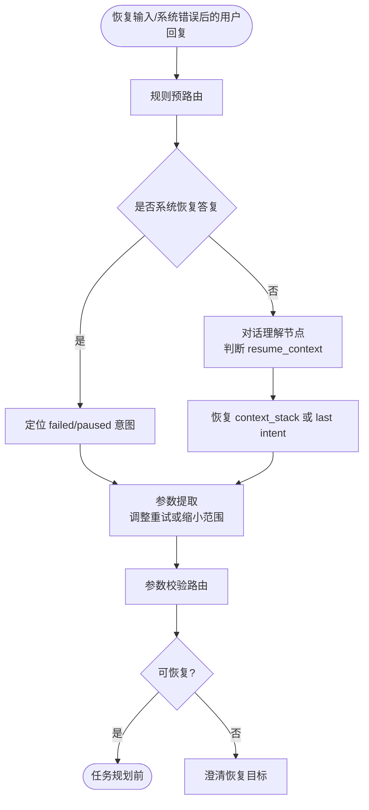

说明：

中断恢复需要区分用户离开后的自然恢复和系统错误后的恢复。系统中断通常已有错误状态和恢复选项，例如“重试或缩小时间范围”。用户回复“缩小到最近24小时”时不需要重新做完整意图解析，可以直接定位 paused 意图并修改 `time_range`。

输入 State：

| 节点 | 关键输入 |
|---|---|
| 规则预路由 | `dialogue_phase="paused"`、`errors`、恢复选项 |
| 对话理解 | “刚才那台设备”“继续之前的”这类引用 |
| 参数提取 | paused 意图参数、用户恢复条件 |
| 参数校验路由 | 重试次数、缩小范围后的完整性 |

输出 State：

| 子场景 | 核心输出 |
|---|---|
| 用户中断 | `session_event="resume_context"`，恢复历史意图 |
| 系统中断 | `session_event="system_recovery"`，更新失败任务参数 |

State 示例：

```json
{
  "user_query": "缩小到最近24小时再查",
  "before": {
    "dialogue_phase": "paused",
    "active_intent_id": "intent_9",
    "errors": [{"code": "log_query_timeout", "task_id": "task_log_query"}],
    "pending_clarifications": {
      "intent_9": {
        "missing_slots": ["retry_or_reduce_time_range"],
        "question": "是否重试或缩小时间范围？"
      }
    }
  },
  "pre_route": {
    "should_call_llm": false,
    "detected_event": "system_recovery",
    "target_intent_id": "intent_9"
  },
  "parameter_results": {
    "intent_9": {
      "time_range": {"value": "last_24h", "source": "recovery_reply"},
      "modifiers": {"retry": true, "reduce_scope": true},
      "validation_status": "valid"
    }
  },
  "retry_counts": {"task_log_query": 2},
  "next_stage": "task_planner"
}
```

### 6.7 I7 复合意图交替

覆盖场景：澄清回复 + 新意图。

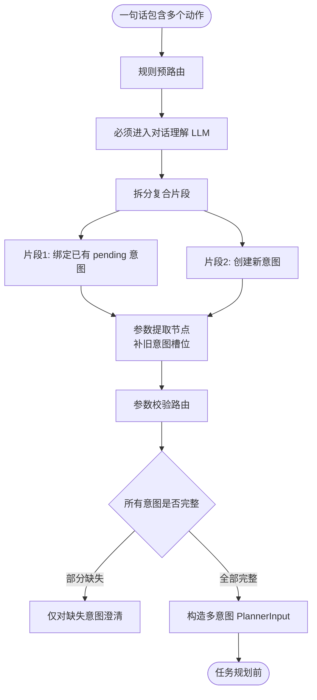

说明：

复合意图不能靠规则简单处理，因为一句话中可能同时包含澄清答案、新查询、修正和追问。对话理解节点必须输出 `context_action="split_compound"`，并标明每个片段绑定哪个意图。参数提取节点逐个处理 `extraction_targets`，不同意图的缺失项互不干扰。

输入 State：

| 节点 | 关键输入 |
|---|---|
| 对话理解 | 当前 pending、用户完整输入、历史意图 |
| 参数提取 | 复合拆分结果、每个片段对应的 intent_id |
| 参数校验路由 | 多个 `parameter_results` 的独立校验结果 |

输出 State：

| 子场景 | 核心输出 |
|---|---|
| 澄清回复 + 新意图 | 旧意图补槽完成，新意图新增并提取参数 |

State 示例：

```json
{
  "user_query": "设备A是10.1.1.1，另外看下设备B的丢包",
  "understanding": {
    "session_event": "compound",
    "intent_category": "compound_intent",
    "context_action": "split_compound",
    "parsed_intents": [
      {
        "id": "intent_10",
        "relation_to_context": "clarification_answer",
        "type": "metric_query"
      },
      {
        "id": "intent_11",
        "relation_to_context": "compound_part",
        "type": "metric_query"
      }
    ],
    "extraction_targets": ["intent_10", "intent_11"]
  },
  "parameter_results": {
    "intent_10": {
      "target_entities": [{"type": "device", "name": "设备A", "mgmt_ip": "10.1.1.1"}],
      "metrics": ["cpu_usage"],
      "validation_status": "valid"
    },
    "intent_11": {
      "target_entities": [{"type": "device", "id": "dev_b"}],
      "metrics": ["packet_loss"],
      "time_range": {"value": "last_1h", "source": "default"},
      "validation_status": "valid"
    }
  },
  "planner_input": {
    "ready_intent_ids": ["intent_10", "intent_11"],
    "planning_mode": "template",
    "reason": "两个简单指标查询均已完成参数提取"
  },
  "next_stage": "task_planner"
}
```

### 6.8 I8 领域深化与策略意图

覆盖场景：异常分析深化、多数据源关联、基线/阈值定制、批量与迭代过滤。

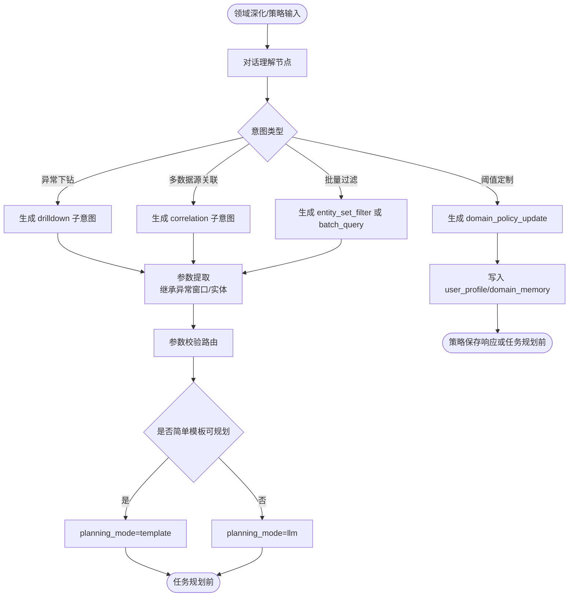

说明：

领域深化与策略意图是最容易消耗 LLM 的部分，但仍可以分层优化。异常下钻、多数据源关联可能需要 LLM 规划；阈值定制只需要写入 `user_profile`；批量与迭代过滤应尽量使用结构化 `entity_set_refs`，避免把大量设备列表塞进 prompt。

输入 State：

| 节点 | 关键输入 |
|---|---|
| 对话理解 | 上一轮异常摘要、结果集、用户画像 |
| 参数提取 | 父意图异常窗口、实体、结果集 ID、用户策略 |
| 参数校验路由 | 是否需要 LLM 规划、是否能模板规划 |

输出 State：

| 子场景 | 核心输出 |
|---|---|
| 异常分析深化 | `type="metric_drilldown/root_cause_analysis"`，继承异常窗口 |
| 多数据源关联 | `metrics=["alarm_event","system_log"]`，`filters.correlate_with` |
| 基线/阈值定制 | `user_profile.thresholds` 更新，不一定进入规划 |
| 批量与迭代过滤 | `entity_set_refs` 引用上一轮结果集 |

State 示例：

```json
{
  "user_query": "过滤掉核心交换机，查这些设备的内存",
  "before": {
    "last_completed_intent_id": "intent_12",
    "domain_memory": {
      "entity_sets": {
        "set_cpu_top10": {
          "source_intent_id": "intent_12",
          "description": "所有设备 CPU Top10"
        }
      }
    }
  },
  "understanding": {
    "session_event": "follow_up",
    "intent_category": "domain_deepening_policy",
    "parsed_intents": [
      {
        "id": "intent_13",
        "parent_intent_id": "intent_12",
        "type": "batch_metric_query",
        "relation_to_context": "follow_up"
      }
    ],
    "extraction_targets": ["intent_13"]
  },
  "parameter_results": {
    "intent_13": {
      "entity_set_refs": [
        {
          "id": "set_cpu_top10",
          "source": "parent_result",
          "filters": {"exclude_role": "core_switch"}
        }
      ],
      "metrics": ["memory_usage"],
      "time_range": {"value": "latest", "source": "default"},
      "modifiers": {"batch_query": true},
      "validation_status": "valid",
      "planner_hint": {"planning_mode": "template"}
    }
  },
  "planner_input": {
    "ready_intent_ids": ["intent_13"],
    "planning_mode": "template",
    "reason": "批量指标查询可由模板规划"
  },
  "next_stage": "task_planner"
}
```

---

## 7. 任务规划前的 PlannerInput 边界

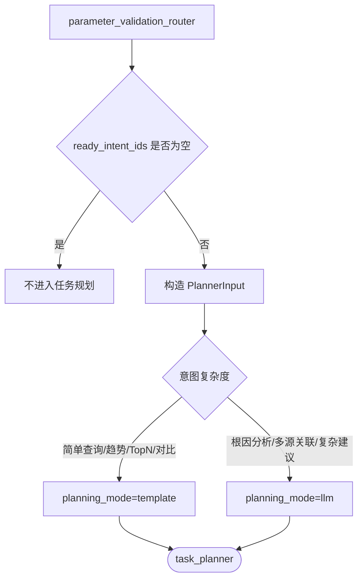

说明：

任务规划前必须保证 `PlannerInput` 中的所有意图参数完整、实体已标准化、歧义已消除、必要确认已完成。`planning_mode` 用于避免任务规划节点每次都调用 LLM：简单监控查询走模板，复杂诊断分析再走 LLM。

PlannerInput 示例：

```json
{
  "ready_intent_ids": ["intent_13"],
  "parameter_results": {
    "intent_13": {
      "target_entities": [],
      "entity_set_refs": [{"id": "set_cpu_top10", "filters": {"exclude_role": "core_switch"}}],
      "metrics": ["memory_usage"],
      "time_range": {"value": "latest"},
      "validation_status": "valid"
    }
  },
  "planning_mode": "template",
  "reason": "批量指标查询，无需 LLM 规划",
  "execution_constraints": {
    "allow_cache": false,
    "max_parallel_tasks": 5
  }
}
```

---

## 8. 推荐 LangGraph 结构

```python
builder.add_node("pre_route", pre_route_node)
builder.add_node("conversation_understanding", conversation_understanding_node)
builder.add_node("parameter_extraction", parameter_extraction_node)
builder.add_node("parameter_validation_router", parameter_validation_router_node)
builder.add_node("clarification_generator", clarification_generator_node)
builder.add_node("confirmation_generator", confirmation_generator_node)
builder.add_node("refuse_or_handoff", refuse_or_handoff_node)
builder.add_node("feedback_response", feedback_response_node)
builder.add_node("task_planner", task_planner_node)
```

```python
builder.set_entry_point("pre_route")

builder.add_conditional_edges(
    "pre_route",
    route_after_pre_route,
    {
        "conversation_understanding": "conversation_understanding",
        "parameter_extraction": "parameter_extraction",
        "feedback_response": "feedback_response",
    },
)

builder.add_edge("conversation_understanding", "parameter_extraction")
builder.add_edge("parameter_extraction", "parameter_validation_router")

builder.add_conditional_edges(
    "parameter_validation_router",
    route_after_parameter_validation,
    {
        "clarification_generator": "clarification_generator",
        "confirmation_generator": "confirmation_generator",
        "refuse_or_handoff": "refuse_or_handoff",
        "task_planner": "task_planner",
    },
)
```

---

## 9. 性能优化建议

| 优化点 | 建议 |
|---|---|
| 会话管理 + 意图解析 | 合并为 `conversation_understanding_node`，一次 LLM 输出结构化结果 |
| 短澄清回复 | 规则预路由直接进入参数提取 |
| 确认/重试/纯反馈 | 规则处理，不调用对话理解 LLM |
| 参数提取 | 对简单模板意图可用规则 + 实体库；复杂输入再调用 LLM |
| 任务规划 | 简单查询走模板，根因分析和多源关联才走 LLM |
| 上下文传入 | 只传活跃意图、父意图、pending、上一轮摘要，不传完整历史 |
| 结果集继承 | 用 `entity_set_refs` 引用结构化结果集，避免大文本上下文 |

最终推荐调用链：

```text
大多数简单确认/澄清/反馈：
规则预路由 -> 参数提取/状态更新 -> 响应

普通业务查询：
规则预路由 -> 对话理解 LLM -> 参数提取 -> 模板任务规划

复杂诊断分析：
规则预路由 -> 对话理解 LLM -> 参数提取 -> LLM 任务规划
```
