# 1 LangGraph 当前 State 多轮对话与意图澄清设计

> 本文基于你当前已有的 `AgentState`、`IntentResult`、`ParameterResult`、`ParsedIntent`、`DataTask` 等结构做兼容式扩展，目标是在不推翻现有“意图解析 -> 参数解析 -> 任务规划 -> 执行 -> 聚合 -> 分析 -> 可视化 -> 最终输出”链路的前提下，补齐多轮对话、意图澄清、上下文继承和 9 个主类别场景的状态表达。

---

## 1.1 当前 State 的保留与扩展原则

### 1.1.1 保留现有主链路

你当前已有链路是合理的：

```text
意图解析 -> 参数解析 -> 任务规划 -> DAG 执行 -> 聚合 -> 分析 -> 可视化 -> 最终响应
```

多轮对话不应该破坏这条主链路，而是应该在前半段增强：

```text
意图识别 -> 参数提取 -> 意图澄清 -> 任务规划
```

其中：

| 节点 | 对应当前结构 |
|---|---|
| 意图识别节点 | 写入 `IntentResult`、`ParsedIntent`、`dialogue_phase`、`active_intent_id` |
| 参数提取节点 | 写入 `ParameterResult`，并更新缺失项、歧义项、默认值、继承来源 |
| 意图澄清节点 | 写入 `pending_clarifications`、`clarification_history`、`pending_confirmations` |

### 1.1.2 当前 State 的主要缺口

| 缺口 | 影响 |
|---|---|
| `ParsedIntent` 没有 `id` | 无法在多意图、澄清、追问、恢复时精准定位某个意图 |
| 缺少 `parent_intent_id` | 追问、省略、修正、重试无法继承父意图参数 |
| 缺少 `dialogue_phase` | 路由节点无法判断当前是澄清、执行、恢复还是空闲 |
| 缺少 `active_intent_id` | 澄清回复无法知道补哪个意图 |
| 缺少 `pending_clarifications` | 参数缺失后只能靠自然语言历史，状态不可控 |
| `ParameterResult` 只有 `missing_entities`，缺少 `missing_filters` 和 `ambiguities` | 无法表达阈值缺失、指标歧义、实体多候选 |
| `default_applied` 是 bool | 无法知道哪个字段应用了默认值 |
| 缺少上下文栈 | 话题切换和回溯历史意图不好处理 |
| 缺少用户画像和领域记忆 | 基线/阈值定制、实体别名、结果集引用不好落地 |

---

## 1.2 推荐的兼容版数据结构

下面的代码保持你当前的 dataclass 风格，只做必要扩展。字段注释都写在变量后面，便于直接复制到代码中继续演进。

### 1.2.1 枚举常量建议

```python
from typing import Literal

DialoguePhase = Literal[
    "idle",                    # 空闲状态，当前没有待澄清、待确认或待恢复事项
    "intent_recognition",      # 正在进行意图识别
    "parameter_extraction",    # 正在进行参数提取、继承、标准化或补槽
    "clarifying",              # 正在等待用户回答澄清问题
    "confirming",              # 正在等待用户显式确认
    "ready_for_planning",      # 参数完整，准备进入任务规划
    "planning",                # 正在进行任务规划
    "executing",               # 正在执行 DAG 子任务
    "aggregating",             # 正在聚合 task_results
    "analyzing",               # 正在生成分析报告
    "visualizing",             # 正在生成图表配置
    "finished",                # 已完成最终响应
    "paused",                  # 因用户中断、系统错误或外部条件暂停
    "error"                    # 流程进入错误状态
]

MainScenario = Literal[
    "clarification",             # 澄清场景
    "follow_up",                 # 追问场景
    "context_switch",            # 上下文切换场景
    "confirmation_correction",   # 确认与修正场景
    "feedback_evaluation",       # 反馈与评价场景
    "interruption_recovery",     # 中断与恢复场景
    "compound_intent",           # 复合意图交替场景
    "context_inheritance",       # 上下文继承/省略场景
    "domain_specific"            # 领域特殊场景
]

IntentRelation = Literal[
    "new",                    # 全新意图
    "follow_up",              # 追问，依赖父意图
    "clarification_answer",   # 用户正在回答澄清问题
    "context_switch",         # 话题切换
    "history_resume",         # 回溯历史意图
    "correction",             # 修正已有意图
    "confirmation",           # 确认或取消待确认意图
    "feedback",               # 反馈评价
    "retry",                  # 重试已有意图
    "compound_part",          # 复合输入拆分的一部分
    "policy_update"           # 更新阈值、基线或用户偏好
]

IntentStage = Literal[
    "created",                 # 意图刚创建
    "parameter_extraction",    # 正在或等待参数提取
    "waiting_clarification",   # 等待用户澄清
    "waiting_confirmation",    # 等待用户确认
    "ready_for_planning",      # 参数完整，准备规划
    "completed",               # 意图完成
    "failed",                  # 意图失败
    "suspended"                # 意图被暂停
]

CapabilityStatus = Literal[
    "supported",                    # 系统支持
    "supported_with_confirmation",  # 支持但需要确认
    "unsupported",                  # 不支持
    "needs_handoff"                 # 需要转人工或外部系统
]
```

### 1.2.2 TimeRange

```python
@dataclass
class TimeRange:
    """时间范围定义，用于数据查询"""
    start: str                         # ISO 8601 起始时间，如 "2024-06-01T00:00:00Z"
    end: str                           # ISO 8601 结束时间，如 "2024-06-01T01:00:00Z"
    timezone: str = "Asia/Shanghai"    # 时区，默认按当前系统业务使用中国时区
    source: str = "user"               # 时间来源：user、default、parent_intent、clarification、system_recovery
    raw_expression: Optional[str] = None # 用户原始时间表达，如“今天上午10点到11点”
```

说明：保留你的 `start/end`，新增 `timezone/source/raw_expression`，解决默认时间、父意图继承、审计追踪问题。

### 1.2.3 IntentResult

```python
@dataclass
class IntentResult:
    """意图解析节点的最终输出，将被写入 ParsedIntent.intent"""
    intent_type: str                    # 业务意图分类，如 metric_query、compare_query、root_cause_analysis
    intent: str                         # 意图描述摘要，便于日志和 prompt 压缩
    intent_confidence: float            # 置信度 [0.0, 1.0]
    reasoning: str                      # LLM 给出的简短判断依据，不建议保存长推理
    next_stage: str                     # 下一阶段，通常为 parameter_extraction
    main_scenario: Optional[str] = None # 9 大主类别之一
    sub_scenario: Optional[str] = None  # 子类型，如 missing_required_entity、metric_drilldown
    relation: str = "new"              # 与上下文关系，如 new、follow_up、correction
    capability_status: str = "supported" # 能力支持状态
    target_intent_id: Optional[str] = None # 当前输入指向的已有意图，用于澄清、确认、修正、重试
    parent_intent_id: Optional[str] = None # 父意图 ID，用于追问、下钻、省略、重试
    errors: List[str] = field(default_factory=list) # 本节点产生的错误
```

说明：兼容你原有字段，新增多轮关键字段。`IntentResult` 仍然表达“识别到了什么”，但具体 ID、阶段和参数放在 `ParsedIntent` 和 `ParameterResult`。

### 1.2.4 ParameterResult

```python
@dataclass
class ParameterResult:
    """参数解析节点的输出，将被存入 ParsedIntent.params 或 AgentState.extracted_params"""
    target_entities: List[Dict[str, Any]] = field(default_factory=list)
    # 目标实体列表，如 [{"type": "device", "id": "dev_a", "name": "设备A", "source": "user"}]

    metrics: List[str] = field(default_factory=list)
    # 标准化指标名列表，如 ["cpu_usage", "packet_loss_rate"]

    time_range: Optional[TimeRange] = None
    # 最终时间范围；若用户未指定，可由默认值、父意图或澄清回复填充

    extra_context: Dict[str, Any] = field(default_factory=dict)
    # 附加上下文，如异常窗口、告警 ID、聚合方式、关联证据、结果集 ID

    raw_user_time_expression: Optional[str] = None
    # 用户原始时间表述，用于审计和二次解析

    missing_entities: List[str] = field(default_factory=list)
    # 缺失实体，如 ["device_name", "interface_name"]

    missing_filters: List[str] = field(default_factory=list)
    # 缺失过滤条件，如 ["cpu_threshold", "time_range", "log_level"]

    ambiguities: List[Dict[str, Any]] = field(default_factory=list)
    # 歧义项，如 [{"field": "device", "raw_text": "核心A", "candidates": [...]}]

    default_applied: Dict[str, bool] = field(default_factory=dict)
    # 哪些字段应用了默认值，如 {"time_range": true, "threshold": false}

    inherited_from: Dict[str, str] = field(default_factory=dict)
    # 参数继承来源，如 {"target_entities": "intent_1", "time_range": "intent_1"}

    compare_windows: List[TimeRange] = field(default_factory=list)
    # 对比查询的多个时间窗口，如当前窗口和上周同期

    entity_set_refs: List[str] = field(default_factory=list)
    # 结构化结果集引用，如 ["set_cpu_top10_without_core"]

    validation_status: str = "valid"
    # 参数校验状态：valid、needs_clarification、needs_confirmation、unsupported、invalid

    errors: List[str] = field(default_factory=list)
    # 本节点产生的非致命错误，如实体模糊匹配失败、时间解析回退

    next_stage: str = "diagnosis_planning"
    # 下一阶段；缺关键参数时设为 wait_user_input 或 intent_clarification
```

说明：主要变化是把 `default_applied: bool` 改为 `Dict[str, bool]`，并增加 `missing_filters`、`ambiguities`、`inherited_from`、`compare_windows`、`entity_set_refs` 和 `validation_status`。

### 1.2.5 ParsedIntent

```python
@dataclass
class ParsedIntent:
    """一个解析完成的意图，包含意图本身与提取的参数"""
    id: str                                      # 意图唯一 ID，如 intent_0
    intent: IntentResult                         # 意图识别结果
    params: Optional[ParameterResult] = None      # 参数提取结果，可能尚未完成
    stage: str = "parameter_extraction"          # 当前意图阶段
    parent_intent_id: Optional[str] = None        # 父意图 ID，用于追问、修正、重试、下钻
    root_intent_id: Optional[str] = None          # 根意图 ID，用于多级下钻追溯
    clarification_history: List[Dict[str, Any]] = field(default_factory=list)
    # 当前意图的澄清历史，如 [{"role": "assistant", "content": "请问哪台设备？"}, ...]
```

说明：最关键是新增 `id`。没有 `id`，多轮澄清、复合意图和上下文切换都会变得不可控。

### 1.2.6 ClarificationRequest

```python
@dataclass
class ClarificationRequest:
    """意图澄清节点生成的待澄清请求"""
    intent_id: str                              # 需要澄清的意图 ID
    missing_slots: List[str] = field(default_factory=list) # 缺失槽位
    ambiguity_slots: List[str] = field(default_factory=list) # 歧义槽位
    question: str = ""                          # 面向用户的澄清问题
    options: List[Dict[str, Any]] = field(default_factory=list) # 候选项，如多台设备
    expected_answer_type: str = ""              # 期望回答类型，如 device、threshold、confirmation
    created_turn_id: Optional[str] = None        # 创建澄清的轮次 ID
    retry_count: int = 0                         # 该澄清问题已追问次数
```

### 1.2.7 ContextFrame

```python
@dataclass
class ContextFrame:
    """上下文栈中的一帧，用于话题切换和回溯"""
    intent_id: str                              # 被暂停的意图 ID
    summary: str                                # 该意图摘要
    phase_when_suspended: str                   # 暂停时的对话阶段
    parameter_snapshot: Optional[ParameterResult] = None # 暂停时的参数快照
    pushed_turn_id: Optional[str] = None         # 压栈轮次
```

### 1.2.8 UserProfile 与 DomainMemory

```python
@dataclass
class UserProfile:
    """用户画像和长期偏好"""
    thresholds: Dict[str, Any] = field(default_factory=dict) # 用户自定义阈值，如 {"cpu_high": 85}
    default_time_range: Optional[str] = None                 # 用户默认时间范围，如 last_1h
    preferences: Dict[str, Any] = field(default_factory=dict) # 其他偏好，如默认图表类型
    feedback_history: List[Dict[str, Any]] = field(default_factory=list) # 用户反馈历史

@dataclass
class DomainMemory:
    """领域记忆，用于实体、指标和结果集复用"""
    entity_aliases: Dict[str, str] = field(default_factory=dict) # 实体别名到实体 ID 的映射
    metric_aliases: Dict[str, List[str]] = field(default_factory=dict) # 指标别名映射
    entity_sets: Dict[str, Any] = field(default_factory=dict) # 结果集缓存，如 CPU Top10
    baseline_rules: Dict[str, Any] = field(default_factory=dict) # 基线和阈值规则
```

### 1.2.9 DataTask 建议修正

```python
@dataclass
class DataTask:
    """规划Agent拆解出的单个数据获取子任务"""
    task_id: str                         # 任务唯一 ID
    source: str                          # 数据源，如 prometheus、log_db、alarm_api
    query_type: str                      # 查询类型，如 metric_query、log_query
    query_params: Dict[str, Any]         # 具体查询参数
    description: str                     # 任务描述
    intent_id: str                       # 关联意图 ID；建议替代原字段 intend_id
    params: Dict[str, Any]               # 规划阶段展开后的参数
    time_range: Dict[str, str]           # 查询时间范围，通常包含 start/end
    timeout: int = 10                    # 单任务超时时间，单位秒
    retry: int = 1                       # 单任务重试次数
```

说明：你当前字段是 `intend_id`，建议改为 `intent_id`。如果已有代码依赖 `intend_id`，可以短期同时保留两个字段，逐步迁移。

---

## 1.3 兼容版 AgentState

```python
class AgentState(TypedDict):
    # ---- 对话上下文 ----
    messages: Annotated[List[BaseMessage], add_messages]   # 完整对话历史，使用 LangGraph 内置追加规约器
    user_query: str                                        # 当前用户输入
    turn_id: str                                           # 当前轮次 ID，用于澄清历史和审计
    conversation_id: str                                   # 会话 ID，用于 checkpoint 和多轮记忆
    user_id: Optional[str]                                 # 用户 ID，用于读取用户画像和权限

    # ---- 多轮对话控制：新增 ----
    dialogue_phase: str                                    # 当前对话阶段，如 idle、clarifying、ready_for_planning
    active_intent_id: Optional[str]                        # 当前焦点意图 ID
    last_completed_intent_id: Optional[str]                 # 最近完成意图 ID，用于追问、省略、重试
    intent_counter: int                                    # 意图计数器，用于生成唯一 intent_id
    context_stack: List[ContextFrame]                      # 话题切换时保存被暂停的意图
    pending_clarifications: Dict[str, ClarificationRequest] # 待澄清请求，key 为 intent_id
    pending_confirmations: Dict[str, ClarificationRequest]  # 待确认请求，key 为 intent_id
    user_profile: UserProfile                              # 用户画像和偏好
    domain_memory: DomainMemory                            # 领域记忆，如实体别名、结果集、阈值

    # ---- 当前用户提问解析结果 ----
    parsed_intents: List[ParsedIntent]                     # 解析后的意图列表，每个元素包含意图与参数

    # ---- 参数提取兼容字段：可选新增 ----
    extraction_targets: List[str]                          # 本轮需要参数提取或补槽的意图 ID 列表
    extracted_params: Dict[str, ParameterResult]           # 参数结果索引，key 为 intent_id；也可继续写入 ParsedIntent.params

    # ---- 规划阶段产物 ----
    plan_tasks: List[DataTask]                             # 由规划 Agent 生成的子任务列表，需并行执行

    # ---- 并行数据获取的结果聚合 ----
    task_results: Annotated[Dict[str, Any], operator.ior]  # key=task_id，value=工具返回的数据或错误

    # ---- 聚合后的分析素材 ----
    aggregated_context: Optional[str]                      # 汇总 task_results 形成的文本摘要，供分析 Agent 使用
    raw_task_data: Optional[Dict[str, Any]]                # 原始结构化数据，供可视化 Agent 使用

    # ---- 分析结果 ----
    analysis_report: Optional[str]                         # 根因分析报告，Markdown 格式

    # ---- 可视化图表 ----
    visualizations: List[ChartConfig]                      # 图表配置列表

    # ---- 最终输出 ----
    final_response: Optional[str]                          # 最终返回给前端的完整答案

    # ---- 控制与监控字段 ----
    next_stage: str                                        # 流程阶段标识
    errors: Annotated[List[str], operator.add]             # 全局错误收集，使用列表追加规约器
    retry_counts: Dict[str, int]                           # 各 task_id 或 intent_id 的重试计数

    # ---- DAG dispatcher 字段 ----
    task_dag: Dict[str, Dict[str, Any]]                    # DAG 依赖结构
    current_task: Optional[str]                            # 当前正在执行的任务 ID
```

说明：

1. `parsed_intents` 继续作为主存储，`extracted_params` 是可选索引字段，方便按 `intent_id` 快速取参数。
2. `pending_clarifications` 是多轮澄清的关键字段，不能只放在 `messages` 中。
3. `context_stack` 用于话题切换和历史回溯。
4. `user_profile` 和 `domain_memory` 用于领域特殊场景，尤其是阈值定制和批量结果集过滤。

---

## 1.4 三节点整体流程

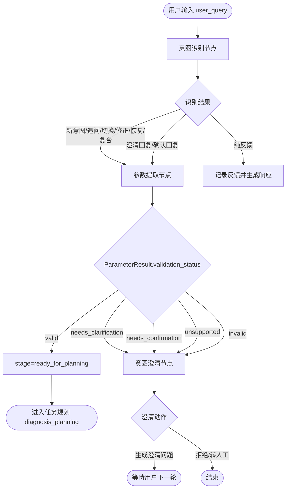

说明：

这个流程与当前 `next_stage` 设计兼容。参数完整时，`ParameterResult.next_stage` 仍可设为 `"diagnosis_planning"`；如果需要澄清，则设为 `"wait_user_input"` 或 `"intent_clarification"`。建议统一使用 `AgentState.next_stage` 做 LangGraph 路由，`ParameterResult.next_stage` 作为局部提示。

---

## 1.5 三节点职责与 State 输入输出

### 1.5.1 意图识别节点

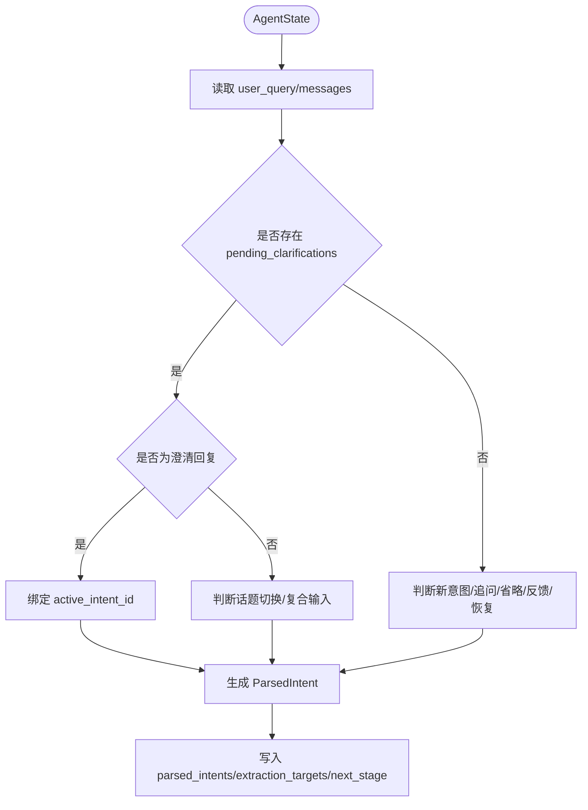

说明：

意图识别节点应该输出 `ParsedIntent`，并给每个意图分配 `id`。如果是追问、省略、修正、重试，需要设置 `parent_intent_id`。如果是澄清回复，不一定新建意图，也可以定位已有 `active_intent_id` 并把它加入 `extraction_targets`。

输入 State：

| 字段 | 作用 |
|---|---|
| `user_query` | 当前用户输入 |
| `messages` | 历史消息 |
| `pending_clarifications` | 判断澄清回复 |
| `pending_confirmations` | 判断确认回复 |
| `parsed_intents` | 查找父意图和历史意图 |
| `active_intent_id` | 当前焦点意图 |
| `last_completed_intent_id` | 追问、省略、重试默认父意图 |
| `context_stack` | 回溯历史意图 |

输出 State：

| 字段 | 作用 |
|---|---|
| `parsed_intents` | 新增或更新意图 |
| `active_intent_id` | 更新当前焦点 |
| `extraction_targets` | 设置需要参数提取的意图 ID |
| `dialogue_phase` | 设置为 `parameter_extraction` |
| `next_stage` | 设置为 `parameter_extraction`、`feedback_response` 或 `end` |

### 1.5.2 参数提取节点

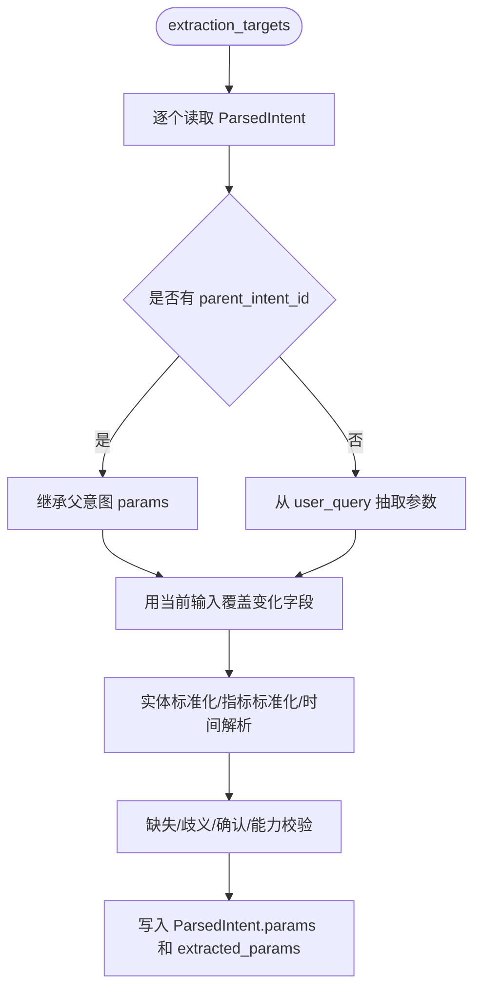

说明：

参数提取节点需要支持两种模式：全量抽取和补槽抽取。澄清回复场景只补 `pending_clarifications[intent_id]` 中列出的槽位。追问、省略、修正、重试则先继承父意图参数，再覆盖当前输入明确提到的字段。

输入 State：

| 字段 | 作用 |
|---|---|
| `extraction_targets` | 本轮要处理的意图 |
| `parsed_intents` | 读取意图类型和父意图 |
| `extracted_params` / `ParsedIntent.params` | 读取父意图参数 |
| `pending_clarifications` | 补槽目标 |
| `user_profile` | 应用用户默认阈值 |
| `domain_memory` | 实体、指标、结果集解析 |

输出 State：

| 字段 | 作用 |
|---|---|
| `ParsedIntent.params` | 写入参数结果 |
| `extracted_params` | 按 intent_id 建索引 |
| `pending_clarifications` | 缺失/歧义时写入 |
| `pending_confirmations` | 需要确认时写入 |
| `dialogue_phase` | `ready_for_planning`、`clarifying`、`confirming` |
| `next_stage` | `diagnosis_planning`、`intent_clarification`、`wait_user_input` |

### 1.5.3 意图澄清节点

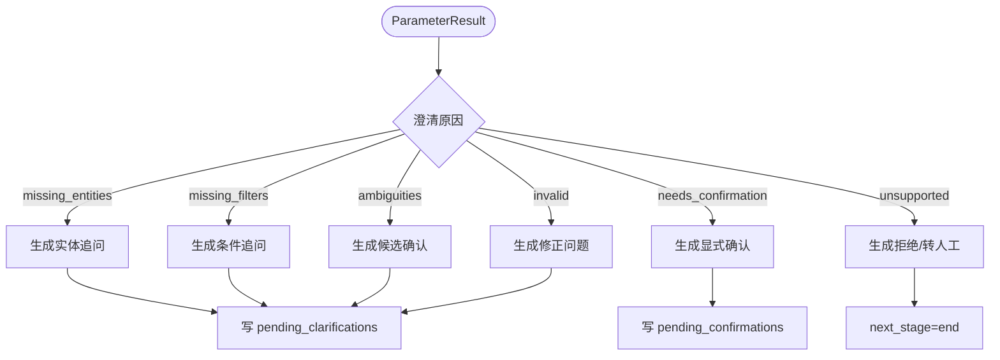

说明：

意图澄清节点的核心产物不是一句话，而是结构化的 `ClarificationRequest`。自然语言问题可以由模板或 LLM 生成，但状态必须写入 `pending_clarifications`，否则下一轮无法稳定判断用户是否在回答澄清。

输入 State：

| 字段 | 作用 |
|---|---|
| `active_intent_id` | 当前要澄清的意图 |
| `ParsedIntent.params` | 判断缺失、歧义和状态 |
| `pending_clarifications` | 避免重复追问 |
| `pending_confirmations` | 处理显式确认 |
| `errors` | 系统中断恢复 |

输出 State：

| 字段 | 作用 |
|---|---|
| `pending_clarifications` | 写入澄清请求 |
| `pending_confirmations` | 写入确认请求 |
| `dialogue_phase` | `clarifying` 或 `confirming` |
| `final_response` | 返回给用户的澄清问题、确认问题或拒绝说明 |
| `next_stage` | 通常为 `end` 或 `wait_user_input` |

---

## 1.6 九类主场景 State 流转

### 1.6.1 澄清场景

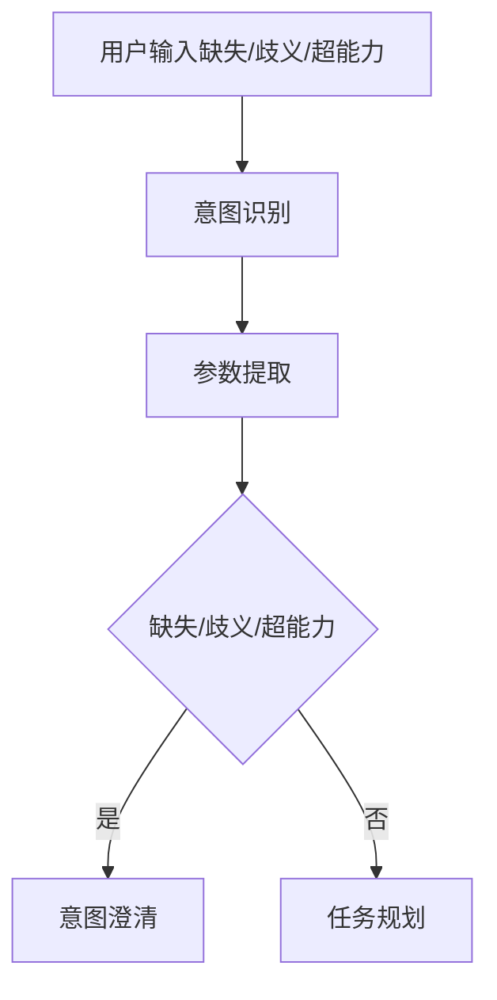

示例输入：

```json
{"user_query": "找一下 CPU 高的设备"}
```

关键输出：

```json
{
  "parsed_intents": [
    {
      "id": "intent_0",
      "intent": {"intent_type": "filtered_metric_query", "main_scenario": "clarification"},
      "stage": "waiting_clarification"
    }
  ],
  "extracted_params": {
    "intent_0": {
      "metrics": ["cpu_usage"],
      "missing_filters": ["cpu_threshold"],
      "validation_status": "needs_clarification"
    }
  },
  "pending_clarifications": {
    "intent_0": {"question": "CPU 高具体指超过多少百分比？"}
  },
  "dialogue_phase": "clarifying",
  "next_stage": "wait_user_input"
}
```

### 1.6.2 追问场景

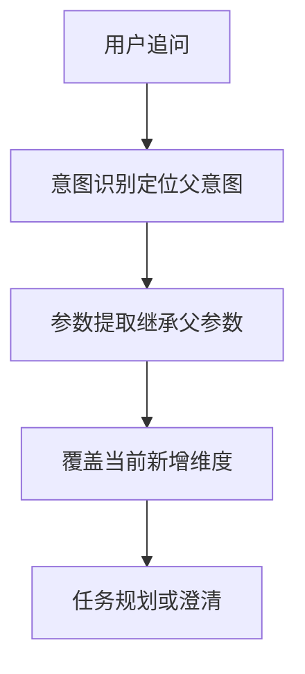

示例输入：

```json
{
  "user_query": "哪个进程占用最高？",
  "last_completed_intent_id": "intent_1"
}
```

关键输出：

```json
{
  "parsed_intents": [
    {
      "id": "intent_2",
      "parent_intent_id": "intent_1",
      "intent": {"intent_type": "metric_drilldown", "main_scenario": "follow_up"},
      "stage": "ready_for_planning"
    }
  ],
  "extracted_params": {
    "intent_2": {
      "target_entities": [{"type": "device", "id": "dev_a", "source": "parent_intent"}],
      "metrics": ["process_cpu_usage"],
      "inherited_from": {"target_entities": "intent_1"},
      "validation_status": "valid"
    }
  },
  "next_stage": "diagnosis_planning"
}
```

### 1.6.3 上下文切换场景

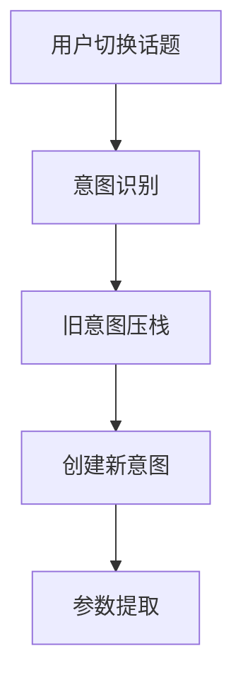

关键输出：

```json
{
  "context_stack": [
    {"intent_id": "intent_3", "summary": "正在澄清 CPU 查询设备", "phase_when_suspended": "clarifying"}
  ],
  "active_intent_id": "intent_4",
  "parsed_intents": [
    {"id": "intent_4", "intent": {"intent_type": "metric_query", "main_scenario": "context_switch"}}
  ]
}
```

### 1.6.4 确认与修正场景

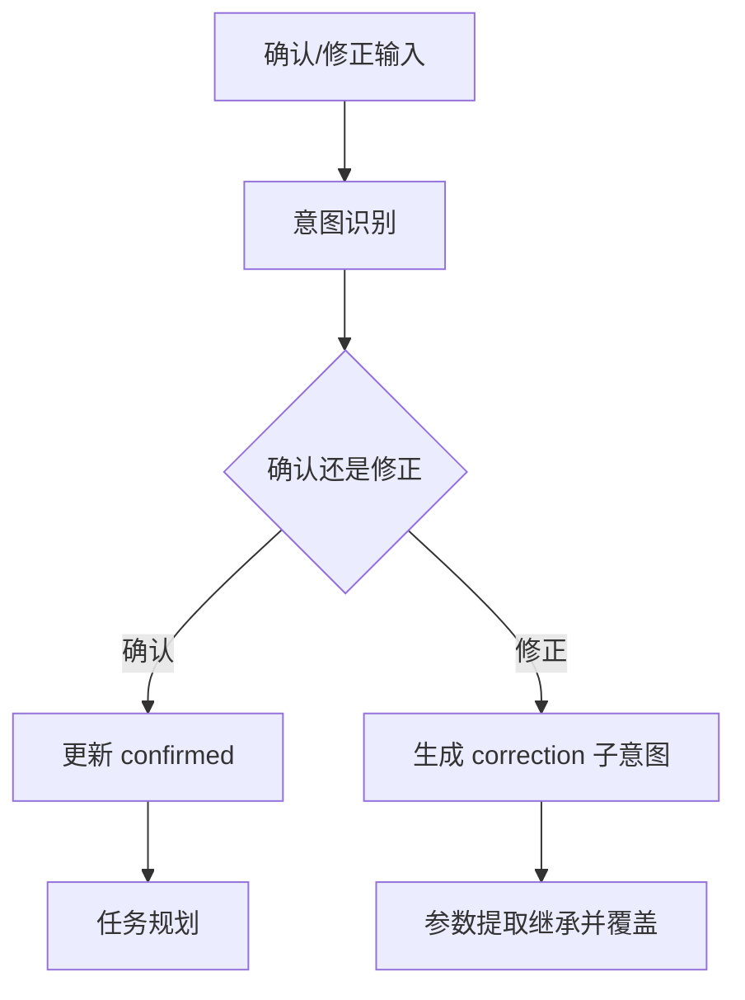

关键输出：

```json
{
  "parsed_intents": [
    {
      "id": "intent_6",
      "parent_intent_id": "intent_5",
      "intent": {"intent_type": "metric_query", "relation": "correction"},
      "stage": "ready_for_planning"
    }
  ],
  "extracted_params": {
    "intent_6": {
      "target_entities": [{"type": "device", "id": "dev_b", "source": "correction"}],
      "metrics": ["cpu_usage"],
      "inherited_from": {"metrics": "intent_5"},
      "validation_status": "valid"
    }
  }
}
```

### 1.6.5 反馈与评价场景

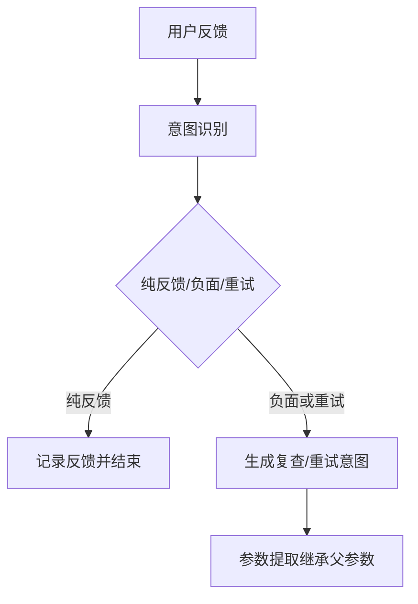

关键输出：

```json
{
  "parsed_intents": [
    {
      "id": "intent_8",
      "parent_intent_id": "intent_7",
      "intent": {"intent_type": "metric_query", "relation": "retry"},
      "stage": "ready_for_planning"
    }
  ],
  "extracted_params": {
    "intent_8": {
      "metrics": ["cpu_usage"],
      "modifiers": {"force_refresh": true, "ignore_cache": true},
      "validation_status": "valid"
    }
  }
}
```

### 1.6.6 中断与恢复场景

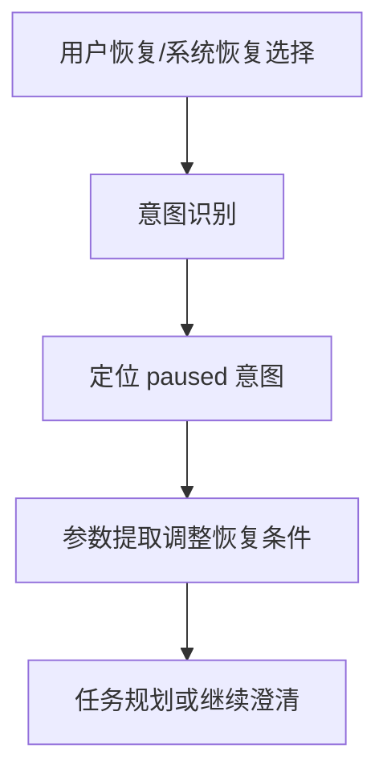

关键输出：

```json
{
  "dialogue_phase": "ready_for_planning",
  "active_intent_id": "intent_9",
  "extracted_params": {
    "intent_9": {
      "time_range": {"source": "system_recovery", "raw_expression": "最近24小时"},
      "modifiers": {"retry": true, "reduce_scope": true},
      "validation_status": "valid"
    }
  }
}
```

### 1.6.7 复合意图交替场景

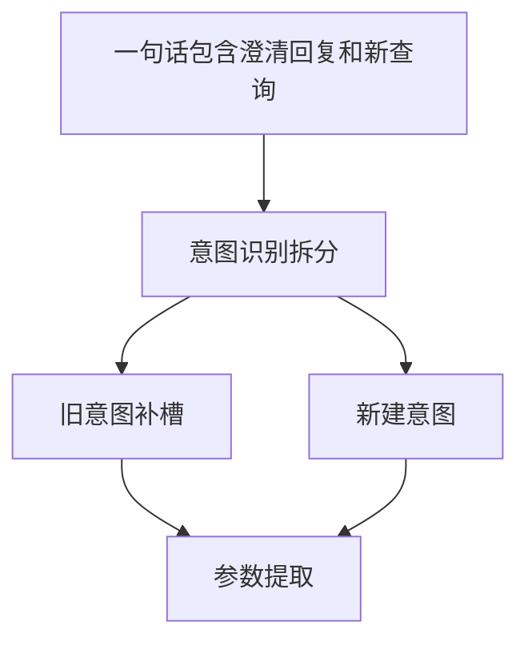

关键输出：

```json
{
  "extraction_targets": ["intent_10", "intent_11"],
  "parsed_intents": [
    {"id": "intent_10", "intent": {"relation": "clarification_answer"}},
    {"id": "intent_11", "intent": {"relation": "compound_part", "intent_type": "metric_query"}}
  ]
}
```

### 1.6.8 上下文继承/省略场景

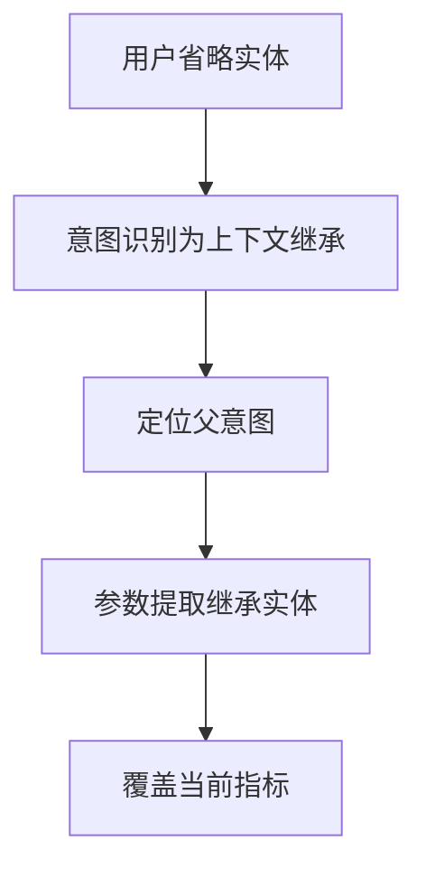

关键输出：

```json
{
  "parsed_intents": [
    {
      "id": "intent_13",
      "parent_intent_id": "intent_12",
      "intent": {"intent_type": "metric_query", "main_scenario": "context_inheritance"}
    }
  ],
  "extracted_params": {
    "intent_13": {
      "target_entities": [{"type": "device", "id": "dev_a", "source": "parent_intent"}],
      "metrics": ["memory_usage"],
      "validation_status": "valid"
    }
  }
}
```

### 1.6.9 领域特殊场景

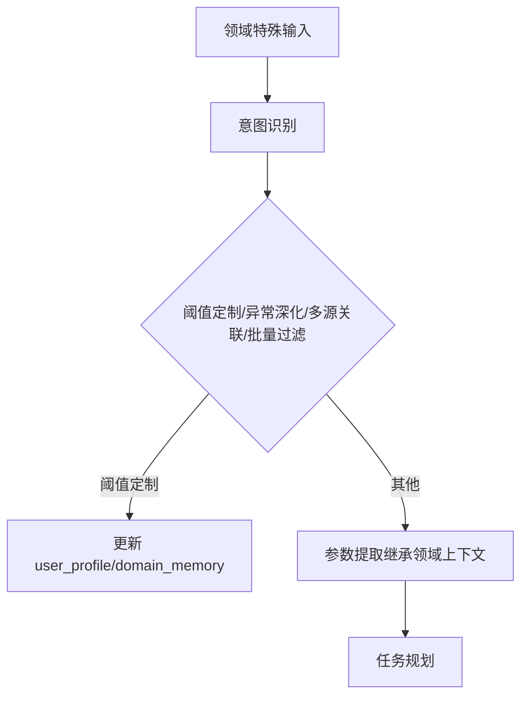

关键输出：

```json
{
  "user_query": "以后 CPU 超过85%就算高",
  "user_profile": {
    "thresholds": {"cpu_high": 85}
  },
  "parsed_intents": [
    {
      "id": "intent_14",
      "intent": {"intent_type": "set_threshold_policy", "main_scenario": "domain_specific"},
      "stage": "completed"
    }
  ],
  "next_stage": "finished"
}
```

---

## 1.7 9 类场景测试用例

| 编号 | 主类别 | 用户输入 | 前置状态 | 期望结果 |
|---|---|---|---|---|
| T01 | 澄清场景 | 查一下 CPU 使用率 | 无设备上下文 | 缺 `device_name`，生成澄清问题 |
| T02 | 澄清场景 | 看核心交换机A的 CPU | 实体库匹配两台设备 | 写入 `ambiguities`，要求选择候选设备 |
| T03 | 澄清场景 | 查设备A的健康度 | 指标别名未配置 | 进入指标澄清 |
| T04 | 澄清场景 | 找 CPU 高的设备 | 无用户阈值 | 缺 `cpu_threshold` |
| T05 | 澄清场景 | 重启设备A | 系统不支持重启 | `unsupported`，拒绝或转人工 |
| T06 | 追问场景 | 哪个进程占用最高？ | 上轮查设备A CPU | 继承设备A，指标为 `process_cpu_usage` |
| T07 | 追问场景 | 看最近24小时趋势 | 上轮查设备A丢包 | 覆盖时间为 `last_24h`，修饰符 `trend` |
| T08 | 追问场景 | 对比上周同期 | 上轮查丢包 | 生成 `compare_windows` |
| T09 | 上下文切换 | 先不查这个了，查设备B内存 | 正在澄清设备A | 旧意图压栈，新建设备B内存意图 |
| T10 | 上下文切换 | 刚才那个继续 | `context_stack` 非空 | 恢复栈顶意图 |
| T11 | 确认与修正 | 确认备份 | 有待确认备份意图 | 标记确认，进入规划 |
| T12 | 确认与修正 | 不是设备A，是设备B | 上轮查设备A CPU | 生成 correction 子意图 |
| T13 | 反馈评价 | 这个分析很准 | 上轮有报告 | 记录正面反馈，不进入规划 |
| T14 | 反馈评价 | 再查一次 CPU | 上轮查设备A CPU | 生成 retry 子意图，`force_refresh=true` |
| T15 | 中断恢复 | 缩小到最近24小时再查 | 查询超时暂停 | 更新时间范围并重试 |
| T16 | 复合意图 | 设备A是10.1.1.1，另外看设备B丢包 | 等待设备澄清 | 拆成补槽旧意图和新意图 |
| T17 | 上下文继承 | 内存呢？ | 上轮查设备A CPU | 继承设备A，指标改为内存 |
| T18 | 领域特殊 | 以后 CPU 超过85%就算高 | 无 | 更新 `user_profile.thresholds.cpu_high` |
| T19 | 领域特殊 | 查这些设备的内存 | 上轮有 CPU Top10 结果集 | 使用 `entity_set_refs` 引用结果集 |

---

## 1.8 落地建议

1. 第一阶段只新增 `id`、`parent_intent_id`、`dialogue_phase`、`active_intent_id`、`pending_clarifications`、`context_stack`，先跑通澄清和追问。
2. 第二阶段再加入 `user_profile`、`domain_memory`、`entity_set_refs`，支持领域特殊场景。
3. 参数提取节点优先写回 `ParsedIntent.params`，同时维护 `extracted_params[intent_id]` 作为索引。
4. 意图澄清节点必须结构化写入 `ClarificationRequest`，不要只把澄清问题放在 `final_response`。
5. 任务规划节点只处理 `stage="ready_for_planning"` 且 `validation_status="valid"` 的意图。
6. 建议把 `DataTask.intend_id` 迁移为 `DataTask.intent_id`，避免后续字段歧义。

